# KAMP X-ray 이물 탐지 — 데이터 분석 · 실험 결과 보고서

> 작성일 2026-09-30 (갱신 2026-10-01: 실패 조건 분석, 데이터 다양성 정량화, 합성 결함 설계와 타당성 검증, 옮겨 심기 검증, 스트레스 곡선 v0, 새 베이스라인 YOLOv8s·D‑FINE‑S 비교; 2026-10-02: 위치 축 스트레스, 사전학습 비교, gVXR 크기·형상·재질 축; 2026-10-06: **팀 결정에 따라 합성 데이터는 평가(test) 전용**으로 정리, 판정 기준을 합성 없이 학습한 모델로 다시 정함)
> 과제: X-ray 영상 기반 완제품 이물질 탐지 및 AI 미탐지 조건 분석
> 요구사항: ① 이물 탐지·위치 표시 모델 ② 조건별 성능 변화 분석 ③ 판정 임계값·재검사 기준 제안

---

## 0. 요약

| 구분 | 내용 |
|---|---|
| 데이터 | 장비 원본 이미지 2,532장 = **GT 500장**(공식 TXT, 결함 1,147개) + **GT 없음 2,020장** + 제외 12장 |
| 데이터의 성격 | 결함이 심어진 **표준 테스트피스를 4시간마다 반복 촬영**한 장비 점검 영상. 결함은 대부분 2×2px이고 위치는 띠 끝으로 고정 |
| 핵심 문제 1 | 모든 이미지에 장비가 그린 **결함 위치 표시(컬러 마커)**가 박혀 있음 → 지우지 않으면 모델이 결함 대신 마커를 학습 |
| 핵심 문제 2 | 같은 장비·같은 날 촬영분끼리 비슷함 → 무작위로 나누면 **누수** |
| 분할 | **(장비, 날짜) 단위**로 train 350 / val 66 / test 84. 모든 실험은 seed 3개로 반복 |
| 베이스라인 | YOLOv3-SPP (416, COCO 사전학습), 마커 Telea 인페인팅: **test AP@0.5 0.935 ± 0.011**, P / R@0.25 0.959 / 0.945 |
| 실험 ① 마커 처리 | 7가지 방식(원본·마스킹·인페인팅 5종)을 학습 방식 × 평가 방식 교차표로 비교. 원본·마스킹 학습은 마커를 지운 입력에서 재현율 0.09 / 0.64로 실패. 인페인팅 5종 사이의 차이는 seed 편차 안이며, **Telea가 평균이 가장 높고 가장 안정적** → **Telea 인페인팅 채택** |
| 실험 ② GT 없는 데이터 | ⓐ 라벨 붙이는 방법 8가지를 GT로 채점(train 3-fold 교차 검증) → **교사 모델 + 구조 필터(T3)**가 가장 정확(중심 정밀도 0.999, 채택 이미지에서 놓친 결함 0). ⓑ 그 의사 라벨로 학습해도 학습량을 맞춘 대조군 대비 **효과 없음**(test AP 차 −0.002 / +0.009) → **학습에 쓰지 않고 검증용으로 사용** |
| 실패 조건·다양성 | 실제 데이터에서 놓친 결함은 **3호기의 흐린 결함(CNR ≤ 10)**에 몰려 있고, 아예 못 찾은 결함은 0개. 결함의 크기·위치·형상·밀도·배경이 사실상 한 가지라 **조건별 성능을 잴 수 없음** → 조건 통제 합성 결함으로 평가하는 설계(§4, 합성은 평가 전용) |
| 실험 ③ 합성 타당성 | 실제 결함을 지우고 같은 자리에 합성 결함을 다시 넣어 비교. **매개변수 합성**(사각 물체 ⊗ 약한 흐림)은 모델 반응은 실제와 같지만, 처리 조건을 맞춰도 분류기가 구별함(AUC 0.95) → **평가 전용**. **옮겨 심기**(다른 날짜 train 결함의 실제 광학 밀도 맵을 이식, TIP 방식)는 같은 처리를 거친 실제 결함과 거의 구별되지 않음(AUC 0.69 / 0.51) → **조건부 통과**. 단 팀 결정(2026-10-06)으로 합성 데이터는 모두 **평가(test) 전용**이며 학습에 쓰지 않음 |
| 스트레스 곡선 v0 | 실제 결함 자리에서 결함을 옅게 하거나 잡음을 더해 검출 한계를 잼(학습 없음). 검출률 50% 지점의 결함 대비는 1·2호기 약 8~9, **3호기 약 16(두 배)**. 실제 결함 대비 대비 여유가 3호기에서 가장 작음(2.1배). 잡음은 실제의 몇 배를 더해도 견딤. 두 합성기의 곡선이 일치. 조건이 나빠져도 오검출은 늘지 않고 놓침만 늘어남 |
| 새 베이스라인 (§3.8) | **YOLOv8s·D‑FINE‑S**(COCO 사전학습, 640)로 기존 실험을 다시 함. test AP@0.5 **0.958 ± 0.021 / 0.942 ± 0.034**(YOLOv3 0.935 ± 0.011). 평균은 높지만 seed 편차 안. val·test 결함 놓침 0. 다만 **결함을 지운 자리에도 반응**(신뢰도 ≥ 0.25: 21% / 67%, YOLOv3 0.7%) → 결함이 늘 있던 위치를 학습한 지름길. 그래서 새 모델의 스트레스 곡선(밀도 축)은 감도로 해석할 수 없음 |
| 위치 축 스트레스 (§4.5) | 실제 농도의 결함을 원래 자리(띠 끝)가 아닌 제품 안 무작위 자리에 옮겨 심으면 검출률이 **YOLOv3 32%, YOLOv8s 41%, D‑FINE‑S 84%**로 떨어짐(원래 자리 98~100%). 대비는 오히려 더 높은 자리들임. 모델이 결함을 보긴 하지만 띠 끝 맥락이 없으면 확신하지 못함 → **현재 test 점수는 다른 위치의 이물에 대한 성능을 크게 과대평가** |
| 사전학습 (§3.9) | ① 없음 / ② COCO / ③ COCO→PIDray: 실제 test는 **② COCO가 가장 좋거나 같음**, PIDray 추가 이득 없음. ① 없음은 두 모델 모두 가장 낮음. 위치 지름길은 사전학습과 무관하게 생김(원인은 고정된 결함 위치) |
| 판정 기준 (§5) | 자동 불량 / 재검사 / 통과 두 임계값을 val로 정함. **YOLOv8s ② COCO**(합성 없이 학습): test 실제 결함 79% 자동 · 20% 재검사 · 놓침 0.8%, 결함 없는 제품 자동 오판 2.8%, GT 없는 영상 재검사 5.2%. T_high는 결함을 지운 원래 자리의 반응(위치 지름길)이 정함. **다른 자리 결함은 84%를 놓치고 임계값으로 메울 수 없음** → 한계로 보고. 제품 영역 후처리는 효과 없음(비용이 없어 넣음) |
| gVXR 크기·형상·재질 (§4.6) | 실제 배경에 gVXR 물리 시뮬레이션 이물을 삽입(실제 결함 = SUS304 구로 보정, 약 0.25 mm, 0.11 mm/px). 모델 반응은 실제 결함과 가장 비슷(상관 0.95~0.98)하나 분류기가 구별 → 평가 전용. **기준보다 작은 이물(×0.5: 0~2%), 큰 이물(×5: 11~65%), 가는 선, 비금속 이물을 놓침**. 모델은 '시편 크기의 금속 점'에 특화. 작은 쪽·비금속은 D‑FINE‑S ②, 큰 쪽은 YOLOv8s ②가 나음 |
| 모델 담당 전달 | `handoff/kamp_xray_v2.zip` (같은 내용의 `.tar.gz`도 있음): 마커 제거 이미지, 고정 분할, YOLO·COCO 라벨, 공통 평가 도구(내부 평가와 소수점까지 일치 확인) |

### 용어
| 용어 | 뜻 |
|---|---|
| GT | 주최 측 공식 TXT 라벨(정답). 이 보고서의 모든 점수는 공식 TXT 기준 |
| 세션 | 같은 장비가 **직전 사진과 10분 이내**에 이어서 찍은 사진 묶음. 보통 몇 초 간격으로 약 6장, 약 17초 동안 촬영 |
| (장비, 날짜) 묶음 | 같은 장비가 같은 날 찍은 모든 사진. 하루 최대 6세션(0·4·8·12·16·20시) |
| 마커 | 장비가 결함 위치에 그린 18×18px 컬러 사각형 테두리(두께 2px) |
| 인페인팅 | 마커 픽셀을 지우고 **주변 픽셀로 자연스럽게 메우는 것** |
| AP@0.5 | 예측 박스와 정답 박스가 IoU ≥ 0.5로 겹치면 정답으로 치는 평균 정밀도(101점 보간). 신뢰도 0.001 이상 모든 검출 사용 |
| P / R@0.25 | 신뢰도 0.25 이상 검출만 남겼을 때의 정밀도 / 재현율 |
| 중심거리 지표 | IoU 대신 **박스 중심 거리 ≤ 8px**이면 맞힌 것으로 침. 결함은 2×2px인데 정답 박스는 5~21px로 들쭉날쭉해서, "위치를 맞혔는가"를 따로 봄 |
| 의사 라벨 | GT 없는 사진에 모델(교사)이 붙인 추정 라벨 |
| p990 / p1000 | 의사 라벨 임계값을 정하는 두 기준. 교사의 val 정밀도가 **0.99(p990) / 1.00(p1000)**이 되는 가장 낮은 신뢰도를 임계값으로 씀 |

---

## 1. 데이터

### 1.1 출처와 구성
모든 이미지는 과제 zip의 **장비 원본 이미지 폴더**에서 가져옵니다.
```
dataset/test1/yolov3/X선이물검출기(06.23_09.22)/{1,2,3}호기/SN*_YYYYMMDD_NgImage/*.bmp
  파일 2,809개 = 고유 이미지 2,532장 (날짜 폴더 사이의 중복 복사 277개)
  기간 2020-06-22 ~ 09-22, 장비 3대. 파일명 = {제품코드}_{날짜}_{시각}({순번})
```

| 장비 | 전체 | **GT 있음** | **GT 없음** | 제외 | 해상도 |
|---|---:|---:|---:|---:|---|
| 1호기 | 943 | 156 | 782 | 5 | 352×332, 316×332 (GT 없음에 412×332 추가) |
| 2호기 | 805 | 177 | 623 | 5 | 316×332 |
| 3호기 | 784 | 167 | 615 | 2 | 576×444 |
| **합계** | **2,532** | **500** | **2,020** | **12** | |

- **GT 있음 500장**: 공식 TXT 라벨(`라벨링 6종 세트/labels/*.txt`, YOLO 형식, 클래스 1개 `Defect`)이 있는 이미지. 결함 1,147개. 그중 400장은 `라벨링 6종 세트/images 400`과 바이트 단위로 같습니다.
- **GT 없음 2,020장**: 공식 라벨이 없는 이미지 (§1.6)
- **제외 12장**: 튜토리얼 예제용 이미지. 공식 라벨이 없고, 규칙이 다른 예제 라벨만 있어 사용하지 않습니다.

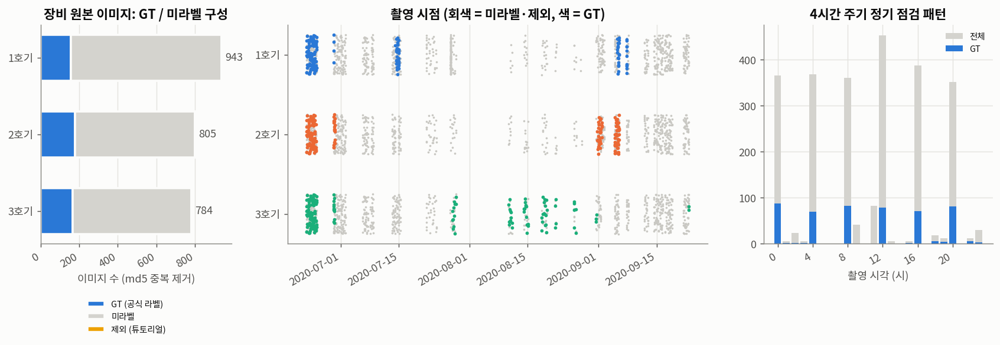

### 1.2 이미지 특성
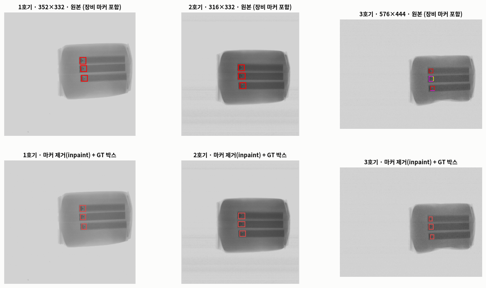

| 장비 | 해상도 | 컨베이어 배경 | 제품 영역 밝기 | 결함 주변 노이즈 σ |
|---|---|---:|---:|---:|
| 1호기 | 352×332 | 210 (포화) | 143 | 1.5 |
| 2호기 | 316×332 | 210 (포화) | 106 | 1.5 |
| 3호기 | 576×444 | 210 (포화) | 122 | 4.5 |

- 형식은 8bit 팔레트 BMP이고, 마커를 뺀 모든 픽셀이 R=G=B인 흑백 영상입니다.
- 장비마다 해상도·밝기·노이즈가 다른 **세 개의 도메인**이며, 3호기는 노이즈가 약 3배입니다.

### 1.3 테스트피스 정기 점검 영상
- GT 이미지의 94%가 **0·4·8·12·16·20시 30분경** 촬영됐습니다(§1.1 그림 오른쪽). 한 번에 **몇 초 간격으로 약 6장**(세션)을 찍습니다.
- 결함은 항상 제품 안 **어두운 띠의 끝**에 있고, 이미지당 결함 수(1개 또는 3개)는 시편 종류(띠 1개 / 3개)로 정해집니다.
- 즉 실제 오염 제품이 아니라, **결함이 심어진 표준 시편을 장비 점검용으로 반복 촬영한 영상**입니다. 이 때문에 결함의 크기·위치·모양이 거의 다양하지 않습니다.

### 1.4 장비 마커
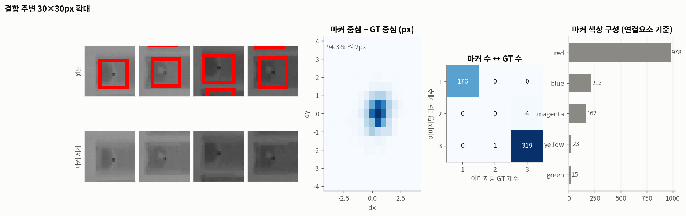

- **모든 이미지**에 장비가 결함 위치에 그린 18×18px 컬러 사각형(선 두께 2px)이 박혀 있습니다.
- 마커 1,144개 중 1,141개가 공식 라벨 결함을 정확히 1개씩 감싸고, 94%는 마커 중심과 라벨 중심의 거리가 2px 이내입니다. → **마커를 그대로 두면 모델이 결함 대신 마커를 학습**할 수 있습니다.
- 과제 안내: 마커는 탐지 특징으로 사용 금지, 공식 정답은 TXT, 제거·마스킹·인페인팅은 허용(방법·영향 명시). → 마커는 **제거 대상**으로만 다룹니다(§3.2).

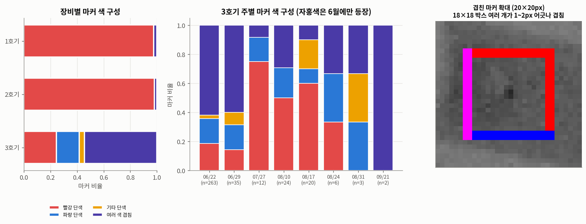

- 1·2호기 마커의 97~98%는 빨강 단색입니다. 여러 색은 대부분 3호기에서 나오며, 같은 크기의 박스 여러 개가 1~2px 어긋나 겹쳐 그려진 것입니다. 장비 내부 판정 채널별 표시로 추정됩니다. 3호기의 자홍색은 6월에만 나타납니다.

### 1.5 결함 특성
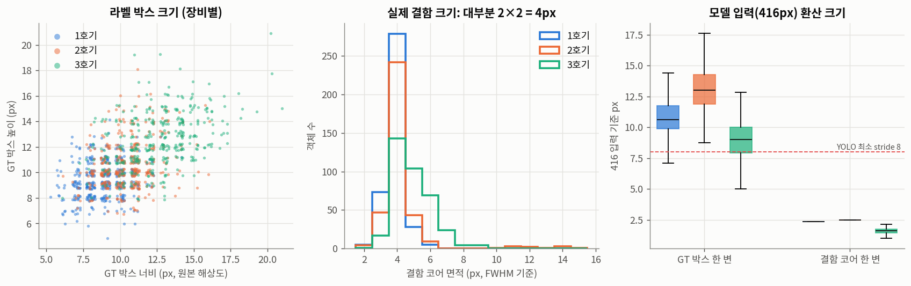

| 장비 | GT 박스 (중앙값) | 결함 코어 면적 (반치폭) | 416 입력 기준 코어 한 변 |
|---|---|---:|---:|
| 1호기 | 9×9 px | 4 px | ≈ 2.4 px |
| 2호기 | 10×10 px | 4 px | ≈ 2.5 px |
| 3호기 | 13×12 px | 5 px | ≈ 1.6 px |

- **실제 결함은 거의 모두 2×2px 점**입니다. 라벨 박스는 결함보다 면적 기준 약 25배 크고, 같은 결함에도 5~21px로 들쭉날쭉합니다. → 평가 시 IoU 매칭과 함께 **중심거리 매칭(≤ 8px)**도 보고합니다.
- 416 입력에서 결함 코어는 1.5~2.5px로, YOLOv3의 최소 stride(8)보다 작습니다.

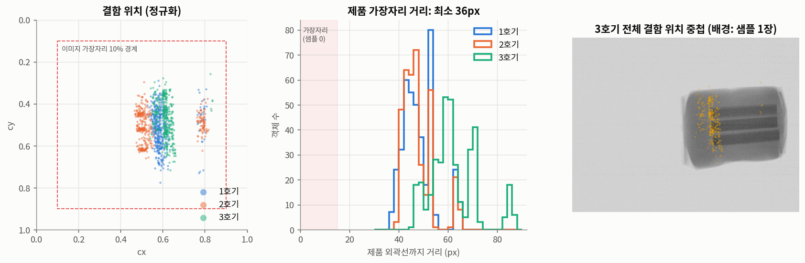

- 결함은 100% 제품 내부에 있고, 제품 외곽선까지 최소 36px 떨어져 있습니다. **제품 가장자리 결함은 0건**입니다.

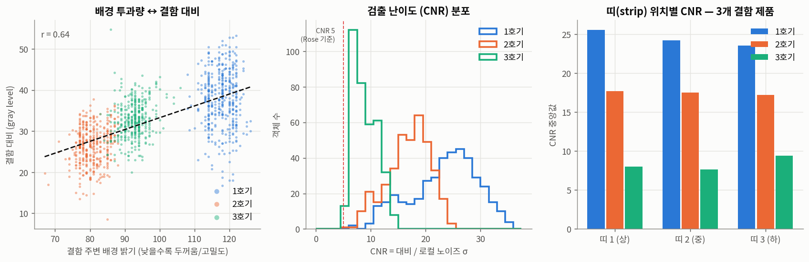

- 결함은 주변보다 국소 밝기의 약 35%만큼 어둡습니다(곱셈형 감쇠). 배경이 어두운(두꺼운) 부위일수록 절대 대비가 작아집니다(r = 0.64).
- **모든 결함이 CNR ≥ 5**(최소 5.1, 중앙값 16)라서, 눈으로 봐도 애매한 결함은 없습니다. 3호기가 노이즈 때문에 CNR이 가장 낮습니다(중앙값 8.4).

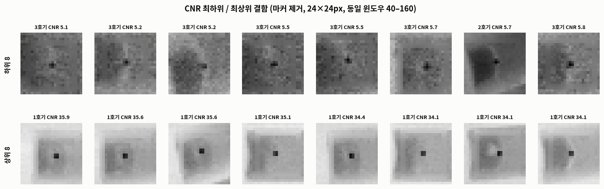

### 1.6 라벨 품질
| 점검 | 결과 |
|---|---|
| 형식 오류·범위 이탈 | 0건 |
| 마커는 있는데 TXT 라벨이 없는 결함 | 1건 (`002_20200623_123055(5)`). 과제 안내에 따라 **TXT를 우선**해 라벨을 추가하지 않으며, 평가에서 모델이 이를 검출하면 오검출로 집계됩니다 |
| TXT 라벨은 있는데 마커가 없는 결함 | 1건 (`001_20200629_082834(2)`). 라벨은 유효 |
| 라벨 중심 ↔ 실제 결함 중심 | 평균 (0.5, 0.0)px 차이. 위치는 정확함 |
| 과제 제공 가중치(`last*.pt`) | 과거 무작위 분할의 test 이미지를 학습에 사용한 상태라 평가·초기값으로 쓰지 않음 |

### 1.7 GT 없는 데이터
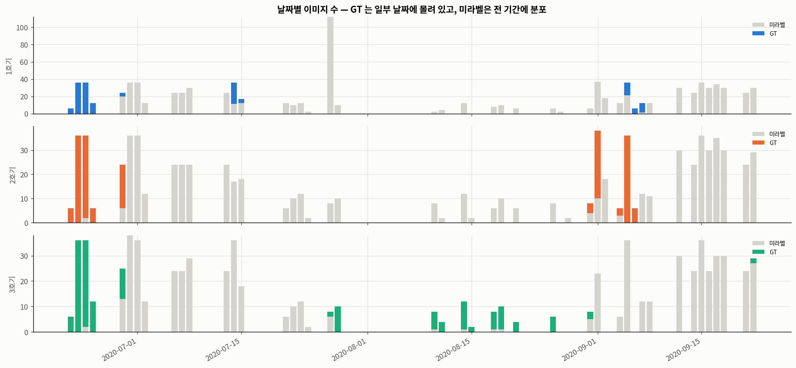

| 항목 | GT 있음 | GT 없음 |
|---|---|---|
| 촬영 날짜 | 장비별 10~17일에 몰려 있음 | 전 기간(장비별 42~45일). **66%가 GT가 한 장도 없는 날짜** |
| 해상도 | 576×444 / 352×332 / 316×332 | 추가로 **412×332 (1호기 120장)** |
| 시편 종류 | 결함 3개짜리 64% | 결함 1개짜리 65% |
| 제품 밝기 | 장비별 143 / 106 / 122 | 같은 범위 (분포만 조금 넓음) |
| 마커 | 모두 있음 | **모두 있음** (장비 불량 판정 저장본) → 같은 방식으로 제거 |

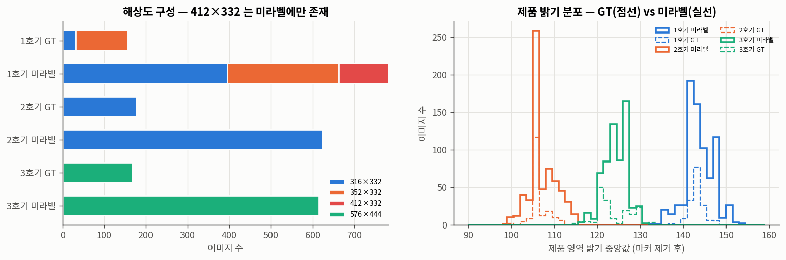
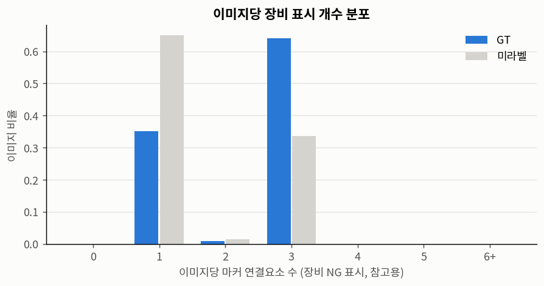

**이상 이미지 107장**
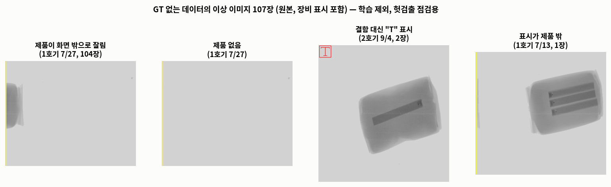

| 유형 | 장수 | 내용 |
|---|---:|---|
| 비정상 촬영 | 104 | 1호기 7/27 한 세션. 제품이 화면 밖으로 잘리거나 없음. 제품 밖 컨베이어에 작은 얼룩이 찍힌 이미지 포함 |
| "T" 표시 | 2 | 2호기 9/4. 결함 표시 대신 빨간 "T" 글자 |
| 제품 밖 표시 | 1 | 1호기 7/13 |

- 정상 이미지는 1,913장입니다. 이상 이미지는 학습에 쓰지 않고, 예외 입력에서 헛검출이 나는지 점검하는 데만 씁니다.

---

## 2. 누수 방지 분할

### 2.1 왜 누수가 생기나
같은 장비가 같은 테스트피스를 **몇 초 간격으로 약 6장씩(세션), 4시간마다** 찍습니다. GT 500장에는 세션이 113개 있고, 세션당 중앙값 6장, 세션 길이는 약 17초입니다.

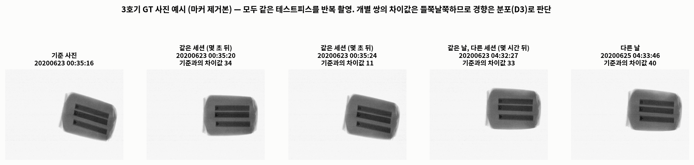
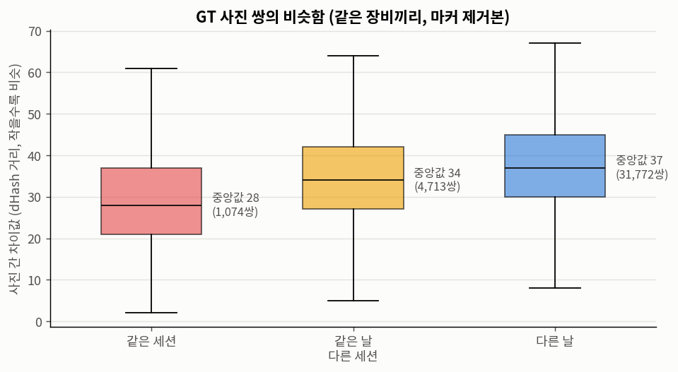

- 같은 장비의 GT 사진 쌍끼리 차이값(dHash 거리, 작을수록 비슷)을 비교하면, 중앙값이 **같은 세션 28 → 같은 날 다른 세션 34 → 다른 날 37**입니다. 개별 쌍은 제품이 놓인 위치에 따라 들쭉날쭉하지만, 분포로 보면 가까운 시간에 찍은 사진일수록 비슷합니다.
- 그래서 **같은 날 사진**이 train과 test에 나뉘어 들어가면, 모델이 시험에 나올 사진과 비슷한 사진으로 미리 학습한 셈이 되어 점수가 부풀려집니다.

### 2.2 분할 규칙
| 항목 | 결정 |
|---|---|
| 대상 | GT 있는 500장. val·test는 정답과 비교해야 하므로 GT가 있는 사진만 씀 |
| **묶음 단위** | **(장비, 날짜)**: 같은 장비·같은 날 촬영분은 모두 한 split에만 들어감 |
| 균형 | 장비(3) × 시편 종류(결함 1개 / 3개)별로 비율을 맞춤 |
| 배정 | 층마다 날짜 묶음을 train / val / test에 배정하는 조합을 무작위로 2만 번 시도(seed 42)해, 70 / 15 / 15에 가장 가까운 것을 선택. 날짜 묶음이 3개 이상인 층은 val·test에 최소 1개씩 배정 |
| 역할 | **train** 학습 · **val** 최적 시점 모델 선택, 의사 라벨 임계값 결정 · **test** 최종 성적에만 사용(방법 선택에 쓰지 않음) |
| 반복 | 모든 실험 조건을 seed 0·1·2로 3번 학습해 평균 ± 표준편차로 비교. seed만 바꿔도 AP가 0.01~0.05 흔들리기 때문 |

- **"세션은 자동으로 함께 묶인다"의 뜻**: 세션은 몇 초~몇십 초짜리 촬영이라 항상 하루 안에 끝납니다. 따라서 날짜 단위로 묶으면, 한 세션의 사진이 두 split으로 갈라지는 일이 저절로 없어집니다. 세션보다 큰 단위(날짜)로 묶은 이유는, 같은 날의 다른 세션끼리도 다른 날보다 비슷하기 때문입니다(§2.1).
- 날짜보다 더 큰 단위(주·월)는 쓰지 않았습니다. GT가 있는 날짜가 장비별로 10~17일뿐이라, 더 크게 묶으면 val·test에 넣을 묶음이 모자랍니다.

### 2.3 결과
| split | 1호기 | 2호기 | 3호기 | **합계** | 결함 | 날짜 | (장비, 날짜) 묶음 | 세션 |
|---|---:|---:|---:|---:|---:|---:|---:|---:|
| train | 99 | 134 | 117 | **350** (70%) | 797 | 12 | 17 | 77 |
| val | 26 | 18 | 22 | **66** (13%) | 144 | 9 | 11 | 15 |
| test | 31 | 25 | 28 | **84** (17%) | 206 | 8 | 9 | 21 |

- 같은 (장비, 날짜)나 같은 세션이 두 split에 걸친 경우는 0건입니다(코드로 검증).
- 날짜 묶음 하나가 커서(하루 최대 36장) 비율이 70 / 15 / 15에서 조금 벗어났습니다.

### 2.4 GT 없는 데이터의 배치
GT 없는 사진은 점수를 매길 수 없으므로 **학습 쪽에만** 추가할 수 있습니다. 사진마다 "그날 같은 장비의 GT 사진이 어느 split에 있는지"를 보고 역할을 정했습니다(`prep/build_unlabeled.py`, seed 42).

| 역할 | 장수 | 기준 | 용도 |
|---|---:|---|---|
| 학습 가능 | 1,244 | train과 같은 (장비, 날짜) 38장 + GT가 없는 (장비, 날짜)의 70% 1,206장 | 의사 라벨 대상 후보 |
| 평가용 | 560 | GT가 없는 (장비, 날짜)의 30%. 날짜 단위로 나눔 | 처음 보는 날짜에서의 검출 일관성 (참고 지표) |
| **제외** | **109** | **val(79장)·test(30장)와 같은 장비·같은 날** | 학습에 쓰면 평가 누수 → 사용하지 않음 |
| 이상 이미지 | 107 | §1.7 | 헛검출 점검용 |

**제외 109장을 따로 둔 이유**: 이 사진들은 val·test의 GT 사진과 **파일은 다르지만**, 같은 장비가 같은 날 같은 시편을 찍은 것입니다. §2.1과 같은 이유로, 이 사진으로 학습하면(의사 라벨이라도) val·test와 비슷한 사진을 미리 본 셈이 됩니다. GT 사진끼리 날짜 단위로 나눈 규칙을 GT 없는 사진에도 똑같이 적용한 것입니다.

예: 3호기 2020-09-22에는 GT 사진 2장이 **val**에 있습니다. 같은 날 찍힌 GT 없는 사진 27장은 학습에서 뺐습니다.

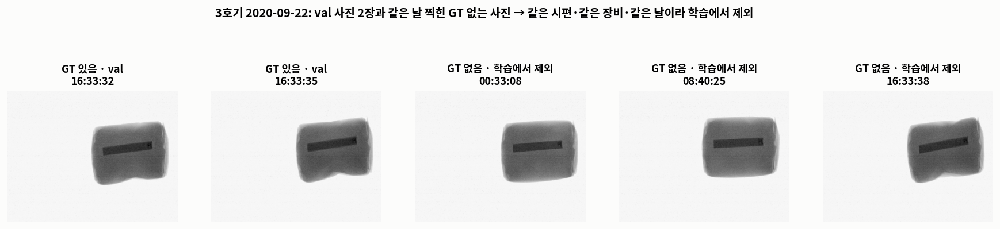
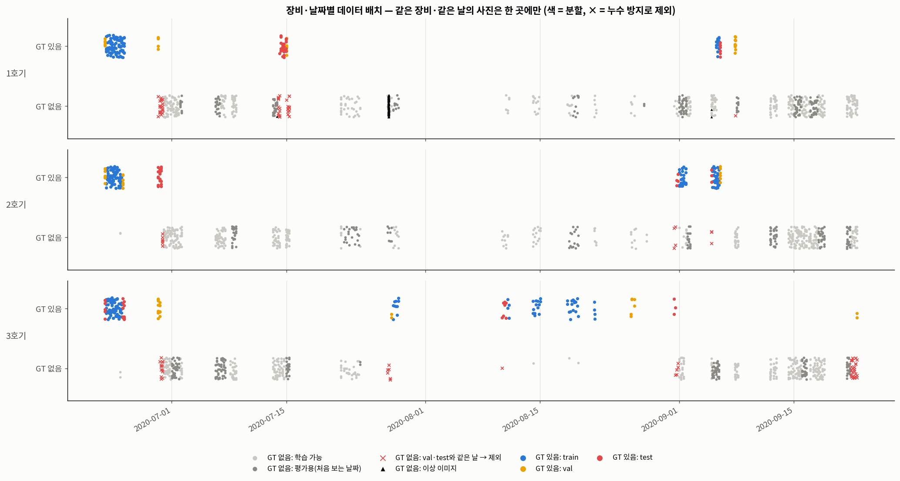

---

## 3. 실험

### 3.1 공통 설정
| 항목 | 내용 |
|---|---|
| 모델 | YOLOv3-SPP (과제 제공 코드에 PyTorch 2.7 호환 패치), 클래스 1개 |
| 초기값 | COCO 사전학습 가중치 (외부 데이터, §3.7) |
| 학습 | SGD + cosine LR(lr0 0.01), 배치 16 × 누적 4 = 실효 배치 64, 300 epoch. 증강은 코드 기본값(mosaic, 크기 320~640 multi-scale, HSV, 좌우 뒤집기). `best.pt` = val 점수가 가장 높은 시점 |
| 입력 | 8bit 흑백 PNG(마커 제거본). 평가 입력 크기 416 |
| 평가 | 공식 TXT 기준. NMS(IoU 0.5) 후 신뢰도 0.001 이상 모든 검출로 AP@0.5, 신뢰도 0.25에서 P·R, 중심거리(≤ 8px) 매칭. 이미지마다 신뢰도 높은 검출부터 아직 짝이 없는 정답과 짝지음 |
| 반복 | seed 0·1·2 (가중치 초기화·데이터 순서·증강이 달라짐). 표의 값은 평균 ± 표준편차 |
| 실험 설계 | **요인별 단독 실험**: 한 요인만 바꾸고 나머지는 베이스라인으로 고정. 요인 = ① 마커 처리 ② GT 없는 데이터 활용 ③ 데이터 다양성 ④ 모델. 각 요인의 선택이 끝나면 선택한 방법끼리 조합해 다시 실험 |

### 3.2 실험 ①: 마커 처리 방식

#### 3.2.1 마커를 찾고 지우는 절차
1. **마커 찾기**: 원본은 8bit 팔레트 BMP입니다. RGB로 바꾸면 X-ray 영상 픽셀은 모두 R=G=B(무채색)이고, 장비가 그린 마커만 유채색입니다. 그래서 **R≠G 또는 G≠B인 픽셀 = 마커**로 마스크를 만듭니다. 사람이 손으로 표시하거나 모델이 추정하는 과정은 없습니다.
2. **지우기**: 흑백으로 바꾼 영상에서 마스크 픽셀만 아래 방법으로 새 값을 채우고, 나머지 픽셀은 그대로 둡니다.
3. **라벨**: 공식 TXT를 수정 없이 그대로 씁니다. 마커 위치는 라벨 생성이나 평가에 쓰지 않습니다.

| 조건 | 방법 | 쉽게 말하면 |
|---|---|---|
| 원본 | 마커를 그대로 둠 | 비교용. 마커를 특징으로 쓰는 셈이라 제출 불가 |
| 마스킹 | 마커 픽셀을 회색 128로 칠함 | 마커 모양의 회색 테두리가 남음 |
| **Telea** (베이스라인) | `cv2.inpaint(TELEA, 반경 3)` | 테두리 바깥쪽부터 안쪽으로, 가까운 픽셀의 밝기와 기울기를 이어 붙여 메움 |
| Navier-Stokes | `cv2.inpaint(NS, 반경 3)` | 밝기의 등고선이 끊기지 않게 흐르듯 이어서 메움 |
| 2px 확장 + Telea | 마스크를 3×3 팽창 2회로 2px 넓힌 뒤 Telea | 마커 가장자리의 번짐까지 확실히 지움. 대신 바뀌는 픽셀이 약 3배 |
| 배경 채우기 | 마스크 밖 픽셀만으로 가우시안(σ=3) 가중 평균 | 주변 평균 밝기로 메움 (구조를 잇지 않음) |
| Biharmonic | `skimage.restoration.inpaint_biharmonic` | 메운 영역이 경계에서 가장 매끄럽게 이어지도록 수식으로 풂 |

**지우기가 데이터에 준 영향**
| 항목 | Telea · NS · 배경 채우기 · Biharmonic | 2px 확장 + Telea |
|---|---|---|
| 바뀐 픽셀 | 이미지당 평균 0.22% (128~496px) | 0.64% |
| 결함 중심 ↔ 가장 가까운 지운 픽셀 | 최소 5px, 중앙값 7px | 최소 3px, 중앙값 5px |
| 결함 코어(2×2px)를 건드렸나 | 아니오 (1,147개 모두) | 아니오 (2px 이내 0개) |
| GT 박스와 겹침 (Telea 기준) | 박스 내부 픽셀의 1.75%(박스 가장자리), 86/500장 | 더 넓음 |

- GT 없는 데이터의 특수 표시("T" 글자, 가장자리 세로선)도 같은 방식으로 흔적 없이 지워집니다.

#### 3.2.2 평가를 어떻게 공정하게 했나
실제 생산 라인 영상에는 마커가 없습니다. 그래서 "마커 없는 영상에서 결함을 찾는가"가 배포 성능입니다. 그런데 **GT 500장은 모두 마커가 박혀 있어, 진짜 마커 없는 평가 이미지는 존재하지 않습니다.** 어떤 방식으로든 지운 test를 써야 합니다.

**문제**: Telea로 지운 test 하나로만 평가하면, Telea로 학습한 모델이 "자기와 같은 방식으로 지운 입력"을 받으므로 유리할 수 있습니다.

**대응 두 가지**
1. **교차표**: 7가지 방식으로 각각 학습(× seed 3 = 21개 모델)하고, 모든 모델을 7가지 방식으로 지운 test 각각에서 평가했습니다. 한 학습 방식이 **다른 방식으로 지운 입력에서도 잘 되는지**를 보면, 특정 채우기 방식에 대한 유불리를 걸러낼 수 있습니다. 배포 성능의 대표값은 **인페인팅 5종 test의 평균**으로 정했습니다. 원본·마스킹 test는 마커나 회색 테두리가 남아 있어 "마커 없는 영상"이 아니므로 대표값에서 뺐습니다.
2. **흔적 검사**: 채운 자국 자체가 모델의 단서가 되는지 직접 확인했습니다. 교차표만으로는 "결함 옆에 채운 자국이 있으면 결함"이라는 지름길을 배웠는지 알 수 없기 때문입니다.
   - 대상: val·test 150장. 이미지마다 **결함이 없는** 제품 내부 위치 3곳(총 450곳)을 고릅니다. 링 전체가 제품 안에 들어가고, 정답 결함·다른 위치와 30px 이상 떨어져야 합니다.
   - 방법: 그 위치에 실제 마커와 같은 18×18px·두께 2px 링 마스크를 만들고, 링 픽셀을 **각 방식으로 지웁니다**(회색 링은 128로 칠함). 결함은 없고 흔적만 생긴 셈입니다.
   - 판정: 링 중심 8px 안에 신뢰도 0.1(또는 0.25) 이상 검출이 생기면 "반응"으로 셉니다. 흔적을 넣기 전 같은 위치의 반응률(대조군)은 모든 모델에서 0~0.2%였습니다.
   - 위치는 모든 방식·모델에서 같습니다(난수 seed 0).

#### 3.2.3 결과
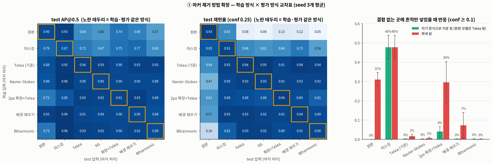

| 학습 방식 | 자기 방식 test AP | **인페인팅 5종 test 평균 AP** | **인페인팅 5종 test 평균 R@0.25** | 흔적 반응: 자기 방식 링 ¹ | 흔적 반응: 회색 링 ¹ |
|---|---|---|---|---|---|
| 원본 | 0.899 ± 0.027 | 0.646 ± 0.091 | **0.087 ± 0.080** | 0% (Telea 링) | 31.0% / 7.5% |
| 마스킹 | 0.866 ± 0.061 | 0.708 ± 0.093 | **0.639 ± 0.029** | 47.8% / 15.3% | 47.8% / 15.3% |
| **Telea** | **0.935 ± 0.011** | **0.924 ± 0.015** | **0.937 ± 0.006** | 0.2% / 0% | 1.6% / 0% |
| Navier-Stokes | 0.901 ± 0.043 | 0.901 ± 0.041 | 0.922 ± 0.013 | 0.1% / 0.1% | 0.5% / 0% |
| 2px 확장 + Telea | 0.912 ± 0.048 | 0.917 ± 0.027 | 0.874 ± 0.034 | **4.0% / 0.9%** | **29.6% / 7.4%** |
| 배경 채우기 | 0.898 ± 0.050 | 0.896 ± 0.046 | 0.918 ± 0.017 | 0.2% / 0% | 7.2% / 0.8% |
| Biharmonic | 0.887 ± 0.025 | 0.910 ± 0.010 | 0.911 ± 0.013 | 0.1% / 0% | 0.1% / 0% |

¹ 결함 없는 450곳 중 반응 비율, 신뢰도 ≥ 0.1 / ≥ 0.25

**인페인팅 5종 test 평균 AP의 seed별 짝 비교 (각 방식 − Telea)**
| 방식 | seed 0 | seed 1 | seed 2 | 평균 |
|---|---:|---:|---:|---:|
| Navier-Stokes | −0.031 | +0.036 | −0.075 | −0.024 |
| 2px 확장 + Telea | −0.001 | +0.030 | −0.050 | −0.007 |
| 배경 채우기 | −0.043 | +0.038 | −0.081 | −0.029 |
| Biharmonic | −0.026 | −0.002 | −0.015 | −0.014 |

**읽는 법**
- **원본·마스킹 학습은 어떤 방식으로 지운 입력에서도 실패합니다.** 원본 학습 모델의 재현율은 인페인팅 5종 모두에서 0.05~0.13, 마스킹 학습 모델은 0.56~0.73입니다. Telea 입력에서만 나쁜 것이 아니므로, 앞선 결론(원본·마스킹 탈락)은 평가 입력 선택 때문이 아닙니다.
- **Telea로 학습한 모델은 다른 방식으로 지운 입력에서도 AP 0.90~0.93, 재현율 0.91~0.95를 유지합니다.** 즉 Telea 모델의 성적은 "Telea 입력이라서"가 아닙니다.
- **인페인팅 5종끼리의 차이는 seed 편차 안입니다.** 짝 비교의 부호가 seed마다 바뀌고(Biharmonic 제외), 차이 크기가 seed 간 편차(0.01~0.05)와 비슷합니다. 다만 **Telea보다 평균이 높은 방식은 없고**, 자기 방식 test 기준으로 Telea의 seed 편차가 가장 작습니다(± 0.011).
- **2px 확장 + Telea는 흔적이 단서가 됩니다.** 자기 방식 링에 4.0%, 회색 링에 29.6% 반응합니다. 넓게 지우면 매끈하게 메운 영역이 결함 3px 앞까지 와서, "사각형 모양의 매끈한 테두리 안쪽 = 결함"이라는 연관을 배운 것으로 추정됩니다. 재현율도 인페인팅 중 가장 낮습니다(0.874).
- 배경 채우기 모델도 회색 링에 7.2% 반응해 Telea(1.6%)보다 흔적에 민감합니다.
- 마스킹 test(회색 테두리가 남은 입력) 열에서 인페인팅 모델들의 점수가 높은 것(AP 0.95~0.96)은 참고용입니다. 배포 영상에는 회색 테두리가 없으므로 판단에 쓰지 않았습니다.

**결론**
- **Telea 인페인팅(반경 3)을 유지합니다.** 평균 성능이 가장 높고, seed 간 편차가 가장 작고, 다른 채우기 방식의 입력에도 강하며, 흔적이 단서가 되지 않습니다.
- 원본 학습은 마커 없는 영상에서 결함의 약 91%를 놓치고, 마스킹은 회색 링 자체가 새 지름길이 되어 결함이 없는 곳의 절반 가까이에서 반응합니다.
- **남는 한계**: 진짜 마커 없는 영상으로는 검증하지 못했습니다. 주최 측이 마커 없는 라인 영상을 제공하면 그걸로 확인하는 것이 가장 확실합니다.

### 3.3 베이스라인
| seed | test AP@0.5 | P@0.25 | R@0.25 | 중심거리 R@0.25 |
|---|---:|---:|---:|---:|
| 0 | 0.943 | 0.961 | 0.951 | 0.990 |
| 1 | 0.923 | 0.956 | 0.942 | 0.985 |
| 2 | 0.940 | 0.960 | 0.942 | 0.981 |
| **평균** | **0.935 ± 0.011** | 0.959 ± 0.003 | 0.945 ± 0.006 | 0.985 ± 0.005 |

- 중심거리 AP는 0.995로, 결함 위치는 거의 다 맞힙니다. 남은 오차는 박스 크기와 신뢰도에서 나옵니다. 라벨 박스 크기가 들쭉날쭉한 영향입니다(§1.5).
- val AP는 0.951 ± 0.015입니다.
- 장비별 test AP(seed 0): 1호기 0.984, 2호기 0.946, **3호기 0.887**. 3호기는 노이즈가 약 3배이고, 416으로 줄이면 결함이 1.6px까지 작아집니다.

### 3.4 실험 ②: GT 없는 데이터 활용
이 실험은 두 질문으로 나눴습니다.
- **ⓐ 어떤 방법으로 라벨을 붙여야 정확한가?** → GT가 있는 사진에서 여러 방법을 채점(§3.4.1)
- **ⓑ 그렇게 만든 의사 라벨이 학습에 도움이 되는가?** → GT만 vs GT + 의사 라벨(§3.4.2)

#### 3.4.1 ⓐ 의사 라벨 방법 비교 (GT로 채점)
GT 없는 사진은 정답이 없어서 라벨 품질을 잴 수 없습니다. 그래서 **GT가 있는 train 사진을 GT 없는 사진인 척** 놓고, 각 방법이 붙인 라벨을 공식 TXT와 비교했습니다.

**설계: train 3-fold 교차 검증** (`prep/build_cv_folds.py`, `eval/pseudo/pl_methods_cv.py`)
- train 350장을 (장비, 날짜) 묶음 단위로 3조각으로 나눴습니다(층 = 장비 × 시편 종류, seed 42). 같은 날 사진은 같은 조각에 들어갑니다.

  | 조각 | 이미지 | 결함 | 묶음 | 1호기 / 2호기 / 3호기 |
  |---|---:|---:|---:|---|
  | 0 | 115 | 210 | 7 | 27 / 72 / 16 |
  | 1 | 87 | 231 | 4 | 36 / 0 / 51 |
  | 2 | 148 | 356 | 6 | 36 / 62 / 50 |

- 조각 k마다 **나머지 두 조각으로 교사를 학습**(베이스라인과 같은 설정, 300 epoch, seed 0)하고, **조각 k의 사진에 라벨을 붙여 채점**합니다. 교사는 채점할 사진을 학습에서 본 적이 없습니다.
- 교사의 최적 시점 선택과 임계값 T는 공식 val로 정했습니다(val 정밀도 ≥ 0.99가 되는 최소 신뢰도: 조각별 T = 0.103 / 0.134 / 0.144). **test는 쓰지 않았습니다.**
- 세 조각의 결과를 합쳐 train 350장 전체(결함 797개)로 채점했습니다.
- 한계: 날짜 묶음이 굵어서 조각마다 장비 구성이 고르지 않습니다(조각 1에 2호기 없음). 교사가 train의 2/3로만 학습해서, 실제 교사(train 전체로 학습)보다 조금 약합니다.

**비교한 방법 8가지**
| 이름 | 방법 | 마커 사용 |
|---|---|---|
| MK | 원본 마커(연결 성분)의 중심에 박스. 박스 크기 = 교사 학습 조각의 장비별 GT 박스 크기 중앙값. 제품 밖 마커 제외 | 사용 |
| T0 | 교사 검출 중 신뢰도 ≥ T | — |
| T1 | T0 + 제품 영역 밖 검출 제외 | — |
| T2 | T1 + 이미지당 검출 수가 1 또는 3인 이미지만 채택 (시편 구조) | — |
| **T3** | T2 + **애매한 검출(0.10 ≤ 신뢰도 < T)이 있는 이미지는 통째로 제외** (실험 ②ⓑ에 쓴 방법) | — |
| T4 | T3 + 같은 세션 사진들의 검출 수 최빈값과 같은 이미지만 채택 | — |
| H1 | 교사 검출(신뢰도 ≥ 0.05, 제품 안) 중 마커 중심 8px 안에 있는 것만 | 사용 |
| H2 | 마커 위치마다 8px 안에 교사 박스(신뢰도 ≥ 0.01)가 있으면 그 박스, 없으면 MK 박스 | 사용 |

- 제품 영역 = 밝은 컨베이어 배경과 구분되는 가장 큰 어두운 영역(Otsu 이진화 → 열림 → 최대 연결 성분 → 구멍 채움).
- 마커를 쓰는 방법(MK·H1·H2)은 규칙상 회색 지대라 "채택 시 주최 측 확인 필요" 후보로 넣었습니다. 마커를 모델 입력 특징으로 쓰는 것은 아니지만, 라벨 생성에 쓰기 때문입니다.

**결과 (train 350장, 결함 797개)**
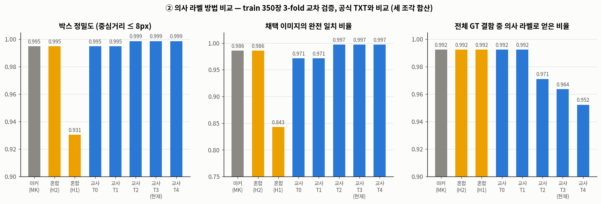

| 방법 | 채택 이미지 | 박스 정밀도 (IoU ≥ 0.5) | **박스 정밀도 (중심)** | 채택 이미지에서 놓친 결함 | **완전 일치 이미지** | 전체 결함 중 얻은 비율 |
|---|---:|---:|---:|---:|---:|---:|
| MK (마커) | 100% | 0.969 | 0.995 | 6 | 0.986 | 0.992 |
| T0 | 100% | 0.962 | 0.995 | 6 | 0.971 | 0.992 |
| T1 | 100% | 0.962 | 0.995 | 6 | 0.971 | 0.992 |
| T2 | 97.4% | 0.966 | **0.999** | **0** | **0.997** | 0.971 |
| **T3 (현재)** | 96.3% | 0.966 | **0.999** | **0** | **0.997** | 0.964 |
| T4 | 95.4% | 0.966 | **0.999** | **0** | **0.997** | 0.952 |
| H1 (혼합) | 100% | 0.900 | 0.931 | 6 | 0.843 | 0.992 |
| H2 (혼합) | 100% | 0.958 | 0.995 | 6 | 0.986 | 0.992 |

- 완전 일치 이미지 = 그 이미지의 의사 라벨이 정답과 하나도 안 틀린 비율(빠진 결함도, 틀린 박스도 없음)

**읽는 법**
- **T2~T4의 중심 기준 오류는 1개뿐이고, 그 1개도 실제 결함입니다.** `002_20200623_123055(5)`의 결함은 마커가 있고 모델도 찾지만 공식 TXT에 라벨이 없는 사례입니다(§1.6). 사실상 틀린 라벨이 없습니다.
- **구조 필터(검출 수 1 또는 3)가 핵심입니다.** T1에서 T2로 가면서 놓친 결함 6개가 모두 사라집니다. 교사가 결함을 놓친 이미지는 검출 수가 2개처럼 구조에 안 맞게 나와서 걸러집니다. 대가로 이미지의 2.6%를 버립니다.
- T3·T4의 추가 필터는 정확도를 더 올리지 못하고 이미지만 더 버립니다. T2와 T3는 사실상 같은 품질입니다.
- **마커 방식(MK)은 교사 방식보다 정확하지 않습니다.** 놓친 결함이 6개(마커가 없는 결함 포함), 중심 기준으로 틀린 박스가 4개입니다. 필터가 없어 틀린 이미지를 걸러내지 못합니다.
- **혼합 방식은 이득이 없습니다.** H1은 한 마커 주변의 낮은 신뢰도 검출이 여러 개 겹쳐 들어와 정밀도가 0.93으로 떨어집니다. H2는 MK와 거의 같습니다.
- IoU 기준 정밀도(0.96~0.97)가 중심 기준(0.999)보다 낮은 것은, 위치는 맞지만 박스 크기가 정답 박스와 달라서입니다. 정답 박스 크기 자체가 들쭉날쭉하기 때문입니다(§1.5). 장비별 IoU 기준 정밀도(T3): 1호기 0.966, 2호기 0.993, 3호기 0.935.

**결론: 교사 + 구조 필터(T3)를 유지합니다.** 가장 정확하고, 마커를 쓰지 않아 규칙 문제도 없습니다. T3는 실험 ②ⓑ에서 이미 쓴 방법이라 추가 학습은 하지 않았습니다.

#### 3.4.2 ⓑ 의사 라벨로 학습하면 도움이 되는가

**방법**
1. **교사**: 베이스라인(seed별 3개, train 350장 전체로 학습)
2. **의사 라벨 생성**: 교사가 "학습 가능" 1,244장(§2.4)에서 결함을 검출하고, T3 조건을 모두 만족하는 이미지만 씁니다.
   - 신뢰도 ≥ T. **T는 교사의 val 정밀도가 0.99(p990) 또는 1.00(p1000)이 되는 가장 낮은 신뢰도**입니다. val 검출을 신뢰도 높은 순으로 줄 세우고, 위에서부터 누적 정밀도가 목표 이상을 유지하는 가장 낮은 신뢰도를 고릅니다. 1.00은 "val에서 틀린 검출이 하나도 섞이지 않는 선"이라 더 엄격합니다.
   - 제품 영역 밖 검출은 제외합니다. 과제 대상이 제품 내부 이물이기 때문입니다.
   - 이미지당 검출 수가 1 또는 3으로 시편 구조와 맞아야 합니다.
   - 애매한 검출(0.10 ≤ 신뢰도 < T)이 있는 이미지는 통째로 제외합니다. 교사가 놓친 결함이 "배경"으로 학습되는 것을 막기 위해서입니다.
3. **학생**: 베이스라인 설정으로 COCO 초기값에서 새로 학습합니다. 데이터는 GT train 350장 + 의사 라벨 이미지, 100 epoch입니다. 데이터가 약 4배라 이미지 처리량은 베이스라인 300 epoch의 약 1.4배입니다.
4. **학습량 대조군**: 의사 라벨 대신 GT train 350장을 반복해서, 학생과 **같은 목록 크기·epoch·LR 스케줄**로 학습합니다. 학생과 비교하면 학습량 차이가 빠지고 **GT 없는 데이터의 순수 효과**만 남습니다.

| 기준 | 임계값 T (seed 0 / 1 / 2) | 의사 라벨 이미지 | 의사 라벨 결함 |
|---|---|---:|---:|
| p990 (정밀도 0.99) | 0.167 / 0.181 / 0.215 | 1,161 ~ 1,187 | 2,001 ~ 2,039 |
| p1000 (정밀도 1.00) | 0.203 / 0.237 / 0.270 | 1,152 ~ 1,165 | 1,982 ~ 1,993 |

- 두 기준의 의사 라벨은 98~99% 같습니다. p1000 결과가 p990의 부분집합이고, 공통 이미지의 라벨은 100% 동일합니다. 그래서 두 조건은 **거의 같은 데이터로 한 번 더 학습한 반복 실험**으로도 읽을 수 있습니다.

**의사 라벨 품질 (val 66장에 같은 절차를 적용해 공식 TXT와 비교)**
| 교사 | 필터 통과율 | 의사 라벨 정밀도 | 통과 이미지에서 놓친 결함 |
|---|---:|---:|---:|
| seed 0 / 1 / 2 | 88~94% | **1.00** | **0** |

임계값을 같은 val에서 정했으므로 낙관적인 추정입니다. §3.4.1의 교차 검증(임계값을 정한 사진과 채점한 사진이 다름)에서도 중심 기준 정밀도 0.999로 같은 결론입니다.

**결과**
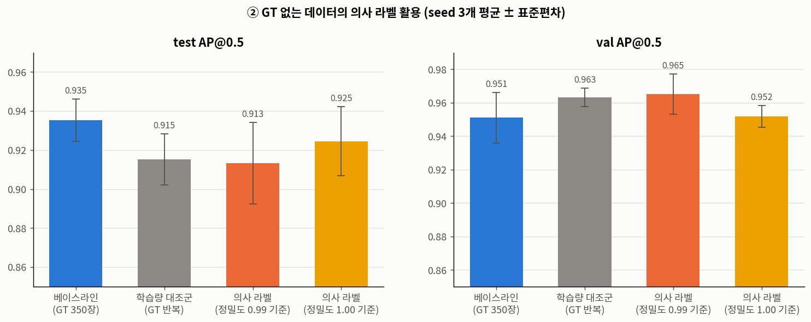

| 지표 | 베이스라인 | 학습량 대조군 | 의사 라벨 (p990) | 의사 라벨 (p1000) |
|---|---|---|---|---|
| **test AP@0.5** | **0.935 ± 0.011** | 0.915 ± 0.013 | 0.913 ± 0.021 | 0.925 ± 0.018 |
| test R@0.25 | 0.945 ± 0.006 | 0.942 ± 0.005 | 0.940 ± 0.012 | 0.937 ± 0.005 |
| test P@0.25 | 0.959 ± 0.003 | 0.946 ± 0.005 | 0.945 ± 0.008 | 0.954 ± 0.010 |
| val AP@0.5 | 0.951 ± 0.015 | 0.963 ± 0.005 | 0.965 ± 0.012 | 0.952 ± 0.007 |
| GT 없는 평가용 560장: 구조 일치율 / 검출 0개 비율 ¹ | 0.971 / 0.009 | 0.977 / 0.007 | 0.989 / 0.002 | 0.967 / 0.011 |
| 이상 이미지 107장 헛검출 비율 ¹ | 0.028 | 0.028 | 0.028 | 0.028 |

¹ 정답이 없는 참고 지표. 구조 일치율 = 신뢰도 0.25 이상 검출 수가 1 또는 3인 이미지 비율(제품 밖 검출 제외)

seed별 짝 비교 (test AP 차)
- 대조군 − 베이스라인: −0.041 / +0.005 / −0.023 (평균 −0.020)
- 의사 라벨(p990) − 대조군: +0.015 / −0.036 / +0.015 (평균 −0.002)
- 의사 라벨(p1000) − 대조군: +0.044 / −0.013 / −0.003 (평균 +0.009)

**결론**
- **GT 없는 데이터의 순수 효과는 없습니다.** 학습량을 맞춘 대조군 대비 test AP 차이가 평균 −0.002 / +0.009이고, 부호가 seed마다 바뀝니다.
- 학습량 증가 자체는 val을 올리고(+0.012) test를 약간 낮춥니다(−0.020). 대조군 없이 학생과 베이스라인만 비교했다면 "의사 라벨이 해롭다"고 잘못 결론 내렸을 것입니다.
- 의사 라벨이 98~99% 같은 두 조건의 결과가 ±0.01~0.02 차이 나므로, 이 크기의 차이는 우연 범위입니다.
- 원인: GT 없는 데이터도 **같은 테스트피스를 같은 위치에서 찍은 영상**이라, 라벨이 정확해도 모델에 새 정보를 주지 못합니다.
- **GT 없는 데이터는 학습에 쓰지 않고, 처음 보는 날짜에서의 검출 일관성 확인과 이상 입력 점검에 씁니다.**

### 3.5 실제 데이터의 실패 조건 분석
**질문**: 지금 모델은 실제 데이터에서 언제 결함을 놓치나?

**방법** (`eval/failure/collect_heldout.py`, `failure_analysis.py`)
- GT 결함 1,147개 전부를, **그 사진을 학습에 쓰지 않은 모델**로 채점했습니다.
  - val·test 150장(결함 350개): 베이스라인 seed 3개
  - train 350장(결함 797개): 실험 ②ⓐ의 교차 검증 교사 (해당 조각을 학습하지 않은 교사, seed 0)
- 결함마다 **결함 중심 8px 안 검출의 최대 신뢰도**를 구합니다. 0.25 미만이면 "놓침"으로 셉니다. 놓친 비율을 결함 조건(장비, CNR, 배경 밝기, 크기, 위치, 시간대 등)별로 비교했습니다.

**결과**
| 조건 | 결함 수 (×모델) | 놓침 (신뢰도 < 0.25) |
|---|---:|---:|
| 1호기 | 678 | 1.0% |
| 2호기 | 582 | 0.2% |
| 3호기 | 587 | **5.6%** |
| 3호기, CNR ≤ 8 | 253 | 4.7% |
| 3호기, CNR 8~10 | 154 | **10.4%** |
| 3호기, CNR > 10 | 180 | 2.8% |
| 1·2호기, CNR ≤ 10 | 45 | 2.2% |
| 1·2호기, CNR > 10 | 1,215 | 0.6% |
| 3호기 2020-06-24 하루 | 102 | **17.6%** |

- **아예 못 찾은 결함은 0개입니다.** 놓친 41건 모두 결함 위치에 신뢰도 0.07~0.25로 반응했습니다. 모델이 보지 못하는 영역이 있는 게 아니라 확신이 약한 경우입니다.
- **놓침은 3호기의 흐린 결함(CNR ≤ 10)에 몰려 있습니다.** 3호기는 잡음이 약 3배이고, 416 입력에서 결함이 1.4px로 가장 작습니다.
- 크기, 제품 가장자리 거리, 배경 밝기, 시편 종류로 나눈 차이는 대부분 장비 차이로 설명됩니다. 3호기가 이미지가 커서 가장자리 거리가 길고, 배경 밝기도 중간 구간에 있기 때문입니다.
- **AP를 깎는 주원인은 박스 크기입니다.** 위치를 맞힌 검출 1,806건 중 61건(3.4%)이 IoU < 0.5였습니다. 이때 정답 박스는 예측 박스의 약 0.70배(중앙값)로 더 작습니다. 라벨 박스 크기가 들쭉날쭉한 영향입니다(§1.5).
- 신뢰도 0.25 이상 오검출은 1,847건 중 2건뿐입니다(중심 기준).

**결론**: 실제 데이터에서 찾을 수 있는 약점은 **"잡음 많은 장비의 흐린 결함"** 하나입니다. 그 밖의 조건은 데이터에 변화가 없어서 약점인지 아닌지조차 알 수 없습니다(§3.6).

### 3.6 데이터 다양성 정량화
**질문**: 과제가 요구하는 "이물 조건(크기·위치·형상·밀도·대비)에 따른 성능 변화"를 지금 데이터로 잴 수 있나?

**방법** (`eda/diversity.py`): 결함 1,147개마다 결함 코어 주변 12×12px를 잘라 아래 값을 측정했습니다.
- **감쇠율** a = 1 − I / I_배경: 결함이 X선을 얼마나 가리는지. 0이면 그대로 통과, 1이면 완전 차단
- **광학 밀도** OD = −ln(1 − a): Beer-Lambert 법칙에서 OD = (재질의 감쇠 계수 × 두께)이므로, **재질 밀도 × 두께**의 대리 지표
- **크기**: 최대 감쇠의 절반 이상인 픽셀 수(반치 면적)
- **형상**: 장비별 평균 결함 패치와의 정규화 상관
- **위치**: 제품 영역의 외접 사각형 기준 정규화 좌표 (u, v), 제품 가장자리까지 거리
- **배경 비교**: 장비별 이미지 40장의 제품 픽셀 밝기 분포

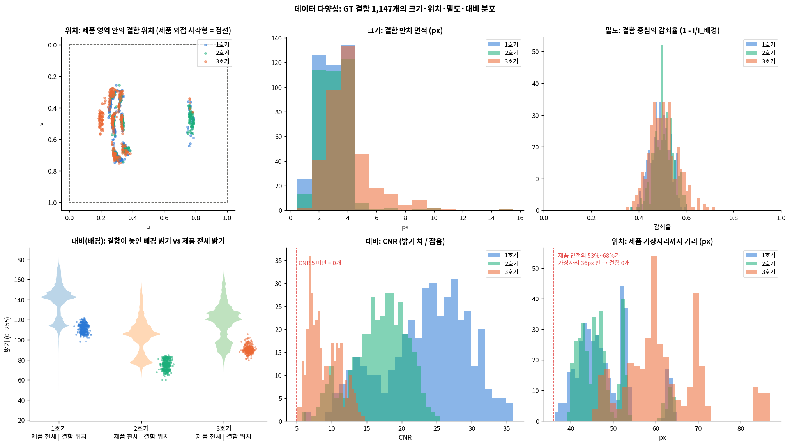
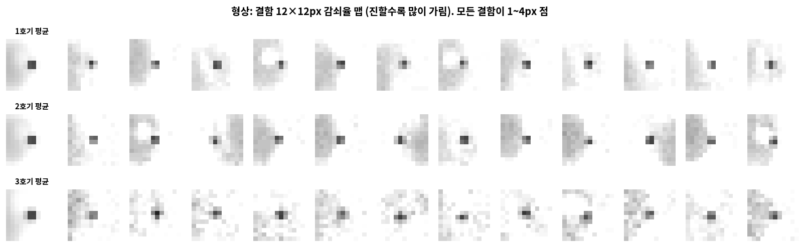

| 조건 | 측정값 (5~95% 범위, 장비 3대) | 제품 전체에서 가능한 범위 | 다양성 |
|---|---|---|---|
| **크기** | 반치 면적 1~7px (중앙 3~4px), 416 입력에서 한 변 1.0~2.6px | 제품 크기 190~260px | ❌ 한 가지 (1~4px 점) |
| **위치** | 제품 안 **고정된 4곳**(시편 종류별 1곳 또는 3곳). 결함 위치 반경 10px이 제품 면적의 2~4% | 제품 전체 | ❌ 4곳 |
| **위치 (가장자리)** | 제품 가장자리에서 **최소 36px** | 제품 면적의 53~68%가 가장자리 36px 안 | ❌ 가장자리 결함 0개 |
| **형상** | 모두 1~4px 점. 해상도 한계로 모양 구분 불가 | — | ❌ 한 가지 |
| **밀도 (감쇠)** | 감쇠율 0.41~0.60, OD 0.53~0.93 (변동계수 약 10%) | — | ❌ 한 가지 재질·두께 |
| **개수** | 이미지당 1개 또는 3개 (시편 종류로 결정) | — | ❌ 2가지 |
| **배경 (제품 두께)** | 결함 주변 밝기 1호기 105~118, 2호기 68~83, 3호기 86~97 | 제품 밝기 1호기 111~165, 2호기 76~136, 3호기 88~148 | ❌ 제품의 가장 어두운 부분(띠 끝)에만 |
| **대비 (CNR)** | 6~32. 장비 차이로만 변함(3호기 6~13) | — | △ 장비 3대만큼 |
| **잡음** | 장비별 고정(1호기·2호기 σ 1.5, 3호기 4.5) | — | △ 장비 3대만큼 |

- 모든 결함은 **같은 시편의 같은 위치(어두운 띠 끝)**에 있어서, 결함 주변 맥락까지 같습니다. 평균 패치(f11 첫 열)에 띠의 끝이 항상 같은 쪽에 보입니다.
- 장비 사이에서는 결함 대비 ÷ 배경 밝기가 0.34~0.36으로 일정합니다. 배경이 68→113으로 바뀌어도 같은 비율로 어두워지므로, **곱셈형 감쇠(Beer-Lambert)와 맞습니다**. 장비 안에서는 배경 범위가 좁아(±5) 따로 검증할 수 없습니다.

**결론: 현재 데이터로는 모델의 조건별 미탐지 성능을 평가할 수 없습니다.** 대비와 잡음은 장비 3대만큼만 변하고, 크기·위치·형상·밀도·배경은 사실상 한 가지입니다. 현재 test 점수 0.935는 **"처음 보는 날에 같은 시편을 찾는 능력"**입니다. 실험 ②에서 GT 없는 데이터가 효과가 없었던 이유도 같습니다. GT 없는 사진도 같은 시편을 찍은 것이라 새 조건을 더하지 못합니다.

### 3.7 과제 안내사항 준수
| 안내 | 적용 |
|---|---|
| 마커를 탐지 특징으로 사용 금지 | 모든 학습·평가 입력에서 마커를 지움. 마커는 지울 위치를 찾는 마스크로만 사용. 채택한 의사 라벨(T3)은 교사 모델의 검출에서 나오며 마커를 쓰지 않음 |
| 공식 정답 = TXT, 불일치 시 TXT 우선 | 공식 TXT를 수정 없이 복사해 사용(500개 바이트 대조). 마커는 있는데 TXT에 없는 결함 1건도 라벨을 추가하지 않음. 의사 라벨은 평가 정답에 쓰지 않음 |
| 전처리 허용, 방법·영향 명시 | §3.2 (방법, 바뀐 픽셀 비율, 결함과의 거리, 흔적 검사) |
| 외부 데이터: 사유·방법·출처 명시 | **COCO 사전학습 YOLOv3-SPP 가중치** (`pjreddie.com/media/files/yolov3-spp.weights`, md5 `6c569c9ef748131c2d96b2deab446a5f`). 외부 이미지·라벨은 사용하지 않음. **사유**: 학습 결함 797개로 6,260만 파라미터 모델을 처음부터 학습하기엔 부족하고, 과제 제공 가중치는 평가 이미지가 섞여 초기값으로 부적합. **방법**: backbone·neck 텐서 508/514개를 옮기고 출력 헤드는 새로 초기화한 뒤 전체 층을 미세조정. 제출 전 Darknet·COCO 라이선스 원문 확인 필요 |
| 외부 데이터 (새 베이스라인, §3.8) | **COCO 사전학습 YOLOv8s** (`github.com/ultralytics/assets/releases/download/v8.3.0/yolov8s.pt`, md5 `0a1d5d0619d5a24848a267ec1e3a3118`, AGPL-3.0). **COCO 사전학습 D‑FINE‑S** (`github.com/Peterande/storage/releases/download/dfinev1.0/dfine_s_coco.pth`, md5 `24db8615005ce1f8276cdcc37e6f948d`, 코드 Apache-2.0). 사유·방법은 YOLOv3와 같음(출력 헤드를 1클래스로 새로 만들고 전체 미세조정). PIDray는 사전학습 조건 ③용으로 준비만 했고 아직 쓰지 않음(§6) |

### 3.8 새 베이스라인: YOLOv8s, D‑FINE‑S (COCO 사전학습)
**질문**: 최신 검출 모델로 바꾸면 성능과 실패 양상이 어떻게 달라지나? 두 모델을 학습한 뒤, 기존 실험(기본 평가, 마커 흔적 검사, 실패 조건, 합성 검증 V3·V4, 스트레스 곡선)을 **학습 없이 추론만으로** 다시 했습니다. 사전학습 3조건 비교(§6) 중 조건 ②(COCO)에 해당합니다.

**설정** (`prep/run_nb2.sh`, `configs_nb2/dfine_s_kamp.yml`, `eval/nb2_eval.py`, `eval/nb2_models.py`, `prep/run_nb2_reruns.sh`, `eval/nb2_compare.py`)
| 항목 | YOLOv8s | D‑FINE‑S |
|---|---|---|
| 초기값 | COCO 사전학습 (§3.7) | COCO 사전학습 (§3.7) |
| 데이터 | 전달 패키지와 같은 이미지(Telea 인페인팅)·분할·공식 TXT 라벨 | 같음 |
| 입력 | 640 (3호기 576×444가 줄어들지 않음) | 640 |
| 학습 | 300 epoch, 배치 16. 기본 증강에서 확대·축소를 0.5 → 0.2로 줄임(0.5는 2px 결함을 1px로 뭉갬), 색상 증강 끔(흑백) | 공식 custom 설정에서 RandomZoomOut 제거(최대 1/4로 줄여 결함이 사라짐), 배치 64 → 16(lr 1/2), 160 epoch(증강은 150에서 정지) |
| 체크포인트 선택 | val 0.1·AP50 + 0.9·AP50:95 최고 (epoch 125~135) | val AP50:95 최고 (epoch 58~64) |
| 학습 시간 (RTX 4090 1장) | 약 12분 | 약 29분 |
| 추론 | 신뢰도 ≥ 0.001, NMS IoU 0.5 (YOLOv3와 같음) | 신뢰도 ≥ 0.001, NMS 없음(상위 300 쿼리) |
- 평가는 YOLOv3와 같은 도구(공식 TXT, 같은 매칭·지표)를 씁니다.
- **체크포인트 선택 기준이 다릅니다.** YOLOv3는 val AP@0.5, 새 모델은 각 프레임워크 기본값(AP50:95 위주)으로 골랐습니다.
- **실패 조건과 합성 검증은 val·test 결함 350개만으로 했습니다.** §3.5는 train 결함까지 교차 검증 교사로 채점했지만, 새 모델에는 교사가 없습니다. 아래 표의 YOLOv3 값도 같은 범위(베이스라인 seed 3개, val·test)로 다시 계산한 것이라 §3.5·§4.4의 값과 조금 다릅니다.

**결과 1: 기본 평가** (seed 3개 평균 ± 표준편차)
| 모델 | test AP@0.5 | P / R@0.25 | val AP@0.5 | test 1호기 | test 2호기 | test 3호기 | seed별 test AP |
|---|---:|---:|---:|---:|---:|---:|---|
| YOLOv3-SPP 416 | 0.935 ± 0.011 | 0.959 / 0.945 | 0.951 ± 0.015 | 0.983 | 0.933 ± 0.017 | 0.879 ± 0.011 | 0.943, 0.923, 0.940 |
| YOLOv8s 640 | **0.958 ± 0.021** | 0.971 / 0.971 | 0.984 ± 0.007 | 0.979 | 0.942 ± 0.053 | **0.947 ± 0.008** | 0.952, 0.941, 0.982 |
| D‑FINE‑S 640 | 0.942 ± 0.034 | 0.943 / 0.963 | 0.988 ± 0.007 | 0.985 | 0.938 ± 0.068 | 0.901 ± 0.014 | 0.958, 0.903, 0.964 |

- **평균은 YOLOv8s가 가장 높지만, 차이(+0.023, +0.007)가 seed 편차 안에 있습니다.** 특히 2호기 test에서 seed 사이 편차가 큽니다(± 0.05~0.07).
- 가장 일관되게 오른 곳은 **3호기(0.879 → 0.947, YOLOv8s)**입니다. 640 입력에서 3호기 영상이 줄어들지 않기 때문으로 보이지만, 모델과 해상도를 함께 바꿔서 둘의 효과는 분리되지 않습니다.
- 세 모델 모두 중심거리 AP는 0.995입니다. 남은 차이는 박스 크기와 신뢰도 순위에서 나옵니다(§1.6).

**결과 2: 실패 조건** (val·test 결함 350개 × seed 3)
| | YOLOv3-SPP 416 | YOLOv8s 640 | D‑FINE‑S 640 |
|---|---:|---:|---:|
| 놓침 (신뢰도 < 0.25), 전체 | 1.6% | **0%** | **0%** |
| 놓침, 3호기 / 3호기 CNR 8~10 | 3.6% / 5.1% | 0% / 0% | 0% / 0% |
| 찾은 결함 중 IoU < 0.5 | 3.5% | 2.2% | 2.8% |
| 오검출 (신뢰도 ≥ 0.25, 중심 기준, seed당) | 0.3건 | 0건 | 0건 |
| 마커 흔적 검사: 가짜 링 450곳 반응 (신뢰도 ≥ 0.25 / ≥ 0.1) | 0% / 0.22% | 0% / 0.07% | 0.07% / 0.15% |

- 새 모델은 val·test 결함을 **모두** 신뢰도 0.25 이상으로 찾았습니다. YOLOv3의 유일한 약점이던 3호기 흐린 결함도 놓치지 않습니다.
- 마커를 지운 흔적에는 세 모델 모두 반응하지 않습니다(같은 자리의 원본과 차이 없음). D‑FINE은 신뢰도 0.01 기준에서는 흔적 5.3%, 원본 3.7%로 둘 다 높습니다. 낮은 신뢰도 검출을 넓게 뿌리는 출력 특성으로 보입니다.

**결과 3: 위치 사전 반응 (중요)**
| | YOLOv3-SPP 416 | YOLOv8s 640 | D‑FINE‑S 640 |
|---|---:|---:|---:|
| 실제 결함을 **지운 자리**의 반응 (신뢰도 ≥ 0.25) | 0.7% | **21.1%** | **67.1%** |
| 같은 자리, 신뢰도 ≥ 0.1 | 10.6% | 30.6% | 78.1% |
| 같은 지우기를 한 **빈 자리**(제품 안 3곳, 1,500곳)의 반응 (신뢰도 ≥ 0.1) | 0% | 0% | 0% |
| 스트레스 밀도 축 k = 0.1(대비 1/10)에서 검출률 | 1.8% | 31.6% | 73.1% |

- 결함을 지워도 새 모델은 그 자리에 결함이 있다고 답합니다. 같은 지우기를 다른 자리에 했을 때는 반응이 없으므로, **지운 흔적이 아니라 결함이 늘 있던 위치(띠 끝)에 반응**하는 것입니다. 결함 위치가 고정된 4곳뿐이라(§3.6) 위치만 보고도 답을 맞힐 수 있는 지름길이 있고, 새 모델은 YOLOv3(§4.3 부수 발견)보다 이를 훨씬 강하게 학습했습니다.
- 따라서 **새 모델의 높은 재현율에는 위치 기억이 섞여 있을 수 있습니다.** 현재 test는 같은 시편의 같은 위치라서, 결함을 보고 찾았는지 위치로 찾았는지 구분하지 못합니다.
- **스트레스 곡선(§4.4)은 새 모델에 대해 감도로 해석할 수 없습니다.** 검출률 50% 지점의 대비(전체)는 YOLOv3 10.3 → YOLOv8s 4.9 → D‑FINE‑S 1.9로 내려가지만, 결함이 거의 없을 때(k = 0.1)도 검출률이 이미 32% / 73%입니다. 결함 감도가 아니라 위치 반응을 잰 것입니다. D‑FINE의 1.9는 결함이 없는 자리에서 잰 대비(5~7)보다도 낮습니다. 비교 그림은 `eda/fig/n1_stress_models.png`, 값은 `eval/out_nb2/compare_stress.csv`에 있습니다.

**결과 4: 합성 검증 V3** (실제 결함 vs 같은 자리 합성 결함, 결함별 신뢰도 상관)
| 합성 | YOLOv3-SPP 416 | YOLOv8s 640 | D‑FINE‑S 640 |
|---|---:|---:|---:|
| 옮겨 심기 (T_cross) | 0.86 | 0.94 | 0.92 |
| 매개변수 합성 (R1_cal) | 0.91 | 0.58 | 0.63 |
- 옮겨 심기는 새 모델에서도 실제 결함과 같은 반응을 냅니다. 매개변수 합성은 덜 일치합니다. 새 모델에서는 놓침이 거의 없어 신뢰도가 1 근처에 몰리므로 상관이 불안정하지만, "옮겨 심기는 조건부 통과, 매개변수 합성은 불통과"라는 §4.3 판정과 같은 방향입니다(합성은 모두 평가 전용).

**결론**
- 새 모델은 실제 test에서 YOLOv3와 같거나 조금 낫습니다(평균 차이는 seed 편차 안). 3호기는 YOLOv8s에서 일관되게 좋아졌습니다.
- 세 모델 모두 val·test 결함을 사실상 다 찾아서, **현재 test로는 모델 사이의 감도 차이를 가릴 수 없습니다.**
- 새 모델은 **결함 위치를 지름길로 강하게 학습**했습니다. 그래서 다음 평가인 **위치 축 스트레스**(띠 끝이 아닌 자리에 결함을 옮겨 심기)가 모델 비교에서 가장 중요한 평가가 됩니다 → §4.5에서 했고, 세 모델 모두 다른 자리 결함을 크게 놓쳤습니다. 학습에서도 옮겨 심기로 결함 위치를 다양하게 하는 것이 지름길을 줄일 후보입니다.

### 3.9 사전학습 비교: ① 없음 ② COCO ③ COCO → PIDray
**질문**: 결함 797개로 학습할 때 사전학습이 필요한가? X선 도메인 데이터(PIDray)로 한 번 더 사전학습하면 나아지나?

**설정** (`prep/run_nb2.sh <모델> <gpu> <seed> scratch|coco|pidray`, `prep/run_pidray_pretrain.sh`, `configs_nb2/dfine_s_{pidray,kamp_scratch}.yml`)
- KAMP 단계는 세 조건 모두 같습니다(§3.8의 해상도·증강·epoch·체크포인트 선택, seed 3개).
- ① 없음: 무작위 초기화. D‑FINE은 ImageNet backbone 자동 다운로드도 끔(`HGNetv2: pretrained: False`).
- ③ PIDray 1단계: COCO 가중치에서 PIDray 흑백 9,482장(12종, train 8,534 / val 948)으로 학습. YOLOv8s 50 epoch(배치 32, PIDray val mAP50 0.963, mAP50:95 0.903), D‑FINE‑S 48 epoch(배치 32, val AP50:95 0.894). 2단계에서 출력 헤드만 1클래스로 새로 만들고 나머지는 이어받음.

**결과** (seed 3개 평균 ± 표준편차. 위치 축 = §4.5, val·test 기증 결함)
| 모델 | 조건 | 실제 test AP@0.5 | test 3호기 | val AP@0.5 | 지운 자리 반응 | 다른 자리 k = 1 |
|---|---|---:|---:|---:|---:|---:|
| YOLOv8s | ① 없음 | 0.927 ± 0.042 | 0.881 | 0.988 | 14.9% | 29% ± 5 |
| YOLOv8s | ② COCO | **0.958 ± 0.021** | **0.947** | 0.984 | 21.0% | 42% ± 16 |
| YOLOv8s | ③ COCO → PIDray | 0.947 ± 0.017 | 0.906 | 0.985 | 37.3% | 53% ± 11 |
| D‑FINE‑S | ① 없음 | 0.908 ± 0.006 | 0.850 | 0.965 | 78.5% | 80% ± 6 |
| D‑FINE‑S | ② COCO | 0.942 ± 0.034 | 0.901 | 0.988 | 67.0% | 83% ± 4 |
| D‑FINE‑S | ③ COCO → PIDray | 0.943 ± 0.012 | 0.932 | 0.986 | **94.9%** | 84% ± 4 |

- **실제 test에서는 ② COCO가 가장 좋거나 같고, ③ PIDray의 추가 이득은 보이지 않습니다.** ②와 ③의 차이는 seed 편차 안입니다. ① 없음은 두 모델 모두 가장 낮습니다(YOLOv8s 0.927, D‑FINE‑S 0.908). D‑FINE‑S ①은 신뢰도 0.25에서 정밀도도 낮습니다(test P 0.79~0.92).
- **위치 지름길은 사전학습 조건과 상관없이 생깁니다.** 결함을 지운 자리 반응이 YOLOv8s ① 15% / ② 21% / ③ 37%, D‑FINE‑S ① 79% / ② 67% / ③ 95%입니다. YOLOv8s에서는 사전학습이 많을수록 커지지만 D‑FINE‑S에서는 일정한 순서가 없고, 사전학습이 없어도 강합니다. 지름길의 원인은 사전학습이 아니라 **결함 위치가 고정된 학습 데이터**입니다. 실제 데이터에는 다른 위치의 결함이 없고 합성 데이터는 학습에 쓰지 않으므로(§4 머리말), 지금 학습 방식으로는 끊을 수단이 없습니다.
- PIDray는 물체가 크고(박스 중앙값 133px) 보안 검색 영상이라, 2px 결함 검출에는 도움이 제한적이라는 예상(§6)과 맞습니다. 라이선스(학술 목적 한정)를 고려하면 **최종 파이프라인에는 ② COCO를 권장**합니다.

---

## 4. 실험 ③: 조건 통제 합성 결함

§3.5·§3.6의 결론: 실제 데이터의 약점은 "흐린 결함" 하나뿐이고, 나머지 조건은 측정할 수 없습니다. 그래서 아래 순서로 갑니다(failure-driven augmentation). 과제 요구사항 ②(조건별 성능 변화 분석)에 직접 답하는 구조입니다.

```
합성 모델(가설) → 합성 타당성 검증 → 통과? ─ 아니오 → 합성 방법 수정
                                        └ 예 → 스트레스 test → 실패 분석 (조건별 한계 보고)
```

**원칙 (팀 결정, 2026-10-06): 합성 데이터는 학습에 쓰지 않고 test에만 씁니다.** 모든 모델은 공식 TXT 라벨이 있는 실제 train 350장만으로 학습합니다. 합성은 실제 데이터로 잴 수 없는 조건(위치·크기·형상·재질·농도·잡음)에서 모델의 한계를 재는 데만 씁니다. 합성 타당성 검증(§4.3)은 "이 합성으로 잰 성능을 실제 결함에 대한 성능으로 읽어도 되는가"를 판정합니다.

### 4.1 참고한 방법
| 방법 | 내용 | 이 데이터에 적용 |
|---|---|---|
| **Threat Image Projection (TIP)** | 공항 X선 검색에서 쓰는 방식. 따로 찍은 위험물 X선 영상을 정상 가방 영상에 **투과율을 곱해** 겹침(Beer-Lambert). 합성만으로 학습한 모델이 실제 데이터 학습의 약 90% 성능(mAP 0.78 vs 0.88)을 낸 보고가 있음 [1] | 곱셈 합성 원리를 씀. 따로 찍은 이물 영상은 없으므로 **train 결함 797개의 실제 광학 밀도 맵을 이식 소스**로 씀(시도 4). 실제 예가 없는 크기·형상은 매개변수로 생성 |
| **잘라 붙이기 (cut-paste)** | 따로 찍은 이물 X선 영상을 잘라 정상 포장식품 영상에 붙이되, 픽셀을 바꿔 넣지 않고 **제품 밝기에 곱해서** 붙임 [2] | 실제 결함이 2×2px 점 하나뿐이라 모양을 다양하게 만들 수 없음 → 크기·모양 확장은 매개변수 생성으로 |
| **물리 시뮬레이션** | 3D 모델에서 투영 영상을 계산 [3] | 제품 3D 정보와 장비 사양이 없어 적용 불가 |
| **생성 모델 (GAN·확산)** | 학습으로 이물 영상을 만듦 | 학습할 이물 다양성이 없고 조건 통제가 어려워 쓰지 않음 |

### 4.2 합성 모델 (가설)
```
I_합성(x) = ( 배경(x) + 잡음 보충(x) ) · exp( −OD0 · box(x) )
  box = 사각 물체(한 변 w) ⊗ 장비 흐림(가우시안 σ), 픽셀 면적으로 적분 (물체 내부 = 1)
  OD0 = 물체 내부의 광학 밀도 = 재질 감쇠 계수 × 두께 → 크기(w)·흐림(σ)·밀도(OD0)를 따로 조절
```
- 곱셈이므로 배경이 밝은(얇은) 곳에서는 대비가 크고, 어두운(두꺼운) 곳에서는 작아집니다. 실제 결함은 장비 간 비교에서 이 성질과 맞지만(§3.6), 장비 안에서는 검증되지 않은 **가설**입니다.
- 결함이 픽셀 크기라서, 한 점에서 값을 찍지 않고 픽셀 면적 전체로 적분합니다.
- 라벨: 공식 TXT는 그대로 두고, 합성 결함 박스만 추가합니다. 박스 크기 관례가 결과를 좌우하지 않도록, 조건별 성능은 **중심거리 재현율**로 봅니다.

### 4.3 합성 타당성 검증
**방법: 복제 검사** (`prep/synth/build_replica.py`, `eval/synth/validate_replica.py`)
1. GT 결함 1,147개를 각각 Telea로 지우고, 지운 영역에 장비별 잡음을 다시 채웁니다.
2. 실제 결함에 합성 모델을 맞춰 OD0·w·σ·위치를 구합니다(관측 광학 밀도 −ln(실제/지운 배경)에 최소제곱).
3. **같은 자리에 합성 결함을 다시 넣고**, 실제 결함과 짝지어 비교합니다.
4. 모델 반응은 "그 사진을 학습에 쓰지 않은 모델"로 봅니다(val·test = 베이스라인 seed 3개, train = 교차 검증 교사).
5. 밝기 보정 계수는 train 결함으로만 정하고, 판정(V1·V2)은 val·test 결함 350개로 합니다.

**통과 기준 (결과를 보기 전에 정함)**
| 층 | 검사 | 통과 기준 |
|---|---|---|
| V1 물리·화소 | 대비, CNR, 최대 광학 밀도, 반치 면적, 잡음 σ | 실제 대비 표준화 평균차 \|SMD\| < 0.2 |
| V2 통계 | 반경 방향 밝기 단면 | 차이 < 결함 간 편차의 20% |
| V2 보조 | 실제 vs 합성 패치 구별 분류기 (장비·날짜 묶음 교차 검증) | AUC ≤ 0.60. 단독으로 판정하지 않음 |
| V3 모델 반응 | 놓침률, 신뢰도, 박스 중심 오차 | 놓침률 차 ≤ 2%p, **기준 구간(3호기 CNR 8~10, 실제 놓침 10.4%)**에서 95% 구간이 겹침, 신뢰도 차 < 0.05, 중심 오차 차 < 0.5px |
| V4 빈 합성 | 결함 없는 곳 1,500곳을 지우고 잡음만 채움 | 반응률이 원본 대비 +0.5%p 이하 |

**검사력 확인**: 일부러 틀리게 만든 합성(흐림 없는 점, 잡음 미보충)은 분류기가 AUC 0.997~0.999로 구별했습니다. 실제 결함을 무작위로 둘로 나눈 음성 대조는 0.51이었습니다. 즉 이 검사는 틀린 합성을 잡아낼 힘이 있습니다.

**결과**
| 층 | 지표 | 시도 1 가우시안 점 | **시도 2 사각 물체 + 보정** | 시도 3 격자 정렬 + 보정 | 기준 |
|---|---|---|---|---|---|
| V1 | 대비 SMD | +0.47 ✗ | **0.00** ✓ | +0.03 ✓ | < 0.2 |
| V1 | CNR SMD | +0.22 ✗ | **−0.06** ✓ | +0.01 ✓ | < 0.2 |
| V1 | 최대 광학 밀도 SMD | +0.53 ✗ | **−0.01** ✓ | +0.03 ✓ | < 0.2 |
| V1 | 반치 면적 SMD | +0.14 ✓ | +0.27 ✗ | +0.10 ✓ | < 0.2 |
| V1 | 잡음 σ SMD | +0.04 ✓ | +0.04 ✓ | +0.00 ✓ | < 0.2 |
| V2 | 밝기 단면 차 (결함 간 편차 대비) | 1.58 ✗ | 0.96 ✗ | 0.29 ✗ | < 0.2 |
| V2 보조 | 구별 AUC | 0.97 | 0.97 | 1.00 | ≤ 0.60 |
| V3 | 놓침률 실제 → 합성 | 2.2% → 2.4% | **2.2% → 3.2%** ✓ | 2.2% → 4.9% ✗ | 차 ≤ 2%p |
| V3 | 기준 구간 놓침 실제 → 합성 | 10.4% → 5.8% | **10.4% → 9.1%** ✓ (16 → 14 / 154) | 10.4% → 13.6% ✓ (16 → 21) | 95% 구간 겹침 |
| V3 | 신뢰도 차 / 상관 | +0.008 / 0.94 | **−0.007 / 0.94** ✓ | −0.022 / 0.90 ✓ | < 0.05 |
| V3 | 중심 오차 차 | +0.02px | **+0.02px** ✓ | +0.07px ✓ | < 0.5px |
| V4 | 빈 합성 반응 (신뢰도 ≥ 0.1) | 0% (1,500곳) ✓ | 0% ✓ | 0% ✓ | +0.5%p 이하 |

- **시도 1 (가우시안 점)**: 실제보다 넓게 번지고 중심이 12% 더 어두워 V1에서 탈락했습니다.
- **시도 2 (사각 물체 w ≈ 1.7~1.9px ⊗ 흐림 σ ≈ 0.3px, OD0 ≈ 0.7, 밝기 보정 ×1.05~1.07)**: 크기·밀도·대비와 **모델 반응이 실제와 같습니다(V1 대부분, V3 전부 통과)**. 하지만 반치 면적이 약간 크고, 밝기 단면과 분류기(V2)에서 탈락했습니다. 합성 결함이 바로 옆 픽셀(반경 1~2px)까지 조금 더 번집니다(0.925 vs 실제 0.953).
- **시도 3 (결함 중심을 픽셀 경계에 고정)**: 실제 결함이 격자에 맞춘 2×2 블록처럼 보여서 시도했습니다. 화소 통계(V1)는 가장 좋아졌지만, 모양이 지나치게 규칙적이 되어 분류기가 거의 완벽히 구별하고(AUC 1.00), 모델 반응도 실제와 멀어졌습니다(놓침 4.9%).
- 시도 2의 놓침 차이(실제는 찾았는데 합성은 놓침 29건 vs 반대 11건)는 통계적으로는 유의하지만, 크기가 1%p로 미리 정한 허용 범위(2%p) 안입니다.

**분류기 AUC 해석의 주의점**
- 복제 검사는 실제 결함을 먼저 지워야 합니다. 그런데 **결함이 없는 곳을 지우고 다시 채우기만 해도** 분류기가 AUC 0.89로 구별했습니다. 복제 검사의 AUC 0.97에는 이 "지우기 흔적"이 섞여 있습니다.
- 지우기 흔적을 맞춘 비교(주변은 똑같이 지우고 결함 픽셀만 실제/합성)에서는 0.89였습니다. 다만 이 비교도 실제 결함 픽셀과 채운 배경 사이에 이음매가 생겨 완전히 공정하지는 않습니다.
- 실제로 합성할 때는 지우지 않은 원래 배경에 넣으므로 지우기 흔적은 생기지 않습니다. 검출 모델은 지우기 흔적에 반응하지 않았습니다(V4 0%).

**부수 발견**: 실제 결함을 지운 자리에서도 모델이 신뢰도 0.1 이상으로 반응한 비율이 10.6%였습니다(0.25 이상은 0.65%). 결함이 없어도 "띠 끝" 위치 자체에 약하게 반응한다는 뜻입니다. 결함 위치가 늘 같아서 **위치 맥락을 일부 학습**했음을 보여 줍니다(§3.6의 위치 편향).

**1차 판정 (매개변수 합성): 합성 타당성 불성립 (V1·V3·V4 통과, V2 탈락).**
- 시도 2는 **검출 모델 입장에서는 실제 결함과 같습니다**(V3). 실제 관측 범위 안의 스트레스 평가에는 근거가 있습니다.
- 하지만 화소 수준에 구별 가능한 흔적이 남아 있어(V2), **학습에 넣으면 합성 흔적을 지름길로 배울 위험**이 있습니다.

#### 시도 4: 옮겨 심기 (TIP 방식) — 교차 복제 검사
**방법** (`prep/synth/build_replica.py`의 `T_self`, `T_cross`)
- train 결함마다 실제 광학 밀도 맵 −ln(실제 / 지운 배경)을 15×15px로 떼어 둡니다.
- **T_cross (옮겨 심기)**: 결함 A를 지운 자리에, **같은 장비·다른 날짜의 train 결함 B**의 광학 밀도 맵을 곱해 넣습니다. 그런 다음 실제 A와 비교합니다.
- **T_self (처리 대조)**: A를 지웠다가 **A 자신의 맵을 그대로** 다시 넣습니다. 결함은 진짜이고 지우기·잡음 보충 처리만 거친 것이므로, "처리만으로 생기는 차이"의 기준이 됩니다.

**결과** (val·test 결함 350개, 굵게 = 판정 대상)
| 층 | 지표 | 처리 대조 T_self | **시도 4 옮겨 심기 T_cross** | 시도 2 매개변수 | 기준 |
|---|---|---|---|---|---|
| V1 | 대비 / CNR / 최대 광학 밀도 SMD | 0.02 / 0.00 / 0.01 | **0.09 / 0.01 / 0.08** ✓ | 0.00 / −0.06 / −0.01 | < 0.2 |
| V1 | 반치 면적 SMD | 0.06 | **0.22** (경계) | 0.27 ✗ | < 0.2 |
| V1 | 잡음 σ SMD | 0.01 | **0.01** ✓ | 0.04 | < 0.2 |
| V2 | 밝기 단면 차 | 0.49 ✗ | **0.69** ✗ | 0.96 ✗ | < 0.2 |
| V2 보조 | 구별 AUC: **실제 원본** vs 각 방식 | 0.95 | **0.95** | 0.97 | ≤ 0.60 |
| V2 보조 | 구별 AUC: **처리 대조 T_self** vs 각 방식 (gbm / logreg) | — | **0.69 / 0.51** | 0.95 / 0.88 | ≤ 0.60 |
| V3 | 놓침률 실제 → 합성 | 2.2% → 2.7% | **2.2% → 3.1%** ✓ | 2.2% → 3.2% | 차 ≤ 2%p |
| V3 | 기준 구간 놓침 실제 → 합성 | 10.4% → 11.7% | **10.4% → 8.4%** ✓ (16 → 13 / 154) | 10.4% → 9.1% | 95% 구간 겹침 |
| V3 | 신뢰도 차 / 상관 | −0.001 / 0.98 | **−0.005 / 0.89** ✓ | −0.007 / 0.94 | 차 < 0.05 |
| V3 | 중심 오차 차 | +0.01px | **+0.10px** ✓ | +0.02px | < 0.5px |
| V4 | 빈 합성 반응 | 0% | 0% ✓ | 0% ✓ | +0.5%p 이하 |

**해석**
- **원래 V2 기준은 진짜 결함조차 통과하지 못합니다.** 처리 대조 T_self(결함은 진짜, 처리만 거침)도 실제 원본과 AUC 0.95, 밝기 단면 차 0.49로 탈락했습니다. 즉 실제 원본과 비교하는 V2는 합성의 차이가 아니라 **지우기·잡음 보충 처리의 흔적**을 주로 잽니다.
- 그래서 **같은 처리를 거친 진짜 결함(T_self)을 기준으로** 다시 비교했습니다.
  - 옮겨 심기는 AUC 0.69(gbm) / 0.51(logreg)로 거의 구별되지 않았습니다.
  - 매개변수 합성은 처리를 맞춰도 0.95 / 0.88로 여전히 구별됐습니다. 매개변수 합성의 흔적(바로 옆 픽셀로 더 번짐)은 처리 탓이 아니라 **모양 자체의 차이**입니다.
- 이 비교 기준은 결과를 본 뒤에 바꾼 것입니다(사후 변경). 그리고 gbm 0.69는 미리 정한 0.60보다 조금 높아서, **약한 흔적이 남아 있을 수 있습니다**.

**2차 판정**
| 합성 방법 | 판정 | 사용 범위 |
|---|---|---|
| **옮겨 심기** | **조건부 통과**: V1·V3·V4 통과, 처리 대조 기준 V2 거의 통과(사후 기준) | 위치·배경·잡음·밀도(배율)·개수 축의 **스트레스 test**(평가 전용, 팀 결정) |
| 매개변수 합성 | 불통과 (처리를 맞춰도 V2 탈락) | **평가 전용**. 실제 예가 없는 크기·형상 축은 이것만 가능하므로 "검증되지 않은 통제 조건"으로 표시 |

### 4.4 스트레스 곡선 v0 (실제 결함 자리, 학습 없음)
**설정** (`eval/synth/stress_v0.py`, `stress_v0_check.py`, `stress_v0_fig2.py`)
- val·test 150장의 결함 350개를 베이스라인 seed 3개로 검출했습니다. 위치·배경은 실제 결함 자리 그대로 두고 **한 축만** 바꿨습니다.
- **밀도 축**: 결함을 지운 배경에 광학 밀도를 배율 k = 0.1~1.3로 다시 넣습니다. 옮겨 심기와 매개변수 합성 두 가지로 각각 했습니다.
- **잡음 축**: 실제 결함 영상 그대로에 흰 잡음 σ = 1~12를 더합니다(합성 결함 없음).
- 검출 = 결함 중심 8px 안에 신뢰도 0.25 이상의 검출이 있음. 결함 대비는 "k × (k = 1일 때 잰 대비)"인 명목값을 씁니다(아래 측정 주의 참고).

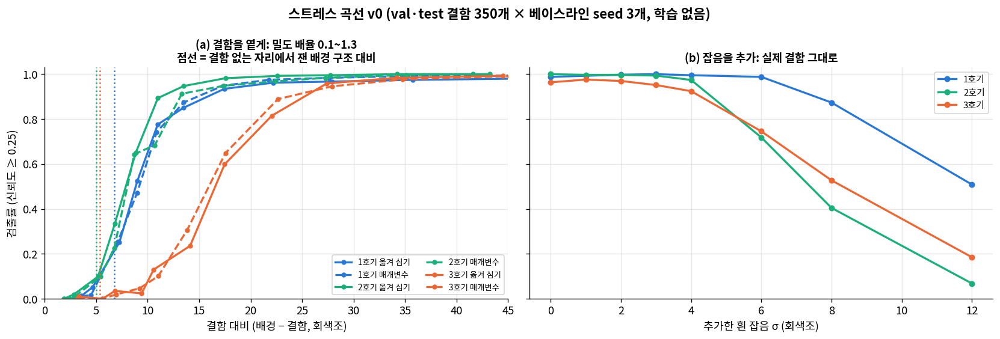

| 장비 | 실제 결함 대비 (하위 5% / 중앙값) | 검출률 50% 대비 | 검출률 90% 대비 | 여유 (중앙값 ÷ 50% 지점) | 실제 잡음 σ | 검출률 50%가 되는 추가 잡음 σ |
|---|---|---|---|---|---|---|
| 1호기 | 28 / 39 | 9.1 | 17.0 | 4.3배 | 1.1 | 12 초과 (σ 12에서 51%) |
| 2호기 | 17 / 26 | 7.8 | 12.0 | 3.3배 | 1.7 | 7.4 |
| 3호기 | 27 / 33 | **16.2** | **24.9** | **2.1배** | 2.0 | 8.3 |

대비 단위는 회색조(0~255)입니다. 표의 값은 옮겨 심기 기준이며, 매개변수 합성과의 50% 지점 차이는 0.7 이하입니다. 실제 잡음 σ는 이웃 화소 차로 추정했습니다.

**발견**
1. **두 합성기의 곡선이 일치합니다.** 결론이 합성 방법에 좌우되지 않습니다.
2. **3호기는 같은 검출률을 내려면 결함이 약 두 배 진해야 합니다.** 3호기 실제 결함의 하위 5%(대비 27)가 90% 지점(25) 바로 위에 있어서, 여유가 가장 작습니다. 실제 데이터에서 놓친 결함이 3호기 흐린 결함에 몰린 것(§3.5)과 맞습니다.
   - 원인 가설(검증 안 됨): 3호기 영상(576×444)은 416으로 줄일 때 결함이 0.72배로 작아집니다. 그리고 잡음이 세 장비 중 가장 큽니다.
3. **잡음에는 여유가 큽니다.** 실제 잡음(σ 1~2)에 σ 4를 더해도 재현율이 0.92 이상입니다.
4. **조건이 나빠져도 오검출은 늘지 않습니다.** 모든 수준에서 이미지당 오검출이 0.002 이하였습니다. 조건 악화로 인한 실패는 놓침입니다.

**측정 주의: 대비 축과 잡음 축을 CNR 하나로 합치지 않은 이유**
- **실제 영상에는 잡음이 거의 없습니다.** 이웃 화소 차의 57~83%가 정확히 0입니다. 그래서 실제 영상에서 잰 잡음 σ(CNR의 분모)는 측정 바닥값에 가깝습니다.
- **결함이 옅으면 측정 대비가 부풀려집니다.** 대비는 결함 근처 5×5 안의 최솟값으로 잽니다. 그래서 결함이 옅으면 배경 구조를 결함으로 잡습니다. **결함이 없는 자리에서도 대비가 5~7로 나왔습니다**(그림 (a)의 점선).
- 그 결과, 측정 CNR로 그리면 "같은 CNR에서 대비 감소가 잡음 추가보다 훨씬 나쁘다"처럼 보였습니다(50% 지점 5.6 vs 3.2). 명목 대비로 바꾸면 차이가 줄었고, 남은 차이도 단위가 다른 두 양을 섞은 데서 옵니다.
- **옅은 결함의 검출 한계를 정하는 것은 잡음이 아니라 배경 구조**입니다. 그래서 두 축을 각자 단위(대비 / 추가 잡음 σ)로 보고합니다.
- §3.5의 CNR은 실제 영상끼리의 순위로는 쓸 수 있지만, 절대값은 이 한계를 가집니다.

**한계**
- 밀도 축은 결함을 지운 배경 위에서 했습니다. 이 배경은 분류기가 구별할 수 있는 처리 흔적이 있습니다(검출 모델은 반응하지 않음, V4).
- 위치는 실제 결함 자리(띠 끝)로 고정했습니다. 모델이 이 위치에 약한 사전 반응을 가지므로(§4.3 부수 발견), **다른 위치에서는 곡선이 더 나쁠 수 있습니다**. 이것이 다음 스트레스 축입니다.
- 옮겨 심기는 k = 1에서만 검증했습니다. 배율을 바꾼 맵은 검증된 맵을 선형으로 조절한 것입니다.
- 이 곡선은 YOLOv3 기준입니다. 새 베이스라인(YOLOv8s, D‑FINE‑S)은 결함이 거의 없어도 이 위치에 반응해서(k = 0.1에서 검출률 32% / 73%), 같은 방식으로는 감도를 잴 수 없습니다(§3.8).

### 4.5 위치 축 스트레스 (결함을 원래 자리가 아닌 곳에, 학습 없음)
**질문**: 결함이 늘 있던 자리(띠 끝)가 아닌 곳에 있으면 모델이 찾을까? §3.8에서 새 모델이 결함을 지운 자리에도 반응해서, 위치를 빼고 감도를 따로 재야 했습니다.

**설정** (`eval/synth/stress_pos.py`, `stress_pos_summary.py`)
- **배경**: 실제 결함을 지운 val·test 150장(`data/synth_val/erased`). 원래 결함 자리의 위치 반응이 섞이지 않게 했습니다.
- **결함**: 옮겨 심기(§4.3 조건부 통과). 같은 장비 train 결함의 실제 광학 밀도 맵을 무작위로 골라 배율 k로 곱해 넣습니다.
- **자리**: 제품 안 무작위 자리 3곳 × 4회. 원래 결함 자리와 20px 이상, 서로 24px 이상, 제품 가장자리에서 2px 이상 떨어뜨렸습니다. 모델마다 장비 1·2·3호기 자리 684 / 516 / 600곳, 합계 1,800곳입니다(seed 3개 각각).
- **기준**: 같은 사진의 원래 결함 자리에 같은 방식으로 다시 심은 것(§4.3 T_cross와 같음).
- k = 0(아무것도 심지 않음), 0.2, 0.35, 0.5, 0.75, 1(실제 농도). 검출 = 심은 결함 중심 8px 안에 신뢰도 0.25 이상.

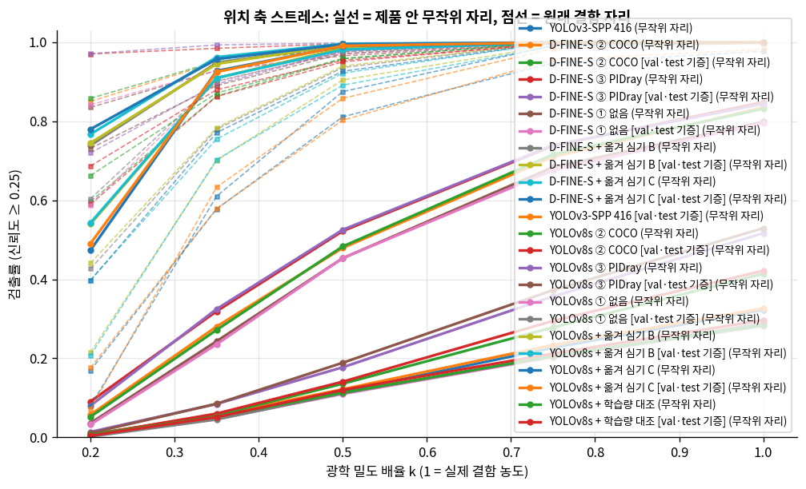

| 모델 | 무작위 자리, k = 1 | 원래 자리, k = 1 | 무작위 자리, k = 0.5 | 원래 자리, k = 0.5 | 원래 자리, k = 0 (빈 자리 반응) |
|---|---:|---:|---:|---:|---:|
| YOLOv3-SPP 416 | **32.3%** (seed 26~43%) | 97.7% | 11.6% | 81.1% | 0% |
| YOLOv8s 640 | **41.4%** (seed 24~55%) | 100% | 13.6% | 95.8% | 21.0% |
| D‑FINE‑S 640 | **83.5%** (seed 80~86%) | 100% | 47.9% | 98.5% | 67.0% |

무작위 자리, k = 1에서 장비별 검출률:
| 모델 | 1호기 | 2호기 | 3호기 |
|---|---:|---:|---:|
| YOLOv3-SPP 416 | 23% | 36% | 40% |
| YOLOv8s 640 | 41% | 51% | 34% |
| D‑FINE‑S 640 | 93% | 78% | 78% |

**발견**
1. **세 모델 모두 결함을 "결함이 있던 자리"에서만 잘 찾습니다.** 실제와 같은 농도의 결함을 다른 자리에 두면 YOLOv3는 3개 중 1개, YOLOv8s는 5개 중 2개만 찾습니다. 원래 자리에서는 98~100%입니다.
2. **무작위 자리가 더 어려워서가 아닙니다.** 무작위 자리의 결함 대비(중앙값 44 회색조)는 원래 자리(33)보다 오히려 높습니다. 배경이 더 밝아 같은 광학 밀도가 더 진하게 보이기 때문입니다(곱셈형 감쇠). 그리고 YOLOv3·YOLOv8s의 검출률은 대비가 높아져도 거의 오르지 않습니다(대비 20~30: 36% / 42%, 40~60: 32% / 41%).
3. **보지 못하는 게 아니라 확신하지 못하는 것입니다.** YOLOv3는 무작위 자리 결함의 99.8%에 신뢰도 0.01 이상, 82%에 0.1 이상으로 반응했습니다. 결함 모양은 보고 있지만, 띠 끝이라는 맥락이 없으면 신뢰도가 0.25를 넘지 못합니다. 판정 임계값(요구사항 ③)을 정할 때, 실제 test에서 고른 임계값이 다른 자리 이물에는 맞지 않는다는 뜻입니다.
4. **D‑FINE‑S가 위치 밖에서 가장 잘 찾습니다.** 결함을 지운 자리에 가장 강하게 반응한 모델(67%)인데도, 다른 자리 결함을 가장 잘 찾았습니다(84%). "띠 끝이면 결함"이라는 사전 반응과 결함 자체를 보는 능력은 따로 움직입니다. 실제 test AP(§3.8)로는 이 차이가 전혀 보이지 않았습니다.
5. **원래 자리 곡선은 위치 반응에 부풀려져 있습니다.** 원래 자리에서는 농도를 절반으로 해도 81~99%를 찾지만, 다른 자리에서는 12~48%입니다. §4.4의 스트레스 곡선(원래 자리)은 "띠 끝에 있는 결함"의 한계이지, 결함 일반의 한계가 아닙니다.
6. **배경이 어두울수록 잘 찾습니다.** 제품에서 가장 어두운 10% 자리(띠 끝과 비슷한 밝기)에서 YOLOv3 68% / YOLOv8s 73% / D‑FINE‑S 91%, 중간 밝기(25~50%)에서 20% / 27% / 77%입니다. 제품 가장자리 거리나 원래 자리까지 거리로는 일관된 차이가 없습니다.
7. **기증 결함을 바꿔도 같습니다.** train 결함 대신 학습에 쓰지 않은 val·test 결함(같은 장비, 다른 (장비, 날짜) 묶음)의 맵으로 심어도, 무작위 자리 k = 1 검출률이 YOLOv3 32.6%, YOLOv8s 42.2%, D‑FINE‑S 83.2%로 같았습니다.
8. **결함을 더 넣어도 오검출은 늘지 않습니다.** 심은 자리 밖의 신뢰도 0.25 이상 검출은 사진당 0.003건 이하입니다. 실패는 놓침입니다.
9. **제품 가장자리 이물을 특히 놓칩니다.** 과제 설명이 걱정하는 '가장자리 이물'을 가장자리 거리별로 보면, 가장자리 0~8px 자리(모델당 255곳)에서 YOLOv3 27%, YOLOv8s 45%, D‑FINE‑S 70%만 찾습니다. 실제 데이터에는 가장자리 결함이 하나도 없어(§3.6) 합성으로만 잴 수 있습니다.

**한계**
- 옮겨 심기는 원래 결함 자리(띠 끝)에서만 검증했습니다(§4.3). 다른 배경에 넣은 결함이 그 배경의 실제 결함과 같은지는 실제 예가 없어 검증할 수 없습니다(§4.9). 다만 물리 모델(곱셈형 감쇠)과 결함 자체의 광학 밀도 맵은 실제와 같습니다.
- 배경은 결함을 지운 사진이라 원래 자리에는 지운 흔적이 있습니다. 같은 지우기를 다른 자리에 했을 때는 세 모델 모두 반응하지 않았습니다(§3.8 V4).

**결론**: 지금 모델들은 결함 감지기라기보다 **"이 시편의 띠 끝 결함" 감지기**입니다. 실제 test 점수(0.935~0.958)는 이 능력을 재며, 다른 위치의 이물에 대해서는 크게 과대평가합니다. 합성 데이터는 학습에 쓰지 않으므로, 이 결과는 운영 판정(§5)과 한계(§7)에 그대로 반영합니다.

### 4.6 크기·형상·재질 축: gVXR 물리 합성 (학습 없음)
**질문**: 실제 데이터에 한 가지씩밖에 없는 이물의 크기·형상·재질(§3.6)이 바뀌면 모델이 찾을까? 과제 설명의 "작은 이물질" 조건도 여기서 잽니다.

**합성기** (`prep/synth/gvxr_core.py`, gVirtualXRay 2.1.0)
- 실제 KAMP 배경(결함을 지운 val·test 150장)은 그대로 두고, 이물 부분만 시뮬레이션해서 곱셈으로 넣습니다(I = I_배경 · exp(−OD)).
- **gVXR**이 3D 형상의 투영 두께와 재질별 감쇠계수 μ(E)를 계산합니다. 형상은 구, 정육면체, 무작위 볼록 조각, 판, 선입니다. 재질은 원소·화합물·혼합물 데이터베이스에서 가져옵니다. 다색 스펙트럼 투과율, 검출기 흐림(투과율에 가우시안), 픽셀 적분은 numpy로 계산합니다.
- **장비 가정**: 70 kVp 텅스텐 Kramers 스펙트럼, Al 2 mm 여과, 에너지 적분 검출기, 평행빔. 실제 장비 값(관전압, 필터, 픽셀 크기, 검출기)은 데이터에 없습니다. 제품이 미리 거른 스펙트럼 변화(빔 경화)는 무시했습니다.
- **재질**: SUS304, Fe, Al, 유리(SiO₂ 2.5), 돌(CaCO₃ 2.71), 뼈(ICRU 피질골 1.92), 플라스틱(폴리프로필렌 0.9).
- 설치: 프로젝트 `.venv`에만 설치했습니다. 시스템에 없는 xcb 라이브러리 4개는 Ubuntu 패키지에서 추출해 `third_party/gvxr_libs/`에 두고 실행 중에 불러옵니다.

**보정** (`prep/synth/gvxr_calibrate.py`, train 결함만): 실제 결함(시편)을 **SUS304 구**로 보고, 장비별로 구 지름 D(px)와 픽셀 크기 p(mm/px)를 정했습니다. 맞추는 값은 적분 광학 밀도와 최대 광학 밀도(맞춤 오차 2% 안팎)입니다.
| 가정 | 기준 구 지름 D | 픽셀 크기 p | 기준 구 지름 (mm) |
|---|---|---|---|
| **SUS304, 70 kVp (기본)** | 2.2 / 2.3 / 2.5 px (1·2·3호기) | 0.11 / 0.11 / 0.10 mm | 약 0.25 mm |
| SUS304, 50 / 90 kVp | 2.2~2.6 px | 0.05~0.07 / 0.14~0.17 mm | 0.13~0.14 / 0.35~0.38 mm |
| Fe, 70 kVp | 같음 | 같음 | 같음 |
| 유리, 70 kVp | 2.3~2.5 px | 2.5~2.7 mm | 약 6 mm (화면 폭 약 88 cm → 비현실적) |
- **px 단위 크기는 가정과 무관하게 안정적이지만, mm 단위는 관전압 가정에 따라 약 2.5배 바뀝니다.** 그래서 크기 축은 **기준 시편 대비 배수**로 보고합니다. mm는 기본 가정의 참고값입니다. 시편을 유리로 보면 픽셀 크기가 비현실적이 되므로, 금속 시편 가정이 타당합니다.

**합성 타당성 검증** (`prep/synth/build_gvxr_replica.py`, §4.3과 같은 V1~V4, val·test 결함): 실제 결함을 지운 자리에 gVXR 구를 다시 넣었습니다. G_fit은 결함마다 적분 광학 밀도에 맞춘 지름이고, G_gen은 장비별 보정값만 쓴 것입니다.
| 검사 | 옮겨 심기 T_cross | 매개변수 R1_cal | **gVXR G_fit** | **gVXR G_gen** |
|---|---:|---:|---:|---:|
| V1 최대 광학 밀도 / 반치 면적 SMD (기준 < 0.2) | 0.08 / 0.22 | −0.01 / 0.27 | −0.21 / 0.20 | −0.38 / 0.13 |
| V2 구별 분류기 AUC, 같은 처리 대비 (기준 ≤ 0.60) | **0.69** | 0.95 | 0.98 | 0.98 |
| V3 결함별 신뢰도 상관: YOLOv3 / YOLOv8s | 0.89 / 0.94 | 0.94 / 0.58 | **0.96 / 0.97** | 0.95 / 0.98 |
| V3 놓침률 차이 (기준 ≤ 2%p) | 통과 | 통과 | 통과 (0) | 통과 (0) |
- **검출 모델에게는 gVXR 구가 실제 결함과 가장 비슷합니다.** 결함별 신뢰도 상관이 두 모델 모두 0.95 이상입니다. 매개변수 합성은 새 모델에서 0.58로 떨어졌습니다.
- **화소 수준에서는 분류기가 구별합니다(AUC 0.98).** 미리 정한 기준에 따라 **평가 전용**입니다(매개변수 합성과 같은 판정). 실제에 없는 크기·형상·재질은 어떤 합성기로도 검증할 수 없으므로 "통제 조건"으로만 해석합니다(§4.9).

**스트레스 설정** (`eval/synth/stress_gvxr.py`): 제품 안 무작위 자리(§4.5와 같은 규칙) 이미지당 3곳 × 2회, 모델마다 조건당 900곳(seed 3개 각각). 한 번에 한 축만 바꿉니다.
- 크기: SUS304 구, 지름 = 기준 × 0.5~5
- 형상: SUS304, **부피 = 기준 구**, 무작위 회전. 구 / 정육면체 / 불규칙 조각 / 판(두께 = 한 변의 1/5) / 선(길이 = 지름의 10배, 20배)
- 재질: 구, 지름 = 기준 × 1, 2, 4, 8

찾음은 신뢰도 0.25 이상인 검출 중심이 이물 중심 8px 안이거나, 이물 영역을 4px 넓힌 곳 안에 있는 경우입니다(긴 선 고려).

**결과** (검출률, 신뢰도 ≥ 0.25. 대비 = 배경 × (1 − e^−OD최대), 회색조. 면적 = 반치 면적 px. 실제 결함은 대비 17~59, 면적 1~7)
| 조건 | 대비 / 면적 | YOLOv3 | YOLOv8s ② | D‑FINE‑S ② |
|---|---|---:|---:|---:|
| 크기 × 0.5 (약 0.13 mm) | 16 / 2 | 0% | 0% | 2% |
| 크기 × 0.75 | 37 / 2 | 11% | 13% | 44% |
| **크기 × 1 (기준 시편)** | 57 / 3 | 29% | 41% | 81% |
| 크기 × 2 | 91 / 11 | 57% | 95% | 97% |
| 크기 × 3 | 103 / 26 | 43% | 75% | 89% |
| 크기 × 5 (약 1.3 mm) | 114 / 80 | 11% | 65% | 42% |
| 크기 × 8 (약 2 mm, 재질 축) | 120 / 217 | 0% | 31% | 4% |
| 형상: 구 / 정육면체 / 조각 / 판 | 43~57 / 3~5 | 22~30% | 31~41% | 67~81% |
| 형상: 선 (길이 10배) | 28 / 9 | 6% | 12% | 17% |
| 형상: 선 (길이 20배) | 20 / 15 | 0% | 4% | 4% |
| Al × 2 / × 4 / × 8 | 13 / 25 / 43 | 0~1% | 1% | 8 / 18 / 3% |
| 유리 × 2 / × 4 / × 8 | 10 / 19 / 34 | 0% | 0% | 1 / 10 / 2% |
| 돌 × 2 / × 4 / × 8 | 20 / 36 / 57 | 0~5% | 4~8% | 29 / 33 / 4% |
| 뼈 × 2 / × 4 / × 8 | 11 / 21 / 37 | 0~1% | 0~1% | 3 / 12 / 3% |
| 플라스틱 × 1~8 | 1~6 | 0% | 0% | 0% |
| 같은 크기(× 1)의 Al / 유리 / 돌 / 뼈 | 4~8 / 3 | 0% | 0% | 0% |

**발견**
1. **가장 큰 사각지대는 "크고 옅은" 이물입니다.** 기준보다 큰 이물은 대비가 충분한데도(×5 SUS: 대비 114, 면적 80px) 놓칩니다. 실제 결함과 대비가 같은 크기 × 8 유리(대비 34, 면적 202px)는 모든 모델이 3% 이하로 찾습니다. 모델은 "2~3px 점"을 결함으로 배웠고, **덩어리**는 결함으로 보지 않습니다. 결함 크기가 한 가지뿐인 학습 데이터(§3.6)의 직접적인 결과입니다.
2. **같은 크기라면 금속만 보입니다.** 기준 시편과 같은 크기의 Al·유리·돌·뼈는 대비가 4~8로, 잡음과 배경 구조 수준입니다(§4.4: 결함 없는 자리에서도 측정 대비 5~7). 비금속 이물은 2~4배 이상 커야 보이는데, 그 크기에서는 1번의 사각지대에 걸립니다. 플라스틱은 8배(약 2 mm)에서도 대비 6이라 물리적으로 보이지 않습니다. 이 영역은 모델이 아니라 **촬영 조건의 한계**입니다.
3. **작은 쪽도 사각지대입니다.** 기준의 절반(약 0.13 mm, 대비 16)에서 0~2%, 3/4 크기(대비 37)에서 11~44%입니다. 같은 크기라도 띠 끝이 아닌 무작위 자리라서 위치 지름길(§4.5)이 함께 작용합니다.
4. **형상**: 부피가 같으면 구·정육면체·불규칙 조각·판은 큰 차이가 없습니다(YOLOv8s 31~41%, D‑FINE‑S 67~81%). **가늘고 긴 선**은 대비가 낮아지면서(28, 20) 검출률도 떨어집니다. 길이 10배에서 6~17%, 20배에서 0~4%입니다.
5. **모델마다 강한 쪽이 다릅니다.** D‑FINE‑S ②는 기준 이하 크기와 비금속에서 낫고(× 0.75 44%, × 1 81%, 돌 × 4 33%; YOLOv8s ② 13%, 41%, 8% 이하), YOLOv8s ②는 큰 이물에서 낫습니다(× 5 65%, × 8 31%; D‑FINE‑S ② 42%, 4%). D‑FINE‑S ②는 위치 지름길이 강해서 운영 판정에는 맞지 않습니다(§5). **실제 test만으로 모델을 고르면 이 차이가 보이지 않습니다.**
6. **결과가 기준 시편 배수로 표현되므로, mm 환산은 관전압 가정에 따라 약 2.5배 범위가 있습니다.** 재질 사이의 비율도 스펙트럼에 따라 바뀝니다. 실제 장비 사양(관전압, 필터, 픽셀 크기)을 알면 다시 계산해야 합니다.

**결론**: 지금 모델들은 **"띠 끝에 있는, 시편과 비슷한 크기의 금속 점"**에 특화돼 있습니다. 과제 설명이 우려하는 "작은 이물"과 "가장자리 이물"(§4.5), 그리고 **기준보다 큰 이물·가는 선·비금속 이물**이 모두 사각지대입니다. 합성 데이터는 학습에 쓰지 않으므로(팀 결정) 이 사각지대는 조건별 한계로 보고합니다. 메우려면 실제로 다양한 이물(크기·재질·위치)을 넣어 촬영한 데이터가 필요합니다.

### 4.7 조건 축 (한 번에 하나만 바꾸고, 나머지는 실제 결함의 중앙값으로 고정)
**실제 관측 범위**와 **관측되지 않은 스트레스 범위**를 구분합니다. 스트레스 범위의 값은 과제 설명에 이물 크기·종류 범위가 없어서 정한 **통제 조건**이며, 실제 이물의 범위라고 주장하지 않습니다.

| 축 | 실제 관측 범위 | 스트레스 범위 (관측 안 됨) |
|---|---|---|
| 크기 (물체 한 변 w) | 1.7~1.9px (반치 면적 1~7px) | 1px 미만, 3·5·8·12px |
| 형상 | 점 | 타원(가로세로 비 2~6), 선(길이 5~30px, 폭 1~2px), 불규칙 덩어리. 실제 식품 이물 형상이라는 근거가 없으므로 **"형상 일반화를 보는 통제 조건"**으로만 해석 |
| 밀도 (OD0) | 0.6~0.8 | 0.05, 0.1, 0.2, 0.35, 1.0, 1.5 |
| 배경 (제품 밝기) | 제품에서 가장 어두운 5~10% | 제품 밝기 25·50·75·95% 지점 |
| 잡음 / CNR | CNR 6~32 (3호기 6~13). 결함 대비 17~59 회색조 | 1·2호기에 잡음을 더해 3호기 수준 이하로. **실제 약점(3호기 흐린 결함)이 기준점**. CNR은 축 간 비교에 쓰지 않음(§4.4 측정 주의) |
| 위치 | 고정된 4곳, 가장자리에서 36px 이상 | 제품 내부 격자 전체. 가장자리 0~36px 띠 포함 |
| 개수 | 1 또는 3 | 1~5 |

### 4.8 스트레스 test 운영 원칙
| 항목 | 내용 |
|---|---|
| 스트레스 test 구성 | val 66장 / test 84장에만 합성 (train 사진 사용 안 함). 축·수준마다 결함 약 300개 이상. **완료**: 밀도·잡음(§4.4), 위치(§4.5), 크기·형상·재질(§4.6). **남은 축**: 배경(제품 밝기) 단독 축, 개수 |
| 실패 분석 | 조건별 재현율·정밀도·위치 오차·놓침률 곡선. 관측 범위와 스트레스 범위를 그림에서 구분 |
| 학습 사용 | **하지 않음** (팀 결정, 2026-10-06). 합성은 조건별 성능 측정에만 씀 |
- 임계값 등 방법 선택은 실제 val(과 스트레스 val)로만 합니다. 실제 test와 스트레스 test는 최종 보고에만 씁니다.
- 합성 데이터는 대회 데이터로 만들므로 외부 데이터가 아닙니다. 다만 전처리처럼 방법과 영향을 결과보고서에 명시합니다.

### 4.9 한계
- 실제 생산 라인의 이물이 어떤 재질·모양인지 모릅니다. 스트레스 결과는 "이런 조건이면 모델이 이렇게 된다"는 **능력의 한계**이지, 현장 성능 추정이 아닙니다.
- 복제 검사는 실제 결함이 있는 조건(띠 끝, 점 모양)에서만 합성을 검증할 수 있습니다. 관측 범위 밖(큰 크기, 다른 배경, 다른 형상)의 합성은 같은 물리 모델을 쓴다는 것 외에는 검증할 방법이 없습니다.

[1] Bhowmik et al., "The Good, the Bad and the Ugly: Evaluating CNNs for Prohibited Item Detection Using Real and Synthetically Composited X-ray Imagery", 2019. https://arxiv.org/abs/1909.11508
[2] "Real-Time Anomaly Detection in Packaged Food X-Ray Images Using Supervised Learning", CMC 67(2). https://www.techscience.com/cmc/v67n2/41335
[3] "CT-based data generation for foreign object detection on a single X-ray projection", Scientific Reports, 2023. https://www.nature.com/articles/s41598-023-29079-w

---

## 5. 판정 기준 제안 (요구사항 ③)
**질문**: 검출 결과를 현장에서 어떻게 쓸까? 어디까지 자동으로 불량 판정하고, 어디부터 사람이 다시 볼까? 제품 영역 밖 검출을 버리면 나아질까?

**규칙** (`eval/decision/collect_dets.py`, `thresholds.py`)
- 검출마다 신뢰도가 **T_high 이상이면 자동 불량**, **T_low 이상 T_high 미만이면 재검사**, **T_low 미만이면 버립니다**. 사진의 판정은 그 사진 검출 중 가장 높은 등급입니다.
- 위치는 결함 중심과 검출 중심의 거리 ≤ 8px로 판정합니다. 정답 박스 크기가 들쭉날쭉해서(§1.6) IoU 대신 씁니다. "어디에 이물이 있는가"를 표시하는 목적에는 충분합니다.
- **임계값은 seed마다 val로만 정합니다.**
  - **T_high** = val의 '결함 아닌 검출' 중 최고 신뢰도 바로 위. 결함 아닌 검출은 실제 영상에서 짝이 없는 검출과, 결함을 지운 영상(결함 없는 제품 대용)의 모든 검출입니다. val에서 자동 불량 오판이 0이 되는 가장 낮은 값입니다.
  - **T_low** = val 실제 결함을 하나도 놓치지 않는 가장 높은 값(정책 R).
  - 정책 P는 다른 자리 결함(위치 축 val, k = 1)도 99% 잡도록 T_low를 더 낮춘 것입니다.
- test 평가 항목은 다섯 가지입니다.
  - 실제 결함 206개
  - 실제 영상 84장의 오검출
  - 결함을 지운 test 84장(결함 없는 제품 대용)
  - 위치 축 test 다른 자리 결함(k = 1, 0.5)
  - GT 없는 2,020장의 사진 판정 비율(재검사 부담)
- **결함 없는 정상 영상이 데이터에 없어서**, 결함을 지운 영상을 대신 씁니다. 지운 자리에는 흔적이 있습니다. 다만 같은 지우기를 다른 자리에 했을 때 모델이 반응하지 않았으므로(§3.8 V4), 흔적 자체가 오판을 만들지는 않습니다.

**대상 모델**: 합성 데이터는 학습에 쓰지 않으므로(팀 결정, §4 머리말), 실제 train만으로 학습한 YOLOv8s ② COCO와 D‑FINE‑S ② COCO(§3.8)를 비교합니다. 위치 축(다른 자리 결함)과 결함 없는 제품은 평가 전용 합성(§4.5, 결함 지운 영상)으로 잽니다.

**결과** (정책 R, 제품 영역 후처리 적용, seed 3개 평균. `eval/decision/summary.csv`)
| 모델 | T_low ~ T_high (seed 범위) | test 결함: 자동 / 재검사 / 놓침 | test 오검출 (사진당, 자동) | 결함 없는 제품: 자동 불량 / 재검사 | 다른 자리 k = 1: 자동 / 놓침 | 다른 자리 k = 0.5: 자동 / 놓침 | GT 없는 2,020장: 재검사 |
|---|---|---|---:|---|---|---|---:|
| **YOLOv8s ② COCO** | 0.56~0.65 ~ 0.60~0.68 | **79.4% / 19.7% / 0.8%** | 0 | 2.8% / 5.6% | 8.8% / **83.6%** | 1.9% / **95.9%** | **5.2%** |
| D‑FINE‑S ② COCO | 0.57~0.67 ~ 0.74~0.78 | 28.3% / 71.7% / 0% | 0 | 2.0% / 51.2% | 0.1% / **59.9%** | 0% / **86.8%** | 45.9% |

정책 P(다른 자리 결함 99%를 잡도록 T_low를 낮춤), YOLOv8s ②: T_low가 0.001까지 내려가 test 결함 놓침 0, 그러나 결함 없는 제품 재검사 79.8%, 다른 자리 k = 1 놓침 18.0%(재검사 73.1%), GT 없는 영상 재검사 6.3%.

**발견**
1. **T_high는 결함을 지운 원래 자리의 반응이 정합니다.** YOLOv8s ② seed 3개 모두, val에서 가장 높은 '결함 아닌 검출'은 실제 영상의 오검출이 아니라 결함을 지운 영상의 띠 끝 자리(신뢰도 0.60~0.68)였습니다. 위치 지름길(§3.8, §4.5)이 임계값을 끌어올리는 셈입니다. 그래서 T_low와 T_high 사이가 좁고(0.04~0.09), 실제 결함의 약 20%가 재검사로 갑니다.
2. **다른 자리 결함은 판정 기준으로 메울 수 없습니다.** YOLOv8s ②는 실제 농도의 다른 자리 결함 84%를 놓칩니다. 다른 자리 결함은 T_low보다 훨씬 낮은 신뢰도로 나오기 때문입니다. 정책 P로 T_low를 0.001까지 내리면 결함 없는 제품의 80%가 재검사로 가는데도 다른 자리 결함의 18%는 여전히 놓칩니다. 합성 학습을 하지 않으므로 이 한계는 남습니다(§7).
3. **D‑FINE‑S ②는 운영에 맞지 않습니다.** 원래 자리 반응이 강해서(67%) T_high가 0.74~0.78로 높아집니다. 실제 결함의 72%가 재검사로 가고, GT 없는 영상의 46%가 재검사입니다.
4. **실제 결함 기준으로는 쓸 만합니다.** YOLOv8s ②는 test 실제 결함 206개 중 79%를 자동 불량, 20%를 재검사로 보내고 놓침은 0.8%(seed당 1~2개)입니다. 실제 영상의 자동 불량 오검출은 0입니다. GT 없는 2,020장은 88.7%가 자동 불량, 5.2%가 재검사, 6.1%가 통과입니다. 이 데이터는 결함 시편을 반복 촬영한 영상이므로(§1.7) 대부분 자동 불량이 맞는 판정입니다.
5. **남는 위험은 결함 없는 제품의 자동 불량 오판(2.8%, 84장 중 seed당 약 2.3장)입니다.** 모두 결함을 지운 원래 자리에 대한 반응입니다. 결함 지운 영상은 정상품의 대용이고 지운 자리에 흔적이 있으므로, 실제 정상품에서 이 비율이 같을지는 알 수 없습니다(같은 지우기를 다른 자리에 했을 때는 반응하지 않음, §3.8 V4). 운영에서는 T_high를 조금 높여 재검사로 돌리는 쪽이 안전합니다.
6. **제품 영역 후처리는 효과가 없습니다.** 정책 R의 임계값(T_low 0.56 이상)에서는 제품 밖 검출이 남지 않아 판정이 바뀌지 않습니다(정책 P에서만 실제 영상 재검사 오검출이 사진당 0.55 → 0.20건으로 줆). 비용이 없으니 파이프라인에는 넣습니다.
7. **임계값이 seed마다 다릅니다**(T_high 0.60~0.68). val 결함 144개, 결함 없는 영상 66장으로 정하기 때문입니다. 최종 모델 하나를 고른 뒤 그 모델의 val로 다시 정해야 하고, 숫자 자체보다 "val에서 오판 0이 되는 가장 낮은 값"이라는 **정하는 방법**을 제안합니다.

**제안**
- 모델: **YOLOv8s ② COCO** (실제 train만으로 학습, 합성 없음), 입력 640, 제품 영역 밖 검출 제거.
- 판정: T_high = val에서 결함 아닌 검출(결함 지운 영상 포함)의 최고 신뢰도 바로 위, T_low = val 실제 결함 최저 신뢰도(정책 R). seed 3개에서 T_low 0.56~0.65, T_high 0.60~0.68.
- 기대 성능(test, seed 평균): 실제 결함 79% 자동 · 20% 재검사 · 놓침 0.8%, 실제 영상 자동 오검출 0, 결함 없는 제품 자동 불량 오판 2.8% · 재검사 5.6%, GT 없는 영상 재검사 5.2%.
- **한계 (합성 test로 잰 것)**: 띠 끝이 아닌 자리의 결함은 실제 농도에서도 84%를 놓칩니다(§4.5). 가장자리·작은·큰·비금속 이물도 대부분 놓칩니다(§4.5, §4.6). 이 판정 기준의 성능은 **"정해진 시편 자리의 금속 점"**에 대한 것이며, 생산 라인의 임의 위치 이물에 대한 성능이 아닙니다. 결함 없는 제품 수치는 결함을 지운 영상으로 잰 값이라 실제 정상품으로 다시 확인해야 합니다.


---

## 6. 현재 선택과 남은 실험

| 요인 | 선택 / 상태 |
|---|---|
| ① 마커 처리 | **Telea 인페인팅 (반경 3)**. 7가지 방식 교차표와 흔적 검사로 확인 |
| ② GT 없는 데이터 | 라벨 방법은 **교사 + 구조 필터(T3)**가 가장 정확하지만, 학습 효과가 없어 **학습에 쓰지 않음** (검증·이상 입력 점검용) |
| ③ 데이터 다양성 | 다양성 부족을 정량화함(§3.6). 실제 약점은 3호기 흐린 결함(§3.5). **합성 데이터는 평가(test) 전용**(팀 결정 2026-10-06), 학습에 쓰지 않음. 합성 검증(§4.3): 옮겨 심기 조건부 통과, 매개변수 합성 불통과, gVXR(§4.6) 모델 반응은 가장 비슷하나 분류기가 구별. 스트레스 test 완료: 밀도·잡음(§4.4, 3호기는 결함 대비가 약 두 배 필요), 위치(§4.5, 다른 자리 결함 YOLOv8s 41%만 찾음), 크기·형상·재질(§4.6, 작은·큰·선·비금속 이물 사각지대). 남은 축: 배경 단독, 개수 |
| ④ 모델 | **새 베이스라인: YOLOv8s, D‑FINE‑S** (2026-10-01 결정). YOLOv3-SPP 결과는 제공 코드 기준 참고값으로 유지. 해상도 640 권장(3호기 영상이 축소되지 않음). **사전학습 3조건 비교**: ① 없음 ② COCO ③ COCO → PIDray(X선 도메인) → KAMP. PIDray 준비 완료(아래). **조건 ② 결과 §3.8, 세 조건 비교 §3.9**: 실제 test는 ② COCO가 가장 좋거나 같고 PIDray 추가 이득 없음 → **② COCO 권장** |
| 외부 데이터 (③용) | **PIDray** 공식 `test_easy` 중 라벨 있는 9,482장, 흑백 변환 (`data/external/pidray_gray/`, `prep/build_pidray.py`). 라이선스: 학술 목적 한정 → 최종 제출 사용은 주최 측 확인 필요. 물체가 크고(박스 중앙값 133px) 보안 검색 영상이라 기대 효과는 X선 질감 표현에 한정. GDXray(공업용 주조 결함, 가장 유사)는 공식 배포 링크가 삭제되어 사용 불가(재배포 금지 조건이라 비공식 사본도 쓰지 않음) |
| 조합 | 요인별 선택 확정 후 |
| 요구사항 ③ | **§5**: YOLOv8s ② COCO, 제품 영역 밖 검출 제거, T_high = val 결함 아닌 검출 최고 신뢰도 바로 위, T_low = val 결함 최저 신뢰도. test 실제 결함 79% 자동 · 20% 재검사 · 놓침 0.8%, 결함 없는 제품 자동 오판 2.8%, GT 없는 영상 재검사 5.2%. 다른 자리 결함 84% 놓침은 한계로 보고 |

## 7. 한계
- **결함 다양성 부족**: 모든 GT 결함이 같은 테스트피스(1~4px 점, 띠 끝 4곳, 감쇠율 약 0.5)입니다(§3.6). 현재 test 점수는 "처음 보는 날에 같은 시편을 얼마나 잘 찾는가"이며, 다른 크기·위치·재질의 이물에 대한 성능은 아직 측정하지 못했습니다. 요구사항 ②(조건별 성능)는 §4의 합성 평가(밀도·잡음·위치·크기·형상·재질 축)로 답합니다.
- **합성 데이터는 평가 전용**(팀 결정): 합성 test에서 드러난 사각지대(다른 위치·가장자리·작은·큰·비금속 이물)를 학습으로 보강하지 않습니다. 보강하려면 다양한 실제 이물 촬영 데이터가 필요합니다. 합성 test 결과도 합성이 실제 이물과 같다는 가정 위의 값입니다(§4.9).
- **진짜 마커 없는 평가 영상이 없음**: 마커 제거 효과는 여러 방식으로 지운 test와 흔적 검사로 간접 확인했습니다(§3.2.2).
- **평가 규모**: val 66장(결함 144), test 84장(결함 206). 결함 1개 = 재현율 약 0.5~0.7%p. seed 간 AP 편차가 0.01~0.05라 그보다 작은 차이는 구분하지 못합니다.
- **분할이 하나**: 날짜 묶음이 적어(장비별 10~17일) 분할에 따라 점수가 달라질 수 있습니다.
- **GT 없는 데이터의 지표**는 정확도가 아닌 일관성 지표입니다.

---

## 부록 A. 재현과 파일

**실행 환경**: 공용 anaconda 환경은 다른 사용자가 패키지를 바꿔(numpy 2.x로 pandas가 깨짐) 쓸 수 없어서, 프로젝트 전용 가상환경 `.venv`를 만들어 모든 실험을 돌렸습니다. 이 환경은 공용 패키지를 읽기만 하고, 아래 버전만 고정합니다: numpy 1.26.4, torch 2.7.1+cu118, torchvision 0.22.1+cu118. 이 환경에서 베이스라인 점수가 그대로 재현되는 것을 확인했습니다(seed 0 test AP 0.9427). GPU는 RTX 4090(24GB) 3장 중 비어 있는 것을 사용했습니다. 모델 하나 학습에 약 16~20분(300 epoch)이 걸립니다.

```bash
PY=.venv/bin/python
$PY eda/extract.py                # 원본 인벤토리, 이미지·결함·마커 통계 (eda/out/)
$PY eda/figures.py                # 데이터 분석 그림 (f1~f9)
$PY eda/unlabeled.py              # GT 없는 데이터 통계·품질 판정 (u1~u3)
$PY prep/convert_coco_weights.py  # 외부 가중치 변환 (weights/yolov3-spp.weights 필요)
$PY prep/build_dataset.py         # 마커 Telea 인페인팅(data/clean)·원본(data/marked) + (장비, 날짜) 분할
$PY prep/build_masked.py          # 마스킹 비교용 (data/masked)
$PY prep/build_marker_variants.py # 마커 제거 방식 4종 (data/rm_ns, rm_dil, rm_bgfill, rm_biharm). 방식 정의는 prep/rm_methods.py
$PY prep/build_unlabeled.py       # GT 없는 데이터: 인페인팅(data/unlabeled) + 역할(data/splits/unlabeled_roles.csv)
$PY eda/split_figures.py          # 분할 그림 (d1~d5)
bash prep/run_train.sh v2/B_s0 0 clean 320 640 416 300 16 "" 0   # 베이스라인 (이름 GPU 데이터 최소 최대 평가크기 epoch 배치 초기값 seed)
bash prep/run_marker_factor.sh    # 실험 ① 원본·마스킹 학습 + 평가 + 흔적 검사
bash prep/run_marker_rm.sh        # 실험 ① 확장: 제거 방식 4종 학습, 21개 모델 × 입력 7종 평가, 흔적 검사 6종
$PY prep/build_cv_folds.py        # 실험 ②ⓐ 교차 검증 조각 (data/splits/cv3.csv)
bash prep/run_train.sh v2/CV_f0 1 cv3_f0 320 640 416 300 16 "" 0  # 조각별 교사 (f0, f1, f2)
$PY eval/pseudo/pl_methods_cv.py  # 실험 ②ⓐ 의사 라벨 방법 8가지 채점
bash prep/run_unlabeled_factor.sh # 실험 ②ⓑ (의사 라벨 생성, 학생, 학습량 대조군, 평가)
$PY eval/evaluate.py --runs <run ...> --inputs clean --out eval/out_v2
$PY eval/v2_figures.py            # 실험 결과 그림 (x1~x4)
$PY eval/failure/collect_heldout.py   # 실패 조건: 학습에 안 쓴 모델로 GT 500장 검출
$PY eval/failure/failure_analysis.py  # 실패 조건: 결함별 놓침·조건 (eval/failure/per_defect.csv)
$PY eda/diversity.py              # 데이터 다양성 정량화 (f10, f11, eda/diversity/)
$PY prep/synth/build_replica.py   # 합성 타당성 검증용 복제 데이터 (data/synth_val/). 합성 함수는 prep/synth/synth_core.py
$PY eval/synth/validate_replica.py --infer   # V1~V4 판정, 옮겨 심기 T_self·T_cross 포함 (처음 실행 시 보정 계수를 쓰고 끝남 → build_replica.py 다시 실행 후 한 번 더)
$PY eval/synth/stress_v0.py       # 스트레스 곡선 v0: 밀도·잡음 축 검출 (약 10분, GPU)
$PY eval/synth/stress_v0_check.py # 명목 대비 환산, 빈 자리 측정 편향
$PY eval/synth/stress_v0_fig2.py  # 스트레스 그림(s1)·한계값 표
$PY prep/build_handoff.py         # 모델 담당 전달 패키지 (부록 B)
bash prep/run_nb2.sh yolov8s 1 0  # 새 베이스라인 학습 (모델 GPU seed). dfine_s 는 third_party/D-FINE + configs_nb2/dfine_s_kamp.yml
bash prep/run_nb2_reruns.sh yolov8s 1   # 새 베이스라인으로 기존 실험 다시 돌리기 (기본 평가 → 흔적 검사 → 실패 조건 → 합성 검증 → 스트레스, 추론만)
$PY eval/synth/stress_pos.py      # 위치 축 스트레스 (NB2_MODEL=yolov8s|dfine_s|<변형> 이면 새 모델, 없으면 YOLOv3)
$PY eval/synth/stress_pos_summary.py   # 위치 축 요약 (eval/out_nb2/pos_*.csv, eda/fig/n2_stress_pos.png)
bash prep/run_pidray_pretrain.sh yolov8s 1   # 사전학습 조건 ③ 1단계 (COCO → PIDray). 2단계: run_nb2.sh <모델> <gpu> <seed> pidray (조건 ①: scratch)
$PY eval/decision/collect_dets.py yolov8s dfine_s   # 판정 기준용 검출 (실제·결함 지운·GT 없는 영상, 제품 영역 표시)
$PY eval/decision/thresholds.py   # 자동 불량·재검사 임계값과 test 판정 결과 (eval/decision/thresholds.csv, summary.csv)
$PY eval/nb2_variants.py          # 모델 변형(사전학습) 비교표 (eval/out_nb2/variants.csv)
$PY prep/synth/gvxr_calibrate.py  # gVXR 보정: 실제 결함 = SUS304 구 → 장비별 픽셀 크기·기준 지름 (eval/synth/gvxr/calibration.csv, sensitivity.csv)
$PY prep/synth/build_gvxr_replica.py   # gVXR 복제 검증 데이터 (data/synth_val/G_gen, G_fit, H_gvxr) → eval/synth/validate_replica.py --add
$PY eval/synth/stress_gvxr.py yolov8s dfine_s   # 크기·형상·재질 축 (약 1시간, eval/synth/gvxr/stress_site.csv)
$PY eval/nb2_compare.py           # YOLOv3·YOLOv8s·D-FINE-S 비교표 (eval/out_nb2/compare_*.csv, eda/fig/n1_stress_models.png)
$PY prep/build_pidray.py          # 외부 데이터 PIDray 흑백 변환 (사전학습 조건 ③). 원본: data/external/pidray/ (공식 라벨 + HF 이미지)
```

| 경로 | 내용 |
|---|---|
| `data/splits/split.csv` | GT 500장: 장비, 날짜, (장비, 날짜) 묶음, 세션, split |
| `data/splits/unlabeled_roles.csv` | GT 없는 2,020장의 역할 |
| `data/splits/cv3.csv` | 실험 ②ⓐ train 교차 검증 조각 |
| `eda/out/raw_inventory.csv` | 원본 폴더 전체 인벤토리 (GT / GT 없음 / 제외) |
| `data/clean`, `data/marked`, `data/masked` | Telea 인페인팅 / 원본 / 마스킹 |
| `data/rm_ns`, `data/rm_dil`, `data/rm_bgfill`, `data/rm_biharm` | 마커 제거 방식 비교용 |
| `data/unlabeled`, `data/pl_v2` | GT 없는 데이터(Telea 인페인팅) / 의사 라벨 |
| `runs/v2/` | 베이스라인 `B_s*`, 실험 ① `M_{marked,masked,rm_ns,rm_dil,rm_bgfill,rm_biharm}_s*`, 실험 ② `CV_f*`, `U1_p990_s*`, `U1_p1000_s*`, `U0ctrl_s*` |
| `eval/out_v2/metrics.csv` | 공식 TXT 기준 평가 결과 (모델 × 입력 × split) |
| `eval/marker_v2/` | 흔적 검사 (`trace_sites_<방식>.csv`), 제거 영역과 결함 거리 (`variant_check.csv`) |
| `eval/pseudo_v2/` | 의사 라벨 방법 비교(`pl_methods_cv*.csv`), 의사 라벨 품질, GT 없는 데이터 평가 |
| `eval/failure/` | 실패 조건 분석: 학습에 안 쓴 모델의 검출(`dets_heldout.csv`), 결함별 결과(`per_defect.csv`), 오검출(`per_fp.csv`) |
| `eval/synth/` | 합성 타당성 검증: 결함별 맞춤 값(`replica_params.csv`), 보정 계수(`od_calibration.csv`), 판정(`validation_summary.csv`, `classifier_auc.csv`, `validation_v4.csv`), 시도 1 결과(`attempt1_gauss/`). 스트레스 곡선: 결함별 결과(`stress_v0_per_defect*.csv`), 오검출(`stress_v0_fp.csv`), 한계값(`stress_v0_limits.csv`), 잡음 상관(`noise_corr.csv`) |
| `runs/nb2/`, `eval/out_nb2/` | 새 베이스라인 학습 결과(`yolov8s_s*`, `dfine_s_s*`) / 평가(`metrics.csv`, `per_machine.csv`, `summary.csv`)·비교표(`compare_*.csv`). 실패 조건·합성·스트레스·흔적 검사 결과는 기존 폴더에 모델 이름을 붙여 저장(`eval/failure/per_defect_<모델>.csv`, `eval/synth/nb2_<모델>/`, `eval/synth/stress_v0_per_defect_<모델>.csv`, `eval/marker_nb2/<모델>/`) |
| `eda/diversity/` | 결함별 크기·위치·감쇠·형상(`defect_features.csv`), 조건 요약(`summary.csv`), 제품 비교(`product_summary.csv`) |

## 부록 B. 모델 담당 전달 패키지
모델 담당은 다른 환경을 쓰고 프레임워크가 아직 정해지지 않아, 어떤 프레임워크에서도 쓸 수 있게 만들었습니다.

| 항목 | 내용 |
|---|---|
| 위치 | `handoff/kamp_xray_v2/` (압축본 `handoff/kamp_xray_v2.zip` 또는 `.tar.gz`, 각 18MB, 내용 동일, sha256 파일 동봉) |
| 이미지 | Telea로 마커를 지운 8bit 흑백 PNG, `images/{train,val,test}` |
| 라벨 | YOLO 형식 `labels/{train,val,test}` (공식 TXT 그대로), COCO 형식 `coco/instances_{split}.json`, YOLO 설정 `data.yaml` |
| 분할 근거 | `split_manifest.csv` (장비 M1~M3, 날짜, 묶음, 세션) |
| 도구 | `tools/evaluate.py`: numpy·pandas만 필요. 예측 CSV(`image_id,x1,y1,x2,y2,conf`)를 받아 이 보고서와 같은 지표 계산. `tools/verify_split.py`: 자기 train/val/test 목록이 고정 분할과 같은지 검사 |
| 검증 | 베이스라인 3개 모델의 검출 결과를 `tools/evaluate.py`로 다시 계산한 test·val 6건이 내부 평가와 소수점까지 일치. COCO 박스와 YOLO 라벨의 중심 일치 확인. 분할 검사 스크립트가 올바른 목록은 통과, 틀린 목록은 실패로 판정하는 것 확인 |
| 안내 (README) | 분할을 새로 만들지 말 것, test는 최종 성적에만, seed 3개 반복, 외부 데이터 사용 시 사유·방법·출처 명시, GT 없는 데이터는 요청 시 제공 |
