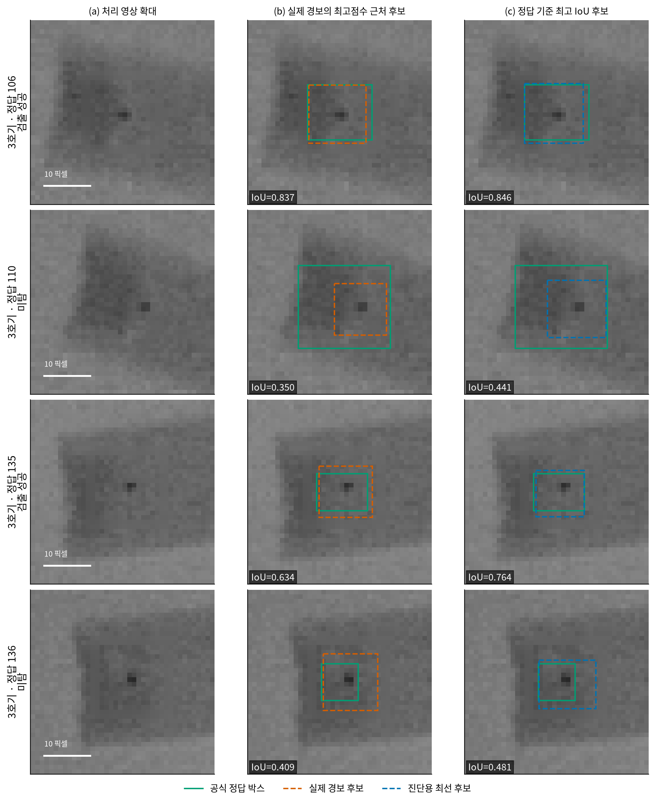
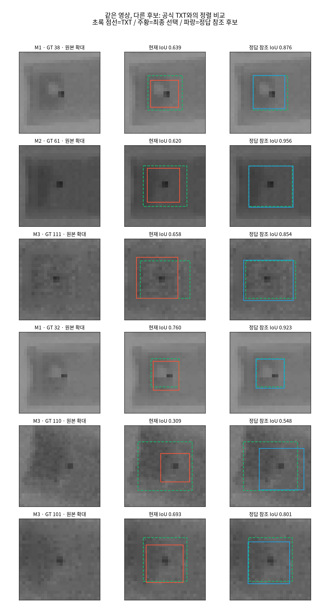

# 사용자 작업 아카이브 — 모델링·분석·그림 생성

`user-research` 브랜치는 main의 통합 제출 패키지와 별도로, 사용자 작업 폴더의 코드·설정·보고서·분석 산출물을 보존한다. main에서 가져온 팀 통합 코드는 저장소 루트에 그대로 있고, 이 폴더는 `/home/viplab/contest`의 상대 경로를 유지한 작업 스냅샷이다. 원 저자 코드를 포함한 D-FINE 등은 각 LICENSE를 따른다.

## 팀원이 바로 볼 이미지

| 필요한 자료 | 이미지 | 생성 코드 |
|---|---|---|
| 실제 이물·GT·모델 예측 비교 | [보고서 사례 그림](final_project/figures/figure_04_cases.png) | [publication_analysis.py](final_project/scripts/publication_analysis.py) |
| 현재 선택 박스와 더 정밀한 후보 비교 | [비교 모음](experiments/kamp_v2_candidate_visualization/comparison_sheet.png) | [build.py](experiments/kamp_v2_candidate_visualization/build.py) |
| 미탐 GT110 확대 | [사례 이미지](experiments/kamp_v2_candidate_visualization/case_05_gt110.png) | 위 build.py |
| 합성 데이터 전체 영상 예시 | [전체 영상](experiments/kamp_synth_v1_audit/audit_full_images.png), [확대 영상](experiments/kamp_synth_v1_audit/audit_crops.png) | [visualize.py](experiments/kamp_synth_v1_audit/visualize.py) |
| 모델 구조도 | [아키텍처](final_project/figures/figure_07_method.png) | [figure_07_architecture.py](final_project/scripts/figure_07_architecture.py) |
| 선택적 검사 운영 구조 | [운영 구조](final_project/figures/figure_14_selective_inspection.png) | [selective_inspection_figure.py](final_project/analysis/editorial/selective_inspection_figure.py) |
| 데이터 분포·EDA·조건별 결과 | [그림 전체](final_project/figures/) | [publication_analysis.py](final_project/scripts/publication_analysis.py) |
| 재검사 영역·그룹 전이 | [그림 전체](final_project/figures/) | [operational_validation.py](final_project/scripts/operational_validation.py) |





비교 모음에서 초록은 공식 GT, 주황은 현재 모델 출력, 파랑은 정답을 참조해 고른 최고 IoU 후보다. 파란 박스는 진단용 oracle이며 실제 모델의 예측 개선 결과로 사용하지 않는다. 이미지마다 범례와 seed를 확인한다.

## 예시 이미지 3장과 박스 그림을 바로 생성

[examples](examples/)에는 기존 검증셋의 서로 다른 촬영 장비 사례 3장, 해당 사례의 GT와 저장된 최종 예측이 있다. 새 학습이나 모델 추론 없이 박스 없는 사진과 박스 표시 사진을 각각 만든다. 예시는 과거 후보 비교 실험의 seed20260929 출력으로, 최종 대표 seed20260930 성능 재현용이 아니다.

저장소 루트에서:

```bash
python3 -m venv .image-venv
.image-venv/bin/pip install Pillow
.image-venv/bin/python user_work/scripts/export_example_boxes.py \
  --images user_work/examples/images \
  --annotations user_work/examples/annotations.json \
  --predictions user_work/examples/predictions.json \
  --output user_work/examples/rendered
```

녹색=공식 정답, 주황색=저장된 예측. COCO `[x,y,width,height]` 픽셀 좌표를 사용한다. `--threshold` 기본값 0은 제공된 최종 예측을 모두 표시한다. 다른 데이터에도 동일 JSON 형식으로 사용할 수 있다. [생성 결과](examples/rendered/)도 함께 보관했다.

## 작업 폴더 안내

- `experiments/`: baseline, P2, MAL, UQ, ranking, 경계 불확실성, 미탐, 임계값, 합성 데이터 평가·학습 등 각 실험 코드와 보존된 결과.
- `final_project/`: 최종 모델 추론·평가 코드, 보고서 그림 생성 코드, 분석 자료.
- `scripts/`, `analysis/`, `inference_locked/`: 데이터 조사와 전처리 실험, 통계, 고정 추론 관련 코드·결과.
- `models/`: 실험에 사용한 D-FINE 코드와 설정. `external/`: 외부 데이터 관련 준비 코드·메타데이터.
- `reports/archive/`: 과거 보고서. 최신 진행 문서는 [프로젝트 진행과정 통합보고서](프로젝트_진행과정_통합보고서.md), 제출 본문은 [가독성 개선본](제출용_결과보고서_사용자담당_가독성개선본.md).
- `FILE_MANIFEST.csv`: 보관 파일별 크기와 SHA256. `EXCLUDED_SUMMARY.json`: 제외 항목별 수량.

## 실행 범위와 제외 자료

이 폴더는 모든 실험을 새 환경에서 한 번에 실행하는 완성 패키지가 아닌 원 작업 스냅샷이다. 기존 스크립트 일부에는 `/home/viplab/contest`, 폰트, 환경 경로가 남아 있다. 전체 그림을 다시 만들려면 원 데이터와 저장 예측을 준비하고 경로를 맞춰야 한다. 보고서 생성 스크립트는 결과 파일을 덮어쓸 수 있으므로 복사본에서 실행한다. 최종 모델의 재현은 저장소 루트 [README](../README.md)와 [repro](../repro/)를 따른다.

반복 가중치(.pt/.pth), 후보 캐시(.npz/.npy), 가상환경, 원 데이터 전체, 외부 데이터 이미지, 논문 PDF 원문, 머신 관리 스크립트, 심볼릭 링크, 5MiB 초과 개별 산출물은 제외했다. 따라서 일부 분석 재실행에 필요한 대형 예측은 원 작업 폴더에서 별도 준비해야 한다. main에 이미 포함된 대표 가중치는 이 브랜치에서도 `repro/checkpoints/`에 유지된다. 예시 이미지는 팀 보고서 작업용으로 포함했으며 데이터 이용 조건을 따른다.
