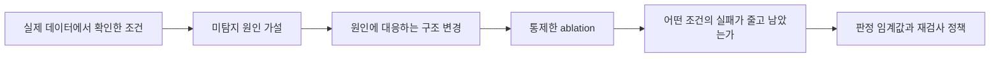
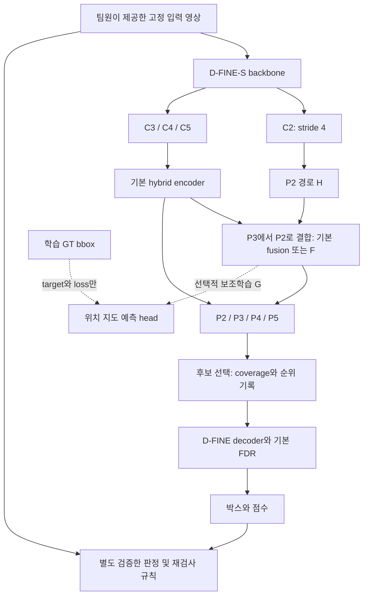

# 작은 X-ray 이물의 검출 실패에서 출발하는 아키텍처 설계
## 최신 선행연구·Ablation·조건별 실패 분석·판정 및 재검사 기준

작성·검증일: 2026-09-29 · 개정판 v2.1  
대상: KAMP ④ X-ray 영상 기반 완제품 이물질 탐지 및 AI 미탐지 조건 분석  
기준 문서: [대회 분석](대회_분석_보고서.md), [데이터 분석](데이터_분석_보고서.md)  
상태: **외부 실험용 데이터는 구축 완료. 모델 학습·성능 비교는 아직 수행하지 않았다.** 아래의 구조와 운영 기준은 검증할 제안이며 결과가 아니다.

## 1. 제안의 중심: 무엇을 만들고, 무엇으로 설득할 것인가

이번 과제의 좋은 설명은 “최신 모듈을 여러 개 결합했다”에서 끝나지 않는다. **작은 이물이 어느 단계에서 놓치는지 측정하고, 그 원인에 맞는 변경이 실제로 해당 실패를 줄였는지 보여 주며, 남은 실패를 재검사 대상으로 연결하는 것**이 핵심이다.

현재 권장하는 출발점은 **D-FINE-S를 고정 기준 모델로 두고, P2 경로의 필요성을 먼저 검증하는 설계**다. 이후 배경·특징 융합에 문제가 확인되면 FreqFusion 계열 변경을, 작은 위치의 학습 신호가 약하면 Gaussian 위치 보조학습을 독립적으로 비교한다. D-FINE이 이미 가진 분포 기반 위치 보정을 활용하고, UGS/TOLF는 위치 실패가 남을 때 검토할 별도의 대안으로 둔다. 네 방법을 처음부터 모두 결합하지 않는다.

이는 D-FINE이 KAMP에서 가장 좋다는 주장이 아니다. 최신 공개 구현을 갖춘 기준 모델 안에서 **특징 보존, 특징 결합, 위치 보정의 역할을 분리해서 설명하기 쉽다**는 설계상 선택이다. 사용자 결정에 따라 두 기준 모델은 D-FINE과 YOLO로 둔다. 구체적인 시작 구성은 **D-FINE-S와 YOLOv8s**를 제안한다. YOLOv8은 공식 문서가 널리 채택된 모델로 소개하며 구현과 학습 지원이 공개되어 있다. 가장 인기 있는 버전이라는 정량 순위를 확인한 것은 아니다. [YOLOv8 공식 문서](https://docs.ultralytics.com/models/yolov8/). query 선택의 연구 대조군은 Salience DETR가 적절하다. 모델 계열 비교와 한 모듈의 ablation은 구분한다.

대회 분석 보고서상 모델 개발·성능평가가 40점이고, 나머지 60점은 데이터 진단·오류분석·활용·차별성·재현성이다. 따라서 최종 산출물은 단일 mAP보다 다음 연결을 보여 주어야 한다.

**발표의 중심 문장:** “작은 이물의 후보 누락과 위치 오차를 구분해 개선하고, 개선 후에도 취약한 조건에서는 자동 판단을 보류하도록 설계했다.” 마지막 절은 실제 정책 검증 후에만 완료형으로 쓴다.

## 2. 확인된 사실과 아직 검증할 가설

| 현재 근거 | 확인 수준 | 설계에 주는 의미 |
|---|---|---|
| 주 라벨 500장·1,147 bbox·단일 클래스 | 기존 데이터 감사로 확인 | 다중 클래스 의미 구분보다 이물/배경 및 위치 정확도가 중요 |
| bbox 너비·높이 중앙값 각 10px; 짧은 변 10px 미만 567개 | 확인 | 고해상도 경로와 작은 박스 위치 학습을 우선 조사 |
| 영상당 1~3개 bbox | 확인 | 밀집 객체의 개수 추정이 주 문제라고 가정하지 않음 |
| 최장 변 640 환산 시 53.9%가 stride 8에서 짧은 변 2칸 미만 | 실제 라벨 환산 | P2 검토 근거. 검출 불가능의 경계는 아님 |
| 원본 영상의 색상 표시 및 라벨 출처 충돌 | 확인 | 표시 잔존을 잘 찾는 모델을 좋은 이물 detector로 오인할 위험 |
| 주 라벨 세트에 정상 확인 영상 없음 | 확인 | 정상 제품 오경보율·자동 통과 신뢰도를 입증할 자료가 부족 |
| 낮은 대비와 복잡한 제품 배경에서 더 많이 놓친다 | **아직 가설** | 팀원 제공 최종 입력과 baseline 예측에서 조건별 FN을 측정해야 함 |
| downsampling이 실제 FN의 주 원인이다 | **아직 가설** | P2의 존재뿐 아니라 후보 recall·크기별 개선을 확인해야 함 |
| gradient instability가 우리 회귀의 병목이다 | **아직 가설** | 위치 오차·학습 변동·박스 크기별 분석 없이 UGS 도입을 정당화하지 않음 |

계산 근거: [기존 특징맵 통계](analysis/detector_research/feature_grid_coverage.json). 우리 원본의 최장 변은 640보다 작으므로 640 입력이 원본을 축소해 정보를 없앤다고 설명하면 잘못이다. **입력의 확대와 네트워크 내부 downsampling은 서로 다른 과정**이다.

쉽게 말하면, “아주 작은 박스를 맞혀야 한다”는 사실은 이미 알고 있다. “배경에 묻혀 못 봤는지, 후보 선택에서 버렸는지, 박스를 잘못 그렸는지”는 모델을 실행해야 알 수 있다. 스토리텔링도 이 구분에서 출발한다.

## 3. 조사 범위와 논문을 읽는 기준

2024~2026년 연구 **21편**과 배경 연구 QueryDet(2022) **1편**, 총 22편을 정리했다. 이 중 직접적인 detector 구조·학습 연구, 다른 영상 방식에서 가져올 간접 근거, 판정 기준 연구를 구분한다. CVPR·ICCV·ECCV·ICLR 본회의, TPAMI/TGRS/Pattern Recognition, ACCV/WACV, COPA의 성격을 같은 등급으로 묶지 않는다. 실시간 인용수는 검증하지 않았으며 인용 순위로 선정하지 않았다.

논문별 실험 데이터·입력 크기·학습 recipe가 다르므로 발표 AP를 한 표에서 순위로 비교하지 않는다. 공식 코드 링크는 구현 출발점이지 우리 환경에서 재현 완료했다는 표시가 아니다. 코드 미확인은 비공개라는 단정이 아니다.

| ID | 논문 | 발표 | 검토할 역할 |
|---|---|---|---|
| R01 | [DM-EFS](https://openaccess.thecvf.com/content/ICCV2025/html/Sharma_DM-EFS_Dynamically_Multiplexed_Expanded_Features_Set_Form_for_Robust_and_ICCV_2025_paper.html) | ICCV 2025 | 고해상도 특징·동적 선택 |
| R02 | [YOLO small-object structure](https://openaccess.thecvf.com/content/ACCV2024/html/Hu_A_Universal_Structure_of_YOLO_Series_Small_Object_Detection_Models_ACCV_2024_paper.html) | ACCV 2024 | 얕은 검출 경로·fusion |
| R03 | [FreqFusion](https://arxiv.org/abs/2408.12879) | IEEE TPAMI 2024 | 특징 결합·경계 보존 |
| R04 | [SET](https://openaccess.thecvf.com/content/CVPR2025/html/Sun_SET_Spectral_Enhancement_for_Tiny_Object_Detection_CVPR_2025_paper.html) | CVPR 2025 | 학습 시 배경 특징 조절 |
| R05 | [Position Gaussian Distribution](https://openaccess.thecvf.com/content/CVPR2025/html/Bian_Feature_Information_Driven_Position_Gaussian_Distribution_Estimation_for_Tiny_Object_CVPR_2025_paper.html) | CVPR 2025 | 위치 보조 감독·특징 보강 |
| R06 | [SR-TOD](https://www.ecva.net/papers/eccv_2024/papers_ECCV/papers/02515.pdf) | ECCV 2024 | 재구성 차이 기반 특징 보강 |
| R07 | [DNTR](https://arxiv.org/abs/2406.05755) | IEEE TGRS 2024 | fusion noise·2단계 검출 |
| R08 | [UGS](https://openaccess.thecvf.com/content/ICCV2025/html/Sun_Uncertainty-Aware_Gradient_Stabilization_for_Small_Object_Detection_ICCV_2025_paper.html) | ICCV 2025 | 위치 학습 안정화 |
| R09 | [TOLF](https://arxiv.org/abs/2601.00617) | Pattern Recognition 2026 | 라벨 노이즈에 대한 위치 강건성 |
| R10 | [D-FINE](https://proceedings.iclr.cc/paper_files/paper/2025/hash/6cf58a87e3097e7d1f9be3e8693a93de-Abstract-Conference.html) | ICLR 2025 | 분포 기반 반복 위치 보정·주 baseline |
| R11 | [DQ-DETR](https://www.ecva.net/papers/eccv_2024/papers_ECCV/papers/09775.pdf) | ECCV 2024 | 객체 수·밀도에 따른 query |
| R12 | [DEIM](https://openaccess.thecvf.com/content/CVPR2025/html/Huang_DEIM_DETR_with_Improved_Matching_for_Fast_Convergence_CVPR_2025_paper.html) | CVPR 2025 | matching·학습 recipe |
| R13 | [RT-DETR](https://openaccess.thecvf.com/content/CVPR2024/html/Zhao_DETRs_Beat_YOLOs_on_Real-time_Object_Detection_CVPR_2024_paper.html) | CVPR 2024 | 효율적 다중 scale 검출·대조군 |
| R14 | [BDNet](https://openaccess.thecvf.com/content/CVPR2026/html/Guan_BDNetBio-Inspired_Dual-Backbone_Small_Object_Detection_Network_CVPR_2026_paper.html) | CVPR 2026 | 색상·경계 이중 backbone, 직접 적용 제외 |
| R15 | [DyFCLT](https://openaccess.thecvf.com/content/CVPR2026/html/Li_DyFCLT_Dynamic_Frequency-Decoupled_Cross-Modal_Learning_Transformer_for_Multimodal_Tiny_Object_CVPR_2026_paper.html) | CVPR 2026 | RGBT frequency, 직접 적용 제외 |
| R16 | [NS-FPN](https://openaccess.thecvf.com/content/CVPR2026/papers/Yuan_Seeing_Through_the_Noise_Improving_Infrared_Small_Target_Detection_and_CVPR_2026_paper.pdf) | CVPR 2026 | 적외선 특징 노이즈 억제, 간접 근거 |
| R17 | [BoltzFormer](https://openaccess.thecvf.com/content/CVPR2025/html/Zhao_Boltzmann_Attention_Sampling_for_Image_Analysis_with_Small_Objects_CVPR_2025_paper.html) | CVPR 2025 | 작은 영역의 attention sampling, 간접 근거 |
| R18 | [Salience DETR](https://openaccess.thecvf.com/content/CVPR2024/html/Hou_Salience_DETR_Enhancing_Detection_Transformer_with_Hierarchical_Salience_Filtering_Refinement_CVPR_2024_paper.html) | CVPR 2024 | scale bias·후보 선택 |
| R19 | [Detection calibration](https://openaccess.thecvf.com/content/WACV2024/html/Popordanoska_Beyond_Classification_Definition_and_Density-Based_Estimation_of_Calibration_in_Object_WACV_2024_paper.html) | WACV 2024 | 검출 신뢰도 평가 |
| R20 | [DiL](https://openaccess.thecvf.com/content/WACV2025/html/Giloni_DiL_An_Explainable_and_Practical_Metric_for_Abnormal_Uncertainty_in_WACV_2025_paper.html) | WACV 2025 | 미검출 포함 장면 수준 불확실성 |
| R21 | [CRC detection](https://proceedings.mlr.press/v266/hulsman25a.html) | COPA / PMLR 266 2025 | 민감도·FP trade-off, 보조 의사결정 근거 |
| R22 | [QueryDet](https://openaccess.thecvf.com/content/CVPR2022/html/Yang_QueryDet_Cascaded_Sparse_Query_for_Accelerating_High-Resolution_Small_Object_Detection_CVPR_2022_paper.html) | CVPR 2022 | 고해상도·후보 누락의 배경 연구 |

## 4. 논문별 분석: 결과를 가져오는 대신 가설을 가져오기

### R01. DM-EFS — ICCV 2025

**원제:** DM-EFS: Dynamically Multiplexed Expanded Features Set Form for Robust and Efficient Small Object Detection  
[원문](https://openaccess.thecvf.com/content/ICCV2025/html/Sharma_DM-EFS_Dynamically_Multiplexed_Expanded_Features_Set_Form_for_Robust_and_ICCV_2025_paper.html) · 공식 코드 위치는 이번 조사에서 확인하지 못함

**무엇을 바꿨나:** 얕은 backbone의 고해상도 특징을 추가하는 EFS와, 크기–특징 관계를 학습해 사용할 특징을 선택하는 DFM을 제안한다. 단순히 P2가 좋다는 데서 끝나지 않고 계산량 증가까지 다룬다.

**우리의 해석:** 작은 이물에 얕은 특징이 필요할 수 있다는 최근 근거다. 그러나 동적 선택기가 이물을 배경으로 판단하면 처리 경로 자체를 놓칠 수 있다. 처음에는 항상 켜진 P2를 사용하고, 선택적 실행은 계산 비용이 실제 문제일 때 검토한다.

**검증·실패 기준:** P2 사용 전후의 후보 recall과 작은 구간 FN을 비교한다. 동적 경로를 쓰면 그 경로가 꺼진 영상의 FN도 별도로 기록한다. 논문은 YOLOv7 기반 실험이며 D-FINE의 즉시 교체 부품은 아니다.

### R02. YOLO small-object structure — ACCV 2024

**원제:** A Universal Structure of YOLO Series Small Object Detection Models  
[원문](https://openaccess.thecvf.com/content/ACCV2024/html/Hu_A_Universal_Structure_of_YOLO_Series_Small_Object_Detection_Models_ACCV_2024_paper.html) · 공식 코드 위치는 이번 조사에서 확인하지 못함

**무엇을 바꿨나:** 고해상도 검출 분기, Detail-Guide Block, Feature-Refine Module로 작은 특징과 upsampling 과정의 세부 정보를 다룬다. 효과가 작은 깊은 검출 분기를 제거하는 구성도 실험한다.

**우리의 해석:** 작은 물체 대응은 “backbone을 크게”보다 “어느 수준의 특징을 head까지 전달하나”의 문제일 수 있다. 반면 우리 제품의 넓은 맥락도 필요하므로 논문의 깊은 분기 제거를 그대로 따르지는 않는다.

**검증·실패 기준:** 얕은 경로의 추가와 깊은 경로의 제거는 다른 실험으로 분리한다. 작은 구간 recall이 늘어도 정상 배경 FP가 급증한다면 고해상도만으로 충분하지 않다.

### R03. FreqFusion — IEEE TPAMI 2024

**원제:** Frequency-aware Feature Fusion for Dense Image Prediction  
[원문](https://arxiv.org/abs/2408.12879) · [저자 코드](https://github.com/Linwei-Chen/FreqFusion)

**무엇을 바꿨나:** FreqFusion은 adaptive low-pass, 위치 재샘플링, adaptive high-pass를 결합해 특징 내부의 불일치와 경계 흐려짐을 다룬다. 입력 영상의 단순 선명화 필터가 아니라 특징 융합 구조다.

**우리의 해석:** 이물 정보를 살려도 scale을 합치는 과정에서 경계가 흐려질 수 있다. “모든 고주파를 키우자” 또는 “모든 고주파를 없애자”보다 세부 경계와 배경 변동을 구분한다는 점이 유용하다.

**적용:** P2를 넣은 뒤 P3→P2 융합 한 곳만 교체하는 후보로 권장한다. 전체 neck 교체는 원인 설명을 어렵게 한다.

**검증·한계:** 같은 파라미터 규모의 일반 convolution 대조군과 비교하고, 중심 오차·AP75·배경 복잡도별 FP를 확인한다. X-ray 특화 기법이 아니며 10px 이물에서 효과는 미검증이다.

### R04. SET — CVPR 2025

**원제:** SET: Spectral Enhancement for Tiny Object Detection  
[원문](https://openaccess.thecvf.com/content/CVPR2025/html/Sun_SET_Spectral_Enhancement_for_Tiny_Object_Detection_CVPR_2025_paper.html) · [저자 코드](https://github.com/HuixinSun/SET)

**무엇을 바꿨나:** SET의 HBS는 학습 GT로 전경/배경 특징을 나누고 배경 특징을 부드럽게 한다. API는 특징에 adversarial perturbation을 주는 학습 절차다. 논문과 공식 구현은 학습 중 적용하고 추론 추가 비용을 없애는 구성을 설명한다.

**바로잡을 점:** SET을 추론 그래프에 붙이는 일반적인 “spectral enhancement 블록”으로 소개하면 부정확하다. spectral은 공간 주파수 분석이며 X-ray 에너지 스펙트럼이나 RGB 색상이 아니다.

**우리의 해석:** 제품 무늬·표시 잔존을 강조하는 enhancement가 해로울 수 있다는 중요한 반례다. 다만 항공영상에서의 분석이 X-ray의 주파수 법칙은 아니다.

**검증·한계:** HBS와 API를 분리한다. 학습 GT 사용과 달리 추론 GT는 금지한다. 입력을 GT 박스로 지우는 전처리와 동일한 방법이 아니다. 기본 구조의 효과가 확인된 후 독립 학습 실험으로 둔다.

### R05. Position Gaussian Distribution — CVPR 2025

**원제:** Feature Information Driven Position Gaussian Distribution Estimation for Tiny Object Detection  
[원문](https://openaccess.thecvf.com/content/CVPR2025/html/Bian_Feature_Information_Driven_Position_Gaussian_Distribution_Estimation_for_Tiny_Object_CVPR_2025_paper.html) · 공식 코드 위치는 이번 조사에서 확인하지 못함

**무엇을 바꿨나:** 픽셀별 정보량을 모델링하는 branch와, bbox 위치·크기에서 생성한 Position Gaussian Distribution Map을 예측하는 다중 scale branch를 함께 사용한다. 예측 지도와 정보 지도로 P2를 보강한다.

**바로잡을 점:** 원논문은 Gaussian auxiliary loss 하나가 전부가 아니다. 논문의 전체 구조와 우리가 단순화한 “Gaussian 위치 보조학습”을 같은 이름으로 부르면 안 된다.

**우리의 해석:** 작은 GT가 차지하는 몇 픽셀에 추가 감독을 주되, 추론에서는 영상에서 예측한 지도만 사용할 수 있다. 추가 이물 segmentation 정답이 없어도 가능한 감독 방식이다.

**적용·검증:** 먼저 학습 전용 보조 head를 비교한다. 예측 지도를 실제 특징에 곱하는 구성은 별도 비교한다. bbox 오차·표시 잔존에 과도하게 집중할 수 있으므로 지도 밝기 자체를 탐지 근거나 안전 확률로 보지 않는다.

### R06. SR-TOD — ECCV 2024

**원제:** Visible and Clear: Finding Tiny Objects in Difference Map  
[원문](https://www.ecva.net/papers/eccv_2024/papers_ECCV/papers/02515.pdf) · [저자 코드](https://github.com/Hiyuur/SR-TOD)

**무엇을 바꿨나:** SR-TOD는 재구성한 영상과 입력의 차이 지도를 통해 작은 객체의 약한 특징을 보강하는 DGFE를 제안한다.

**우리의 해석:** 주변에서 설명하기 어려운 국소 구조를 찾는 방향은 이물 탐지와 잘 맞는다. 하지만 재구성 오차는 이물뿐 아니라 제품 경계, 노이즈, 색상 제거 흔적에도 커질 수 있다.

**검증·한계:** 차이 지도가 이물이 아닌 artifact를 지목하는 비율을 사례와 FP로 검증해야 한다. 현재는 데이터에 표시 처리 문제가 있어 주 설계로 우선 채택하지 않는다. “재구성 오차가 크면 이물”이라는 정상성 가정은 아직 성립하지 않는다.

### R07. DNTR — IEEE TGRS 2024

**원제:** A DeNoising FPN With Transformer R-CNN for Tiny Object Detection  
[원문](https://arxiv.org/abs/2406.05755) · [저자 코드](https://github.com/hoiliu-0801/DNTR)

**무엇을 바꿨나:** DNTR은 FPN 융합 중 발생하는 noise를 억제하는 DN-FPN과 Transformer 기반 R-CNN을 결합한다.

**우리의 해석:** 입력의 촬영 노이즈만이 문제가 아니라 서로 다른 level의 특징을 섞는 과정도 문제일 수 있다. 전처리를 팀원이 맡더라도 neck에서의 특징 결합은 우리가 조사할 수 있다.

**검증·한계:** 두 구성 요소의 효과를 분리한다. DN-FPN이라는 이름만으로 모든 X-ray 센서 노이즈를 제거한다고 주장하지 않는다. 주 설계의 FreqFusion과 같은 문제를 다루는 대안이며, 처음부터 둘을 겹쳐 넣지 않는다.

### R08. UGS — ICCV 2025

**원제:** Uncertainty-Aware Gradient Stabilization for Small Object Detection  
[원문](https://openaccess.thecvf.com/content/ICCV2025/html/Sun_Uncertainty-Aware_Gradient_Stabilization_for_Small_Object_Detection_ICCV_2025_paper.html) · 공식 코드 위치는 이번 조사에서 확인하지 못함

**무엇을 바꿨나:** UGS는 작은 객체의 회귀 불안정을 분석하고, 비균일 구간 표현을 이용한 classification 기반 위치 학습, uncertainty minimization, uncertainty-guided perturbation refinement를 결합한다.

**우리의 해석:** 이물 근처는 찾지만 1~2px 오차로 IoU 기준을 놓치는 경우에 적합한 가설이다. 단순히 NWD 손실을 추가하는 것과 다르며, 회귀 head·target encoding·학습 목적이 함께 바뀐다.

**적용·검증:** 위치 실패가 지배적일 때 독립 head 대안으로 비교한다. D-FINE의 분포 표현 위에 손실만 무작정 추가하지 않는다. 동일 대응 GT의 중심·크기 오차와 seed별 분산을 기록한다.

**한계:** 불확실성을 줄이는 목적함수는 위험 확률의 calibration이 아니다. 낮은 entropy로 틀릴 수도 있다. 따라서 UGS 출력을 즉시 재검사 확률로 해석할 수 없다.

### R09. TOLF — Pattern Recognition 2026

**원제:** Noise-Robust Tiny Object Localization with Flows  
[원문](https://arxiv.org/abs/2601.00617) · 공식 코드 위치는 이번 조사에서 확인하지 못함

**무엇을 바꿨나:** TOLF는 normalizing flow로 예측–정답 위치 오차 분포를 표현하고, uncertainty-aware gradient modulation으로 라벨 노이즈에 대한 과적합을 줄인다. 2026년 Pattern Recognition 논문이며 저자 arXiv 공개본이 있다.

**우리의 해석:** 아주 작은 bbox의 정밀한 회귀는 정답도 정확하다는 전제를 갖는다. 현재 데이터에서 확인한 라벨 출처 충돌은 “더 강한 회귀”만으로 해결되지 않는다.

**검증·한계:** 라벨은 팀원이 확정한 버전으로 고정하고, 학습 박스만 1~2px 교란하는 선택적 민감도 실험에서 평가 정답은 바꾸지 않는다. 이는 모델 내구성 실험이며 데이터 정제 업무를 대체하지 않는다. uncertainty down-weighting이 실제 어려운 작은 이물까지 무시하는지 구간별 FN을 반드시 본다.

### R10. D-FINE — ICLR 2025

**원제:** D-FINE: Redefine Regression Task of DETRs as Fine-grained Distribution Refinement  
[원문](https://proceedings.iclr.cc/paper_files/paper/2025/hash/6cf58a87e3097e7d1f9be3e8693a93de-Abstract-Conference.html) · [저자 코드](https://github.com/Peterande/D-FINE)

**무엇을 바꿨나:** D-FINE은 decoder에서 경계 분포를 반복 갱신하는 FDR과 위치 self-distillation인 GO-LSD를 사용한다.

**선정 이유:** 위치가 몇 픽셀만 달라도 평가가 크게 바뀌는 과제에, 위치 보정 과정을 관찰할 수 있는 현대적 baseline을 제공한다. 공개 S 구성을 주 기준 모델로 권장한다. 단, COCO 성능이 KAMP 성능을 보장하지 않는다.

**우리의 적용:** 기본 FDR은 유지한 채 P2와 특징 융합 효과를 먼저 분리한다. 기본 모델에 이미 있는 FDR을 우리 개선 모듈로 주장하지 않는다.

**검증·한계:** layer별 위치 오차를 추적한다. 후보를 아예 찾지 못한 경우 분포 보정만으로 복구할 수 없다. decoder layer를 줄이는 비교는 계산량·보정 횟수가 함께 바뀌므로 FDR만의 ablation이 아니다.

### R11. DQ-DETR — ECCV 2024

**원제:** DQ-DETR: DETR with Dynamic Query for Tiny Object Detection  
[원문](https://www.ecva.net/papers/eccv_2024/papers_ECCV/papers/09775.pdf) · [저자 코드](https://github.com/hoiliu-0801/DQ-DETR)

**무엇을 바꿨나:** DQ-DETR은 tiny-object 검출에서 객체 수 변화와 특징을 고려해 dynamic query를 설계한다. DINO 계열의 공식 구현이 공개되어 있다.

**우리의 해석:** decoder 이전 후보 배정도 작은 이물의 병목일 수 있다는 점은 유용하다. 그러나 KAMP는 영상당 1~3개, 외부 세트는 0~1개라 밀집 객체 개수 예측이 우선 문제라는 근거가 없다.

**선정 판단:** 전체 모델 도입의 우선순위는 낮추고, query 후보 recall 진단을 가져온다. query를 정답 최대 개수 3으로 제한하지 않는다. 같은 DQ-DETR 이름의 언어 grounding 논문과 혼동하지 않는다.

### R12. DEIM — CVPR 2025

**원제:** DEIM: DETR with Improved Matching for Fast Convergence  
[원문](https://openaccess.thecvf.com/content/CVPR2025/html/Huang_DEIM_DETR_with_Improved_Matching_for_Fast_Convergence_CVPR_2025_paper.html) · [저자 코드](https://github.com/abinader96/DEIM)

**무엇을 바꿨나:** DEIM은 Dense One-to-One matching과 Matchability-Aware Loss로 DETR 학습을 개선한다. Dense O2O는 추가 목표를 만드는 표준 증강을 활용한다.

**우리의 해석:** 객체가 적을 때 학습 신호의 밀도와 matching 품질도 확인할 가치가 있다. 다만 이는 backbone·neck 변경만의 연구가 아니며 증강 조건과 분리하기 어렵다.

**선정 판단:** D-FINE 원형을 주 ablation 기준으로 고정하고, DEIM-D-FINE은 별도 학습 recipe 대조군으로 둔다. 동시에 recipe까지 바꾼 결과를 P2의 이득으로 해석하지 않는다. 이 보고서에서 팀원의 증강 방식을 대신 정하지 않는다.

### R13. RT-DETR — CVPR 2024

**원제:** DETRs Beat YOLOs on Real-time Object Detection  
[원문](https://openaccess.thecvf.com/content/CVPR2024/html/Zhao_DETRs_Beat_YOLOs_on_Real-time_Object_Detection_CVPR_2024_paper.html) · [저자 코드](https://github.com/lyuwenyu/RT-DETR)

**무엇을 바꿨나:** RT-DETR은 효율적 hybrid encoder와 query 선택을 통해 다중 scale의 정보를 decoder로 전달하는 실시간 검출기다.

**우리의 해석:** 특징의 전달, 후보 선택, 반복 위치 보정을 단계별로 관찰할 기준이다. D-FINE과 계열이 가까워 위치 보정 설계의 차이를 이해하는 대조군으로 유용하다.

**검증·한계:** 공개 RT-DETR과 D-FINE의 수치를 그대로 빼면 여러 구성 차이가 섞인다. 동일 backbone·입력·학습 조건을 맞추지 못하면 모델 간 실용 비교로 명명한다. 논문의 FPS를 우리 GPU 처리량으로 옮기지 않는다.

### R14. BDNet — CVPR 2026

**원제:** BDNet:Bio-Inspired Dual-Backbone Small Object Detection Network  
[원문](https://openaccess.thecvf.com/content/CVPR2026/html/Guan_BDNetBio-Inspired_Dual-Backbone_Small_Object_Detection_Network_CVPR_2026_paper.html) · 공식 코드 위치는 이번 조사에서 확인하지 못함

**무엇을 바꿨나:** BDNet은 색 차이·색조를 처리하는 경로와 방향성 경계를 처리하는 경로를 가진 이중 backbone이다. 2026년 CVPR 본회의 논문이다.

**우리의 판단:** 최신 연구이지만 전체 구조를 채택하지 않는다. 우리 입력의 물리적 이물 정보는 회색조이며, 색상 표시는 직접 특징으로 쓰면 안 된다. RGB 세 채널을 복제해도 새로운 색상 정보는 생기지 않는다.

**얻는 인사이트:** 경계와 배경 맥락을 별도 경로로 보는 발상은 참고할 수 있다. 그러나 색상 branch를 삭제·교체한 모델은 원논문 재현이 아니라 새로운 변형이다. 최신이라는 이유만으로 채택하지 않는 사례다.

### R15. DyFCLT — CVPR 2026

**원제:** DyFCLT: Dynamic Frequency-Decoupled Cross-Modal Learning Transformer for Multimodal Tiny Object Detection  
[원문](https://openaccess.thecvf.com/content/CVPR2026/html/Li_DyFCLT_Dynamic_Frequency-Decoupled_Cross-Modal_Learning_Transformer_for_Multimodal_Tiny_Object_CVPR_2026_paper.html) · 공식 코드 위치는 이번 조사에서 확인하지 못함

**무엇을 바꿨나:** DyFCLT는 RGB–thermal 두 영상 방식의 주파수 정보와 선택적 smoothing을 결합하는 2026년 CVPR 연구다.

**우리의 판단:** 단일 X-ray에는 RGB와 thermal의 상보적 정보가 없다. Fourier 변환이나 회색조 복제만으로 cross-modal 조건을 충족하지 못하므로 전체 아키텍처를 직접 가져오지 않는다.

**얻는 인사이트:** tiny object의 유용한 주파수 성분은 영상 방식·특징 단계에 따라 다를 수 있다. SET과 함께 읽으면 “tiny니까 고주파를 일괄 제거/증폭”이라는 단순화가 위험하다는 점을 알 수 있다. 특정 주파수 대역의 유익함은 우리 입력에서 별도로 확인해야 한다.

### R16. NS-FPN — CVPR 2026

**원제:** Seeing Through the Noise: Improving Infrared Small Target Detection and Segmentation from Noise Suppression Perspective  
[원문](https://openaccess.thecvf.com/content/CVPR2026/papers/Yuan_Seeing_Through_the_Noise_Improving_Infrared_Small_Target_Detection_and_CVPR_2026_paper.pdf) · 공식 코드 위치는 이번 조사에서 확인하지 못함

**무엇을 바꿨나:** NS-FPN은 infrared small-target detection/segmentation에서 low-frequency-guided purification과 spiral-aware sampling으로 특징 노이즈와 융합을 다룬다.

**우리의 해석:** 특징을 세게 만드는 것보다 정상 배경의 false alarm을 줄이는 접근이 중요하다는 최신 근거다. FreqFusion 비교도 recall만 보지 말고 FP를 함께 보게 한다.

**한계:** 적외선 방출 영상의 점 표적과 투과 X-ray의 이물은 물리가 다르다. pixel mask 성능을 bbox detector 성능으로 바꿔 말할 수 없다. 간접 설계 근거이며 주 모델에 그대로 붙이는 부품으로 권장하지 않는다.

### R17. BoltzFormer — CVPR 2025

**원제:** Boltzmann Attention Sampling for Image Analysis with Small Objects  
[원문](https://openaccess.thecvf.com/content/CVPR2025/html/Zhao_Boltzmann_Attention_Sampling_for_Image_Analysis_with_Small_Objects_CVPR_2025_paper.html) · [저자 코드](https://github.com/microsoft/BoltzFormer)

**무엇을 바꿨나:** BoltzFormer는 온도 스케줄을 갖는 Boltzmann attention sampling으로 초기에는 넓게, 이후에는 집중해 작은 영역의 정보를 처리한다. 주된 실증은 작은 구조의 segmentation이다.

**우리의 해석:** 계산을 줄이려고 너무 일찍 영역을 좁히면 약한 이물을 놓칠 수 있다는 관점이 유용하다.

**한계·선정 판단:** bbox 탐지의 직접 개선 근거로 취급하지 않는다. 현재 영상 크기가 크지 않아 복잡한 sparse attention보다 밀집 P2 기준을 먼저 확보한다. sparse 경로는 후보를 버리지 않는지 확인할 수 있을 때만 비교한다.

### R18. Salience DETR — CVPR 2024

**원제:** Salience DETR: Enhancing Detection Transformer with Hierarchical Salience Filtering Refinement  
[원문](https://openaccess.thecvf.com/content/CVPR2024/html/Hou_Salience_DETR_Enhancing_Detection_Transformer_with_Hierarchical_Salience_Filtering_Refinement_CVPR_2024_paper.html) · [저자 코드](https://github.com/xiuqhou/Salience-DETR)

**무엇을 바꿨나:** Salience DETR은 two-stage query 선택의 scale bias와 중복을 분석하고, scale-independent salience 감독과 계층적 filtering·query refinement를 제안한다.

**우리의 해석:** P2에 이물 신호가 남아 있어도 top-K query 선택에서 제외되면 decoder가 활용하지 못한다. 따라서 “특징을 살렸다”와 “실제로 후보로 전달했다”를 구분해야 한다. 이 점이 P2-only 스토리를 보완한다.

**적용·검증:** encoder 전체 후보와 선택된 query의 GT coverage를 따로 측정한다. 차이가 큰 경우 주 baseline에서 salience 보조 점수를 비교하거나 전체 Salience DETR를 연구 대조군으로 둔다. 전체 모델 교체의 이득을 salience 하나의 이득으로 주장하지 않는다.

### R19. Detection calibration — WACV 2024

**원제:** Beyond Classification: Definition and Density-Based Estimation of Calibration in Object Detection  
[원문](https://openaccess.thecvf.com/content/WACV2024/html/Popordanoska_Beyond_Classification_Definition_and_Density-Based_Estimation_of_Calibration_in_Object_WACV_2024_paper.html) · 공식 코드 위치는 이번 조사에서 확인하지 못함

**무엇을 다루나:** 검출에서는 분류 정확도만의 calibration 정의로 충분하지 않으며, 위치와 관련된 예측 품질도 고려해야 한다는 연구다.

**우리의 해석:** confidence 0.9를 “제품이 안전할 확률 90%”로 읽지 않는다. 검증해야 할 사건은 예를 들어 “해당 예측이 고정 IoU 기준에서 실제 이물과 일대일 대응되는가”다.

**적용·한계:** 예측 점수 구간별 실제 정답 비율과 표본 수를 본다. calibration은 존재하는 후보의 점수를 조정하는 것이므로 후보가 전혀 없는 완전 미탐지를 복구하지 못한다. 최근접 bbox의 분산도 제품 전체의 누락 확률이 아니다.

### R20. DiL — WACV 2025

**원제:** DiL: An Explainable and Practical Metric for Abnormal Uncertainty in Object Detection  
[원문](https://openaccess.thecvf.com/content/WACV2025/html/Giloni_DiL_An_Explainable_and_Practical_Metric_for_Abnormal_Uncertainty_in_WACV_2025_paper.html) · 공식 코드 위치는 이번 조사에서 확인하지 못함

**무엇을 다루나:** DiL은 장면의 saliency 기반 objectness와 최종 출력의 불일치를 이용해 이상 조건의 불확실성을 조사한다. 실제 GT 없이 영상과 모델만 사용하는 방향이다.

**우리의 해석:** “예측 박스가 없으면 uncertainty도 0”이라는 설계의 빈틈을 다루는 참고다. 위치 보조 지도에는 의심 신호가 있는데 최종 검출은 없는 경우를 재검사 후보로 삼는 아이디어를 얻을 수 있다.

**검증·한계:** 우리 Gaussian 보조 지도와의 불일치 지표는 DiL 원형이 아닌 별도 가설이다. 높은 지도 반응은 제품 무늬일 수도 있다. 동일 재검사 예산에서 잡아낸 미탐지 수로 평가하며, heatmap 시각화만으로 설명력이나 안전성을 주장하지 않는다.

### R21. CRC detection — COPA / PMLR 266 2025

**원제:** Conformal Risk Control for Pulmonary Nodule Detection  
[원문](https://proceedings.mlr.press/v266/hulsman25a.html) · 공식 코드 위치는 이번 조사에서 확인하지 못함

**무엇을 다루나:** 폐결절 검출에 conformal risk control을 적용해 민감도와 false positive의 trade-off를 다루며, 전문가 간 정답 정의 차이도 논의한다. COPA 응용 논문으로 CVPR 급 아키텍처 논문과 구분한다.

**우리의 해석:** 임계값을 고정 숫자로 선언하기보다 허용할 누락 수준과 재검사 부담에 맞춰 검증해야 한다. 특히 정답 자체의 불확실성이 있는 tiny bbox에서는 점수 하나의 의미를 과장하지 않아야 한다.

**한계:** conformal의 주변적 위험 보장이 모든 크기·장비·촬영일 조건의 보장은 아니다. 작은 데이터와 상관된 반복 촬영, 분포 변화에서는 전제를 확인해야 한다. 현 단계의 KAMP에 자동 안전 보장을 붙이는 방법으로 채택하지 않는다.

### R22. QueryDet — CVPR 2022

**원제:** QueryDet: Cascaded Sparse Query for Accelerating High-Resolution Small Object Detection  
[원문](https://openaccess.thecvf.com/content/CVPR2022/html/Yang_QueryDet_Cascaded_Sparse_Query_for_Accelerating_High-Resolution_Small_Object_Detection_CVPR_2022_paper.html) · [저자 코드](https://github.com/ChenhongyiYang/QueryDet-PyTorch)

**역할:** 최신 연구가 아니라 고해상도 특징과 비용·후보 선택 문제를 이해하는 배경 문헌이다. 저해상도에서 위치를 제안하고 고해상도에서 선택적으로 계산하는 cascaded sparse query를 사용한다.

**우리의 해석:** P2가 작은 물체에 유용할 수 있다는 근거와 동시에, 저해상도 후보가 약한 이물을 놓치면 뒤 단계가 볼 기회도 없다는 점을 생각하게 한다.

**선정 판단:** 주 추천은 2024~2026년 연구에 기반한다. QueryDet 이름을 최신 근거로 앞세우거나 모든 backbone 단계가 고해상도를 유지하는 구조로 설명하지 않는다.

## 5. 보내준 설계 설명에서 유지할 점과 수정할 점

| 제안 내용 | 판단 | 이번 보고서의 수정 |
|---|---|---|
| 작은 특징을 보존한다 | 좋은 출발점 | P2 유무뿐 아니라 decoder에 후보가 전달되는지까지 본다 |
| 배경에 묻히는 이물을 드러낸다 | 검증할 가치가 있음 | 현재 확정된 FN 원인으로 쓰지 않는다. 대비·배경 조건별 결과로 확인 |
| 고주파를 강조한다 | 일괄 적용 근거 부족 | SET/FreqFusion/2026 연구를 종합해 특징 단계·영역별 역할을 분리 |
| SET을 enhancement 모듈로 붙인다 | 구현 위치 설명이 부정확 | 원형은 GT를 사용하는 학습 절차. 추론 GT가 없는 별도 구조와 구분 |
| Gaussian 지도로 위치를 보조 감독한다 | 적용 후보 | 원논문 전체 구조와 단순 보조 head를 구분; 추가 가짜 정답으로 보지 않음 |
| UGS로 위치 uncertainty를 줄인다 | 위치 오류가 많을 때 후보 | D-FINE/FDR과 중복되는 회귀 설계를 정리한 뒤 대안 비교 |
| uncertainty가 높으면 재검사한다 | 일부만 가능 | 후보가 없는 미탐지는 box uncertainty로 잡히지 않음. 장면 수준 품질·불일치 필요 |
| 모듈을 순서대로 계속 더한다 | 효과 해석이 어려움 | 독립 효과·조합 효과·제거 효과와 대조군을 둔다 |

**새 설계 철학:** “작은 신호를 남기고, 그 신호를 검출 후보까지 전달하며, 박스를 정확히 맞춘다. 그래도 신뢰하기 어려운 영상은 어떤 근거로 재검사하는지 검증한다.” 마지막의 재검사는 detector 구조와 별도의 의사결정 단계다.

## 6. 처음부터 다시 고른 구체적 아키텍처

### 6.1 기준 모델 B: D-FINE-S

기본 backbone·hybrid encoder·query 수·decoder 깊이·FDR/GO-LSD를 공식 S 구성으로 고정한다. 단일 `Defect` 클래스에 맞게 출력 부분을 바꾼다. 초기 가중치 종류와 로딩되지 않은 층을 기록하고 모든 변형이 공유하는 부분은 동일 가중치에서 출발한다. 새 경로를 추가하면 새 파라미터는 초기화되므로 “모든 파라미터의 초기값이 동일”하다고 표현하지 않는다.

이 선택의 장점은 위치 정밀화 기능을 기본으로 확보하면서 후보 선택과 decoder별 위치 변화를 조사할 수 있다는 점이다. baseline 성능이 부진하면 그것이 작은 데이터에서의 학습 불안정인지, 입력·매칭 설정 문제인지 먼저 확인한다. 강한 CNN 대조군이 더 좋으면 결론을 바꿀 수 있다.

### 6.2 H: P2까지 이어지는 고해상도 검출 경로

stride 4의 C2 특징을 projection과 top-down fusion으로 P2로 만들고, P2가 encoder 후보와 decoder의 다중 scale 입력에 실제로 포함되도록 한다. 원래 P3/P4/P5 경로는 보존한다.

**왜 필요한가:** 우리 박스가 작다는 관측에 직접 대응한다. **검증할 주장:** 가장 작은 구간에서 top-K 후보 coverage와 최종 recall이 개선된다.

P2 그림 한 줄을 추가하는 것과 구현은 다르다. feature stride, 채널 projection, level 수, encoder 후보 좌표, query 선택, decoder sampling 입력을 모두 맞춰야 한다. 공식 모델에 없는 이 변경은 우리 변형이다. 또한 P2가 늘리면 배경 후보도 늘어나므로, 작은 이물의 후보 순위가 오히려 내려가는지 검사한다. 처음부터 P2 전역 self-attention이나 sparse pruning을 추가하지 않는다.

### 6.3 F: P3→P2 한 곳의 특징 융합 개선

H가 있는 구성에서 **P3→P2의 기본 upsampling/fusion을 FreqFusion 계열 결합으로 교체**하는 후보를 둔다. 경계 세부 정보를 유지하면서 상위 특징과의 불일치를 줄이는 가설이다. 다른 level은 그대로 두어 변경 원인을 추적하기 쉽게 한다.

이는 X-ray 영상 전처리도, X-ray 물리 스펙트럼 분석도 아니다. 모델 내부 특징 결합이다. “배경 억제에 성공했다”는 표현은 저대비·복잡한 배경에서 recall/FP 개선과 실패 사례가 뒷받침할 때만 쓴다. 일반 convolution을 같은 규모로 추가한 대조군과 비교해 단순 용량 증가의 효과인지 확인한다.

### 6.4 G: Gaussian 위치 보조학습은 선택적 실험

P2 특징에서 작은 위치 지도를 예측하는 얕은 auxiliary head를 둔다. 학습 target은 GT bbox의 중심·크기로 생성한다. 이 프로젝트의 단순화에서는 각 객체의 peak를 1로 정규화하고 여러 target의 최대값을 취하는 연속 Gaussian 지도를 후보로 삼을 수 있다. 이는 R05의 정보량 모델·Gaussian mixture 전체 재현이 아니라 **R05-inspired 변형**이다. sigma의 단위, 최소 폭, 보조 loss 계수는 train/val에서 결정하고 고정한다.

첫 비교는 **학습 보조 loss만 사용하고 추론에서는 head를 제거**한다. 두 번째 선택지는 예측 지도 `A(I)`로 P2를 `P2 × (1 + α A(I))` 형태로 잔차 보강하는 구성이다. 후자는 추론에도 head가 남으므로 학습 전용 구성과 비용이 다르다. GT 지도를 추론에 넣는 실험은 유효하지 않다.

지도 기반 후보 제한을 처음부터 하지 않는 이유는 보조 head가 놓친 이물을 원 detector까지 함께 놓칠 수 있기 때문이다. soft 보강을 해도 효과와 FP를 측정해야 한다. 미라벨 이물을 배경으로 감독하는 문제는 여전히 존재한다.

### 6.5 위치 보정: 기본 FDR을 활용하고 대안은 분리

B 자체가 FDR을 포함하므로 현재 주 설계의 추가 기여는 H/F/G다. UGS와 TOLF는 “기본 FDR과 함께 붙이는 필수 모듈”이 아니라 위치 실패가 많이 남을 때의 **대안 연구**다.

FDR의 독립 효과를 측정하려면 공유 backbone/encoder/decoder를 유지한 별도 위치 head 대조군과 동일한 loss/증류 조건의 정의가 필요하다. FDR 제거 시 GO-LSD와 경계 표현도 함께 정리해야 한다. 공개 RT-DETR과 D-FINE을 비교하는 것은 유용하지만 그 차이를 FDR만의 효과로 주장할 수 없다.

### 6.6 그림으로 보는 전체 구성

그림은 제안 구조이며 완성·학습된 모델이 아니다. G의 추론 잔차 보강은 별도 변형으로 기록한다. 간단히 설명하면 **H는 볼 기회를 늘리고, F는 합치는 과정의 손실을 줄이며, G는 작은 위치에 추가 학습 신호를 준다. 기본 FDR은 찾은 후보의 경계를 보정한다.** 각 역할의 효과는 측정 전에는 가설이다.

## 7. Ablation: 좋아 보이는 설명을 반증할 수 있게 만들기

### 7.1 핵심 비교표

최초의 중요한 질문은 H의 필요성이다. F와 G는 P2 경로에 붙으므로, H를 확보한 다음 그 위에서 2×2 조합 비교를 한다. 존재하지 않는 P2에 F를 붙인 가상의 대조군을 만들지 않는다.

| 실험 | 구성 | 직접 비교 | 확인할 내용 |
|---|---|---|---|
| E0 | B | 기준 | baseline 오류를 후보·점수·위치 단계로 분해 |
| E1 | B+H | E1−E0 | 고해상도 경로가 작은 이물의 후보 누락을 줄이는가 |
| E2 | B+H+F | E2−E1 | P2 융합 변경이 실제로 도움이 되는가 |
| E3 | B+H+G | E3−E1 | 학습 전용 위치 감독만으로 개선되는가 |
| E4 | B+H+F+G | E4−E2, E4−E3 | 각각을 제거하면 이득이 사라지는가; 서로 보완하는가 |
| E5 | B+H+일반 conv | E5와 E2 | F의 이득이 단순 추가 용량 때문인가 |
| E6, 선택 | B+H+예측지도 잔차 보강 | 지도 loss 없는 동일 head와 비교 | 보조 loss와 추론 gating의 효과를 분리 |

E1/E2/E3/E4로 `E4 − E2 − E3 + E1`의 상호작용을 같은 지표에서 볼 수 있다. 표본 변동보다 작은 차이를 시너지라고 부르지 않는다. E4가 E2보다 못하면 G를 제거하는 것이 합리적인 최종 설계다.

UGS/TOLF, SET의 HBS/API, salience 후보 선택은 **해당 오류가 관측됐을 때의 선택적 확장**이다. 처음부터 모든 조합을 실험하지 않는다. 특히 G와 salience 감독은 목적이 일부 겹치므로 둘의 개별 효과를 먼저 비교한다.

### 7.2 통제해야 실제 구조 비교가 되는 조건

- 영상·라벨·분할 manifest와 팀원의 전처리 버전, 입력 해상도·letterbox·증강·학습 예산을 고정한다.
- 동일한 공개 초기 가중치 계열, optimizer·batch·학습률·정지 기준을 사용한다. 구조 때문에 바꾼 조건은 기록한다.
- 모델 선택 기준은 val에서 정한다. 작은 외부 세트는 validation 시료가 2개뿐이므로 여러 모듈을 과도하게 튜닝하지 않는다.
- 핵심 비교는 같은 seed 묶음으로 반복하고, paired 결과를 남긴다. 계산 여건에 따라 탐색은 단일 seed일 수 있지만 최종 주장은 반복 변동을 함께 제시한다.
- 대표적인 학습 안정성 차이가 남으면 동일 epoch만으로 공정하다고 단정하지 않는다. 동일 예산과 수렴 추이를 함께 설명한다.
- 성능 숫자는 동일 임계값 비교와 동일 FP 부담에서의 비교를 구분한다. 모델마다 score 분포가 바뀌므로 confidence 0.5 하나만으로 구조를 평가하지 않는다.

### 7.3 모델 선정 지표

공식 과제에서 특정 IoU/AP 규칙이 확정되어 있다는 뜻은 아니다. 다음은 프로젝트의 권장 평가 정의다.

| 지표 | 답하는 질문 |
|---|---|
| AP50, AP75, AP50:95 | 탐지와 엄격한 위치 품질이 함께 좋아지는가 |
| 고정 FP/영상에서 object recall | 같은 오검출 부담으로 더 많은 이물을 찾는가 |
| 크기·대비 구간별 recall | 평균 향상에 가려진 취약 조건이 있는가 |
| 전 이물 검출률 | 여러 이물이 있는 영상에서 하나만 찾고 성공으로 세지 않는가 |
| 이물 포함 영상의 경보 포착률 | 적어도 하나의 신호로 불량 영상을 검사 경로로 보내는가 |
| 중심 오차·폭/높이 오차 | 1~2px 수준의 위치 개선이 있었는가 |
| FPS/지연시간·메모리·파라미터 | 얻은 효과에 비해 부담이 어느 정도인가 |

예를 들어 FP/영상 0.1·0.5에서의 recall은 비교용 운영점으로 사용할 수 있다. **이 숫자는 공인 안전 기준이 아니다.** FP/영상은 양성 영상에서도 계산할 수 있지만 정상 제품의 오경보율은 아니다. 미라벨 이물이 있으면 FP 집계도 왜곡되므로 라벨 품질의 전제를 명시한다.

## 8. Failure 분석을 스토리의 증거로 만들기

### 8.1 오류를 한 번만 세는 단계별 분류

낮은 후보 보관 임계값과 top-K를 먼저 고정하고, 일대일 GT matching 규칙을 명시한다. 주 검출 평가는 IoU 0.5를 예로 둘 수 있지만, 아래의 느슨한 위치 대응은 원인 분석용이며 공식 TP 판정을 대체하지 않는다.

| 단계 | 관측과 분류 규칙 | 관련 설계 |
|---|---|---|
| 후보 없음 | encoder 전체 후보에 GT 근처의 진단용 대응 후보가 없음 | H, 특징 표현 |
| 선택 탈락 | encoder 전체에는 있으나 top-K query에서 탈락 | salience·후보 순위 |
| 위치 실패 | 선택된 후보의 중심은 GT 근처지만 최종 bbox가 평가 IoU 미달 | FDR, UGS/TOLF 대안 |
| 점수 탈락 | 기준 IoU를 만족하는 예측이 존재하지만 운영 임계값 아래 | 점수 품질·calibration·임계값 |
| 후처리 탈락 | 앞에서는 통과했으나 NMS/최종 top-K 등에서 제거 | 후처리; NMS 없는 모델은 해당 항목 제외 |
| 그 밖의 데이터·정답 불명확 | 실제 가시성, 누락 라벨, 충돌 등에 의해 해석 불가 | 별도 감사 표시; 임의로 모델 탓하지 않음 |

진단 대응은 예를 들어 예측 중심이 GT를 일정 비율 확장한 영역 안에 있고 폭·높이 비율도 사전 정의 범위인지를 이용할 수 있다. 이 값은 val에서 정의해 고정한다. 너무 큰 배경 박스를 “이물을 봤다”로 세지 않도록 크기 제약을 둔다. IoU-only 정의와 중심 기반 정의의 민감도도 함께 확인한다.

이 분류는 **관측 가능한 단계별 현상**이지 내부 feature 소실의 확정적인 인과 증명은 아니다. feature energy나 heatmap은 보조 증거이며, 그것만으로 “모델이 이물을 보았다/보지 않았다”고 확정하지 않는다.

### 8.2 대회의 ‘이물질 등의 조건’을 구체화

| 조건 | 만들 수 있는 분석 변수 | 해석 한계 |
|---|---|---|
| 크기 | 원본 짧은 변 <8, 8–12, 12–16, ≥16px; 입력 환산 크기도 기록 | 원본 픽셀과 입력 픽셀, 특징 stride 단위를 혼동하지 않음 |
| 형상 | bbox 종횡비·면적 | bbox는 실제 이물 모양·재질의 대체 라벨이 아님 |
| 국소 대비 | bbox 내부와 주변 ring의 회색조 중앙값 차이를 ring 변동으로 정규화 | bbox 내부 배경·처리 흔적이 섞임; 물리 밀도 측정이 아님 |
| 배경 복잡도 | 주변 ring의 gradient/분산, 사전 고정한 지표 | 노이즈·제품 경계·이물 자체를 분리해 해석 |
| 위치 | 영상 경계까지 거리, 정규화 좌표; 검증된 제품 mask가 있으면 제품 경계 거리 | 영상 경계와 제품 경계는 다름 |
| 장비·촬영일 | 실제 장비 경로와 날짜 metadata | 파일명 prefix를 장비 ID로 대체하지 않음 |
| 객체 수 | 1개와 3개 등 | 외부 세트는 0/1개만 있어 다중 이물 검증을 대신 못 함 |
| 표시 처리 영향 | 팀원이 제공한 동일 처리 버전 안에서 잔존/경계 조건 표시 | 색상 표식을 직접 예측 특징으로 사용하는 것은 금지 |

국소 대비의 예시 진단량은 `|median(B)−median(R)| / (1.4826×MAD(R)+ε)`다. B는 bbox 내부, R은 확장한 주변 ring이며 다른 GT와 겹치는 픽셀은 분석에서 제외한다. **이 GT 기반 계산은 평가 조건을 분류하는 데만 사용**한다. 실제 운영에서 아직 탐지되지 않은 이물의 GT 대비·크기를 알고 재검사하는 규칙은 만들 수 없다.

우선 1차원 조건별 표를 만들고, 표본이 확보된 경우에만 크기×대비, 크기×장비 정도로 확장한다. 각 칸에는 GT 수·독립 촬영군 수·FN 수를 표시한다. 표본이 2개인 구간의 100%를 확고한 결론으로 쓰지 않는다. 여러 조건을 사후 탐색해 발견한 패턴은 탐색적 결과라고 표시한다.

### 8.3 발표에 필요한 그림은 무엇인가

1. **크기×대비 FN 지도:** baseline과 개선 모델을 같은 표본에서 비교하고 각 칸의 표본 수를 적는다.
2. **오류 단계 변화:** 후보 없음·선택 탈락·위치 실패·점수 탈락이 각각 얼마나 변했는지 보여 준다.
3. **짝지은 사례:** 개선한 FN, 새로 만든 FP, 여전히 못 찾는 이물을 모두 제시한다. 유리한 성공 사례만 고르지 않는다.
4. **재검사율–잔여 누락률 곡선:** 같은 재검사 예산에서 어떤 정책이 더 많은 불량을 보류하는지 본다.

예를 들어 E1에서 가장 작은 구간의 후보 coverage는 늘었는데 AP75가 그대로라면 “해상도만으로 위치 문제는 해결되지 않았다”가 설명이다. E2에서 복잡한 배경 FP가 늘면 “특징 보강이 배경도 증폭했다”는 반증이다. 이런 결과 때문에 모듈을 제거하는 결정도 좋은 설계 스토리다.

## 9. 안전을 고려한 임계값과 재검사 기준을 어떻게 연결할 것인가

### 9.1 검출, 불량 경보, 자동 통과는 서로 다른 판단이다

bbox가 IoU 기준에 약간 못 미쳐도 영상 전체를 경보 처리하면 현장에서는 불량이 보류될 수 있다. 반대로 이물이 3개인데 1개만 찾으면 영상 경보는 성공이지만 모든 이물 위치 탐지는 실패다. 따라서 **객체 recall, 전 이물 검출률, 불량 영상 경보 포착률을 각각 보고**한다.

주 KAMP 라벨 500장은 모두 이물이 있는 영상이다. 이 세트로는 양성 영상에 대한 누락과 배경 FP를 평가할 수 있지만, 정상 제품 분모가 필요한 정상 오경보율·특이도·정상 자동 통과율을 검증할 수 없다. 미라벨 영상을 정상으로 취급해서 빈자리를 채우면 안 된다. 이번 외부 세트의 정상 91장은 정책 계산 절차를 시험할 자료이며 KAMP의 정상 분포를 대신하지 않는다.

### 9.2 추론 때 실제 얻을 수 있는 신호만 사용한다

- `s_max`: 충분히 낮은 보관 임계값 위 후보들의 최고 점수. 후보 없음은 0으로 정의하되 “안전 확률 100%”를 의미하지 않는다.
- `q(I)`: 영상 전체 또는 제품 영역의 흐림·포화·대비 이상, 미지원 장비/입력 형식 등 영상 수준의 품질·지원 범위 신호.
- `u(I)`: 별도로 검증한 출력 불안정성 또는 독립 보조 지도와 검출의 불일치. 단순 decoder 분포 entropy와 구분한다.
- 예측 bbox 크기·국소 대비는 해당 후보가 있을 때만 사용한다. GT 조건과 같은 정확도의 변수라고 가정하지 않는다.

장비 ID만으로 보류하는 규칙은 알려진 취약 장비에서 효율적일 수 있지만, 그 장비 전체의 처리량을 늘린다. 장비별 임계값은 충분한 보정 표본이 있을 때만 검토한다.

### 9.3 세 가지 조치로 구성한 정책 후보

| 조건 | 조치 | 검증할 항목 |
|---|---|---|
| 하나 이상의 후보가 `s ≥ τ_high` | 이물 의심 경보·제품 보류 | 불량 포착률과 정상 불필요 보류율 |
| `τ_low ≤ s_max < τ_high`, 또는 영상 품질 실패, 또는 검증된 불일치 신호 | 재검사 | 동일 재검사 예산에서 추가로 포착한 FN |
| `s_max < τ_low`이고 품질·지원 범위·불일치 점검 통과 | 자동 통과 **후보** | 실제 KAMP 정상/불량 독립 검증 없이는 통과 안전성 미입증 |

이물 의심 경보와 재검사 모두 즉시 통과시키지 않는 조치다. 낮은 점수라도 품질이 나쁘거나 지원 범위를 벗어난 입력은 통과 후보로 두지 않는다. 후보가 전혀 없고 품질도 양호한 완전 미탐지는 이 규칙으로도 남을 수 있으므로, 이를 명시하고 무작위 표본 검사나 별도 검사 수단을 운영 대안으로 제시한다. 그 효과를 실험하지 않았다면 숫자로 주장하지 않는다.

**재검사 절차는 동일 모델을 같은 영상에 그대로 다시 돌리는 것이 아니다.** 예를 들어 사전에 정의한 높은 입력 해상도의 2차 추론, 다른 계열 모델의 확인, 사람이 원 X-ray를 확인하는 경로를 각각 별도 정책으로 평가한다. 새 촬영이 가능하다고 가정하지 않는다. 동일 모델의 해상도 변경도 같은 오류를 공유할 수 있으며 원본에 없는 세부 정보를 복원하는 것은 아니다.

### 9.4 임계값을 선택하는 방법

학습/모델 선택에 사용하지 않은 **보정용 자료**에서 `(τ_low, τ_high, 품질·불일치 임계값)` 후보를 비교하고, 최종 시험 자료에서는 고정한다. KAMP 표본이 적으면 촬영군 기준의 out-of-fold 예측을 활용하되, 그 결과로 선택한 정책의 최종 성능은 다시 독립 자료에서 확인한다. 같은 val에서 구조·임계값·재검사 규칙을 모두 반복 선택한 성능을 독립 검증으로 부르지 않는다.

1. 프로젝트의 비용·허용 위험을 변수로 둔다. 공식 수치가 없는 상태에서 “안전 기준은 99%”라고 창작하지 않는다.
2. 누락 위험을 우선 제한하는 후보들 중, 불필요한 보류·재검사가 적은 정책을 고른다. 예를 들어 **불량 통과율 상한 ≤ α**, **재검사율 ≤ β**를 만족하는지 본다. α·β는 의사결정 시나리오 변수이며 실제 허용 수치가 아니다.
3. 조건을 만족하는 후보가 없으면 “검증 범위에서 충족하지 못했다”고 결론 낸다. 임계값을 임의로 낮춰 안전하다고 표현하지 않는다.
4. 전체와 취약 조건별로 결과·표본 수·불확실성을 함께 보고한다.

판정 지표의 분모를 고정한다.

- **불량 통과율:** 실제 불량 중 자동 통과한 비율.
- **통과 제품 내 불량 비율:** 자동 통과 제품 중 실제 불량 비율. 앞 지표와 다르고 현장 불량 유병률의 영향을 받는다.
- **정상 보류율:** 실제 정상 중 경보 또는 재검사로 보낸 비율.
- **재검사율:** 전체 제품 중 재검사 경로에 보낸 비율. 경보로 바로 보류한 제품은 별도 집계한다.
- **2차 검사 후 잔여 누락률:** 재검사기의 실제 오류까지 포함한 최종 누락. 재검사 대상을 정답으로 자동 정정했다고 계산하면 안 된다.

재검사 정책은 점수만 사용, 품질 신호 추가, 불일치 신호 추가, 무작위 선택을 **동일 재검사 예산**에서 비교한다. 가능하면 예측 점수 순위만 낮춰 보내는 단순 규칙도 대조군으로 둔다. 복잡한 uncertainty가 단순 score보다 낫지 않으면 제거한다.

### 9.5 ‘실험에서 안 놓쳤다’와 ‘안전하다’의 차이

독립적인 불량 표본 n개에서 통과 누락이 0개일 때도, 이항모형의 단측 95% 누락률 상한은 `1−0.05^(1/n)`이다. 예를 들어 n=100이어도 약 2.95%다. **이 계산은 독립·동일분포 표본과 미리 고정한 정책이라는 전제**가 있다. 같은 닭고기의 반복 촬영 100장을 독립 제품 100개로 세면 안 된다. 외부 test는 60장이어도 닭고기 3개뿐이다.

KAMP에서는 촬영군/제품군을 단위로 재표집하는 방법을 고려하되, 실제 독립 단위가 불명확하거나 군 수가 적으면 신뢰구간 자체의 한계도 명시한다. GT 기반 조건별 분석에서 좋은 결과가 나왔다고 새로운 장비·재질까지 보장하지 않는다.

R19~R21의 역할은 이런 검증 사고방식을 보완하는 것이다. calibration/CRC/uncertainty라는 용어를 붙였다는 이유로 현장 안전 인증이 생기는 것은 아니다.

## 10. 이번에 구축한 외부 데이터의 역할

**방향 수정:** 주 실험은 KAMP 주 라벨 500장·1,147 bbox를 중심으로 설계한다. 외부 세트는 선택적인 실행 점검 자료로 보존한다. 외부 실험을 완료해야 KAMP 실험을 시작할 수 있는 것은 아니다. 500장 원본 ID에 대해 날짜/촬영군·중복을 고려한 train/val/test manifest를 먼저 고정하고, 팀원이 제공하는 모든 전처리 버전에 같은 분할을 적용한다. 약 70/15/15를 출발 비율로 삼을 수 있으나 그룹 경계를 우선하며 아직 실제 분할을 생성·확정하지 않았다. 원본 RGB 학습은 표시 의존 진단용일 뿐, 이물 탐지 성능의 주 근거로 쓰지 않는다.

대회 문구는 “베이스라인 포함 2개 이상 모델 비교”이며 서로 다른 baseline 두 개를 반드시 만들라는 더 좁은 규정은 아니다. 프로젝트에서는 D-FINE-S와 YOLOv8s를 공통 분할·입력·평가 규칙에서 비교한다. S라는 이름이 같아도 파라미터·연산량은 같지 않으므로 실측 비용을 함께 제시한다. 계열 비교에서는 적합한 학습 recipe와 동일한 튜닝 예산을 명시하고, 한 계열 내부 H/F/G ablation에서는 recipe를 고정한다. D-FINE을 최종 모델로 선결정하지 않는다.

[제공 YOLOv3 노트북 검토](제공_YOLOv3_코드_검토.md)

[데이터 구축 설명](external/chicken_bone/README.md) · [YOLO 설정](external/chicken_bone/dataset/data.yaml) · [검증 결과](external/chicken_bone/dataset/validation.json) · [소형 패키지](external/chicken_bone/chicken_bone_ablation_254.zip)

CWI 닭고기 뼛조각 데이터에서 한 전압·노출 조건만 사용했다. 254장, 163 bbox, 단일 Defect 클래스, 정상 91장이다. 352×280 회색조 PNG를 RGB 3채널로 저장했고 YOLO TXT와 COCO JSON을 함께 제공한다. 짧은 변 중앙값 약 11.79px로 원 KAMP의 작은 박스 규모에 가까우나 너비·높이, 재질, 제품 배경 분포까지 같지는 않다.

| 분할 | 영상 | 이물 포함 | 정상 | 닭고기 ID |
|---|---:|---:|---:|---|
| train | 154 | 88 | 66 | 1–9 |
| val | 40 | 30 | 10 | 10–11 |
| test | 60 | 45 | 15 | 12–14 |

닭고기 ID와 뼛조각 ID 모두 분할 간 중복이 없고, 원본·변환본의 동일 픽셀 중복도 없다. 원본 마스크는 **라벨 생성에만** 사용했다. 학습 영상에 박스나 마스크를 그리지 않았다. 원 데이터의 train/val/test를 그대로 유지한 benchmark가 아니라 누수를 통제한 프로젝트용 재분할이다.

외부 세트에서는 학습 파이프라인이 동작하는지, H/F/G가 어떤 실패 유형에 영향을 주는지, 재검사 정책의 지표를 올바르게 계산하는지 시험한다. **외부에서 좋아진 모듈을 KAMP의 검증된 개선으로 쓰지 않는다.** 팀원의 최종 데이터가 오면 기존 가설과 핵심 대조군을 다시 확인하고, KAMP 조건의 임계값은 새로 보정한다. 외부 세트는 0~1개 이물만 있어 KAMP의 3개 이물 영상에서 전 이물 검출률을 확인할 수 없다.

## 11. 결과보고서와 발표를 관통하는 구성

| 논리 단계 | 지금 쓸 수 있는 내용 | 실험 후 채워야 할 증거 |
|---|---|---|
| 문제 정의 | 10px 규모 bbox와 미탐지 조건 분석이라는 대회 요구 | baseline에서 실제 취약 구간 |
| 원인 분리 | 후보·선택·위치·점수 단계별 분석 설계 | 각 단계의 실패 수와 대표 사례 |
| 설계 이유 | H/F/G와 기본 FDR의 역할, 최신 논문의 근거·한계 | 변경이 의도한 단계에 미친 효과 |
| 반증과 선택 | 단순 conv, 단독/조합/제거 대조군 | 효과 없는 모듈과 제거 이유 |
| 남은 한계 | 정상 라벨·새로운 재질·분포 변화의 검증 한계 | 남은 FN의 조건과 표본 수 |
| 현장 판단 | 임계값·재검사 정책의 정의 | 같은 검사 부담에서 잔여 누락 감소 |

실험 후 사용할 서술 구조는 다음과 같다. 대괄호는 반드시 실제 결과로 채운다.

> 원 데이터에서 작은 박스가 많다는 사실을 확인했다. 그러나 크기만이 원인이라고 단정하지 않고 baseline의 실패 단계를 분석했다. [조건]에서 [후보/위치/점수] 실패가 집중되어 [구조 변경]을 비교했다. 동일 입력과 학습 조건에서 [해당 실패]가 [측정 결과]만큼 변했고, [대조군]과 비교해 효과의 범위를 확인했다. 개선 후에도 [조건]의 누락이 남아 [추론 시 관측 가능한 신호]를 이용한 재검사 규칙을 평가했다. [동일 재검사 예산]에서 [잔여 누락]을 줄였으나 [검증되지 않은 조건]까지 안전을 보장하지는 않는다.

이 서술에서 모듈이 실패해 빠지는 것은 약점이 아니다. **관측에 따라 설계를 바꾼 이유와 남은 한계를 설명하는 것**이 이 과제의 핵심이다. 현재는 결과가 없으므로 위 문장을 완료된 성과로 제출하지 않는다.

## 12. 최종 추천과 근거 자료

**권장 설계 가설:** D-FINE-S → P2 경로 검증 → P2의 FreqFusion/위치 보조학습을 단독·조합 비교. 기본 FDR은 유지하고, UGS/TOLF/SET/salience 개선은 관측한 실패 원인에 따라 선택한다. 가장 복잡한 최종 조합을 목표로 삼지 않는다.

**가장 먼저 깊게 읽을 연구:** Salience DETR(R18), FreqFusion(R03), Position Gaussian Distribution(R05), SET(R04), UGS(R08), TOLF(R09), D-FINE(R10). DM-EFS(R01)는 고해상도 비용·선택 문제, 2026년 BDNet/DyFCLT/NS-FPN은 최신 아이디어의 적용 조건을 구분하는 데 유용하다.

- [전체 논문 목록·원문·코드·검증 범위 CSV](sources/detector_research_v2/papers.csv)
- [구조화된 목록 JSON](sources/detector_research_v2/papers.json)
- [실험 기록 양식](analysis/detector_research_v2/ablation_matrix.csv)
- [오류 필드 정의](analysis/detector_research_v2/failure_schema.csv) · [빈 오류 기록표](analysis/detector_research_v2/failure_records.csv)
- [이전 보고서 보관본](sources/detector_research_v2/archive/Detector_아키텍처_선행연구_v1.md)

핵심 원문의 본문을 내려받아 SET의 GT 사용 위치, PGD의 전체 구성, UGS의 위치 표현, TOLF의 noise 가정, query와 고해상도 특징의 역할을 확인했다. 일부 웹 도구의 CVF 접속 제한은 공개 PDF와 저자 자료로 보완했다. 문헌별 검토 깊이는 CSV에 기록했다. 2026년 문헌도 포함했지만 모든 최신 연구를 망라한 목록은 아니다. 코드 실행과 모델 재현은 수행하지 않았다.

후속 실험(2026-09-30): [임시 전처리 및 P2 ablation 실행 기록](임시_전처리_P2_Ablation_실험_보고서.md). 본 문서의 설계 가설과 실제 실행 결과는 이 기록을 통해 구분한다.

오류 분석 후속(2026-09-30): [P2 결과 해석과 다음 설계 보고서](P2_결과_해석과_다음_설계_보고서.md). 후보 소실 가설과 실제 위치·크기·중복 오류를 구분하고, validation 후처리 ablation 및 다음 학습 제안을 기록했다.
