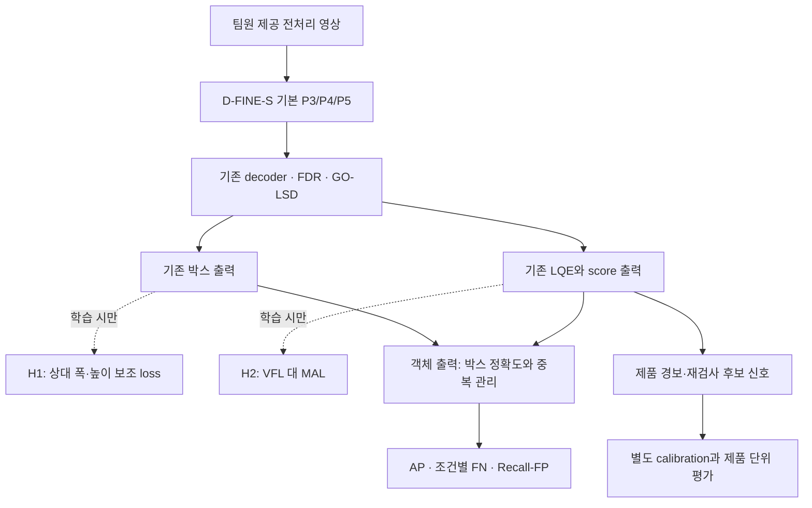

# KAMP X-ray 검출: 실험 근거에 따른 가설·아키텍처 재설계

작성·자료 확인: 2026-09-30 · 설계 개정 v3

기준: [대회 분석](<../../../대회_분석_보고서.md>), [데이터 분석](<../../../데이터_분석_보고서.md>), [P2와 후처리 실험 해석](<P2_결과_해석과_다음_설계_보고서.md>).

**추천:** YOLOv8s와 D-FINE-S를 기준 모델로 유지하고, 연구의 중심을 **작은 박스의 크기 회귀와 예측 순위의 신뢰성**으로 옮긴다. P2·주파수 강화·Gaussian 보조학습은 필수 모듈에서 조건부 후보로 내린다. 먼저 구조를 유지한 학습 변경으로 원인을 검증하고, 부족할 때만 head를 바꾼다.

이번 문서는 선행연구 재조사와 실험 계획이다. 새로운 학습, 새 head 구현, 새 성능 검증을 완료했다는 뜻이 아니다. 기존 결과와 앞으로 검증할 주장을 구분한다. 데이터 전처리·증강·재라벨링의 개발은 팀원 역할로 유지한다.

## 1. 기존 가설을 얼마나 수정해야 하는가

기존에는 작은 이물의 특징 소실 → 고해상도 P2 → 배경 억제 → 정밀 위치 보정이라는 흐름을 생각했다. 이제는 **특징 소실을 주 원인으로 먼저 가정하지 않고, 후보 생성·박스 회귀·순위·제품 판정의 어느 단계가 실패하는지 검증하는 흐름**으로 바꾼다.

P2가 일반적으로 무효라는 결론도 아직 이르다. 한 seed, 64장, 6개 촬영일의 결과이고, 검증 GT 142개 중 102개가 한 날짜에 몰려 있다. 입력도 임시 Telea 처리본이다. 새 가설 역시 확정된 원인이 아니라 현재 관측에 더 가까운 설명이다.

| 관측 사실 | 지금 가능한 해석 | 아직 말할 수 없는 것 |
|---|---|---|
| D-FINE P2의 AP50:95는 35.69→37.25 | 전체 검출 품질에 개선 가능성 | 가장 작은 이물이 좋아졌다는 주장 |
| 같은 운영점에서 <8px 검출은 11/17→8/17 | P2의 tiny 개선 근거가 부족 | 고해상도 특징이 불필요하다는 일반화 |
| YOLO P2는 허용 FP 6→8개에서 TP 92→134 | 소수 상위 FP와 점수 순위에 민감 | 42개 이물의 특징이 사라졌다는 설명 |
| GT 크기를 대입하는 진단의 이득이 GT 중심 대입보다 큼 | 대응된 후보에서는 크기 오차가 중요 | 실제 구현으로 oracle 이득을 모두 얻을 수 있다는 약속 |
| 네 모델 모두 0.95배 크기 보정에서 AP 개선 | 크기 편향 또는 경계 민감성 조사 가치 | 라벨 오류 확정, 새 데이터에도 0.95가 최적 |
| D-FINE P2의 상위 FP 6개 중 4개가 중복 | 낮은 FP 운영점에서 중복이 문제 | 모든 FP가 중복이라는 주장 |
| NMS로 객체 검출 수는 늘지만 AP75는 감소 | 중복 제거와 정확한 박스 선택은 별개 | NMS만으로 제품 안전성 개선 |

픽셀 크기는 원본 좌표에서 정의한다. 모델 내부 입력 좌표와 섞지 않는다. 원본보다 큰 640 입력으로 확대하는 것과 backbone 내부 downsampling은 다른 현상이다.

## 2. 새 연구 질문과 반증 기준

**중심 질문:** “작은 X-ray 이물의 후보가 존재할 때, 크기 오차와 점수–위치 품질의 불일치가 엄격한 검출 기준에서 실패를 만드는가? 이를 분리해 개선하면서 제품 미탐지를 악화시키지 않을 수 있는가?”

| 가설 | 근거 수준 | 필요한 진단 | 독립적인 변경 | 가설을 지지하지 않는 결과 |
|---|---|---|---|---|
| H1. 작은 박스의 상대 폭·높이 오차가 주요 병목이다 | 대응 후보 분석에서 지지 | 크기별 signed log-size 오차, 중심 오차, AP75 | 폭·높이의 상대 오차 보조 loss | 크기 오차는 줄어도 독립 그룹의 AP75·Recall이 개선되지 않음 |
| H2. 더 부정확한 박스가 높은 점수를 받는 현상이 낮은 FP Recall을 제한한다 | 상위 FP·NMS 실험에서 시사 | 같은 GT 주변 후보의 점수–IoU 순위 역전 | MAL 또는 품질 예측 입력 개선, 각각 별도 | 순위 개선 없이 confidence 숫자만 바뀜 |
| H3. 남는 중복은 위치 품질과 query 경쟁의 문제다 | 최종 출력에서 확인, 발생 원인은 미확인 | decoder 단계별 중복과 GT당 후보 수 | 원본/NMS 고정 대조, 이후 필요 시 matching 변경 | 중복 제거가 근접한 실제 두 이물까지 합침 |
| H4. 특징·후보 소실은 특정 조건에서만 병목일 수 있다 | 보류 | encoder→top-k→각 decoder→후처리 전후 후보 Recall | P2 또는 query 선택 변경 | 후보 Recall은 같고 회귀·순위에서만 차이 |
| H5. 불확실한 경계에 과도하게 맞추는 학습이 일반화를 해친다 | 아직 미확인 | 학습/검증 크기 오차 추이, 팀원 라벨 감사 결과 | robust loss, 필요 시 TOLF 계열 | 어려운 진짜 이물의 Recall이 감소 |

H1~H3을 우선한다. H4·H5를 배제하지 않지만, 근거 없이 복잡한 모듈을 먼저 붙이지 않는다. 고정 FP 운영점만으로 가설을 판단하지 않고 전체 곡선과 조건별 분모를 함께 본다.

## 3. 선행연구 재조사: 무엇을 가져오고 무엇을 보류할 것인가

2025~2026년 자료를 중심으로 14편을 다시 선정했다. 이 중 GFLv2·VarifocalNet·Rank-DETR는 현재 문제의 직접적인 배경 연구이고, 오래된 방법이라는 점을 명시한다. 인용수 순위는 조사·검증하지 않았다. 본회의, 학술지, preprint, 응용 심포지엄을 같은 등급으로 표시하지 않는다. 논문의 COCO·원격탐사 결과는 KAMP에서의 효과가 아니다.

### R1. D-FINE — ICLR 2025, 이미 가진 기능부터 확인

[논문](https://proceedings.iclr.cc/paper_files/paper/2025/hash/6cf58a87e3097e7d1f9be3e8693a93de-Abstract-Conference.html) · [저자 코드](https://github.com/Peterande/D-FINE)

**내용:** FDR로 박스 경계의 분포를 반복 정제하고, GO-LSD로 층 사이 위치 정보를 자기증류한다. 단순한 좌표 회귀기와 다르다.

**우리에게 주는 의미:** “분포 기반 위치 보정”은 새 기여가 아니라 기존 baseline 기능이다. 로컬 구현에는 분포 통계로 score logit을 조절하는 LQE와 IoU를 목표로 사용하는 VFL도 있다. 새로운 quality head를 단순히 추가하면 같은 역할이 겹칠 수 있다.

**실험 연결:** decoder 층별 폭·높이 오차, 경계 분포의 퍼짐, LQE 적용 전후 점수 순위부터 기록한다. 층이 깊어져도 크기 편향이 남는다면 기존 head의 감독을 수정할 이유가 생긴다. baseline의 제거 실험은 진단용이며 공정한 주 비교는 기존 기능을 켠 상태다.

### R2. UGS — ICCV 2025, 작은 박스의 학습 안정성

[논문·공식 초록](https://openaccess.thecvf.com/content/ICCV2025/html/Sun_Uncertainty-Aware_Gradient_Stabilization_for_Small_Object_Detection_ICCV_2025_paper.html) · [저자 연구 목록](https://huixinsun.github.io/)

**내용:** 작은 객체의 localization gradient 불안정을 분석하고, 비균일 이산 표현과 분류 방식의 위치 학습을 제안한다. uncertainty minimization과 불확실 영역 refinement도 포함한다.

**인사이트:** 작은 박스의 오차를 안정적으로 학습하는 문제가 고해상도 특징과 별개의 연구 축이다.

**우리의 선택:** D-FINE은 이미 비균일 분포 회귀를 하므로 UGS 전체를 그대로 겹치지 않는다. 크기별 regression gradient norm·loss 변동을 먼저 측정한다. 불안정이 없으면 UGS 도입의 근거가 약하다. 단순한 분포 entropy 감소는 자신 있는 오답도 만들 수 있어 채택하지 않는다.

이번에는 공식 초록·메타데이터를 확인했고 PDF 본문 재열람은 실패했다. 공식 구현 URL은 확인하지 못했다. 따라서 세부 수식의 이식이나 재현 가능성을 확정한 연구로 취급하지 않는다.

### R3. TOLF — 2026 공개본, Pattern Recognition 표기

[본문](https://arxiv.org/html/2601.00617v1) · [저자 게재 표기](https://huixinsun.github.io/)

**내용:** 작은 객체의 annotation noise 민감성을 분석하고, normalizing flow로 위치 오차 분포를 모델링하며 uncertainty에 따른 학습 강도를 조절한다. 공개 본문과 저자 페이지에 Pattern Recognition으로 표기되어 있다. 이번 조사에서는 출판사 권·호·DOI까지 대조하지 않았다.

**인사이트:** AP75가 낮다고 무조건 더 강한 정답 경계 추종을 요구하는 것이 답은 아닐 수 있다.

**우리의 선택:** 주·보조 TXT 충돌은 일부 확인했지만 현재 주 라벨 전체가 noisy하다는 증거는 없다. TOLF는 H5가 지지될 때의 후보다. 높은 불확실성을 곧 라벨 오류로 취급하면 저대비 진짜 이물도 학습에서 약해질 수 있다. 채택 시 robust loss만의 효과, flow의 추가 효과, tiny/2호기 Recall을 분리한다. 공식 코드 위치는 이번 조사에서 확인하지 못했다.

### R4. DEIM — CVPR 2025, 기존 VFL을 비교할 직접적인 후보

[공식 논문](https://openaccess.thecvf.com/content/CVPR2025/html/Huang_DEIM_DETR_with_Improved_Matching_for_Fast_Convergence_CVPR_2025_paper.html) · [본문](https://arxiv.org/html/2412.04234v3) · [저자 코드](https://github.com/Intellindust-AI-Lab/DEIM)

**내용:** Dense O2O로 감독을 늘리고 MAL로 서로 다른 matching 품질의 학습을 개선한다. Dense O2O는 증강으로 GT 수를 늘리면서 일대일 matching을 유지하는 방식이다. 일반적인 one-to-many와 동일하지 않다.

**인사이트:** 낮은 IoU인데 높은 confidence를 주는 후보의 학습 페널티를 살펴볼 가치가 있다. 논문은 D-FINE에도 적용한다.

**우선 실험:** 증강·matching·head는 그대로 두고 **VFL→MAL만** 바꾼다. 이는 DEIM 전체 재현이 아니라 구성요소 이식 실험이다. 박스 회귀 변경과 별도 실행한 뒤 2×2 교차한다. MAL이 단지 점수를 낮춰 Recall을 희생하는지도 곡선으로 확인한다. 원 논문 수식과 코드의 reduction·detach·auxiliary 적용 범위를 맞춘 후 학습한다.

### R5. PaQ-DETR — CVPR 2026, query 감독의 최신 비교 연구

[공식 논문](https://openaccess.thecvf.com/content/CVPR2026/html/Kang_PaQ-DETR_Learning_Pattern_and_Quality-Aware_Dynamic_Queries_for_Object_Detection_CVPR_2026_paper.html) · [본문](https://arxiv.org/html/2603.06917v1)

**내용:** 공유 latent pattern으로 영상별 query를 구성하고, 위치·분류의 일관성에 따른 quality-aware one-to-many assignment를 결합한다. 본문은 일반 검출 외 CSD·MSSD 결함 데이터도 평가한다.

**인사이트:** query 수보다 감독이 어떻게 배분되는지가 중요할 수 있다. 다만 결함 영상 결과를 X-ray 이물 효과로 확대하지 않는다.

**우리의 선택:** 주 세트는 영상당 1~3개 이물이라 query 활용률이 낮다는 사실만으로 문제라고 볼 수 없다. encoder 후보가 있는데 top-k/decoder에서 반복 탈락할 때 검토한다. query 생성과 assignment를 한꺼번에 바꾸지 않는다. one-to-many를 순진하게 추가하면 현재 중복 문제가 커질 수 있다. 공식 코드 URL은 이번 조사에서 확인하지 못했다. CVF 직접 재접속은 실패했으나 공식 색인 결과와 arXiv 본문을 대조했다.

### R6. DQSA-DETR — IEEE Access 2026, 최신성이 곧 적합성은 아님

[출판사 원문·초록](https://ieeexplore.ieee.org/abstract/document/11670322/) · [출판사가 연결한 코드](https://github.com/gfnanxi/DQSA-DETR)

**내용:** 원격탐사 tiny detection에서 밀도 기반 특징 강화·query 배분과 quality-aware classification을 함께 제안한다. 출판일은 2026-08-28, DOI는 10.1109/ACCESS.2026.3728183이다. IEEE Access이며 CVPR/ICCV 본회의로 분류하지 않는다.

**인사이트와 제한:** 작은 객체에서도 위치 품질과 confidence의 일관성이 현재 연구 주제임을 보여 준다. 그러나 우리의 1~3개 희소 객체에는 밀도 기반 query 확장이 우선 해법이 아니다. 이번에는 출판사 초록 수준을 확인했으므로 QCL 수식을 MAL과 같은 것으로 단정하지 않는다. 전체 구조 이식은 보류한다.

### R7. DEIMv2 — 2025 공개, 2026-01 개정 preprint

[논문](https://arxiv.org/abs/2509.20787) · [저자 코드](https://github.com/Intellindust-AI-Lab/DEIMv2)

**내용:** DINOv3 사전학습/증류 backbone, Spatial Tuning Adapter, decoder 및 Dense O2O 변경을 결합한다. 이번 확인에서 별도 본회의 게재를 확정하지 않았으므로 preprint로 표시한다.

**우리의 선택:** 향후 강한 외부 기준 모델로는 유용하다. 하지만 backbone·사전학습·학습법이 함께 바뀌므로 현재 위치 오류의 원인을 밝히는 첫 ablation에는 부적합하다. D-FINE을 교체해 얻은 성능을 새 회귀 모듈의 효과로 설명하면 안 된다. DINOv3 backbone과 DINO detector도 구분한다.

### R8. Rank-DETR — NeurIPS 2023, 현재 오류와 직접 연결되는 배경 연구

[논문](https://arxiv.org/abs/2310.08854) · [저자 코드](https://github.com/LeapLabTHU/Rank-DETR)

**내용:** DETR의 confidence 순위와 위치 정확도의 불일치를 다루며, rank-oriented 구조·loss·matching을 제안한다.

**인사이트:** 더 많은 후보 생성보다 이미 존재하는 정확한 후보를 위로 올리는 것이 중요할 수 있다. NMS 후 AP75가 내려간 우리 결과와 연결된다.

**실험 연결:** GT별 후보 중 최고 score 박스와 최고 IoU 박스의 차이를 측정한다. 새 quality 장치의 성공 기준은 동일 박스 집합에서의 순위 개선이다. 논문 전체를 이식하지 않고 ranking 가설과 진단을 가져온다. 2023 연구를 최신 논문으로 포장하지 않는다.

### R9. GFLv2 — CVPR 2021, LQE의 중복 설계를 피하기 위한 배경 연구

[논문](https://openaccess.thecvf.com/content/CVPR2021/papers/Li_Generalized_Focal_Loss_V2_Learning_Reliable_Localization_Quality_Estimation_for_CVPR_2021_paper.pdf)

**내용:** bbox 분포의 통계로 위치 품질을 추정하는 DGQP를 제안한다.

**우리의 인사이트:** 경계 분포가 넓은지 좁은지 보는 접근은 이미 오래 연구됐고, D-FINE의 LQE에도 관련 기능이 있다. 따라서 “분포로 confidence를 예측한다” 자체를 새 설계의 차별점으로 쓰지 않는다. 필요하다면 분포 통계만의 LQE와 query 특징·박스 기하를 추가한 LQE를 비교하고, 단순 MLP 용량 증가 대조군도 둔다.

### R10. Beyond Classification — WACV 2024, 검출 점수의 의미

[공식 논문](https://openaccess.thecvf.com/content/WACV2024/html/Popordanoska_Beyond_Classification_Definition_and_Density-Based_Estimation_of_Calibration_in_Object_WACV_2024_paper.html) · [arXiv](https://arxiv.org/abs/2312.06645)

**내용:** 객체 검출의 calibration을 정의하고 density-based 추정기를 제안한다.

**인사이트:** confidence의 수치가 맞는지와 박스 순서가 맞는지는 다르다. 단조 score 변환은 고정 박스의 순위와 Recall–FP 곡선을 개선하지 못한다. 위치 정확성을 포함한 검출 score를 제품 불량 확률로 바로 읽어서도 안 된다.

**실험 연결:** ranking 개선 후 별도의 calibration 단계로 다룬다. calibration error 감소를 미탐지 감소의 증거로 대신하지 않는다. 후보를 아예 만들지 못한 실패도 별도 집계한다.

### R11. Conformal Risk Control for Pulmonary Nodule Detection — COPA 2025

[논문](https://proceedings.mlr.press/v266/hulsman25a.html)

**내용:** 폐 결절 검출에서 민감도와 FP의 교환관계를 conformal risk control로 다룬 사례다. COPA/PMLR 논문이며 detector 아키텍처의 탑티어 본회의 논문으로 분류하지 않는다.

**인사이트:** 목표 위험과 검사 부담을 명시한 뒤 임계값을 정하는 순서가 대회 요구와 맞는다.

**우리의 적용 범위:** 현재 정상 영상·독립 calibration 표본이 없어서 안전 보장을 주장할 수 없다. 향후 고정된 모델·정책과 독립적인 촬영 그룹을 확보하고, 교환가능성 및 선택한 loss의 조건을 검토한 뒤 적용한다. 날짜가 묶인 64장을 독립 64개 생산 사례로 가정하지 않는다. 조건별 안전 보장은 전체 평균 보장과 별개의 문제다.

### R12. VarifocalNet — CVPR 2021, 단순 점수 곱셈과 구분

[논문](https://openaccess.thecvf.com/content/CVPR2021/papers/Zhang_VarifocalNet_An_IoU-Aware_Dense_Object_Detector_CVPR_2021_paper.pdf) · [저자 코드](https://github.com/hyz-xmaster/VarifocalNet)

**내용:** 물체 존재와 위치 품질을 합친 IoU-Aware Classification Score를 VFL로 학습하며, star-shaped feature와 bbox refinement를 사용한다. 단순히 두 불완전한 점수를 곱하는 방식의 한계도 논의한다.

**우리의 판단:** 이 논문을 근거로 `현재 D-FINE score × 새 IoU score`가 필연적으로 좋아진다고 설명하면 부정확하다. 현재 D-FINE이 이미 VFL을 쓰는지도 실제 설정에서 확인했다. 우리의 새 질문은 quality 기능의 부재가 아니라, 기존 quality 학습의 어떤 부분이 작은 박스에 충분하지 않은가이다. 따라서 MAL 단독 비교와 기존 LQE 진단을 새 head보다 먼저 둔다.

### R13. EASE-DETR — CVPR 2024, 중복 후보의 경쟁

[공식 논문](https://openaccess.thecvf.com/content/CVPR2024/html/Gao_EASE-DETR_Easing_the_Competition_among_Object_Queries_CVPR_2024_paper.html)

**내용:** decoder 중간 층에서 query 간 leading/trailing 관계를 구하고, 다음 self-/cross-attention에서 leading query의 우세를 강화한다.

**인사이트:** 중복 억제를 단순한 최종 NMS가 아닌 query 사이 상호작용 문제로 볼 수 있다.

**우리의 제한:** 지금 가장 높은 점수가 가장 정확한 박스를 뜻하지 않을 수 있다. 잘못된 leader를 더 강하게 만들면 AP75가 악화될 수 있으므로, EASE의 아이디어를 “GT IoU가 가장 높은 query를 추론 때 선택한다”로 바꾸어 설명하지 않는다. decoder별 leader 정확도·중복 잔존을 먼저 측정하고, 실제 ranking이 나아진 뒤에도 경쟁 문제가 남을 때 고려한다. 공식 코드 위치는 이번 조사에서 확인하지 못했다.

### R14. MDS-DETR — 2026-05 preprint, 중복 억제의 추가 후보

[논문·본문](https://arxiv.org/html/2605.23507v1) · [저자 코드](https://github.com/DChoLee/MDS-DETR)

**내용:** 하나의 decoder에서 one-to-many와 one-to-one 감독을 활용하며, confidence에 따른 causal masking으로 self-attention에 비대칭성을 주는 Masked Duplicate Suppressor를 제안한다. 이번 확인에서 정식 게재를 확정하지 않았으므로 preprint로 분류한다.

**우리의 선택:** 중복을 직접 다루는 최신 후보라는 점에서는 적합하다. 그러나 현재 D-FINE의 감독 구조와 다르므로 mask만 붙인 것을 논문 재현이라 할 수 없다. 먼저 중복의 층별 발생 경로를 확인하고, NMS 대비 근접한 실제 두 이물의 보존·AP75·지연시간을 함께 비교한다. confidence 순위가 틀릴 때의 오류 전파도 확인한다. 전체 구조 교체는 G/M 이후의 조건부 실험이다.

### 공유된 설계 제안과 대조하여 바로잡은 사항

| 제안에서 가져올 점 | 추가로 구분해야 할 점 |
|---|---|
| localization과 ranking으로 중심을 이동 | 최종 출력에서 근처 예측이 있다는 사실만으로 내부 feature 소실을 반증한 것은 아님 |
| 작은 크기 변화가 AP를 바꾼다는 관측 | 평가 민감성의 증거이지 학습 gradient 불안정의 직접 증거는 아님 |
| quality predictor가 유용할 수 있음 | D-FINE에는 LQE와 VFL이 이미 있으며, 최종 score는 순수 objectness가 아님 |
| 높은 score의 낮은 IoU를 줄여야 함 | 해당 박스보다 정확한 다른 후보가 있어야 재순위만으로 그 GT의 위치를 개선할 수 있음 |
| 중복 query를 억제해야 함 | 같은 GT와 IoU 0.9인 박스 두 개는 둘 다 높은 quality를 받음. IoU 예측만으로 중복 문제가 해결되지 않음 |
| 불확실한 박스의 점수를 낮춤 | 객체 AP 개선과 불량 제품 통과 감소가 같은 목표는 아님. 안전 경보 후보까지 지우지 않도록 별도 검증 |

YOLOv8 구현에도 DFL과 task-aligned assignment가 있다. 두 baseline 모두 기존 위치·품질 학습 기능을 가진 모델이다. 이 기능을 처음 도입한 것처럼 설명하지 않는다. 또한 현재 IoU 0.499942 사례 같은 경계 오류와 완전한 배경 오류를 구분하되, 평가 기준을 바꿔 성능 향상으로 보고하지 않는다.

## 4. 제안 아키텍처: 우선은 backbone을 유지한다

### 4.1 첫 후보는 구조 유지 + 두 학습 변경의 독립 비교

YOLOv8s는 동일 데이터·평가기의 독립 기준 모델로 유지한다. D-FINE-S에서 원인을 분해한 뒤 유효한 공통 아이디어만 YOLO에도 검증한다. 서로 다른 detector의 recipe를 억지로 동일하게 만들기보다, 각 계열 내 ablation 조건을 고정하고 계열 간 차이는 명시한다.

**G: 상대 크기 감독 — 우리의 최소 실험 제안, 특정 논문의 재현 아님.** 기존 Hungarian matching과 모든 원래 loss를 유지하고, 마지막 정상 decoder 출력의 matched positive에만 아래 항목을 추가한다. denoising·auxiliary 층 전체에 처음부터 전파하지 않는다.

`L_size = mean[Huber(log((w_pred+ε)/(w_gt+ε))) + Huber(log((h_pred+ε)/(h_gt+ε)))]`

`L_total = L_original + λ_size × L_size`

정규화 좌표에서 ε를 고정하고, 양성 수로 정규화한다. Huber transition과 λ는 train 내부 개발 절차에서 고정한다. 초기 후보 λ는 0.1/0.3의 작은 범위로 제한하되 실제 gradient 크기도 기록한다. 이는 폭·높이를 무조건 줄이라는 제약이 아니다. 작게 예측한 박스에는 커지는 방향의 감독을 준다. GT는 학습 loss에만 사용한다.

대조군은 원래 bbox loss 가중치만 증가시킨 구성이다. 새 loss가 단순히 regression 학습을 강하게 한 효과를 넘는지 확인한다. 기존 GIoU도 크기 오차를 다루므로 “기존 모델에 크기 감독이 없었다”라고 설명하지 않는다.

**M: matching 품질 감독 — DEIM의 MAL 단독 이식.** 기존 LQE와 matching을 유지하고 VFL만 바꾼다. 공식 구현의 수식·정규화를 확인해 적용하며, 증강을 바꾸지 않는다. G와 M은 단독으로 먼저 비교한다. 목표는 낮은 품질의 높은 점수 예측을 줄이는 것이며, 효과는 아직 미검증이다.

### 4.2 실제 head 변경이 필요한 경우

G/M만으로 충분하면 새 head를 만들지 않는다. 구조 변경은 다음 두 진단을 통과할 때만 선택한다.

| 조건 | 구조 후보 | 기존 구성과 다른 점 | 반드시 필요한 대조 |
|---|---|---|---|
| 상대 크기 오차가 조건별로 남고 G가 부족함 | 마지막 query 특징→작은 2출력 MLP로 log-width/log-height residual 예측 | 마지막 FDR 박스의 중심은 유지하고 크기만 제한적으로 보정 | 고정 0.95배, train-only에서 맞춘 상수 보정, G-only |
| 경계 분포가 뾰족한데 박스가 틀리는 사례에서 순위 역전이 남음 | 기존 LQE 입력에 query 특징·예측 기하를 추가하는 경량 residual branch | 기존 분포 통계에 영상 문맥을 보탬 | 기존 LQE, 통계 입력만으로 MLP 용량을 늘린 모델 |

첫 head는 `w'=w×exp(δw), h'=h×exp(δh)`로 정의하고 마지막 layer를 0 초기화해 처음에는 원 모델과 같다. residual 범위는 ±log(1.1) 같은 사전 고정 범위를 후보로 삼는다. 이는 우리의 제한적 보정 제안이며 UGS/TOLF 구현으로 부르지 않는다. 장비 번호·GT 크기·색상 마스크를 head 입력에 넣지 않는다. 초기에는 기존 detector를 고정해 보정 능력만 조사하고, end-to-end 학습은 별도 비교한다. 추가 head가 기존 분포와 독립적으로 박스를 바꾸면 기존 LQE의 품질 추정과 어긋날 수 있으므로 score–IoU 관계를 다시 평가해야 한다.

두 번째 head는 기존 LQE에 새로운 score를 무조건 곱하지 않는다. 이미 quality가 반영된 점수에 quality를 두 번 반영하는 문제를 피하도록 residual logit 경로로 설계하고 0 초기화한다. 박스를 고정한 ranking 진단과 전체 학습 효과를 구분한다. 새로운 품질 score는 불량 확률이 아니며 안전 판정을 직접 대체하지 않는다.

분포 bin 수 증가도 첫 선택이 아니다. D-FINE의 기대값 출력은 연속값이므로 “bin 하나보다 작은 위치는 표현할 수 없다”는 설명은 틀리다. bin·reg_scale 변경은 표현 범위, 사전학습 head 호환성, 학습 안정성을 함께 바꾸는 별도 실험이다.

## 5. 실행 계획: 측정 → 작은 변경 → 상호작용 → 독립 검증

### 단계 A. 학습을 늘리기 전에 계측할 항목

1. D-FINE의 encoder 후보, top-k 선택 후, decoder 각 층, 최종 출력, NMS 후의 GT 대응률을 저장한다. IoU 0.3은 넓은 위치 대응 진단, 0.5/0.75는 별도 위치 기준으로 보고한다. top-k 수와 confidence 하한을 명시한다.
2. 같은 GT 주변 후보의 `max IoU − IoU(highest-score box)`와 순위 역전율을 측정한다. GT는 사후 분석에만 쓰며, oracle score로 얻은 이득을 실제 성능으로 보고하지 않는다.
3. 중심 오차와 signed/absolute log 폭·높이 오차를 원본 좌표에서 분리한다. 크기·장비·촬영일별 분모를 표시한다. 현재 맞춘 후보만의 오차 통계와 미대응 개수를 같이 기록한다.
4. LQE 전후 score, 경계 분포 entropy·variance와 실제 IoU의 관계를 본다. 분포는 실제 bin 좌표에서 해석한다. uncertainty 값 자체를 정확한 오류 확률로 간주하지 않는다.
5. 동일 GT의 P2 gain/loss와 decoder 단계별 변화를 연결한다. 후보는 늘고 최종 순위에서 사라지는지, 후보부터 없는지 구분한다.

이 단계의 결과에 따라 H1/H2를 채택하거나 H4의 우선순위를 올린다. 현재 최종 예측 분석만으로 “중간 특징 소실이 없다”고 결론내리지 않는다.

### 단계 B. 반복성 확인과 최소 학습 비교

기존 seed 20260929에 20260930·20261001을 추가하여 기본형/P2 네 구성의 반복성을 확인한다. 날짜처럼 보이는 값은 난수 seed이며 실행 일정이 아니다. 동일 계열에서는 split·전처리·입력 640·batch·30 epoch·초기 가중치·augmentation·checkpoint 선택 규칙을 고정한다. 비교 모듈 간에는 같은 seed를 짝지어 사용한다.

| ID | 기반 | 변경 | 목적 |
|---|---|---|---|
| B0 | D-FINE-S | 없음 | 원 기준 |
| C0 | D-FINE-S | bbox loss 가중치만 증가 | 감독 강도 대조 |
| G | D-FINE-S | 상대 크기 loss | H1 |
| M | D-FINE-S | VFL→MAL | H2 |
| GM | D-FINE-S | G+M | 두 변경의 상호작용 |
| Y0 | YOLOv8s | 없음 | 실용 기준 |
| P | 두 계열 기본형 | 기존 P2 | H4의 반복성, 이전 결과와 연결 |

G/M은 기존 데이터의 exploratory 비교로 시작하되, 한 seed의 최고점만으로 승자를 확정하지 않는다. 모든 후보를 무한 탐색하지 않고, 단독 변경이 실패하면 조합을 무조건 추진하지 않는다. GM은 `GM−G−M+B0`도 보고하여 독립 효과인지 상호작용인지 설명한다. 학습 방식이 달라진 C0/G/M/GM을 모두 “아키텍처 변경”이라고 부르지 않는다.

### 단계 C. 남은 원인에만 구조를 추가

G가 도움이 되지만 조건별 편향이 남으면 크기 residual head를, M 이후에도 ranking 오류가 남으면 확장 LQE를 검토한다. 둘을 한 번에 붙이지 않는다. P2도 유효 후보와 on/off 교차 비교해 다른 개선으로 이미 대체된 효과인지 확인한다. matching 문제의 직접 증거가 있을 때만 PaQ 계열로, decoder 내부 중복 경쟁이 남을 때만 EASE/MDS 계열로 넘어간다.

### 단계 D. 후처리·데이터·모델 효과를 분리

모든 후보에 원본 출력과 동일한 후처리 비교를 적용한다. 한 모델만 validation 최적 NMS·크기 배율을 적용한 점수로 구조 우수성을 주장하지 않는다. NMS 0.7·크기 0.95는 기존 exploratory 기준점으로 보존하되, 선택 편향을 명시한다. 추가 튜닝은 train 내부 분할에서 수행한다.

팀원 처리본은 원본 ID의 split을 유지한다. 같은 500장의 다른 처리본은 독립 새 데이터가 아니다. 기본형과 선정 후보를 같은 새 처리본에서 다시 비교하여 전처리 효과와 모델 효과를 분리한다. 새 라벨·새 촬영 영상이 포함되면 버전·그룹 대응을 기록한다.

## 6. 성공 기준과 검증 설계

**객체 품질:** 공통 COCO AP50:95·AP75·AP50, 전체 Recall–FP 곡선, FP/영상 0.05/0.1/0.2/0.5 운영점, 중심 및 상대 크기 오차, 중복 수, <8/8–12/12–16px 구간의 TP/FN을 함께 보고한다. 구간은 원본 짧은 변 기준이며 분모가 작은 구간에서는 사례 수가 우선이다.

**채택 기준:** 같은 seed끼리 차이를 제시하고 평균·범위를 함께 본다. 평균 AP만 올라가면서 tiny 또는 2호기에서 반복적으로 Recall이 악화되면 자동 채택하지 않는다. 회귀 변경은 크기 오차·AP75의 개선, ranking 변경은 같은 후보의 순위와 낮은 FP 구간 개선이라는 자기 목적을 보여야 한다. 임계값 한 점만 개선된 경우 안정적인 효과로 해석하지 않는다.

현재 validation은 이미 여러 번 확인했으므로 탐색용으로 취급한다. 추가 seed는 학습 변동을 보여 줄 뿐 새로운 데이터 독립성이나 검증셋 선택 편향을 해결하지 않는다. 촬영일 단위 재표집도 모델 선택 과정을 반영한 일반화 보장이 아니다.

선정 후보만 train 358장의 촬영 그룹을 이용한 내부 group-fold 비교로 확인하고, 외부 val 64장은 기존 개발 결과로 명시한다. 최종 정책의 calibration에는 학습·모델 선택에 쓰지 않은 별도 그룹이 필요하다. 현재 train에서 calibration 그룹을 새로 떼면, 그 그룹을 학습한 기존 checkpoint는 최종 calibration에 사용할 수 없으므로 제외 후 재학습한다. 실제 운영 임계값을 만들려면 정상 제품도 필요하다. **test 78장은 설계·정책을 고정한 뒤 최종 평가에만 사용한다.**

지연시간은 동일 GPU·batch 1·동일 정밀도·워밍업 후 반복 측정하고 후처리 포함 여부를 명시한다. 최고 AP와 최고 속도를 서로 다른 설정에서 골라 하나의 모델 결과처럼 합치지 않는다.

## 7. 조건별 미탐지·안전 임계값·재검사를 어떻게 연결하는가

### 7.1 제품을 놓치는 것과 박스를 틀리는 것은 다르다

기존 YOLO 기본은 해당 운영점에서 불량 영상 64장 모두에 경보를 냈지만, 모든 이물을 IoU 기준으로 찾은 영상은 57장이었다. 위치 정확도 개선은 중요하지만 이 결과만으로 불량 제품 유출을 추가로 줄였다고 주장할 수 없다.

객체 표시는 위치 품질을 반영한 score로 정리하고, 제품 경보는 별도의 검증된 정책으로 다룬다. 품질 score가 낮다는 이유만으로 이물 후보를 안전 판정에서 제거하지 않는다. D-FINE의 LQE 이전 score 역시 순수한 이물 존재 확률이라고 보장되지 않으므로 필요 시 비교할 대리값일 뿐이다. 별도 존재 분류 head도 정상 표본 없이 안전 확률을 학습했다고 주장하지 않는다.

### 7.2 후보 정책과 현재 가능한 평가

| 판단 | 추론 시 가능한 신호 | 검증할 내용 |
|---|---|---|
| 이물 의심 경보 | 검출 score, 영상별 최고 score | 양성 영상 경보율; 정상 오경보율은 정상 데이터 필요 |
| 위치 불확실 재검사 | 박스 분포, decoder 간 크기 변화, 두 detector의 위치·검출 불일치 | 같은 재검사 예산에서 위치/객체 누락 포착률 |
| 조건 이상 재검사 | 영상 품질·지원 촬영 조건 이탈 | 새로운 장비·날짜에서 오류 집중 여부 |
| 자동 통과 | 독립적으로 검증한 제품 정책 | 불량 통과율과 정상 보류율을 함께 확인 |

재검사 점수 후보는 train 내부 out-of-fold 예측으로 개발하고 고정한다. 낮은 confidence만 사용하는 기준, 모델 불일치 기준, 무작위 선택을 같은 5/10/20% 예산에서 비교한다. 현재 양성셋에서는 “알려진 실패 중 몇 개를 재검사 대상으로 골랐는가”만 분석할 수 있다. 선택된 제품의 오류가 실제로 고쳐졌다는 뜻은 아니다. 실제 재검사자·추가 촬영·두 번째 검사 모델의 결과를 확보해야 최종 불량 통과 감소를 평가할 수 있다.

모델 둘이 모두 놓치면 불일치가 작을 수 있고, 후보가 없으면 bbox uncertainty도 없다. 아무 후보가 없는 제품을 자동 안전으로 간주하지 않는다. GT 크기·GT 대비는 사후 조건 분석에만 사용하고 운영 정책 입력으로 쓰지 않는다. 재질·이물 종류는 현재 단일 클래스 TXT에서 알 수 없어 밝기만으로 이름 붙이지 않는다.

조건 분석은 장비·촬영일·크기·대비·마스크 접촉을 사용하되, 예를 들어 2호기의 낮은 Recall이 장비 자체 때문인지 크기·대비 분포 때문인지는 분리한다. 충분한 공통 구간 안의 비교와 원래 분포의 결과를 함께 제시한다. 희소 교차 구간에 복잡한 통계 모델을 맞춰 인과관계를 주장하지 않는다.

## 8. 발표에서 사용할 수 있는 설명

현재 사실로 말할 수 있는 이야기:

> 작은 X-ray 이물이 많아 고해상도 특징을 추가하는 가설부터 검증했다. 그러나 P2의 효과는 모델과 크기 구간에 따라 달랐고, 가장 작은 이물의 개선으로 일관되지 않았다. 예측을 추적하니 이물 근처의 후보가 있어도 작은 박스의 경계 오차와 높은 점수의 중복 때문에 엄격한 기준에서 실패하는 사례가 나타났다. 이에 특징 강화 중심 설계에서 크기 회귀와 예측 순위를 분리 검증하는 설계로 수정했다. 위치 출력의 개선과 제품 안전 판정을 구분하여 남는 실패 조건을 재검사 정책의 검증 대상으로 삼는다.

후속 실험이 성공했을 때만 추가할 내용:

> 동일한 backbone과 데이터 조건에서 상대 크기 감독과 matching 품질 감독의 효과를 각각 검증했다. 단순 loss 가중치·고정 박스 보정·NMS와 비교해 어떤 개선이 필요한지 확인했고, 여러 seed와 촬영 그룹에서 반복되는 효과만 남겼다. 재검사 정책은 detector 점수와 별도로 평가했다.

**실패했을 때도 유효한 결론:** G/M이 단순 보정을 넘지 못하면 복잡한 구조를 채택하지 않는다. P2가 새 처리본에서만 효과적이면 입력 처리와 구조의 상호작용으로 설명한다. 크기·ranking 개선에도 후보 누락이 남으면 그때 고해상도·query 연구로 돌아간다. 결과에 맞춰 가설을 수정한 과정 자체가 프로젝트의 설명 근거다.

## 9. 출처와 재현 상태

논문 링크는 각 절에 있다. 공식 원문·저자 공개본·저자 코드·출판사 메타데이터를 우선했으며, 검색된 비공식 요약과 인용수 순위는 기술 근거로 사용하지 않았다. PDF 일부는 접근 실패가 있어 읽은 범위를 각 절에 명시했다. 열람 범위 밖의 구현을 재현 완료한 것으로 표시하지 않는다.

로컬 코드 점검:

- [D-FINE LQE와 decoder](<../../../models/D-FINE/src/zoo/dfine/dfine_decoder.py>): `LQE.forward`의 top-k 분포 통계→logit 보정 확인.
- [D-FINE criterion](<../../../models/D-FINE/src/zoo/dfine/dfine_criterion.py>): IoU target VFL, bbox L1/GIoU, FGL/DDF 확인.
- [기존 결과 근거](<../../../experiments/kamp_pilot_v1/failure_analysis/analysis_manifest.json>): validation 64장·142 GT, test 미사용, 새 학습 없음.
- [이전 설계 보관본](<../../../analysis/detector_research/archive/선행연구_v2_20260929.md>): 실험 이전 문서이며 현 설계는 이 v3 문서를 우선한다.

이번 개정으로 학습 코드·전처리·라벨·checkpoint·후처리 기본값을 변경하지 않았다. 다음 실행 대상은 **단계 A의 후보·분포·순위 계측과 단계 B의 통제 실험**이다.
