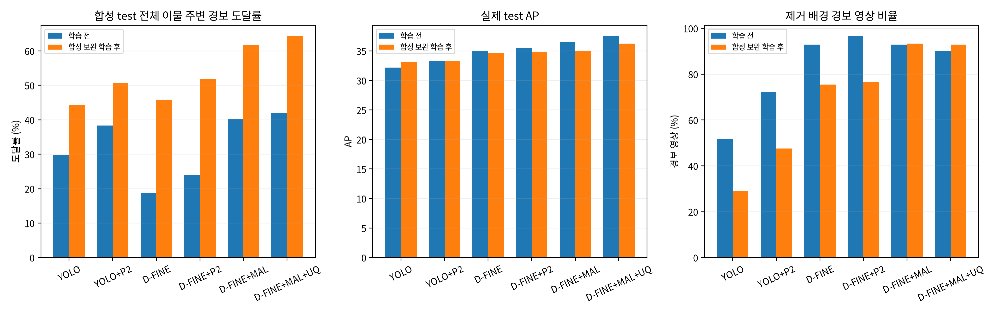
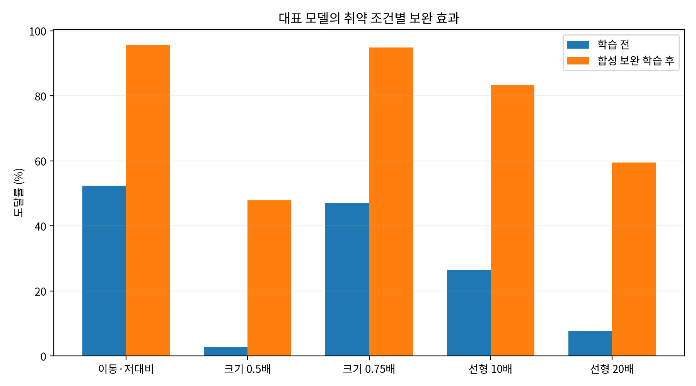

# 합성 데이터 학습·평가 분석 보고서

> 진행 상태(2026-10-07 10:34 KST): 실제 train 350장과 합성 val 파생 120장(취약 조건 96장, 제거 배경 hard-negative 24장)을 섞은 25.5% 합성 혼합셋으로 추가 학습을 완료했다. 합성 test 파생 영상은 학습에서 제외했다. YOLOv8s, YOLOv8s+P2, D-FINE-S, D-FINE-S+P2, D-FINE-S+MAL, D-FINE-S+MAL+UQ의 6개 구성에 3개 난수 초기값을 적용한 총 18회가 정상 종료됐고, 합성 조건과 실제 데이터의 학습 전후 평가까지 마쳤다. 이 문서는 고정 가중치의 스트레스 테스트 결과와 보완 학습 결과를 함께 기록한다.

## 쉬운 요약

이번 합성 자료는 두 가지 역할로 사용했다. 먼저 기존 실데이터 모델이 낯선 크기·형상·재질·대비 조건에서 얼마나 약해지는지 확인하는 **스트레스 테스트**로 썼다. 이어 실제 train 350장에 합성 val 파생 120장을 더한 보완 학습을 18회 수행해, 취약 조건을 학습으로 보완할 수 있는지도 확인했다.

보완 학습은 합성 조건에서는 효과가 뚜렷했다. 대표 구성인 D-FINE-S+MAL+UQ의 합성 시험 경보 도달률은 42.01%에서 64.19%로 22.18%p 상승했다. 특히 이동·저대비 조건은 52.31%에서 95.63%, 시편 크기 0.5배 조건은 2.78%에서 47.82%, 긴 선(20배) 조건은 7.74%에서 59.52%로 올라갔다.

반면 같은 보완 학습 후 실제 시험셋 AP는 대표 구성에서 37.46에서 36.27로 낮아졌고, 이물을 지운 합성 배경의 경보 비율도 90.08%에서 92.86%로 증가했다. 따라서 **기존 D-FINE-S+MAL+UQ 가중치를 실제 데이터 기준 최종 모델로 유지**하고, 합성 보완 학습은 취약 조건 완화 가능성과 학습 분포 균형의 중요성을 보여주는 보조 결과로 사용한다.

대표 모델은 원래 이물이 있던 자리에 넣은 합성 이물 206개를 모두 찾았다. 하지만 같은 농도의 이물을 다른 자리로 옮기면 1,008개 중 933개(92.56%), 농도를 절반으로 낮추면 1,008개 중 589개(58.43%)만 찾았다. 시편 크기의 절반인 이물은 504개 중 9개(1.79%), 길고 가는 선 모양 이물은 504개 중 58개(11.51%)에 그쳤다. **잘 찾는 조건과 크게 놓치는 조건이 분명하게 갈린다.**

판정을 느슨하게 하면 일부 놓친 이물이 다시 경보로 잡히지만, 이물과 연결되지 않는 경보도 크게 늘어난다. 이물을 지운 합성 배경 84장에서도 78장에 경보가 나왔다. 따라서 이 결과로 공장의 정상 제품 오경보율이나 안전한 자동 통과를 증명할 수 없다. 영상 자체에서 배경과 구별되는 신호가 없는 합성 양성 사례도 있다.

이 보고서는 실패 조건, 임계값 전이, 향후 합성 학습 설계를 설명하는 추가 근거로 활용할 수 있다. 제출용 본문은 이 결과를 반영하기 전 별도로 검토한다.

작성·검토 시각: **2026-10-07T03:07:22+09:00 (한국시간)**. 사용자 지정 별도 보고서 예외에 따라 이 파일만 작성한다. 대회 기준 문서와 데이터 기준 문서, 통합 보고서 §16.24–16.25를 참고했다. 공식 기한이나 규정을 새로 판단하는 작업이 아니므로 외부 규정 갱신은 하지 않았다.

숫자는 따로 명시하지 않는 한 합성 `test` 배경 파생 세트의 결과다. 대표 모델은 기존 **D-FINE-S + MAL + UQ, seed20260930**이다. 난수 초기값(seed)은 학습 초기화의 구분이다. P2는 고해상도 특징 단계 추가, MAL은 기존 프로젝트에서 구현한 Matchability-Aware Loss(매칭 가능성을 반영한 손실), UQ는 이 프로젝트의 Unary Quality(후보별 품질 예측) 구성이다. 선행연구의 전체 구현이나 일반적인 UQ 확률 보정과 동일하다고 가정하지 않는다. M1/M2/M3는 각각 **1호기/2호기/3호기 촬영 장비 코드**다.

## 1. 조사 범위와 실행 상태

프로젝트의 실험·스크립트·최종 패키지 내 Python, YAML, 셸 파일에서 합성 관련 참조를 검색하고, 합성 데이터 디렉터리와 실험 디렉터리를 확인했다. 실제 관련 자료는 `data/synthetic/`, `experiments/kamp_synth_v1_audit/`, `experiments/kamp_synth_v1_eval/`, `experiments/synthetic_scheduled_analysis/`다. 과거 `kamp_ablation_v3/audit_analysis.py`의 synthetic 표현은 음수 박스 폭의 수치 오류를 재현한 인위적 단위 입력이며, 합성 X-ray 학습 실험이 아니다.

`ps`에서는 도구의 격리 환경 프로세스만 보였고, `systemctl is-active kamp-synth-v1-eval.service`는 버스 연결 권한 제한으로 실패했다. `nvidia-smi`도 드라이버 통신에 실패했다. **호스트 전체에서 실행 중인 작업이 없다고 단정할 수는 없다.** 다만 아래 완료 기록·로그·산출물은 일치한다.

| 작업 | 확인 상태·진행률 | 남은 시간 | 다음 확인 |
| --- | --- | --- | --- |
| 합성 데이터 다운로드·형식 감사 | 12,750장·37,600개 검사 완료 | 0 | 재검사 일정 불필요; 생성 근거 인계 시 확인 |
| 본 평가: 6구성 × 3seed | 18/18 추론·분석 완료(100%) | 0 | 새 파일/실패 신고 시 재확인 |
| 전체 교차 분석 | 완료, 반환코드 0 | 0 | 제출에 인용하기 전 이 보고서의 한계와 함께 검토 |
| 속도 benchmark·parity·QA | 기록상 완료; 보조 검사 | 0 | 본 평가 결과와 혼합하지 않음 |
| 합성 보완 학습 | 6구성×3seed, 총 18/18 완료 | 0 | §10 학습 전후 비교 |
| 호스트 실행 상태 | 직접 확인 불가 | 산정 불가 | 호스트 접근 가능한 다음 확인 시 서비스·GPU·로그 대조 |
| 03:00 예약 보고서 작업 | run_20261007_030056.log: 현재 분석 보고서 작성 작업 | 학습 ETA 해당 없음 | 이 보고서 저장 후 예약 작업 종료 기록 확인 |

본 평가 시작은 2026-10-06 22:10:20.893741, 종료는 **22:57:35.126422**, 총 2,834.23초(47.24분)다. 2 worker가 추론·CPU 분석을 실행했고, 총 229,500회 영상 추론을 완료했다. 본 평가의 실행 중 실험은 기록상 남아 있지 않으므로 학습 잔여 시간을 추정하지 않는다. 상태 JSON의 마지막 경과시간은 종료 파일보다 앞선 기록일 수 있으므로 종료 시각은 completion 파일을 우선한다.

근거: [experiments/kamp_synth_v1_eval/protocol.json](../experiments/kamp_synth_v1_eval/protocol.json), [experiments/kamp_synth_v1_eval/queue.log](../experiments/kamp_synth_v1_eval/queue.log), [experiments/kamp_synth_v1_eval/queue_status.json](../experiments/kamp_synth_v1_eval/queue_status.json), [experiments/kamp_synth_v1_eval/completion.json](../experiments/kamp_synth_v1_eval/completion.json), [experiments/kamp_synth_v1_eval/summary/complete.json](../experiments/kamp_synth_v1_eval/summary/complete.json), [scripts/run_synthetic_analysis.sh](../scripts/run_synthetic_analysis.sh).

### 표 1. 전체 가중치와 완료 산출물

방법: protocol의 체크포인트와 실제 파일 SHA256을 18개 모두 대조했고 전부 일치했다. 각 run의 추론·분석 완료 JSON과 NPZ 목록을 대조했다. 각 run에는 단일 영상 단위 NPZ 12,750개가 있으며, 분석 CSV를 직접 읽어 영상 12,750행과 객체 37,600행을 18run 모두 확인했다. 모든 NPZ를 새로 디코딩하여 재추론한 검사는 아니다. 시간은 해당 추론 실행의 기록 시간(초)이며 현장 처리 속도 보장은 아니다.

| 구성 | seed | 기존 실제 val 임계값 | 추론 시간(초) | 영상/객체 | 체크포인트 |
| --- | --- | --- | --- | --- | --- |
| D-FINE-S + MAL + UQ | 20260930 | 0.193372294 | 304.98 | 12,750/37,600 | [experiments/kamp_v2_uq/runs_frozen/dfine_mal_UQ_seed20260930/last.pth](../experiments/kamp_v2_uq/runs_frozen/dfine_mal_UQ_seed20260930/last.pth) |
| D-FINE-S + MAL | 20260930 | 0.283834547 | 295.52 | 12,750/37,600 | [experiments/kamp_v2_mal/runs/dfine_M_seed20260930/best_stg1.pth](../experiments/kamp_v2_mal/runs/dfine_M_seed20260930/best_stg1.pth) |
| D-FINE-S | 20260930 | 0.411646813 | 307.98 | 12,750/37,600 | [experiments/kamp_v2_baselines/runs/dfine_s_seed20260930/best_stg1.pth](../experiments/kamp_v2_baselines/runs/dfine_s_seed20260930/best_stg1.pth) |
| YOLOv8s | 20260930 | 0.802003384 | 129.83 | 12,750/37,600 | [experiments/kamp_v2_baselines/runs/yolov8s_seed20260930/weights/best.pt](../experiments/kamp_v2_baselines/runs/yolov8s_seed20260930/weights/best.pt) |
| D-FINE-S + P2 | 20260930 | 0.361672312 | 300.64 | 12,750/37,600 | [experiments/kamp_v2_baselines/runs/dfine_s_p2_seed20260930/best_stg1.pth](../experiments/kamp_v2_baselines/runs/dfine_s_p2_seed20260930/best_stg1.pth) |
| YOLOv8s + P2 | 20260930 | 0.477029294 | 151.54 | 12,750/37,600 | [experiments/kamp_v2_baselines/runs/yolov8s_p2_seed20260930/weights/best.pt](../experiments/kamp_v2_baselines/runs/yolov8s_p2_seed20260930/weights/best.pt) |
| D-FINE-S + MAL + UQ | 20260929 | 0.156397939 | 303.75 | 12,750/37,600 | [experiments/kamp_v2_uq/runs_frozen/dfine_mal_UQ_seed20260929/last.pth](../experiments/kamp_v2_uq/runs_frozen/dfine_mal_UQ_seed20260929/last.pth) |
| D-FINE-S + MAL + UQ | 20261001 | 0.177606046 | 309.46 | 12,750/37,600 | [experiments/kamp_v2_uq/runs_frozen/dfine_mal_UQ_seed20261001/last.pth](../experiments/kamp_v2_uq/runs_frozen/dfine_mal_UQ_seed20261001/last.pth) |
| D-FINE-S + MAL | 20260929 | 0.151010677 | 315.05 | 12,750/37,600 | [experiments/kamp_v2_mal/runs/dfine_M_seed20260929/best_stg1.pth](../experiments/kamp_v2_mal/runs/dfine_M_seed20260929/best_stg1.pth) |
| D-FINE-S + MAL | 20261001 | 0.245618194 | 314.68 | 12,750/37,600 | [experiments/kamp_v2_mal/runs/dfine_M_seed20261001/best_stg1.pth](../experiments/kamp_v2_mal/runs/dfine_M_seed20261001/best_stg1.pth) |
| D-FINE-S | 20260929 | 0.318772405 | 323.73 | 12,750/37,600 | [experiments/kamp_v2_baselines/runs/dfine_s_seed20260929/best_stg1.pth](../experiments/kamp_v2_baselines/runs/dfine_s_seed20260929/best_stg1.pth) |
| D-FINE-S | 20261001 | 0.305562735 | 318.43 | 12,750/37,600 | [experiments/kamp_v2_baselines/runs/dfine_s_seed20261001/best_stg1.pth](../experiments/kamp_v2_baselines/runs/dfine_s_seed20261001/best_stg1.pth) |
| YOLOv8s | 20260929 | 0.079410531 | 145.97 | 12,750/37,600 | [experiments/kamp_v2_baselines/runs/yolov8s_seed20260929/weights/best.pt](../experiments/kamp_v2_baselines/runs/yolov8s_seed20260929/weights/best.pt) |
| YOLOv8s | 20261001 | 0.528835654 | 144.08 | 12,750/37,600 | [experiments/kamp_v2_baselines/runs/yolov8s_seed20261001/weights/best.pt](../experiments/kamp_v2_baselines/runs/yolov8s_seed20261001/weights/best.pt) |
| D-FINE-S + P2 | 20260929 | 0.242942721 | 327.71 | 12,750/37,600 | [experiments/kamp_v2_baselines/runs/dfine_s_p2_seed20260929/best_stg1.pth](../experiments/kamp_v2_baselines/runs/dfine_s_p2_seed20260929/best_stg1.pth) |
| D-FINE-S + P2 | 20261001 | 0.201673448 | 326.62 | 12,750/37,600 | [experiments/kamp_v2_baselines/runs/dfine_s_p2_seed20261001/best_stg1.pth](../experiments/kamp_v2_baselines/runs/dfine_s_p2_seed20261001/best_stg1.pth) |
| YOLOv8s + P2 | 20260929 | 0.168537706 | 173.71 | 12,750/37,600 | [experiments/kamp_v2_baselines/runs/yolov8s_p2_seed20260929/weights/best.pt](../experiments/kamp_v2_baselines/runs/yolov8s_p2_seed20260929/weights/best.pt) |
| YOLOv8s + P2 | 20261001 | 0.014187417 | 173.56 | 12,750/37,600 | [experiments/kamp_v2_baselines/runs/yolov8s_p2_seed20261001/weights/best.pt](../experiments/kamp_v2_baselines/runs/yolov8s_p2_seed20261001/weights/best.pt) |

run 근거 경로 규칙: `experiments/kamp_synth_v1_eval/runs/<protocol의 name>/complete.json`, `status.json`, `batch_*.npz`, `analysis/complete.json`, `analysis/*.csv`. 개별 로그는 `experiments/kamp_synth_v1_eval/<name>_inference.log`, `<name>_analysis.log`다. 가중치를 새로 저장하거나 선택하지 않았다. 대표 체크포인트 SHA256: `ddbdbc3638e661003b49922832edb84a44c8d0b95e30d33906ff4cae984c6461`.

보조 실행은 batch8에서 MAL+UQ 128장(1.379초), D-FINE-S+P2 128장(1.619초), YOLOv8s+P2 128장(1.728초), batch1 대표 모델 128장(3.697초), 단일 영상 parity 8장(0.799초)이다. `benchmark/`, `benchmark_single/`, `parity/` 완료 JSON에 근거한다. batch8 점수/후보 순서 차이 때문에 본 평가는 batch1로 고정했다. 제공 평가 규칙 대조는 QA 객체 378개에서 최대 점수 차이 2.9434×10⁻⁸, 규칙 일치 true였다([experiments/kamp_synth_v1_eval/qa/metric_parity.json](../experiments/kamp_synth_v1_eval/qa/metric_parity.json)). QA의 일부 영상만 예측된 출력이나 인위적 fixture 숫자는 성능 표에 포함하지 않는다.

## 2. 데이터셋 구성과 평가 목적

합성 데이터는 [data/synthetic/kamp_synth_test_v1/README.md](../data/synthetic/kamp_synth_test_v1/README.md)와 `images.csv`, `objects.csv`, `labels/`를 가진 평가 전용 패키지다. 배경은 실데이터 val 66장, test 84장이고, train 유래 이물 donor 사용 기록은 있다. 즉 train 영상 배경을 사용하지 않았다는 말과 train에서 이물 패치를 가져오지 않았다는 말은 다르다. 감사의 `donor_source_splits`에는 train 4,300건이 기록되어 있다.

### 표 2. 평가 데이터 분모와 조건

| 항목 | 구성·수량 | 목적·해석 |
| --- | --- | --- |
| 전체 | 12,750장 / 37,600개 / 42세트 / 원본 150장 | 독립 촬영 12,750건이 아님 |
| 합성 val | 5,610장 / 16,524개 / 원본 66장 | 참고·기존 부 분석 보정용 |
| 합성 test | 7,140장 / 21,076개 / 원본 84장 | 주 조건 분석; 실제 test의 파생 영상 |
| 제거 대조 erased | val 66장 + test 84장, 객체 0개 | 제거 배경의 경보 반응; 실제 정상 제품 아님 |
| 위치·농도 | 원래 자리 2조건 각 150장, 이동 자리 2조건 각 600장 | 같은 배경에서 농도 1/0.5 및 위치 반응 |
| 크기 | SUS304 구 0.5/0.75/1/1.5/2/3/5배, 각 300장 | 작은 물체와 크기 분포 변화 |
| 형상 | 구/정육면체/불규칙/판/10배선/20배선, 각 300장 | 동일 부피 조건의 형상 변화 |
| 재질·크기 | SUS304/알루미늄/유리/돌/뼈/플라스틱 × 1/2/4/8배, 각 300장 | 재질·크기·대비가 결합된 반응 |

방법: 감사 요약과 영상·객체 CSV 집계. 흑백 8bit 영상 12,750장과 라벨 파일 수가 일치하고 형식 오류 0건, 원본 분할 불일치 0건이다. 픽셀 고유 영상은 12,703장(중복 그룹 39개)이다. **플라스틱 1배 양성 47장(시험 파생 31장/93개, 검증 파생 16장/48개)은 제거 배경과 픽셀이 완전히 같다.** 18run 모두 이 동일 픽셀 시험 층에서 found=0이다. 신호가 없는 사례를 묵시적으로 제외하거나 현장 플라스틱 탐지 실패 확률로 일반화하지 않는다.

근거: [experiments/kamp_synth_v1_audit/audit_summary.json](../experiments/kamp_synth_v1_audit/audit_summary.json), [experiments/kamp_synth_v1_audit/condition_counts.csv](../experiments/kamp_synth_v1_audit/condition_counts.csv), [experiments/kamp_synth_v1_audit/positive_images_identical_to_erased.csv](../experiments/kamp_synth_v1_audit/positive_images_identical_to_erased.csv), [experiments/kamp_synth_v1_eval/summary/identical_pixel_positive_results.csv](../experiments/kamp_synth_v1_eval/summary/identical_pixel_positive_results.csv).

고정 가중치 평가는 위치·대비 의존, 크기·형상·재질 취약 조건, P2/MAL/UQ 구성 차이, 임계값의 전이 한계, 재검토 신호의 제한을 확인하기 위한 것이다. 이어진 보완 학습은 취약 조건을 학습 분포에 소량 추가했을 때의 변화를 확인하기 위한 별도 실험이다. 기존 실제 test 평가가 이미 완료되었다는 사실을 유지한다. 팀의 사전 전처리 선택에 test가 사용된 한계도 사라지지 않는다. 합성 시험 배경도 그 실제 test를 재사용하므로 독립적인 새 현장 시험셋이 아니다.

## 3. 평가 방법과 결과 해석

입력은 비율을 유지한 640×640 letterbox, 단일 영상 batch1, 원본 좌표 복원·클리핑, NMS(Non-Maximum Suppression, 중복 후보 억제) IoU 0.7, box scale 1.0, 저장 점수 하한 0.001이다. 각 가중치의 **기존 실데이터 검증 임계값**을 주 결과에 적용했다. 대표 모델은 0.19337229430675507이다.

주 지표는 **이물 주변 경보 도달률**: 임계값 이상 예측 중심이 이물 중심에서 8픽셀 이내이거나 제공 평가 영역 안에 있으면 해당 물체를 찾음으로 계산한다. 평가 영역 판정은 예측 중심 좌표를 내림하고 오른쪽·아래 경계는 제외한다. 같은 경보가 가까운 여러 정답에 도달할 수 있고, 같은 물체 주변 복수 경보도 허용한다. `unmatched`는 어느 이물 영역에도 연결되지 않는 경보 수다. 이는 일대일 IoU 기반 검출 정밀도나 공식 AP(Average Precision, 평균 정밀도)가 아니다. IoU(Intersection over Union, 박스 교집합/합집합)는 보조 위치 진단이다.

근거 구현: [experiments/kamp_synth_v1_eval/infer.py](../experiments/kamp_synth_v1_eval/infer.py), [experiments/kamp_synth_v1_eval/analyze_run.py](../experiments/kamp_synth_v1_eval/analyze_run.py), [data/synthetic/kamp_synth_test_v1/tools/eval_synth.py](../data/synthetic/kamp_synth_test_v1/tools/eval_synth.py).

### 표 3. 전체 구성의 핵심 정량 결과

방법: 각 run의 모든 합성 시험 객체를 합산한 경보 도달률, 이후 3seed 산술평균과 **seed 간 표본 표준편차**를 계산했다. 조건별 임계값이 아닌 run별 기존 실제 val 임계값을 사용한다. 분모는 run마다 21,076객체, 제거 경보는 84영상이다. 전체 평균은 재질 조건 수가 많은 이 패키지의 구성비에 좌우되므로 현장 이물 빈도를 반영하지 않는다.

| 모델 | 전체 도달률 평균 ± SD(%p) | 제거 배경 경보율 평균 | seed별 도달률(0929/0930/1001) |
| --- | --- | --- | --- |
| YOLOv8s | 29.82 ± 12.11 | 51.59% | 41.25%, 17.13%, 31.06% |
| YOLOv8s + P2 | 38.29 ± 8.76 | 72.22% | 37.36%, 30.03%, 47.47% |
| D-FINE-S | 18.67 ± 6.62 | 92.86% | 14.98%, 14.73%, 26.31% |
| D-FINE-S + P2 | 23.87 ± 6.08 | 96.43% | 30.50%, 22.57%, 18.55% |
| D-FINE-S + MAL | 40.27 ± 2.53 | 92.86% | 41.74%, 41.72%, 37.35% |
| D-FINE-S + MAL + UQ | 42.01 ± 4.42 | 90.08% | 39.70%, 47.11%, 39.23% |

근거: [experiments/kamp_synth_v1_eval/summary/all_condition_results.csv](../experiments/kamp_synth_v1_eval/summary/all_condition_results.csv). 대표 단일 모델은 9,928/21,076=47.11%, 검증 파생은 7,780/16,524=47.08%다. 시험 전체 영상 경보는 6,967/7,140=97.58%, 연결되지 않는 경보는 15,642/7,140=2.191개/영상이다. 높은 영상 경보율은 실제 합성 이물을 찾았다는 뜻이 아니다.

### 표 4. 42조건 전체 비교와 대표 모델 분모

방법: 3seed 조건별 도달률 평균 ± seed 표본 SD(%p). 대표는 seed20260930 단일 모델의 found/objects와 도달률 및 원본 배경 묶음 95% bootstrap 신뢰구간이다. 신뢰구간은 500회 재표집이며 seed SD와 다르다. 모든 시험 조건은 동일 84원본의 파생이고 gVXR 각 조건은 168영상/504객체, 이동 자리 각 조건은 336영상/1,008객체, 원래 자리는 84영상/206객체다. 제거 대조에는 객체 도달률이 정의되지 않으므로 별도 표로 제시한다.

| 조건 코드 | YOLOv8s | YOLOv8s + P2 | D-FINE-S | D-FINE-S + P2 | D-FINE-S + MAL | D-FINE-S + MAL + UQ | 대표 단일 | 대표 95% CI |
| --- | --- | --- | --- | --- | --- | --- | --- | --- |
| gvxr_material_Al_x1 | 0.0 ± 0.0 | 0.1 ± 0.1 | 0.0 ± 0.0 | 0.0 ± 0.0 | 0.0 ± 0.0 | 0.0 ± 0.0 | 0/504 (0.00%) | 0.00%–0.00% |
| gvxr_material_Al_x2 | 4.2 ± 6.0 | 11.0 ± 12.2 | 4.3 ± 2.3 | 4.7 ± 0.6 | 17.4 ± 1.9 | 13.4 ± 2.4 | 81/504 (16.07%) | 11.71%–20.54% |
| gvxr_material_Al_x4 | 7.0 ± 10.3 | 18.7 ± 16.9 | 21.7 ± 11.1 | 31.2 ± 16.3 | 32.8 ± 8.8 | 34.8 ± 14.6 | 260/504 (51.59%) | 45.53%–57.64% |
| gvxr_material_Al_x8 | 0.8 ± 0.8 | 6.6 ± 7.1 | 11.5 ± 9.1 | 20.3 ± 10.7 | 7.5 ± 4.6 | 11.0 ± 6.2 | 91/504 (18.06%) | 12.99%–23.52% |
| gvxr_material_SUS304_x1 | 63.9 ± 29.8 | 80.1 ± 10.0 | 27.4 ± 7.2 | 32.5 ± 4.4 | 81.7 ± 2.8 | 84.2 ± 5.7 | 456/504 (90.48%) | 87.70%–93.06% |
| gvxr_material_SUS304_x2 | 93.4 ± 10.3 | 99.7 ± 0.3 | 44.8 ± 15.7 | 58.5 ± 14.7 | 95.5 ± 0.7 | 98.9 ± 0.5 | 501/504 (99.40%) | 98.71%–100.00% |
| gvxr_material_SUS304_x4 | 70.5 ± 28.1 | 85.3 ± 14.8 | 45.9 ± 18.3 | 60.3 ± 17.6 | 81.5 ± 3.7 | 91.5 ± 5.3 | 489/504 (97.02%) | 95.44%–98.52% |
| gvxr_material_SUS304_x8 | 13.4 ± 10.4 | 15.7 ± 10.5 | 15.7 ± 10.6 | 26.7 ± 7.0 | 18.3 ± 2.4 | 27.0 ± 5.5 | 162/504 (32.14%) | 22.71%–40.88% |
| gvxr_material_bone_x1 | 0.0 ± 0.0 | 0.1 ± 0.1 | 0.0 ± 0.0 | 0.0 ± 0.0 | 0.1 ± 0.1 | 0.0 ± 0.0 | 0/504 (0.00%) | 0.00%–0.00% |
| gvxr_material_bone_x2 | 1.9 ± 2.7 | 6.6 ± 8.6 | 2.1 ± 1.2 | 2.2 ± 0.4 | 9.3 ± 3.3 | 6.2 ± 0.2 | 31/504 (6.15%) | 3.97%–8.83% |
| gvxr_material_bone_x4 | 3.8 ± 5.4 | 12.6 ± 14.2 | 17.5 ± 10.9 | 25.1 ± 13.0 | 26.3 ± 8.8 | 27.2 ± 11.9 | 205/504 (40.67%) | 34.72%–46.63% |
| gvxr_material_bone_x8 | 0.5 ± 0.5 | 5.1 ± 5.4 | 10.8 ± 7.7 | 18.8 ± 10.9 | 7.1 ± 4.5 | 9.8 ± 5.7 | 82/504 (16.27%) | 11.11%–21.63% |
| gvxr_material_glass_x1 | 0.0 ± 0.0 | 0.0 ± 0.0 | 0.0 ± 0.0 | 0.0 ± 0.0 | 0.0 ± 0.0 | 0.0 ± 0.0 | 0/504 (0.00%) | 0.00%–0.00% |
| gvxr_material_glass_x2 | 1.1 ± 1.6 | 3.7 ± 5.4 | 1.9 ± 0.6 | 1.8 ± 0.3 | 6.3 ± 2.1 | 4.1 ± 0.6 | 17/504 (3.37%) | 1.79%–5.26% |
| gvxr_material_glass_x4 | 2.9 ± 4.4 | 9.3 ± 11.0 | 13.8 ± 9.6 | 20.8 ± 10.4 | 21.2 ± 8.4 | 20.9 ± 10.5 | 165/504 (32.74%) | 27.18%–37.90% |
| gvxr_material_glass_x8 | 0.5 ± 0.5 | 3.9 ± 4.7 | 10.8 ± 8.0 | 19.2 ± 10.9 | 6.9 ± 4.0 | 9.8 ± 5.6 | 81/504 (16.07%) | 11.51%–21.14% |
| gvxr_material_plastic_x1 | 0.0 ± 0.0 | 0.0 ± 0.0 | 0.0 ± 0.0 | 0.0 ± 0.0 | 0.0 ± 0.0 | 0.0 ± 0.0 | 0/504 (0.00%) | 0.00%–0.00% |
| gvxr_material_plastic_x2 | 0.0 ± 0.0 | 0.0 ± 0.0 | 0.0 ± 0.0 | 0.0 ± 0.0 | 0.0 ± 0.0 | 0.0 ± 0.0 | 0/504 (0.00%) | 0.00%–0.00% |
| gvxr_material_plastic_x4 | 0.0 ± 0.0 | 0.0 ± 0.0 | 0.0 ± 0.0 | 0.0 ± 0.0 | 0.0 ± 0.0 | 0.0 ± 0.0 | 0/504 (0.00%) | 0.00%–0.00% |
| gvxr_material_plastic_x8 | 0.1 ± 0.1 | 0.1 ± 0.1 | 0.1 ± 0.1 | 0.1 ± 0.1 | 0.1 ± 0.1 | 0.1 ± 0.1 | 0/504 (0.00%) | 0.00%–0.00% |
| gvxr_material_stone_x1 | 0.1 ± 0.1 | 0.5 ± 0.9 | 0.0 ± 0.0 | 0.2 ± 0.0 | 0.1 ± 0.1 | 0.1 ± 0.1 | 0/504 (0.00%) | 0.00%–0.00% |
| gvxr_material_stone_x2 | 19.2 ± 19.6 | 30.6 ± 21.4 | 13.8 ± 4.3 | 15.9 ± 3.5 | 41.0 ± 2.0 | 39.4 ± 5.6 | 231/504 (45.83%) | 39.38%–52.18% |
| gvxr_material_stone_x4 | 18.4 ± 21.8 | 36.8 ± 24.0 | 29.6 ± 14.0 | 43.7 ± 22.7 | 47.5 ± 6.3 | 53.7 ± 14.1 | 351/504 (69.64%) | 64.48%–74.60% |
| gvxr_material_stone_x8 | 2.8 ± 3.3 | 10.3 ± 9.1 | 13.1 ± 10.7 | 21.6 ± 10.5 | 8.7 ± 3.6 | 14.5 ± 8.2 | 121/504 (24.01%) | 17.26%–30.86% |
| gvxr_shape_cube | 64.9 ± 28.3 | 81.2 ± 11.6 | 27.9 ± 6.8 | 32.9 ± 4.5 | 82.3 ± 3.8 | 84.5 ± 6.3 | 460/504 (91.27%) | 88.49%–94.05% |
| gvxr_shape_irregular | 57.1 ± 31.4 | 75.2 ± 14.1 | 25.3 ± 7.7 | 31.0 ± 5.0 | 77.0 ± 4.4 | 78.4 ± 7.4 | 438/504 (86.90%) | 82.94%–90.28% |
| gvxr_shape_plate | 47.2 ± 27.9 | 66.1 ± 16.3 | 23.1 ± 8.0 | 27.9 ± 5.5 | 65.3 ± 3.1 | 65.9 ± 9.3 | 386/504 (76.59%) | 72.32%–80.75% |
| gvxr_shape_sphere | 64.3 ± 29.1 | 82.5 ± 9.4 | 27.6 ± 6.9 | 32.7 ± 4.8 | 82.9 ± 3.6 | 85.4 ± 5.9 | 459/504 (91.07%) | 88.10%–93.65% |
| gvxr_shape_wire10 | 10.3 ± 10.6 | 20.2 ± 10.7 | 8.2 ± 3.6 | 9.9 ± 1.1 | 26.1 ± 5.4 | 26.5 ± 8.8 | 185/504 (36.71%) | 31.55%–42.66% |
| gvxr_shape_wire20 | 2.1 ± 2.7 | 5.9 ± 5.3 | 1.9 ± 1.3 | 3.2 ± 0.9 | 6.9 ± 1.9 | 7.7 ± 3.3 | 58/504 (11.51%) | 8.33%–15.28% |
| gvxr_size_x0.5 | 1.5 ± 2.2 | 5.8 ± 7.2 | 0.3 ± 0.1 | 0.9 ± 0.2 | 4.9 ± 2.6 | 2.8 ± 1.0 | 9/504 (1.79%) | 0.79%–3.17% |
| gvxr_size_x0.75 | 32.0 ± 24.2 | 47.0 ± 19.6 | 12.2 ± 2.6 | 14.5 ± 2.1 | 48.1 ± 2.1 | 47.0 ± 5.8 | 271/504 (53.77%) | 46.22%–60.62% |
| gvxr_size_x1 | 63.4 ± 29.1 | 80.0 ± 10.3 | 26.9 ± 7.0 | 32.3 ± 5.5 | 82.0 ± 2.5 | 85.1 ± 5.5 | 460/504 (91.27%) | 88.49%–93.85% |
| gvxr_size_x1.5 | 89.4 ± 14.3 | 98.7 ± 1.2 | 41.3 ± 14.5 | 51.3 ± 11.4 | 96.3 ± 1.1 | 98.8 ± 0.5 | 501/504 (99.40%) | 98.61%–100.00% |
| gvxr_size_x2 | 94.0 ± 9.8 | 99.7 ± 0.5 | 44.8 ± 15.6 | 59.0 ± 14.1 | 95.5 ± 1.0 | 98.5 ± 1.2 | 502/504 (99.60%) | 99.01%–100.00% |
| gvxr_size_x3 | 86.5 ± 21.2 | 96.8 ± 5.3 | 46.6 ± 16.8 | 60.8 ± 17.6 | 93.0 ± 1.5 | 97.4 ± 1.4 | 499/504 (99.01%) | 98.02%–99.60% |
| gvxr_size_x5 | 52.0 ± 28.3 | 64.1 ± 25.2 | 43.1 ± 18.8 | 56.3 ± 17.9 | 56.5 ± 8.3 | 73.1 ± 13.6 | 444/504 (88.10%) | 84.52%–91.67% |
| pos_canon_k0.5 | 94.3 ± 4.5 | 97.1 ± 0.8 | 97.9 ± 0.3 | 96.8 ± 3.5 | 98.5 ± 0.5 | 98.7 ± 0.6 | 204/206 (99.03%) | 97.57%–100.00% |
| pos_canon_k1.0 | 99.2 ± 1.0 | 99.5 ± 0.0 | 98.7 ± 0.7 | 97.6 ± 3.4 | 100.0 ± 0.0 | 100.0 ± 0.0 | 206/206 (100.00%) | 100.00%–100.00% |
| pos_random_k0.5 | 34.5 ± 24.1 | 49.0 ± 19.0 | 14.5 ± 4.3 | 16.9 ± 2.6 | 54.0 ± 3.5 | 52.3 ± 5.4 | 589/1008 (58.43%) | 52.38%–64.19% |
| pos_random_k1.0 | 64.8 ± 27.7 | 81.3 ± 10.1 | 28.8 ± 9.7 | 34.4 ± 5.6 | 84.2 ± 2.6 | 86.8 ± 5.2 | 933/1008 (92.56%) | 90.38%–94.60% |

근거: [experiments/kamp_synth_v1_eval/summary/three_seed_condition_summary.csv](../experiments/kamp_synth_v1_eval/summary/three_seed_condition_summary.csv), [experiments/kamp_synth_v1_eval/runs/dfine_mal_UQ_seed20260930/analysis/condition_summary.csv](../experiments/kamp_synth_v1_eval/runs/dfine_mal_UQ_seed20260930/analysis/condition_summary.csv), [experiments/kamp_synth_v1_eval/runs/dfine_mal_UQ_seed20260930/analysis/source_bootstrap_ci.csv](../experiments/kamp_synth_v1_eval/runs/dfine_mal_UQ_seed20260930/analysis/source_bootstrap_ci.csv). 조건 코드는 원자료 연결을 위한 이름이며, pos_canon=원래 자리, pos_random=이동 자리, k=농도 배수, size=크기, shape=형상, material=재질, x=시편 대비 배수를 뜻한다. wire10/20은 동일 부피의 긴 선 형태다.

### 3.1 위치·농도·크기·형상에서 읽히는 차이

대표 모델의 원래 자리 1배 100.00% → 이동 자리 1배 92.56%, 원래 자리 0.5배 99.03% → 이동 자리 0.5배 58.43%는 위치와 신호 약화가 결합될 때 취약성이 커짐을 보여준다. 같은 원본별 평균의 대응 비교에서 이동−원래 차이는 1배 **−7.44%p(95% CI −9.62~−5.16)**, 0.5배 **−40.77%p(−46.92~−34.72)**다. 원래 자리 객체 수가 영상마다 달라 원본별 평균 차이는 전체 객체 가중 차이와 약간 다를 수 있다. 위치 암기만의 인과 증거로 단정하지 않는다.

크기 0.5배는 1.79%, 0.75배는 53.77%, 1배는 91.27%, 2배는 99.60%, 5배는 88.10%다. 커질수록 항상 좋아지는 곡선이 아니다. 1배 대비 5배의 원본별 차이 **−3.17%p(95% CI −7.94~+1.59)**는 0을 포함한다. 형상은 구 91.07%, 판 76.59%, 10배선 36.71%, 20배선 11.51%다. 구→20배선 차이는 **−79.56%p(−83.53~−75.60)**다. 크기·형상이 바뀌면 픽셀 구조와 대비도 바뀌므로 순수 크기 효과나 재질만의 효과로 설명하지 않는다.

재질 1배에서 SUS304는 90.48%이지만 알루미늄·유리·돌·뼈·플라스틱은 대표 모델에서 모두 0%다. 4배에서는 알루미늄 51.59%, 유리 32.74%, 돌 69.64%, 뼈 40.67%로 개선되나 플라스틱은 여전히 0%다. SUS304 8배도 32.14%로 떨어진다. 이는 시뮬레이션 조건에 대한 모델 반응이고, 실제 재질별 성능 검증은 아니다.

근거: [experiments/kamp_synth_v1_eval/summary/paired_condition_effects.csv](../experiments/kamp_synth_v1_eval/summary/paired_condition_effects.csv), 표 4.

### 3.2 구성 개선과 실패 공유

대표 seed에서 이동 자리 1배에 대한 D-FINE-S→MAL 대응 차이는 +61.81%p(95% CI +58.33~+65.43), MAL→MAL+UQ는 +6.65%p(+5.06~+8.53)다. 반면 절반 크기에서는 MAL→MAL+UQ가 −0.99%p(−2.38~+0.20)이고, UQ가 모든 조건을 개선하지 않는다. 모델별 기존 임계값이 달라 이 비교에는 구조·손실·점수 스케일·임계값 효과가 함께 포함된다. 순수한 구조 효과로 분리할 수 없다.

이동 자리 1배에서 YOLOv8s와 대표 모델은 1,008객체 중 공통 검출 346, YOLO만 12, 대표만 587, 둘 다 미검출 63이다. 두 모델의 결과를 사후 합치면 945/1,008=93.75%에 도달할 가능성이 있지만, 이는 정답 기반 검출 합집합이고 실제 앙상블 경보 수·임계값·현장 효용을 검증한 결과가 아니다. 두 모델 공통 실패가 남으며 절반 크기에서는 둘 다 놓친 것이 495/504개다.

근거: [experiments/kamp_synth_v1_eval/summary/paired_effects_and_complementarity.csv](../experiments/kamp_synth_v1_eval/summary/paired_effects_and_complementarity.csv).

### 표 5. 촬영 장비와 대비 층별 대표 결과

방법: 고정 대표 모델, 합성 시험 전체의 장비별 객체 집계와 합성 val 메타데이터의 1/3·2/3 분위 경계로 정한 사후 대비 층. 대비는 제공 CSV의 수치이며 물리적 신호대잡음비로 보정된 값이 아니다. 장비·원본·합성 조건은 서로 얽혀 있어 장비 자체의 인과 성능 차이로 해석하지 않는다.

| 촬영 장비 | 도달 객체/전체 | 도달률 | 연결되지 않는 경보/영상 |
| --- | --- | --- | --- |
| 1호기 | 3948/7788 | 50.69% | 2.413 |
| 2호기 | 2612/6272 | 41.65% | 2.237 |
| 3호기 | 3368/7016 | 48.00% | 1.903 |

| 대비 층 | 도달 객체/전체 | 도달률 |
| --- | --- | --- |
| (-inf, 17.107] | 253/6366 | 3.97% |
| (17.107, 48.946] | 2795/6317 | 44.25% |
| (48.946, inf] | 4948/5965 | 82.95% |

대비 메타데이터가 있는 시험 객체 18,648개에 한정한다(옮겨 심기 등 결측 층 제외). 낮은 대비 3.97% → 중간 44.25% → 높은 82.95%로 차이가 크다. 경계 거리 층별 도달률은 45.08%, 46.92%, 49.36%이며 혼합 조건 분석이다. 면적 층은 43.90%, 47.25%, 37.36%로 단조 증가하지 않는다. 근거: [experiments/kamp_synth_v1_eval/runs/dfine_mal_UQ_seed20260930/analysis/machine_summary.csv](../experiments/kamp_synth_v1_eval/runs/dfine_mal_UQ_seed20260930/analysis/machine_summary.csv), [experiments/kamp_synth_v1_eval/summary/posthoc_condition_strata.csv](../experiments/kamp_synth_v1_eval/summary/posthoc_condition_strata.csv).

## 4. 실패 사례와 임계값에 따른 변화

### 표 6. 대표 모델의 시험 객체 실패 분해

방법: 21,076객체에 대해 저장 후보와 최종 경보를 분석했다. 임계값 아래 후보는 있지만 경보가 되지 않은 경우와 근접 후보가 저장되지 않은 경우를 구분한다. 저장 하한·쿼리 수·YOLO의 선행 NMS 때문에 ‘저장 후보 없음’은 모든 가능한 모델 후보가 없다는 뜻은 아니다.

| 구분 | 객체 수 | 전체 대비 |
| --- | --- | --- |
| hit | 9928 | 47.11% |
| below_operating_threshold | 7528 | 35.72% |
| no_saved_near_candidate | 3620 | 17.18% |

NMS가 운용 임계값 이상의 근접 후보를 제거한 것으로 분류된 대표 시험 객체는 0개다. 대표 모델의 모든 미탐지는 11,148개이며, 그중 7,528개는 임계값 아래, 3,620개는 저장 근접 후보가 없다. 근거: [experiments/kamp_synth_v1_eval/runs/dfine_mal_UQ_seed20260930/analysis/failure_counts.csv](../experiments/kamp_synth_v1_eval/runs/dfine_mal_UQ_seed20260930/analysis/failure_counts.csv), [experiments/kamp_synth_v1_eval/runs/dfine_mal_UQ_seed20260930/analysis/objects.csv](../experiments/kamp_synth_v1_eval/runs/dfine_mal_UQ_seed20260930/analysis/objects.csv).

### 표 7. 재확인 가능한 개별 미탐지 사례

방법: 각 지정 조건에서 CSV 순서상 첫 시험 미탐지를 골랐다. 빈도 대표 표본이나 가장 심한 사례를 선택한 표가 아니다. 점수는 해당 이물 영역에 도달하는 NMS 후 저장 후보의 최대 점수다.

| 영상 ID | 객체 번호 | 근접 최대 점수 | 분류 |
| --- | --- | --- | --- |
| 002_20200714_042641(8)__pos_random_k0.5__p0 | 2 | 0.118539 | below_operating_threshold |
| 002_20200714_042641(8)__gvxr_size_x0.5__p0 | 0 | 0.056220 | below_operating_threshold |
| 002_20200714_042641(8)__gvxr_shape_wire20__p0 | 0 | 0.013582 | below_operating_threshold |
| 002_20200714_042641(8)__gvxr_material_plastic_x1__p0 | 0 | 0.000000 | no_saved_near_candidate |

이동 이물·작은 물체·긴 선 사례에는 낮은 점수 후보가 남아 임계값을 낮추면 경보로 바뀔 수 있다. 플라스틱 예시의 0은 저장 근접 후보가 없다는 뜻이며, 밝기 신호가 충분한지 확인 없이 단순 임계값 변경으로 해결한다고 말할 수 없다. 영상은 `data/synthetic/kamp_synth_test_v1/images/test/<영상 ID>.png`, 해당 run NPZ의 `index`와 `images.csv`로 연결된다.

### 표 8. 기존 대표 모델의 임계값 진단 곡선

방법: 저장 예측을 고정한 채 점수 기준만 달리 집계했다. 객체 분모 21,076개, 영상 분모 7,140장(제거 대조 포함). 아래 임계값은 진단용이며 새 운용 임계값으로 선택하지 않았다.

| 점수 기준 | 도달 객체 | 도달률 | 연결되지 않는 경보/영상 | 경보 영상 비율 |
| --- | --- | --- | --- | --- |
| 0.001000000 | 17455 | 82.82% | 198.988 | 100.00% |
| 0.010000000 | 17257 | 81.88% | 158.687 | 100.00% |
| 0.025000000 | 15628 | 74.15% | 51.172 | 100.00% |
| 0.050000000 | 13393 | 63.55% | 18.119 | 100.00% |
| 0.100000000 | 11504 | 54.58% | 7.593 | 99.90% |
| 0.193372294 | 9928 | 47.11% | 2.191 | 97.58% |
| 0.250000000 | 9242 | 43.85% | 2.022 | 97.18% |
| 0.500000000 | 5769 | 27.37% | 1.398 | 90.15% |
| 0.600000000 | 2358 | 11.19% | 0.682 | 56.18% |
| 0.700000000 | 0 | 0.00% | 0.000 | 0.00% |

기존 임계값에서 47.11%인 객체 도달률은 0.1에서 54.58%, 0.05에서 63.55%로 오르지만 연결되지 않는 경보도 2.191 → 7.593 → 18.119개/영상으로 늘어난다. 저장 예측 범위에서 0.001에서도 82.82%에 그쳐 전체 90%를 달성하지 못한다. 이 최저 기준의 과도한 후보 수는 작은 이물 근처에 우연히 경보가 놓이는 효과도 포함할 수 있다. 0.7 이상에서는 대표 모델의 도달률과 경보가 모두 0이다. 점수 스케일이 다른 모델에 공통 0.5를 적용하는 것은 같은 운용 특성을 보장하지 않는다.

근거: [experiments/kamp_synth_v1_eval/runs/dfine_mal_UQ_seed20260930/analysis/threshold_curves.csv](../experiments/kamp_synth_v1_eval/runs/dfine_mal_UQ_seed20260930/analysis/threshold_curves.csv).

### 표 9. 제거 대조 영상 반응

방법: 고정 run별 기존 임계값에서 합성 시험 제거 배경 84장의 경보를 집계하고 3seed 평균을 구했다. 괄호의 값은 경보가 난 영상의 비율이지 실제 정상 오경보율이 아니다.

| 구성 | 제거 영상 경보율 평균 | 연결되지 않는 경보/영상 평균 |
| --- | --- | --- |
| YOLOv8s | 51.59% | 0.841 |
| YOLOv8s + P2 | 72.22% | 1.508 |
| D-FINE-S | 92.86% | 2.171 |
| D-FINE-S + P2 | 96.43% | 2.250 |
| D-FINE-S + MAL | 92.86% | 1.972 |
| D-FINE-S + MAL + UQ | 90.08% | 2.143 |

대표 단일 모델은 78/84=92.86%, 경보 202개/84=2.405개/영상이다. 제거 흔적·제품 구조·위치 반응 등이 원인이 될 수 있으나 이 집계만으로 원인을 특정할 수 없다. 근거: [experiments/kamp_synth_v1_eval/summary/three_seed_condition_summary.csv](../experiments/kamp_synth_v1_eval/summary/three_seed_condition_summary.csv), [experiments/kamp_synth_v1_eval/runs/dfine_mal_UQ_seed20260930/analysis/condition_summary.csv](../experiments/kamp_synth_v1_eval/runs/dfine_mal_UQ_seed20260930/analysis/condition_summary.csv).

### 4.1 이미 완료된 합성 val 부 분석 보정

기존 분석은 합성 val에서만 사전 그리드(0.001~0.95 및 run 기존 임계값)를 검색해 목표 90/95/98%를 만족하는 가장 높은 기준을 선택하고 합성 test에 적용했다. **배포 모델의 임계값을 바꾼 작업이 아니다.** 대표 모델의 전체 공통 기준과 장비별 기준은 세 목표 모두 불가능으로 기록됐다. 이는 주어진 저장 예측과 그리드의 한계이며 모든 가능한 모델·센서의 불가능성을 뜻하지 않는다.

크기 1배 조건은 val 목표 90%에서 기준 0.25를 정했지만 test 446/504=88.49%로 목표에 못 미쳤다. 목표 95%의 기준 0.15도 test 470/504=93.25%였다. 목표 98%의 0.05는 test 495/504=98.21%였지만 연결되지 않는 경보가 17.976개/영상이었다. 이동 자리 1배 목표 90%의 기준 0.25는 test 900/1,008=89.29%, 목표 95%의 0.1은 967/1,008=95.93%다. 20배선 조건은 세 목표 모두 불가능이었다.

정답 재질·형상을 미리 안다는 조건별 보정은 진단용이다. 이 조건을 운영 중 자동으로 알 수 있는 정책이 아니다. `mode=set`의 erased_images=0과 경보율 공란은 해당 조건 필터가 제거 대조를 포함하지 않았기 때문이며 0% 오경보를 뜻하지 않는다. `secondary_calibration.csv`의 unmatched mean은 영상별 원자료 평균으로 정상 집계다. 이 보고서 작성 중 초기 의심은 코드 재확인으로 해소했다.

근거: [experiments/kamp_synth_v1_eval/runs/dfine_mal_UQ_seed20260930/analysis/secondary_calibration.csv](../experiments/kamp_synth_v1_eval/runs/dfine_mal_UQ_seed20260930/analysis/secondary_calibration.csv), [experiments/kamp_synth_v1_eval/analyze_run.py](../experiments/kamp_synth_v1_eval/analyze_run.py). 원본 부 분석 결과를 재생성하거나 수정하지 않았다.

## 5. 품질 추정·재검토·표시 여백의 활용 범위

UQ 품질값이 0~0.1인 시험 객체 5,601개에서 선택된 근접 후보의 평균 IoU는 0.311, 0.7~0.8인 3,617개에서는 0.670이다. 품질값과 위치 일치도가 함께 높아지는 층별 경향은 있으나 품질값=IoU 또는 이물 존재 확률로 보정된 것은 아니다. 근접 후보가 없는 객체는 품질 구간 집계에서 빠질 수 있고 동일 원본 반복·조건 혼합도 있다. 원래 점수(base)와 UQ 최종 점수를 같은 숫자 임계값으로 비교한 `base_found_at_same_threshold` 역시 점수 스케일 변경과 별도 NMS를 포함하므로 UQ의 독립 효과로 해석하지 않는다.

재검토 예산 10%의 대표 이동 자리 0.5배 조건에서 336영상 중 34장을 고르면, 두 모델의 경보 유무가 다른 순서로 고른 영상에 미탐지 85개가 포함됐다(전체 미탐지 419개). 무작위 34장에서는 평균 42.564개, 1,000회 무작위 선택의 95% 범위 30~54개다. 낮은 품질 순서는 34개로 무작위보다 적었다. 모든 조건에서 UQ가 좋은 재검토 순위를 제공한다는 주장은 지지되지 않는다. 플라스틱 1배에서는 모든 신호가 17/168영상에 미탐지 51개를 포함해 무작위와 동일했다. 이는 검토 목록에 포함된 미탐지 수이고 사람이 실제로 발견·회수한 수가 아니다. 무작위 구간은 선택 분포이며 모집단 성능의 신뢰구간이 아니다. 조건별 표 안에서 순위를 평가했으므로 혼합 생산 라인 전체의 예산 효과는 미검증이다.

고정 경보 박스에 0/2/4/8픽셀 여백을 줄 때 TXT 정답 영역의 95% 이상이 덮인 시험 객체는 225/7,283/9,335/9,811개(전체 21,076개 기준)다. 이 95%는 면적 포함 기준이며 통계 신뢰수준이 아니다. 표시 확대는 이미 있는 경보의 검토 범위를 넓히는 기하학적 효과다. 검출 모델을 개선하거나 작업자의 발견률을 증명하지 않는다. 모든 두 임계값 조합의 `three_action_scenarios.csv`도 영상 최대 점수에 따른 통과 후보/검토/격리 수만 계산했고 놓친 이물의 안전성·실제 정상 비율·비용은 검증하지 않았다.

근거: [experiments/kamp_synth_v1_eval/summary/uq_localization_reliability.csv](../experiments/kamp_synth_v1_eval/summary/uq_localization_reliability.csv), [experiments/kamp_synth_v1_eval/summary/review_signal_comparison.csv](../experiments/kamp_synth_v1_eval/summary/review_signal_comparison.csv), [experiments/kamp_synth_v1_eval/runs/dfine_mal_UQ_seed20260930/analysis/objects.csv](../experiments/kamp_synth_v1_eval/runs/dfine_mal_UQ_seed20260930/analysis/objects.csv), [experiments/kamp_synth_v1_eval/runs/dfine_mal_UQ_seed20260930/analysis/padding_coverage.csv](../experiments/kamp_synth_v1_eval/runs/dfine_mal_UQ_seed20260930/analysis/padding_coverage.csv), [experiments/kamp_synth_v1_eval/runs/dfine_mal_UQ_seed20260930/analysis/three_action_scenarios.csv](../experiments/kamp_synth_v1_eval/runs/dfine_mal_UQ_seed20260930/analysis/three_action_scenarios.csv).

## 6. 제출 보고서에 활용할 수 있는 서술 문장

아래는 **작성 제안**이며 제출 보고서나 가독성 개선본에 자동 반영하지 않았다.

> 기존 실데이터 학습 가중치 6개 구성과 3개 난수 초기값을 고정한 상태에서 150개 원본 배경에서 파생된 합성 영상 12,750장을 평가하였다. 합성 시험 배경 파생 자료의 경보 도달률은 실제 시험셋의 IoU 기반 AP와 별도로 보고하였다.

> 대표 D-FINE-S + MAL + UQ 모델은 기존 실제 검증 임계값 0.1933722943에서 원래 자리의 농도 1배 합성 이물 206개를 모두 검출하였으나, 이동 자리의 같은 농도에서는 933/1,008개(92.56%), 농도 0.5배에서는 589/1,008개(58.43%)에 도달하였다. 이는 위치 변화와 신호 약화가 결합된 조건에 대한 취약성을 보여주며 위치 암기만의 인과 증거로 해석하지 않는다.

> 시편 대비 절반 크기와 20배 길이의 선 형태에서 도달률은 각각 9/504개(1.79%)와 58/504개(11.51%)였다. 임계값을 낮추면 일부 낮은 점수의 근접 후보를 경보로 전환할 수 있었으나, 전체 조건에서 0.05 기준의 도달률 63.55%와 함께 이물에 연결되지 않는 경보가 18.119개/영상으로 증가하였다. 따라서 단순 임계값 완화만으로 취약 조건을 해결할 수 있다고 주장하지 않는다.

> 제거 대조는 실제 정상 제품이 아닌 이물을 지운 합성 배경이며 대표 모델은 78/84장에 경보를 출력하였다. 플라스틱 1배 양성 중 시험 파생 31장은 제거 배경과 픽셀 배열이 동일하였다. 본 결과는 합성 조건에 대한 모델 반응과 관측 한계를 분석하는 자료이며 현장 정상 특이도·안전한 자동 통과·실제 재질별 일반화 성능을 입증하지 않는다.

> 재검토 신호의 사후 분석에서는 일부 조건에서 경보 불일치가 미탐지 포함 수를 늘렸으나 낮은 품질값 순위가 항상 유리하지는 않았다. 이는 사람이 회수한 미탐지 수가 아니라 재검토 목록에 포함된 객체 수이며, 운영 적용 전 실제 정상·비정형 이물 영상과 작업자 검증이 필요하다.

## 7. 넣을 표·그림 제안

### 표 10. 제출 본문용 표·그림 후보와 제한

방법: 기존 CSV·PNG·PDF를 활용하는 편집 제안이다. 현재 결과보고서 수정이나 새 그림 생성은 수행하지 않았다. 번호는 이 별도 보고서의 번호이며 최종 제출 본문에서는 기존 번호 체계에 맞춰 배정한다.

| 제안 번호 | 근거/자산 | 방법·분모 | 해석과 편집 제한 |
| --- | --- | --- | --- |
| 표 후보 A | 이 보고서 표 2·3 | 데이터 분모와 6구성×3seed 비교 | 전체 조건 구성비 영향, seed SD는 CI가 아님 |
| 표 후보 B | 표 4 중 위치·작은 크기·긴 선·재질 주요 행 | 도달 객체/전체와 대표 CI 병기 | AP·현장 재현율과 분리 |
| 그림 후보 1 | [experiments/kamp_synth_v1_audit/audit_full_images.png](../experiments/kamp_synth_v1_audit/audit_full_images.png) / [experiments/kamp_synth_v1_audit/audit_crops.png](../experiments/kamp_synth_v1_audit/audit_crops.png) | 동일 0–255 밝기에서 영상·박스·합성 중심 설명 | 대표 영상 사례; 전체 생성 정확도의 증명 아님 |
| 그림 후보 2 | [experiments/kamp_synth_v1_eval/summary/size_position.png](../experiments/kamp_synth_v1_eval/summary/size_position.png) / [experiments/kamp_synth_v1_eval/summary/size_position.pdf](../experiments/kamp_synth_v1_eval/summary/size_position.pdf) | 고정 임계값 3seed 평균, 위치·농도·크기 | 오차막대 없음; SD/CI를 표에 병기, P2 구성은 현재 그림에서 빠짐 |
| 그림 후보 3 | [experiments/kamp_synth_v1_eval/summary/material_size.png](../experiments/kamp_synth_v1_eval/summary/material_size.png) / [experiments/kamp_synth_v1_eval/summary/material_size.pdf](../experiments/kamp_synth_v1_eval/summary/material_size.pdf) | MAL+UQ 3seed 평균 재질·크기 도달률 | 504객체/run/칸, 실제 물리 재질 성능 증명 아님 |
| 그림 후보 4 | [experiments/kamp_synth_v1_eval/summary/threshold_conditions.png](../experiments/kamp_synth_v1_eval/summary/threshold_conditions.png) / [experiments/kamp_synth_v1_eval/summary/threshold_conditions.pdf](../experiments/kamp_synth_v1_eval/summary/threshold_conditions.pdf) | 대표 단일 모델의 점수 기준 곡선·기존 기준선 | 현재 코드 조건명은 한글 의미 병기 필요; 경보 부담 표 8 동반 |
| 그림 후보 5 | [experiments/kamp_synth_v1_eval/summary/failure_examples.png](../experiments/kamp_synth_v1_eval/summary/failure_examples.png) | 주황 경보와 청록 대상 위치의 미탐지 사례 | 사전 고정 대표 모델; 8개 알파벳순 조건 예시로 형상·위치 실패가 빠짐 |

기존 실패 그림은 직접 열어 확인했다. 주황 경보가 청록 대상과 떨어져 있는 사례가 보이며, ‘영상에 경보가 있음’과 ‘대상 이물을 찾음’이 다른 점을 설명하기에 적절하다. 다만 앞 8조건 선택 방식으로 알루미늄·SUS304 사례에 치우쳐 있다. 본문의 핵심 실패를 보여주려면 표 7의 작은 이물·긴 선·이동 자리 사례와 정상 대조를 추가하는 편집이 적합하다. 신규 PNG/PDF 제작은 별도 편집 작업에서 진행하고, 기존 벡터 PDF는 보존한다.

표와 그림의 캡션에는 모델/seed 또는 3seed 평균, 임계값, 도달 규칙, 객체·영상·원본 분모, 오차 표현의 종류를 명시한다. 기존 그림의 기호만으로 설명하지 않고 재질·형상·장비 명칭을 풀어 쓴다. 실제 현장 성능 표와 합성 도달률 표는 지표가 다름을 드러낸다.

## 8. 해석 범위와 다음 확인 항목

1. **완료 결과 범위:** §3~§7은 기존 모델의 고정 조건 평가, §10은 합성 보완 학습 전후 비교다. 보완 학습은 12 epoch의 사전 고정 설정으로 종료했으며, 그 결과를 바탕으로 추가 재튜닝이나 새 모델 선택을 자동으로 시작하지 않는다.
2. **실행 상태:** 호스트 프로세스와 service/GPU 상태는 다음 호스트 접근 가능 시 확인한다. 기록상 완료된 18run에 ETA를 다시 부여하지 않는다. 예약 보고서 프로세스는 학습과 구분한다. 정기 학습 진행 재확인은 현재 필요하지 않다.
3. **생성 근거:** 패키지에 없는 gVXR 생성 코드, 장비 가정 전체 설정, 난수 시드, 광학 밀도 합성·제거 구현과 README 참조 REPORT.md를 팀원에게 인계받아 확인할 필요가 있다. 현재는 제공 세트 평가를 재현할 수 있는 근거이고 생성 전체를 재현한 증거는 아니다. README의 상관 0.95 이상·위치 암기 해석·기준 모델 숫자는 제작자 주장으로 구분한다.
4. **새로운 독립 검증:** 기존 test와 같은 원본 배경이므로 독립 현장 검증이 아니다. 시험 결과를 보고 향후 모델·임계값을 바꾼다면 같은 합성 test 재평가를 독립 최종 검증으로 주장하지 않는다. 원본 배경 bootstrap도 촬영 날짜·연속 그룹 상관을 완전히 제거하지 않는다.
5. **조건별 결론:** 크기·재질·대비·위치가 함께 변하는 효과와 시뮬레이션의 관측 불가능성을 구분한다. 특히 픽셀 동일 양성과 검출 하한 0.001 이하 후보는 임계값 변경의 효과와 별도로 해석한다. 그리드에서 불가능한 목표를 모든 방법의 물리적 한계로 확대하지 않는다.
6. **운영 주장 제한:** 실제 정상 제품, 실제 재질·위치·형상 다양성, 신규 촬영 장비/날짜와 작업자의 재검토 실험이 필요하다. 실제 자동 통과 안전성·정상 특이도·현장 발견률·비용 절감은 현재 자료로 산출하지 않는다.
7. **제출 반영 전 확인:** 사용자가 본문 통합 시 주 지표·단일 seed·3seed 평균·SD·원본 CI를 혼동하지 않도록 표와 문장을 대조한다. 여러 조건의 CI는 다중 비교 보정이 없고 일부 보조 해석은 사후 분석이다. 그림 코드명을 한국어로 풀고 실패 예시의 조건 편중을 보완한다. 이 검토는 최종 모델이나 임계값 변경을 요구하지 않는다.

이 보고서의 작성 과정에서는 평가 생성기 `cross_analysis.py`를 재실행하지 않았다. 해당 스크립트는 통합 보고서에 자동 추가하는 코드가 있으므로 읽기만 했다. 과거 개별 보고서 생성기·실데이터 시험 추론·원본 전처리 연결도 실행하지 않았다.

## 9. 근거 파일 찾기

- 데이터 원본·다운로드 이력: [data/synthetic/download_manifest.json](../data/synthetic/download_manifest.json), `data/synthetic/incoming/kamp_synth_test_v1.zip`, `data/synthetic/kamp_synth_test_v1/`.
- 전체 감사: `experiments/kamp_synth_v1_audit/audit_summary.json`, `image_audit.csv`, `images.csv`, `objects.csv`, `condition_counts.csv`, `positive_images_identical_to_erased.csv`.
- 설정·가중치·무결성: `experiments/kamp_synth_v1_eval/protocol.json`의 18개 checkpoint 경로·SHA256·고정 임계값(표 1).
- 전체 실행: `queue.log`, `queue_status.json`, `completion.json`, 각 `<name>_inference.log`, `<name>_analysis.log`, `cross_analysis.log`.
- run별 원자료: `runs/<name>/images.csv`, `batch_*.npz`, `complete.json`, `analysis/objects.csv`, `analysis/images.csv`.
- run별 결과: `analysis/condition_summary.csv`, `axis_summary.csv`, `machine_summary.csv`, `failure_counts.csv`, `threshold_curves.csv`, `source_bootstrap_ci.csv`, `secondary_calibration.csv`, `padding_coverage.csv`, `three_action_scenarios.csv`.
- 교차 비교: `summary/all_condition_results.csv`, `three_seed_condition_summary.csv`, `paired_condition_effects.csv`, `paired_effects_and_complementarity.csv`, `posthoc_condition_strata.csv`, `review_signal_comparison.csv`, `uq_localization_reliability.csv`, `identical_pixel_positive_results.csv`.

경로가 상대 경로로만 쓰인 경우 기준은 `/home/viplab/contest`다. 새 모델·새 임계값을 선택한 근거가 아니라 고정 실험의 감사·해석 근거 목록이다.

## 10. 합성 보완 학습: 취약 조건을 얼마나 회복할 수 있었는가

### 10.1 실험 구성

고정 가중치 평가에서 확인된 취약 조건을 학습에 소량 포함했을 때의 변화를 확인했다. 실제 학습 영상 350장에 합성 검증 배경에서 만든 120장을 추가했다. 추가분은 이동·저대비, 작은 이물, 긴 선형 이물, 저대비 재질 조건 96장과 이물을 제거한 배경 hard-negative 24장으로 구성했다. 합성 비율은 전체 470장 중 25.5%다. 합성 시험 배경 파생 영상은 학습에서 제외했다.

YOLOv8s, YOLOv8s+P2, D-FINE-S, D-FINE-S+P2, D-FINE-S+MAL, D-FINE-S+MAL+UQ를 각각 세 난수 초기값으로 12 epoch, 초기 학습률 5×10⁻⁵에서 추가 학습했다. 총 18회가 모두 정상 종료됐다. 합성 검증 배경을 학습에 사용했으므로 학습 후 실제 검증셋 수치는 진단용으로만 사용했고, 실제 시험셋의 사후 비교 역시 기존 시험셋을 다시 열어 본 **보조 비교**로 구분했다.

### 10.2 전체 변화

합성 보완 학습은 모든 구성에서 합성 조건의 경보 도달률을 높였다. D-FINE 계열의 상승폭이 특히 컸으며, MAL+UQ는 42.01%에서 64.19%로 22.18%p 올랐다. 그러나 실제 시험 AP와 제거 배경 경보는 구성마다 다른 방향으로 움직였다. 합성 조건을 많이 포함하는 것만으로 실제 검사 환경까지 동시에 개선되지는 않았다는 결과다.

*그림 1. 왼쪽은 합성 시험 조건에서 이물 주변에 경보가 도달한 비율, 가운데는 기존 실제 시험셋 AP, 오른쪽은 이물을 지운 합성 배경에서 경보가 발생한 영상 비율이다. 합성 도달률만 보면 모든 구성이 좋아졌지만, 실제 시험 성능과 배경 경보를 함께 보아야 최종 모델을 판단할 수 있다.*

| 구성 | 합성 시험 도달률: 전 → 후 | 변화 | 실제 시험 AP: 전 → 후 | 제거 배경 경보율: 전 → 후 |
| --- | ---: | ---: | ---: | ---: |
| YOLOv8s | 29.82% → 44.31% | +14.50%p | 32.20 → 33.07 | 51.59% → 28.97% |
| YOLOv8s + P2 | 38.29% → 50.70% | +12.41%p | 33.29 → 33.28 | 72.22% → 47.62% |
| D-FINE-S | 18.67% → 45.76% | +27.09%p | 35.00 → 34.63 | 92.86% → 75.40% |
| D-FINE-S + P2 | 23.87% → 51.72% | +27.85%p | 35.44 → 34.84 | 96.43% → 76.59% |
| D-FINE-S + MAL | 40.27% → 61.65% | +21.38%p | 36.50 → 35.00 | 92.86% → 93.25% |
| D-FINE-S + MAL + UQ | 42.01% → 64.19% | +22.18%p | 37.46 → 36.27 | 90.08% → 92.86% |

표의 값은 각 구성의 세 seed 평균이다. 합성 시험 도달률과 실제 AP는 측정 방식이 다르므로 서로 교환 가능한 점수가 아니다. 실제 시험 AP가 가장 높았던 기존 MAL+UQ를 최종 실제 데이터 모델로 유지한다.

### 10.3 대표 모델의 취약 조건 회복

대표 MAL+UQ는 취약 조건에서 학습 효과가 명확했다. 이동한 위치에 대비를 절반으로 낮춘 이물은 52.31%에서 95.63%로, 크기 0.5배 이물은 2.78%에서 47.82%로, 20배 길이의 선형 이물은 7.74%에서 59.52%로 상승했다. 작은 점·긴 선처럼 실제 학습 자료에서 드물었던 모양을 포함하면 모델이 그 조건의 영상 신호를 더 잘 경보로 연결할 수 있음을 보여준다.

*그림 2. 대표 구조 D-FINE-S+MAL+UQ의 세 seed 평균이다. 이동·저대비, 작은 크기, 길고 가는 형상처럼 고정 가중치 평가에서 약했던 조건이 보완 학습 후 크게 회복됐다. 이 그래프는 합성 환경에서의 조건별 반응을 보여준다.*

| 취약 조건 | 학습 전 | 학습 후 | 변화 |
| --- | ---: | ---: | ---: |
| 이동 위치 + 대비 0.5배 | 52.31% | 95.63% | +43.32%p |
| 시편 크기 0.5배 | 2.78% | 47.82% | +45.04%p |
| 시편 크기 0.75배 | 47.02% | 94.84% | +47.82%p |
| 선형 이물 10배 | 26.52% | 83.40% | +56.88%p |
| 선형 이물 20배 | 7.74% | 59.52% | +51.79%p |

재질 조건도 중간 대비 구간에서 크게 회복됐다. 예를 들어 알루미늄 2배는 13.36%에서 70.50%, 뼈 2배는 6.15%에서 57.47%, 유리 2배는 4.10%에서 48.35%로 올랐다. 반면 플라스틱 계열은 가장 큰 8배에서도 3.44%에 머물렀다. 합성 입력 자체에 충분한 구분 신호가 없는 조건은 학습만으로 회복하기 어렵다는 점도 함께 확인된다.

### 10.4 최종 모델 선정과 보고서 활용

이번 보완 학습은 “합성 자료를 추가하면 취약 조건을 개선할 수 있는가?”에는 긍정적인 답을 주었다. 다만 기존 실제 시험 AP와 제거 배경 경보까지 함께 고려하면, 합성 학습 가중치로 최종 실제 데이터 모델을 교체할 이유는 없다. 최종 모델은 기존 D-FINE-S+MAL+UQ로 유지하고, 합성 보완 학습은 다음 두 가지를 뒷받침하는 결과로 활용하는 것이 적절하다.

1. 제공 실데이터에 거의 없던 작은 크기·긴 선형·저대비 조건은 모델의 분명한 취약점이며, 합성 스트레스 테스트로 그 경계를 수치화할 수 있었다.
2. 취약 조건을 포함한 보완 학습은 해당 조건의 경보 도달률을 높일 수 있으나, 실제 배경 분포와의 균형을 맞추는 설계가 함께 필요하다.

제출 보고서에는 다음처럼 정리할 수 있다.

> 합성 스트레스 테스트는 실제 학습 자료에서 드문 작은 크기·긴 선형·저대비 조건에서 성능 저하를 수치로 확인하게 했다. 해당 조건 120장을 실제 학습 자료에 소량 추가한 보완 학습에서는 대표 모델의 합성 시험 도달률이 42.01%에서 64.19%로 상승했고, 이동·저대비 및 선형 이물 조건에서 큰 회복을 보였다. 다만 실제 시험 AP는 37.46에서 36.27로 변화하여, 본 연구의 최종 실제 데이터 모델은 기존 MAL+UQ 가중치로 유지했다. 이 결과는 합성 자료를 최종 성능 점수의 대체물로 쓰기보다, 취약 조건을 찾고 학습 분포를 설계하는 도구로 활용해야 함을 보여준다.

근거 파일: [학습 설정](../experiments/kamp_synth_train_v1/protocol.json), [학습 큐 상태](../experiments/kamp_synth_train_v1/queue_status.json), [학습 전후 run 비교](../experiments/kamp_synth_train_v1_eval/summary/run_comparison.csv), [구성별 3seed 평균](../experiments/kamp_synth_train_v1_eval/summary/model_comparison.csv), [조건별 3seed 평균](../experiments/kamp_synth_train_v1_eval/summary/condition_comparison.csv).
