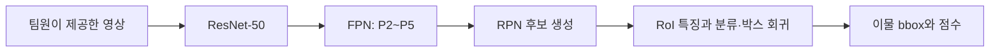
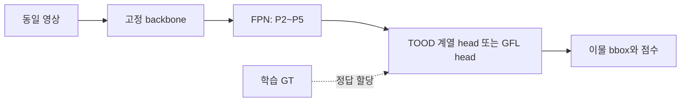
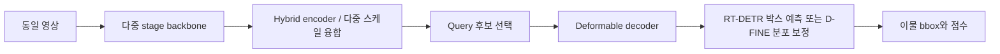

# KAMP X-ray 이물 탐지를 위한 Detector 아키텍처 선행연구 분석

작성일: 2026-09-29  
대상: ④ X-ray 영상 기반 완제품 이물질 탐지 및 AI 미탐지 조건 분석  
기준: [대회 분석 보고서](대회_분석_보고서.md), [데이터 분석 보고서](데이터_분석_보고서.md)

## 1. 결론: 어떤 구조를 검토할 것인가

**우리 데이터에서는 큰 backbone을 먼저 고르기보다, 작은 이물의 특징을 유지하고 그 특징에 충분한 학습 신호를 주며 박스 위치를 정밀하게 맞추는 구조가 우선이다.** 권장 비교 축은 다음과 같다.

| 역할 | 아키텍처 후보 | 검증할 질문 |
|---|---|---|
| 해석하기 쉬운 기준 모델 | Faster R-CNN + ResNet-50 + FPN(P2 포함) | 이물을 후보로 못 찾는가, 후보를 찾고도 분류·회귀에서 놓치는가? |
| 작은 이물에 맞춘 주 설계 후보 | P2를 포함한 FPN + TOOD 계열 head 또는 GFL head | 높은 공간 해상도와 정답 할당·위치 품질 학습이 작은 이물 재현율을 높이는가? |
| 다른 구조의 비교 모델 | RT-DETR 또는 D-FINE의 소형 구성 | query 기반 검출과 반복 위치 보정이 동일 조건에서 더 나은가? |
| 추가 backbone 비교 | ConvNeXt-T / Swin-T | neck·head를 고정했을 때 특징 추출기 변경이 기여하는가? |

위 선택은 논문과 데이터 크기를 근거로 한 **설계 가설**이다. 아직 우리 데이터에서 학습해 우열을 확인한 결과는 아니다. 단순한 P2 추가 역시 새로운 연구 기여로 주장할 수 없으며, 실패 원인과 개선 효과의 연결이 있어야 대회에서 설득력이 생긴다.

이 보고서는 backbone, neck, detection head, query/attention 구조를 중심으로 한다. 학습 중 어떤 예측에 정답을 배정하는지와 박스 회귀 목적함수는 detector 성능을 좌우하므로 별도 보완 연구로 포함한다. 전처리·인페인팅·증강·데이터 생성·미라벨 활용·외부 데이터셋 선정은 다루지 않는다. 팀원이 정리한 영상·라벨·고정 분할을 입력으로 받는다는 전제다.

## 2. 데이터 특성을 아키텍처 조건으로 바꾸기

주 라벨 세트는 500장, 1,147개 bbox, 단일 이물 클래스다. 박스 너비·높이 중앙값은 각각 10픽셀이고, 567개 박스의 짧은 변이 원본에서 10픽셀 미만이다. 이 통계는 담당 팀원이 최종 확정한 데이터 버전에서 달라질 수 있다. [데이터 분석 보고서](데이터_분석_보고서.md)

| 데이터 조건 | detector에 요구되는 성질 | 성급히 결론 내리면 안 되는 것 |
|---|---|---|
| 원본에서 약 5~21픽셀 폭·높이 | 얕은 고해상도 특징, 작은 박스에 맞는 할당과 위치 회귀 | backbone이 크면 자동으로 작은 객체를 잘 찾음 |
| 주 라벨 500장 | 모델 용량·학습 안정성을 통제한 비교 | 500장이므로 Transformer는 반드시 실패함 |
| 단일 클래스 | 배경과 이물 구분, 위치 정밀도가 중요 | 다중 클래스 분류 향상이 그대로 전이됨 |
| 제품 패턴과 이물이 같은 영상에 존재 | 국소 세부 특징과 주변 맥락을 함께 활용 | attention을 추가하면 항상 개선됨 |
| 영상당 정답 1~3개 | 적은 객체에서도 후보 생성·순위 품질 확보 | query 수를 3개로 줄여도 충분함 |
| 아주 작은 박스 | 수 픽셀 위치 차이에도 민감한 평가 대응 | 높은 이미지 단위 판정률이 좋은 위치 검출을 뜻함 |

### 2.1 P2가 중요한 이유를 실제 크기로 계산

P2/P3/P4/P5는 보통 입력 영상 대비 stride 4/8/16/32의 특징맵을 뜻한다. stride 8이면 특징맵의 인접한 두 위치가 입력에서 약 8픽셀 간격이다. 아래는 **영상의 최장 변을 640으로 비율 유지 확대한다는 가정** 아래 실제 1,147개 박스의 짧은 변을 stride로 나눈 값이다. 실제 채택할 입력 크기는 아직 확정하지 않았다.

| 특징 수준 | stride | 박스 짧은 변/stride 중앙값 | 1칸 미만 박스 | 2칸 미만 박스 |
|---|---:|---:|---:|---:|
| P2 | 4 | 3.86 | 0 | 2 |
| P3 | 8 | 1.93 | 2 | 618 |
| P4 | 16 | 0.96 | 618 | 1,147 |
| P5 | 32 | 0.48 | 1,147 | 1,147 |

P3에서는 618/1,147개, 즉 53.9%가 두 칸 미만이다. 이는 P2의 검토 근거다. 단, **특징맵 두 칸 미만이면 검출 불가능하다는 법칙은 아니다.** 수용영역·보간·연속 좌표 회귀가 있으므로 이 값은 공간 샘플링 밀도에 대한 진단량이다. 높은 수준의 특징도 제품 맥락을 제공하므로 모두 제거할 이유는 없다.

P2에는 비용도 있다. 640×640 패딩 입력에서 P2는 160×160, P3는 80×80이므로 같은 채널 수일 때 P2의 공간 위치 수는 P3의 4배다. 그렇다고 전체 모델 비용이 4배라는 뜻은 아니다. dense head·feature fusion·attention의 어느 부분에 P2를 넣느냐에 따라 부담이 달라진다.


왼쪽은 박스 짧은 변/stride의 누적분포다. 오른쪽은 정사각형 박스를 가로로만 이동했을 때의 계산 예시다. 같은 10×10 박스를 2픽셀 이동하면 IoU는 약 0.667, 5×5 박스는 약 0.429다. 따라서 이 과제에서는 ‘찾기는 했으나 박스가 몇 픽셀 어긋남’도 중요한 실패다. 계산 근거: [특징맵 통계](analysis/detector_research/feature_grid_coverage.json).

## 3. 논문 선정 기준과 전체 목록

CVPR·ICCV·ECCV·NeurIPS·ICLR의 정규 논문을 중심으로, 검출 구조의 기초 연구와 작은 객체에 직접 관련된 방법을 선정했다. NWD는 적합성 때문에 포함한 arXiv 연구이며 주요 학회 정규 논문으로 표시하지 않았다. 최신 인용수를 같은 데이터베이스에서 검증하지 않았으므로 인용 수나 인용 순위는 적지 않는다. ‘주요 학회 게재’와 ‘우리 데이터에서 효과가 입증됨’도 구분한다.

| ID | 논문/방법 | 게재 | 담당 구성요소 | 우리 과제에서 읽을 이유 |
|---|---|---|---|---|
| A1 | Faster R-CNN | NeurIPS 2015 | 후보 생성 + 2단계 head | 후보 단계와 최종 판단 단계의 실패 분리 |
| A2 | Feature Pyramid Networks | CVPR 2017 | 다중 스케일 neck | P2의 세부 특징과 깊은 의미 특징 결합 |
| A3 | Swin Transformer | ICCV 2021 | 계층형 backbone | 국소 attention과 다중 해상도 특징 |
| A4 | ConvNeXt | CVPR 2022 | CNN backbone | 현대화한 CNN으로 Transformer와 대조 |
| A5 | ATSS | CVPR 2020 | 정답 할당 | 작은 이물이 충분한 positive를 받는지 |
| A6 | TOOD | ICCV 2021 | head + 정답 할당 | 분류 점수와 위치 품질의 불일치 |
| A7 | Generalized Focal Loss | NeurIPS 2020 | 품질 점수·분포형 회귀 | 미세한 경계 회귀와 후보 순위 |
| A8 | Deformable DETR | ICLR 2021 | 다중 스케일 attention | 고해상도 특징을 선택적으로 참조 |
| A9 | DINO detector | ICLR 2023 | query·decoder 학습 | 안정적인 query 학습과 반복 박스 개선 |
| A10 | RT-DETR | CVPR 2024 | hybrid encoder·query | 효율적인 CNN/Transformer 혼합 검출 |
| A11 | D-FINE | ICLR 2025 | 분포형 decoder·증류 | 박스 경계를 여러 단계에서 정밀 보정 |
| A12 | YOLOv10 | NeurIPS 2024 | dense detector·dual assignment | CNN 계열의 NMS 없는 검출 비교 |
| A13 | NWD | arXiv 2021 | 거리·할당·회귀 보완 | 작은 박스에서 IoU 민감도 완화 |
| A14 | RFLA | ECCV 2022 | 수용영역 기반 할당 | 작은 GT가 학습에서 소외되는 문제 |

A1~A4는 기본 구조, A8~A12는 검출기 계열 비교, A5~A7·A13~A14는 구조를 학습시키는 방식이다. 정답 할당 연구는 데이터를 새로 라벨링하는 연구가 아니다. **주어진 정답을 어떤 anchor·feature 위치·prediction에 학습시킬지 결정하는 detector 내부 과정**이다.

## 4. 논문별 분석

### A1. Faster R-CNN — 후보 생성과 최종 검출을 분리

**서지:** Shaoqing Ren 외, *Faster R-CNN: Towards Real-Time Object Detection with Region Proposal Networks*, NeurIPS 2015. [학회 원문](https://proceedings.neurips.cc/paper/2015/hash/14bfa6bb14875e45bba028a21ed38046-Abstract.html)

**논문의 핵심:** backbone 특징을 공유하는 RPN이 물체 후보를 만들고, 다음 단계가 후보별 분류와 박스 보정을 수행한다. 후보 생성의 비용을 줄이면서 2단계 검출을 공동 학습하는 구조다.

**우리에게 주는 인사이트:** 원인이 구분된다. RPN proposal에 GT 근처 후보가 없으면 후보 생성 문제이고, 후보는 있는데 최종 출력에 없으면 RoI head·점수·후처리 문제다. 작은 이물에 대한 proposal recall을 저장하면 아키텍처 변경의 목적이 명확해진다.

**적용 후보:** ResNet-50-FPN 기준 모델. 단, FPN은 후속 A2의 결합이며 2015 원논문에 있던 구성이 아니다. 최소 anchor 크기, feature stride, proposal 유지 개수를 실제 입력 좌표에서 확인한다.

**한계:** RPN에서 놓친 이물은 뒤 단계가 복구하기 어렵다. 자연영상용 기본 anchor와 필터 설정을 그대로 써도 적합하다는 보장은 없다. 현대 구현 참고: [Detectron2](https://github.com/facebookresearch/detectron2).

### A2. FPN — 가장 먼저 읽을 다중 스케일 구조

**서지:** Tsung-Yi Lin 외, *Feature Pyramid Networks for Object Detection*, CVPR 2017. [학회 원문](https://openaccess.thecvf.com/content_cvpr_2017/html/Lin_Feature_Pyramid_Networks_CVPR_2017_paper.html), [저자 공개본](https://arxiv.org/abs/1612.03144)

**논문의 핵심:** 깊은 단계의 의미 정보를 top-down 경로로 올리고, 얕은 단계의 고해상도 특징과 lateral connection으로 합친다. 해상도마다 의미 정보가 있는 특징 피라미드를 만든다.

**우리에게 주는 인사이트:** 작은 이물의 미세 신호는 얕은 특징에서, 이물과 제품 패턴의 구분은 더 넓은 맥락에서 도움을 받을 수 있다. 둘을 결합하는 P2 경로가 직접적인 설계 후보다.

**적용 후보:** 같은 backbone·head에서 P3~P5와 P2~P5를 비교한다. 기본 Faster R-CNN-FPN 구현에 이미 P2가 있다면 ‘P2 신규 추가’가 아니라 기존 구성 유지·제거 비교로 기록한다.

**한계:** P2는 잡음과 잔존 표시도 잘 보존할 수 있다. P2 사용 여부와 head 채널 수를 동시에 바꾸면 해상도의 기여를 분리할 수 없다. 구조 수정의 주 근거: 원논문 §3의 top-down/lateral 설계.

### A3. Swin Transformer — 계층형 Transformer backbone

**서지:** Ze Liu 외, *Swin Transformer: Hierarchical Vision Transformer Using Shifted Windows*, ICCV 2021. [학회 원문](https://openaccess.thecvf.com/content/ICCV2021/html/Liu_Swin_Transformer_Hierarchical_Vision_Transformer_Using_Shifted_Windows_ICCV_2021_paper.html), [저자 코드](https://github.com/microsoft/Swin-Transformer)

**논문의 핵심:** 작은 window 내부에서 attention을 계산하고 다음 블록에서 window를 이동해 창 사이 정보를 전달한다. 단계별 patch merging으로 다중 해상도 특징을 만든다.

**우리에게 주는 인사이트:** 제품의 국소 패턴과 이물의 관계를 학습하면서 FPN과 연결할 수 있다. 평면적인 단일 해상도 ViT와 계층형 Swin을 같은 구조로 취급하면 안 된다.

**적용 후보:** head와 FPN을 고정한 Swin-T backbone 대체 실험. 얕은 stage 출력이 detection 경로에 실제로 들어가는지 확인한다.

**한계:** window attention이 X-ray의 미세 이물에 유리하다는 직접 증거는 없다. 라벨 수가 적으므로 backbone 교체 성능에는 초기 가중치의 차이도 섞인다. ‘Transformer 대 CNN’의 순수 비교라고 과장하지 않는다.

### A4. ConvNeXt — 큰 모델보다 CNN 구조의 선택

**서지:** Zhuang Liu 외, *A ConvNet for the 2020s*, CVPR 2022. [논문](https://arxiv.org/abs/2201.03545), [학회 PDF](https://openaccess.thecvf.com/content/CVPR2022/papers/Liu_A_ConvNet_for_the_2020s_CVPR_2022_paper.pdf), [저자 코드](https://github.com/facebookresearch/ConvNeXt)

**논문의 핵심:** ResNet 계열을 출발점으로 stage 구성, depthwise convolution, 큰 kernel, inverted bottleneck, normalization 등을 현대화한 순수 CNN이다. 분류뿐 아니라 검출·분할에서도 비교한다.

**우리에게 주는 인사이트:** 맥락 활용을 위해 반드시 Transformer를 택할 필요는 없다. 같은 FPN과 head 아래 CNN backbone 자체를 대조할 수 있다.

**적용 후보:** ResNet-50과 ConvNeXt-T를 별도의 backbone 비교로 둔다. 더 큰 kernel의 효과를 ‘더 작은 픽셀 정보 보존’과 혼동하지 않는다. downsampling 간격은 별도로 확인해야 한다.

**한계:** 큰 kernel이나 넓은 채널은 계산량·과적합 위험도 늘릴 수 있다. 논문의 자연영상 결과만으로 500장 단일 클래스 환경에서 우위를 예상할 수 없다.

### A5. ATSS — anchor 유무보다 positive가 어떻게 정해지는가

**서지:** Shifeng Zhang 외, *Bridging the Gap Between Anchor-Based and Anchor-Free Detection via Adaptive Training Sample Selection*, CVPR 2020. [학회 원문](https://openaccess.thecvf.com/content_CVPR_2020/html/Zhang_Bridging_the_Gap_Between_Anchor-Based_and_Anchor-Free_Detection_via_Adaptive_CVPR_2020_paper.html), [저자 코드](https://github.com/sfzhang15/ATSS)

**논문의 핵심:** anchor 기반/비기반 검출기의 차이를 학습 샘플 정의 관점에서 분석한다. GT 가까이 있는 후보들의 IoU 통계에 따라 positive 기준을 적응적으로 정한다.

**우리에게 주는 인사이트:** 작은 이물의 미탐지는 특징이 부족해서뿐 아니라 학습할 positive가 부족해서 생길 수 있다. 모델을 대형화하기 전에 **GT별 positive 수·할당된 level·미할당 비율**을 기록할 가치가 있다.

**적용 후보:** 고정 neck/head 아래 기존 assigner와 ATSS 비교. 이미 ATSS를 쓰는 모델이라면 이를 새 기법으로 중복 도입하지 않는다.

**한계:** IoU와 후보 중심 조건을 쓰므로 매우 작은 GT의 공간 샘플링 문제를 모두 해결하지 않는다. inference 구조를 늘리는 연구와 학습 신호를 바꾸는 연구를 구분한다.

### A6. TOOD — 점수가 높은 위치와 박스가 정확한 위치를 정렬

**서지:** Chengjian Feng 외, *TOOD: Task-aligned One-stage Object Detection*, ICCV 2021. [저자 공개 본문](https://arxiv.org/html/2108.07755), [저자 코드](https://github.com/fcjian/TOOD)

**논문의 핵심:** 분류와 위치 회귀가 서로 다른 최적 위치를 선호하는 문제를 다룬다. Task-aligned Head와 Task Alignment Learning으로 두 작업의 특징·학습 목표를 맞춘다. 할당에 분류 점수와 위치 품질을 함께 반영한다.

**우리에게 주는 인사이트:** 이물로 보이는 위치와 정확한 bbox의 위치가 달라 높은 confidence의 부정확한 박스가 살아남을 수 있다. 단일 클래스에서도 이 정렬 문제는 남는다.

**적용 후보:** P2를 포함한 FPN과 결합하는 dense detector의 주 head 후보. 낮은 IoU의 고득점 박스, 위치가 좋은 저득점 박스가 줄었는지 확인한다.

**한계:** T-Head와 TAL을 동시에 바꾸면 각각의 효과를 구분하기 어렵다. 초기 예측 품질이 낮을 때의 학습 안정성도 점검 대상이다. TOOD의 assigner와 RFLA를 단순히 동시 적용할 수는 없다.

### A7. GFL — 박스 경계를 분포로 학습하고 위치 품질을 점수에 반영

**서지:** Xiang Li 외, *Generalized Focal Loss: Learning Qualified and Distributed Bounding Boxes for Dense Object Detection*, NeurIPS 2020. [학회 페이지](https://proceedings.nips.cc/paper_files/paper/2020/hash/f0bda020d2470f2e74990a07a607ebd9-Abstract.html), [PDF](https://proceedings.neurips.cc/paper/2020/file/f0bda020d2470f2e74990a07a607ebd9-Paper.pdf)

**논문의 핵심:** QFL은 분류와 위치 품질을 결합한 점수를 학습한다. DFL은 네 박스 경계까지의 거리를 이산 분포로 표현하고 그 기댓값으로 연속 좌표를 만든다. 본문 §3에서 두 목적함수를 구분한다.

**우리에게 주는 인사이트:** 작은 이물에서는 박스의 몇 픽셀 차이가 크므로 단일 좌표 회귀와 분포형 회귀를 비교할 이유가 있다. 분포의 기댓값을 쓰므로 bin 간격이 그대로 좌표의 정수 양자화 한계가 되는 것은 아니다.

**적용 후보:** GFL head를 별도 완성 모델로 비교하거나, 기존 detector의 회귀 표현을 통제해 변경한다. 이미 DFL이 들어 있는 구현이면 ‘DFL 추가’라고 부르지 않는다.

**한계:** 분포의 폭·엔트로피는 자동으로 보정된 미탐지 확률이 아니다. 분포형 head도 틀린 위치에 확신할 수 있으며 라벨 경계 오차를 제거해 주지 않는다.

### A8. Deformable DETR — 모든 위치 대신 필요한 위치를 참조

**서지:** Xizhou Zhu 외, *Deformable DETR: Deformable Transformers for End-to-End Object Detection*, ICLR 2021. [논문·게재 정보](https://arxiv.org/abs/2010.04159), [본문](https://arxiv.org/html/2010.04159v4), [저자 코드](https://github.com/fundamentalvision/Deformable-DETR)

**논문의 핵심:** reference point 주변의 학습 가능한 소수 sampling point에 attention을 집중하고 여러 해상도의 특징을 함께 참조한다. 원래 DETR의 고해상도 처리 비용과 수렴 문제를 완화한다.

**우리에게 주는 인사이트:** 작은 이물에서는 여러 해상도를 효율적으로 읽는 방식이 중요하다. ‘Transformer니까 전역 정보를 본다’보다 어떤 level의 어느 위치를 샘플링하는지가 구체적인 분석 대상이다.

**적용 후보:** 이후 DINO·RT-DETR 계열의 다중 스케일 decoder를 이해하는 기반 논문. 가장 작은 이물에서 sampling 위치와 query 후보를 확인한다.

**한계:** sampling이 학습되더라도 얕은 고해상도 특징이 입력에 없으면 그 정보를 직접 참조할 수 없다. 고해상도 특징을 추가하면 token 수·메모리·학습 조건도 달라진다.

### A9. DINO detector — query 학습을 안정화한 DETR

**서지:** Hao Zhang 외, *DINO: DETR with Improved DeNoising Anchor Boxes for End-to-End Object Detection*, ICLR 2023. [본문](https://arxiv.org/html/2203.03605v4), [학회 등록 페이지](https://openreview.net/forum?id=3mRwyG5one), [저자 코드·게재 확인](https://github.com/IDEA-Research/DINO)

**논문의 핵심:** contrastive denoising, mixed query selection, look-forward-twice 박스 갱신을 결합한다. 학습 시 정답에서 만든 noisy query는 보조 학습용이고 추론 때 정답을 입력하지 않는다.

**우리에게 주는 인사이트:** attention 종류뿐 아니라 query 초기화와 매칭 안정성도 detector 설계 요소다. 본문 부록 D.3에서 4-scale은 깊은 세 stage와 추가 downsampling, 5-scale은 더 얕은 stage를 추가한다고 구분한다. 단순히 ‘DINO 사용’이라고 적기보다 가장 작은 stride를 명시해야 한다.

**적용 후보:** CNN 계열과 충분히 다른 정확도 중심 비교 모델. 고해상도 level 추가 여부를 별도 변수로 다룬다.

**한계:** 작은 데이터에서 denoising·query 수의 최적값은 논문 기본값과 다를 수 있다. 이 DINO는 자기지도 특징학습 DINO와 다른 논문이다. 여기서는 detector DINO만 다룬다.

### A10. RT-DETR — 효율적인 특징 결합과 query 선택

**서지:** Yian Zhao 외, *DETRs Beat YOLOs on Real-time Object Detection*, CVPR 2024. [학회 원문](https://openaccess.thecvf.com/content/CVPR2024/html/Zhao_DETRs_Beat_YOLOs_on_Real-time_Object_Detection_CVPR_2024_paper.html), [저자 코드](https://github.com/lyuwenyu/RT-DETR)

**논문의 핵심:** hybrid encoder가 scale 내부 상호작용과 scale 사이 융합을 분리한다. decoder에 넘길 초기 query도 품질을 고려해 고른다. NMS가 없는 추론 구조를 갖는다.

**우리에게 주는 인사이트:** 고해상도 특징 전체에 무거운 attention을 거는 대신, 깊은 특징에서 맥락을 처리하고 세밀한 특징과 결합하는 방식을 검토할 수 있다. encoder 단계에서 작은 이물이 선택 후보에 들어가는지도 중요하다.

**적용 후보:** 소형 RT-DETR을 구조가 다른 기준 모델로 사용. P2 변경은 별도 연구 구성으로 이름을 붙이고 원래 모델 성능과 구분한다.

**한계:** 논문의 ‘uncertainty’ 기반 query 선택은 현장 안전 위험이 보정된 확률이라는 뜻이 아니다. 논문 GPU·추론 엔진의 FPS를 우리 구현 속도로 인용하지 않는다.

### A11. D-FINE — 반복적인 분포 보정으로 위치를 정밀화

**서지:** Yansong Peng 외, *D-FINE: Redefine Regression Task of DETRs as Fine-grained Distribution Refinement*, ICLR 2025. [학회 원문](https://proceedings.iclr.cc/paper_files/paper/2025/hash/6cf58a87e3097e7d1f9be3e8693a93de-Abstract-Conference.html), [PDF](https://proceedings.iclr.cc/paper_files/paper/2025/file/6cf58a87e3097e7d1f9be3e8693a93de-Paper-Conference.pdf), [저자 코드](https://github.com/Peterande/D-FINE)

**논문의 핵심:** FDR은 decoder layer 사이에서 경계 보정 분포를 잔차 방식으로 갱신한다. 비균일한 위치 가중치로 정밀 보정을 표현하고, GO-LSD는 더 정교한 분포의 위치 지식을 얕은 decoder로 전달한다.

**우리에게 주는 인사이트:** ‘이물 근처는 찾았는데 bbox가 부정확한’ 오류라면 직접적인 비교 대상이다. 최종 AP뿐 아니라 layer별 위치 오차 감소를 측정하면 반복 보정의 역할을 설명할 수 있다.

**적용 후보:** RT-DETR과 같은 계열 안에서 비교할 유력 후보. 초기에는 공개 소형 구성을 유지해 기준을 확보하고, P2 등의 변경은 따로 분리한다.

**한계:** 특징이나 query가 이물을 놓쳤다면 정밀 회귀만으로 해결되지 않는다. GFL의 분포형 head와도 계산·학습 구조가 다르므로 같은 모듈처럼 교체하지 않는다. 증류도 라벨 오류를 자동 교정하지 않는다.

### A12. YOLOv10 — CNN에서도 NMS 없는 검출이 가능

**서지:** Ao Wang 외, *YOLOv10: Real-Time End-to-End Object Detection*, NeurIPS 2024. [학회 원문](https://proceedings.neurips.cc/paper_files/paper/2024/hash/c34ddd05eb089991f06f3c5dc36836e0-Abstract-Conference.html), [저자 코드](https://github.com/THU-MIG/yolov10)

**논문의 핵심:** 일관된 dual assignment로 학습 시 one-to-many와 one-to-one 경로를 활용하고, 추론은 one-to-one 경로로 NMS 없이 수행한다. 계산 효율을 고려한 구성 변경도 포함한다.

**우리에게 주는 인사이트:** NMS 유무와 CNN/Transformer 구분은 별개다. dense 학습 신호를 활용하면서 최종 중복 예측을 줄이는 구조를 비교할 수 있다.

**적용 후보:** 빠른 CNN 계열 비교 모델. NMS 없는 모델이 필요한지, 실제로 NMS에서 이물이 제거되는 오류가 있는지부터 분리해서 본다.

**한계:** 영상당 객체가 적다는 이유만으로 NMS 제거의 이득이 크다고 볼 수 없다. 고해상도 P2를 추가하려면 양쪽 학습 경로와 할당·출력 연결까지 맞춰야 하며 단일 출력층 추가로 끝나지 않을 수 있다.

### A13. NWD — 작은 박스의 IoU 민감도를 다루는 보완 연구

**서지:** Jinwang Wang 외, *A Normalized Gaussian Wasserstein Distance for Tiny Object Detection*, arXiv 2021. [논문](https://arxiv.org/abs/2110.13389), [PDF](https://arxiv.org/pdf/2110.13389), [저자 코드](https://github.com/jwwangchn/NWD). 관련 확장 연구는 *Detecting tiny objects in aerial images: A normalized Wasserstein distance and a new benchmark*, ISPRS Journal of Photogrammetry and Remote Sensing, 2022다. [확장 논문](https://arxiv.org/abs/2206.13996)

**논문의 핵심:** 박스를 2차원 Gaussian으로 표현해 중심·크기 차이의 Wasserstein distance를 계산하고 유사도로 정규화한다. 작은 박스는 조금만 이동해도 IoU가 급감하는 문제에 대응하며, 할당·회귀·NMS에 적용한 결과를 구분한다.

**우리에게 주는 인사이트:** 수 픽셀 오차가 큰 과제이므로 IoU 외의 학습 신호를 검토할 근거가 있다. 여기서 Gaussian은 박스의 기하학적 표현이며 모델의 확률적 불확실성과 다르다.

**적용 후보:** 회귀 보조 손실 또는 assigner 변경을 하나씩 비교. 정규화 상수는 좌표 단위·입력 크기에 영향을 받으므로 다른 데이터의 값을 그대로 옮기지 않는다.

**한계:** 아키텍처 본체가 아니라 보완 방법이다. NWD를 학습에 쓰더라도 공식 검출 평가는 임의로 NWD 기준으로 바꾸지 않는다. 겹치지 않는 박스를 가깝게 취급하는 특성은 위치 정확도와 충돌할 수 있다.

### A14. RFLA — 작은 GT에 학습 신호를 배정하는 방법

**서지:** Chang Xu 외, *RFLA: Gaussian Receptive Field based Label Assignment for Tiny Object Detection*, ECCV 2022. [학회 PDF](https://www.ecva.net/papers/eccv_2022/papers_ECCV/papers/136690518.pdf), [저자 공개본](https://arxiv.org/abs/2208.08738), [저자 코드](https://github.com/Chasel-Tsui/mmdet-rfla)

**논문의 핵심:** anchor box나 점 하나의 포함 관계 대신 feature의 수용영역을 Gaussian으로 모델링한다. Receptive Field Distance와 Hierarchical Label Assignment를 사용해 작은 GT의 학습 소외를 줄인다.

**우리에게 주는 인사이트:** ‘작은 이물에 할당할 feature point가 부족한가?’를 직접 묻는 논문이다. backbone 확대보다 assigner 수정이 맞는 실패 유형이 있을 수 있다.

**적용 후보:** A5의 positive 수 진단에서 문제가 확인될 경우, 같은 dense detector의 기존 assigner를 대체하는 비교. 추론 그래프를 크게 바꾸지 않는 학습 측 개선 후보다.

**한계:** 항공·tiny-object 환경의 결과를 식품 X-ray 성능으로 옮길 수 없다. Gaussian 수용영역은 근사이며 회색조 이물의 실제 모양을 뜻하지 않는다. DETR의 일대일 Hungarian matching에 그대로 겹쳐 붙이는 구성도 아니다.

## 5. 논문에서 우리 설계로 연결되는 다섯 가지 인사이트

### 5.1 backbone·neck·head를 별도 결정으로 취급한다

Faster R-CNN, FPN, Swin은 서로 경쟁하는 같은 종류의 이름이 아니다. Faster R-CNN은 검출 방식, FPN은 특징 결합 구조, Swin은 특징 추출기다. 예를 들어 Swin+FPN+Faster R-CNN도 가능하다. 모델 이름만 나열하는 비교보다 아래 구조를 기록해야 한다.

```text
입력 → backbone의 다중 stage 특징 → neck의 scale 융합 → head/decoder → 박스·점수
                                      ↑
                       학습 시 assigner·matching·회귀 목적함수
```

A2~A4를 종합하면 backbone 교체와 P2 도입을 동시에 하기보다, 어느 변경이 작은 이물의 신호를 살리는지 분리하는 편이 해석 가능하다. 큰 backbone은 선택지이며 출발 조건은 아니다.

### 5.2 P2는 유력하지만 얕은 특징만 쓰는 것은 아니다

우리 박스 크기는 P2 검토를 강하게 뒷받침한다. 그러나 얕은 특징만으로는 제품의 반복 패턴과 이물을 구별하기 어려울 수 있다. **고해상도 위치 정보와 더 넓은 맥락의 융합**이 가설이며, P2-only 모델이 결론은 아니다. P2·P3·P4·P5 중 어느 level에서 검출된 이물이 TP/FN으로 연결되는지 기록하면 FPN 설계의 근거가 된다. 관련: A2, A8~A10.

### 5.3 ‘못 찾음’과 ‘정확하게 못 그림’은 구조적으로 다른 문제다

| 관측하는 실패 | 우선 점검 | 관련 논문 |
|---|---|---|
| GT 주변 proposal/query 후보 자체가 부족 | feature stride, RPN/encoder 후보 recall | A1·A2·A8·A10 |
| 작은 GT의 positive 수가 부족 | assigner, center 조건, 작은 anchor 설정 | A5·A14 |
| 위치가 좋은 후보의 점수가 낮음 | 분류–위치 정렬, 품질 점수 | A6·A7 |
| 점수는 높지만 박스가 수 픽셀 어긋남 | 경계 회귀, 반복 보정 | A7·A11·A13 |
| 후처리에서 인접한 이물 후보가 사라짐 | NMS 전후 결과, 일대일 예측 | A9·A10·A12 |

이는 특정 논문이 원인을 해결한다는 보증이 아니라, 구조 변경을 선택할 때 사용할 진단 기준이다. 모든 개선 모듈을 한 번에 추가하는 것보다 이 연결을 검증하는 것이 대회 오류분석과도 맞는다.

### 5.4 할당·손실·head는 같은 부품이 아니다

ATSS, TAL, RFLA는 서로 다른 정답 할당 선택지다. GFL의 QFL·DFL은 점수·회귀 표현과 학습 목적함수다. NWD는 거리 척도로서 할당 또는 회귀 등 어디에 쓰는지 명시해야 한다. D-FINE은 decoder 자체의 분포 보정과 학습을 함께 바꾼다.

따라서 ‘TOOD+ATSS+RFLA+NWD+DFL을 다 붙인다’는 조합에는 일관된 학습 정의가 없다. **변경 위치 하나를 명확히 한 비교**가 필요하다. 특히 이미 TAL·DFL을 사용하는 구현에 같은 개념을 다시 붙였다고 새 개선으로 소개하면 안 된다.

### 5.5 한 장에 3개라고 query도 3개일 필요는 없다

DETR query는 정답 개수만큼 정해 둔 슬롯 이상의 역할을 한다. 학습 중 후보 경쟁과 일대일 매칭에 사용되므로, 현재 최대 정답 개수 3을 근거로 query를 3개로 제한하면 후보 다양성과 재현율이 줄 수 있다. 이 내용은 A8~A12의 구조를 우리 데이터에 적용한 해석이다. query 수를 줄일 때는 출력 개수뿐 아니라 encoder 후보·decoder recall을 확인해야 한다.

## 6. 구체적인 아키텍처 후보

아래 구성은 이 프로젝트의 제안이며 논문 원형과 구분한다. GPU 메모리나 목표 지연시간이 확정되지 않아 특정 대형 구성의 실행 가능성을 전제하지 않는다.

### 후보 A — 원인 분석용 2단계 detector



핵심은 성능을 확정하는 것이 아니라 proposal 단계의 작은 이물 recall을 측정할 수 있다는 점이다. 이미 P2가 포함된 구현을 기준으로 삼고 작은 anchor와 RoI 설정의 적합성을 점검한다. Faster R-CNN 원논문과 FPN 후속 연구를 결합한 일반적 구성이다. 근거: A1·A2.

### 후보 B — 작은 이물 중심의 dense detector



본 설계의 핵심 변수는 P2 경로다. TOOD와 GFL은 각각 완성된 head·학습 구성을 먼저 비교하고, 무리하게 둘을 통합하지 않는다. GT별 positive 수가 부족하면 assigner 변경을, 후보 위치 오차가 크면 회귀 변경을 검토한다. NWD/RFLA는 이런 진단에 따른 독립 비교군이다. 근거: A2·A5~A7·A13·A14.

### 후보 C — 다중 스케일 Transformer detector



RT-DETR과 D-FINE은 각각의 공개 구성을 기준으로 비교한다. 그림은 공통 개념을 설명하며 둘을 섞은 단일 구현을 의미하지 않는다. 더 얕은 level 추가는 level embedding, feature projection, encoder 융합, decoder 입력까지 영향을 줄 수 있다. 기존 가중치와 호환되는 부분·새 초기화 부분을 구분해야 한다. 근거: A8·A10·A11.

**우선 판단:** 구조 기여를 명확히 보여 주려면 후보 A 또는 B와 후보 C의 비교가 유용하다. B의 P2·할당 개선을 주 설계로, C를 다른 계열의 대조군으로 보는 것이 현재의 권장 방향이다. 단, 실제 성능은 고정된 데이터 조건에서 확인해야 한다. YOLOv10은 추론 효율이 중요한 경우 추가 비교 후보이고, Swin/ConvNeXt는 backbone 변경의 독립 비교다.

## 7. 아키텍처의 기여를 입증하는 비교 항목

전처리와 데이터 분할은 팀원이 제공한 버전으로 고정한다. 아래는 일정이 아니라 각 설계 가설의 검증 방법이다.

| 변경 | 고정할 요소 | 함께 볼 결과 |
|---|---|---|
| P3~P5 → P2~P5 | backbone·head·assigner·입력 크기 | 작은 이물 Recall, FP/영상, 메모리·시간 |
| ResNet → ConvNeXt/Swin | neck·head·분할·입력 조건 | 전체/크기별 성능, 파라미터·초기 가중치 조건 |
| 기존 assigner → ATSS/RFLA 등 | 동일 특징·동일 head·회귀 설정 | GT별 positive 수·미할당률, FN 변화 |
| 회귀 목적함수에 NWD 보완 | assigner·특징·head 용량 | 중심 오차·박스 크기 오차, AP50/AP75 |
| RT-DETR → D-FINE | 가능한 범위에서 backbone·데이터·학습 예산 일치 | 위치 오차, 계층별 box 개선, 실행 비용 |
| decoder 깊이/query 수 변경 | 나머지 모델·평가 조건 | 후보 recall, 최종 Recall, 지연시간 |

모델 간 모든 조건을 같게 만들 수 없다면 그 차이를 공개한다. 서로 다른 초기 가중치·학습 recipe로 비교한 결과는 ‘실용 구성 간 비교’이며 특정 모듈 하나의 인과적 효과로 단정하지 않는다. 선택된 결과가 학습 변동인지 확인하려면 여러 seed의 분포도 유용하다.

최종 출력뿐 아니라 다음 중 모델에 해당하는 중간 결과를 남기면 설계 분석이 가능하다.

- RPN 또는 encoder의 후보 recall과 유지 후보 수.
- GT별 positive 수, 담당 feature level, 미할당 여부.
- score threshold/NMS 적용 전후 TP·FN 변화.
- 원본 픽셀 단위 중심·너비·높이 오차.
- decoder layer별 bbox와 점수.
- 작은 이물 구간별 GT·TP·FN, 객체 전체 탐지 여부.

모든 박스가 일반적인 small 영역에 몰려 있으므로 AP_small 하나보다 원본 짧은 변 구간별 결과가 설명력이 있다. 경계값과 matching 기준은 비교 전에 고정한다. 검출 품질 점수·회귀 분포를 보정된 안전 확률로 해석하지 않는다.

## 8. 읽기 우선순위와 선정 판단

| 목적 | 우선 읽을 논문 | 핵심 질문 |
|---|---|---|
| 바로 구조 설계 | **FPN → TOOD → GFL** | 세부 특징을 어디서 유지하고 어떤 head로 판단할까? |
| 작은 이물 학습 문제 | **ATSS → RFLA → NWD** | 왜 이 GT에 충분한 학습 신호가 가지 않을까? |
| Transformer 비교 구조 | **Deformable DETR → RT-DETR → D-FINE** | 어떤 위치를 보고 경계를 어떻게 개선할까? |
| 정확도 중심 DETR 학습 이해 | DINO detector | query 초기화·매칭·denoising이 어떻게 작동할까? |
| 기준 모델과 backbone 선택 | Faster R-CNN, ConvNeXt, Swin | 후보 생성과 특징 추출 중 어디가 병목일까? |
| CNN 추론 효율 비교 | YOLOv10 | NMS 없이 dense 학습의 장점을 유지할 수 있을까? |

가장 먼저 얻을 설계 인사이트는 **고해상도 특징 경로와 작은 GT의 positive 할당이 실제로 작동하는지 확인하라**는 것이다. 그 다음 위치 회귀·반복 보정의 가치를 검증한다. 이 순서는 원인별 설계 판단이며 작업 일정 제안이 아니다.

## 9. 근거 범위와 재현 자료

논문 게재 정보는 학회 proceedings·CVF·ECVA·저자 arXiv 및 공식 저장소로 확인했다. 방법 설명은 원문 abstract와 본문을 함께 사용했으며, 특히 GFL §3, DINO의 multi-scale 부록, D-FINE의 FDR·GO-LSD, RFLA의 RFD·HLA, NWD의 거리 정의를 확인했다. 각 항목의 ‘우리에게 주는 인사이트·적용 후보·한계’에는 우리 데이터에 대한 분석적 추론이 포함되어 있다.

공식 코드 링크는 구현 출발점이며 이번 작업에서 설치·학습·속도 측정까지 검증한 것은 아니다. 일부 CVF/OpenReview 페이지는 접속 제한이 있어 저자 공개본과 저장소로 보완했다. 2015~2025년 핵심 구조를 선별한 보고서이며 2026년까지 모든 최신 논문을 망라한 목록이나 인용 순위표는 아니다.

- [논문 목록과 원문 URL](sources/detector_research/architecture_papers.csv)
- [실제 bbox의 특징맵 해상도 환산](analysis/detector_research/feature_grid_coverage.json)
- [해상도·위치 오차 설명 그림](analysis/detector_research/feature_grid_and_iou.png)

우리 데이터에서 어느 구조가 우수한지, 어느 조합이 미탐지를 줄이는지는 아직 실험 전이다. 보고서가 제시하는 것은 **논문 근거가 있는 아키텍처 후보와 검증 가능한 가설**이다.
