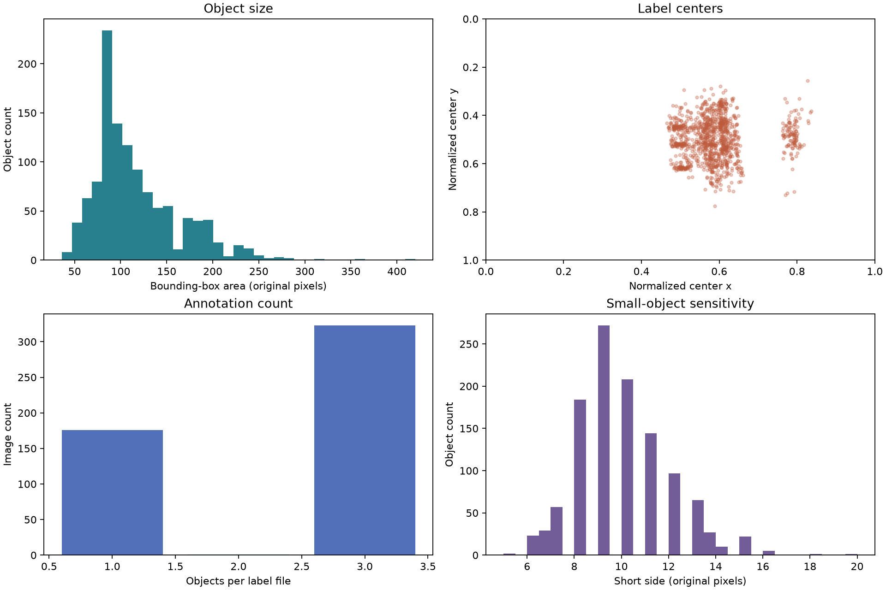
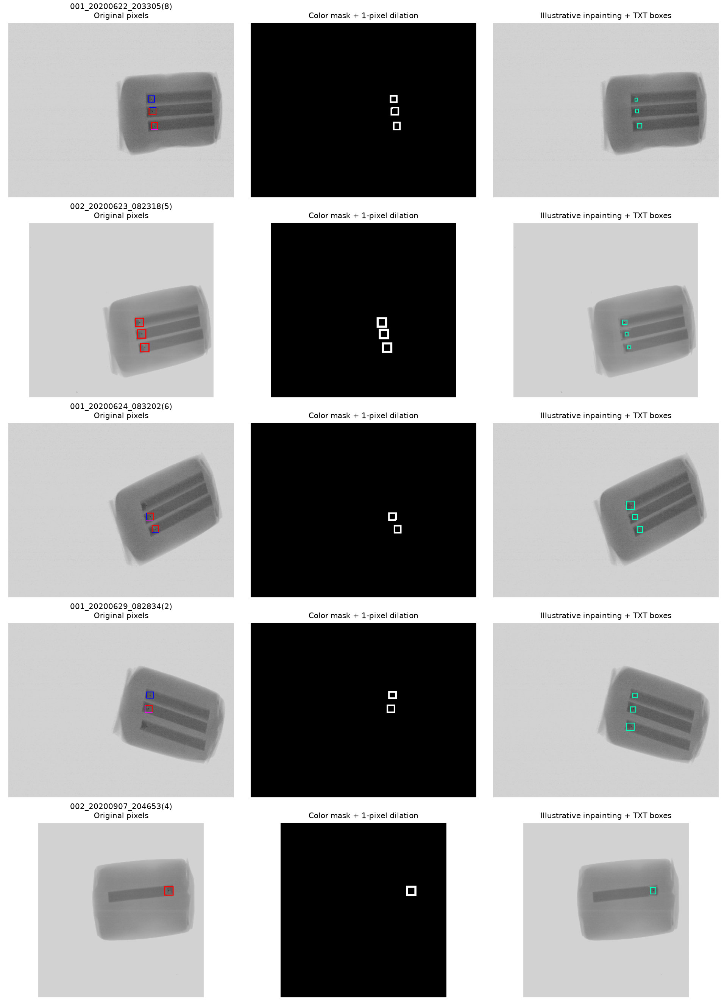
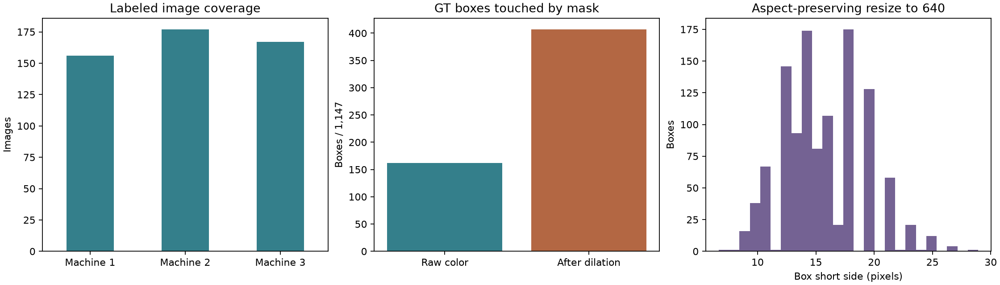
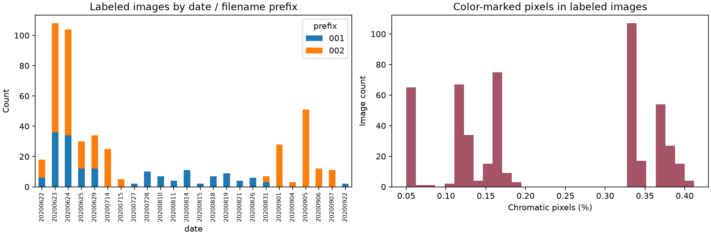

# X-ray 이물질 데이터 재분석 보고서

작성일: 2026-09-28 · 대상: KAMP ④ X-ray 영상 기반 완제품 이물질 탐지 및 AI 미탐지 조건 분석

## 1. 판단과 권장 방향

**모델 선택보다 먼저 정리할 문제는 라벨 출처 충돌, 영상에 새겨진 색상 표시, 중복·촬영 조건에 의한 평가 누수다.** 학습의 기준은 `라벨링 6종 세트/labels`의 500개 TXT와 대응하는 500개 대표 BMP로 고정하고, 보조 라벨은 분리하는 것을 권장한다. 이 주 라벨 세트에는 이물질 1,147개가 있고 정상으로 확인된 영상은 없다.

이번 재분석에서는 이미지 파일을 다시 디코딩하고 픽셀 해시를 재계산했다. 이전 목록과 3,924개 영상의 경로·해시가 모두 일치했다. 모든 라벨 후보 TXT 530개와 XML 833개도 조사했다. **전체 패키지의 고유 TXT 대상은 512장이므로, “라벨이 있는 영상은 전체에서 500장뿐”이라는 해석은 수정해야 한다.** 500장은 주 라벨 세트의 크기다. 추가 12장·16박스는 보조 도구/실습 폴더의 라벨이며 검토 전 병합하지 않는다.

추천 진행 순서는 **주 라벨·영상 manifest 확정 → 장비·촬영일을 고려한 평가 분할 → 표시 제거 방식 비교 → 작은 이물 검출 → 미탐지 조건·재검사 기준 분석**이다. 이번 문서는 데이터 감사와 실험 설계 결과다. 모델 성능이나 인페인팅의 우수성을 검증한 보고서는 아니다.

## 2. 원본 구조와 데이터 수

| 구분 | 수량 | 해석 |
|---|---:|---|
| 디코딩 가능한 영상 | 3,924파일 | 학습 샘플 수와 다름 |
| BMP / JPG / PNG | 2,824 / 1,099 / 1 | 도구·예제·복사본 포함 |
| 전체 고유 픽셀 배열 | 2,551개 | 해시 중복 제거 기준 |
| 원본 계열 BMP | 2,809파일 | `X선이물검출기` 경로 기준 |
| 원본 계열 고유 stem / 픽셀 | 2,529 / 2,532 | 같은 이름의 다른 영상 존재 |
| 주 라벨 세트 | 500 TXT, 1,147박스 | 500개 대표 BMP와 연결 |
| 주 라벨 대표 영상 고유 픽셀 | 500개 | 이 세트 내부 완전 중복 없음 |
| 보조 TXT | 15개씩 2곳, 총 30파일 | 고유 대상 15장 중 3장은 주 세트와 겹침 |
| XML | 833개 | 이물·다른 클래스·빈 예제 혼합 |
| 영상 디코딩 불가 `.jpg` | 11개 | 코드·문서 이름의 파일; 영상에서 제외 |

원본 ZIP은 기존 검사에서 CRC 검증을 통과했다(5,360파일, 5,521멤버). 이번에는 추출 영상과 라벨을 재검사했다. 다운로드 정보는 [manifest](sources/download_manifest.json)에 있다. `Dockerfile.jpg`, `LICENSE.jpg`, `README.jpg` 같은 파일을 이미지로 세지 않도록 확장자뿐 아니라 실제 디코딩 성공 여부로 선별한다.

## 3. 라벨 정보와 사용 기준

### 3.1 TXT 형식

한 줄은 한 이물질이다. 공백으로 구분한 다섯 값은 다음과 같다.

```text
class_id center_x center_y width height
0 0.6336805555555556 0.4369369369369369 0.010416666666666666 0.018018018018018018
```

| 필드 | 의미 | 주의점 |
|---|---|---|
| class_id | 이물 클래스 번호 | 주 라벨에서 모두 `0` |
| center_x, center_y | 영상 폭·높이로 나눈 박스 중심 | 왼쪽 위가 원점, 오른쪽·아래 방향으로 증가 |
| width, height | 영상 폭·높이로 나눈 박스 크기 | 실제 픽셀 크기로 환산하려면 영상 해상도 필요 |

위 예시는 `001_20200622_203305(8).txt`의 첫 줄이다. 대응 영상 576×444에서 중심은 (365,194), 크기는 6×8픽셀이고 좌상단·우하단은 (362,190), (368,198)이다. 일반 변환식은 `x1=(cx-w/2)×W`, `y1=(cy-h/2)×H`, `x2=(cx+w/2)×W`, `y2=(cy+h/2)×H`이다.

**TXT에는 RGB 색상, 이물 재질, 밀도, 검출 확률, 제품의 정상 여부 필드가 없다.** 클래스 0의 도구 이름은 `Defect`이다. 금속/유리/플라스틱 등 재질별 성능은 현재 라벨로 계산할 수 없다. 라벨 행 순서와 이미지 표시 색상으로 새로운 클래스를 만들지 않는다.

OpenLabeling은 사람이 박스를 그려 TXT/XML을 저장하는 도구다. 도구가 포함되어 있다는 사실이 폴더 안 모든 산출물이 공식 검증용 정답이라는 뜻은 아니다.

### 3.2 라벨 출처 충돌: 이번에 추가 발견

| 출처 | 파일 수 | 박스 수 | 사용 판단 |
|---|---:|---:|---|
| `라벨링 6종 세트/labels` | 500 | 1,147 | 본 분석의 주 정답 기준 |
| `OpenLabeling-master/main/output/YOLO_darknet` | 15 | 23 | 보조 라벨, 주 세트와 충돌 있음 |
| `test1/yolov3/labels` | 15 | 23 | 같은 대상의 보조 라벨, 중복 병합 금지 |
| `OpenLabeling-master/main/output/PASCAL_VOC` | 833 | 혼합 | 일괄 학습 금지 |

주 세트와 보조 TXT가 겹치는 세 이미지에서 좌표가 실제로 다르다. 단순 행 순서 차이가 아니다.

| stem | 주 세트 박스 수 | 확인된 차이 |
|---|---:|---|
| `001_20200622_203312(6)` | 3 | 중심·너비·높이 일부 상이 |
| `001_20200623_003516(8)` | 3 | 보조 박스가 훨씬 작음 |
| `001_20200922_163332(2)` | 1 | 중심 y·너비·높이 상이 |

예를 들어 `001_20200623_003516(8)` 첫 박스는 주 세트에서 11×12픽셀, 보조 TXT에서 3×7픽셀이다. 두 버전을 함께 학습하면 동일 영상에 서로 다른 박스 크기를 정답으로 주게 된다. 공식 안내는 TXT 우선이라고 설명하지만 TXT 폴더 사이의 우선순위까지 이 저장 안내에서 확인되지는 않았다. **주 500개를 우선하는 것은 본 보고서의 일관성 확보 방침**이며, 충돌 3건과 추가 12개 라벨의 사용 기준은 주최 측에 확인할 질문으로 남긴다.

XML에는 X-ray 이름 35개가 있지만 그중 14개는 object가 비어 있다. 이 빈 파일들이 정상 제품을 뜻하지는 않는다. X-ray XML 일부에는 `Defect`와 `SN77128`, `person`이 함께 있고, 패키지 전체에는 `donut`도 있다. 일반 동영상 예제도 포함되어 있다. 빈 XML을 정상으로 변환하거나 XML의 모든 클래스를 병합해서는 안 된다.

### 3.3 형식 검사와 정답 품질의 차이

TXT 530개 모두 숫자 형식, 유한값, 양수 폭·높이, 박스 경계 범위 검사를 통과했다. 동일 파일 내 완전히 같은 중복 행은 없었다. 주 세트의 빈 TXT와 영상 누락도 0개다. 그러나 이는 **좌표 형식이 유효하다는 의미**다. 실제 이물이 모두 표시되었는지, 박스 경계가 정확한지, 영상 전체에 추가 이물이 없는지는 전수 육안 검증하지 않았다. 미라벨 이물이 있으면 올바른 탐지까지 FP로 계산될 수 있다.

## 4. 라벨 분포와 수집 편향

이미지당 1박스는 176장(35.2%), 2박스는 1장(0.2%), 3박스는 323장(64.6%)이다. 3박스가 많다는 사실만으로 같은 제품을 반복 촬영했다고 확정할 수는 없지만, 개수·배치의 규칙성을 모델이 외우는지 점검해야 한다.

| 통계 | 최소 | 중앙값 | 최대 |
|---|---:|---:|---:|
| 너비(px) | 5 | 10 | 21 |
| 높이(px) | 5 | 10 | 21 |
| 면적(px²) | 36 | 108 | 420 |
| 짧은 변(px) | 5 | 10 | 20 |
| 영상 대비 박스 면적 | 0.0188% | 0.0763% | 0.2287% |

567/1,147개(49.4%)는 짧은 변이 10픽셀 미만이다. 10×10 박스를 가로로 2픽셀만 이동해도 IoU는 약 0.667이 된다. 작은 객체에서는 몇 픽셀의 라벨 차이가 AP와 TP/FN 판정을 크게 바꾼다. 높은 IoU 성능과 실패 예시를 함께 보고, 평가 기준은 사전에 고정해야 한다.

| 실제 장비 폴더 | 주 라벨 영상 | 박스 | 촬영일 수 | 영상 크기 |
|---|---:|---:|---:|---|
| 1호기 | 156 | 404 | 10 | 316×332: 32장, 352×332: 124장 |
| 2호기 | 177 | 376 | 10 | 316×332: 177장 |
| 3호기 | 167 | 367 | 17 | 576×444: 167장 |

파일명의 `001`은 주 세트에서 3호기, `002`는 1·2호기에 대응한다. **prefix를 장비 ID로 사용하면 서로 다른 장비가 섞인다.** 장비 ID는 전체 상대경로의 장비 폴더에서 추출해야 한다. 날짜는 24개이며 상위 3일에 263장(52.6%)이 집중되어 있다. 파일명 날짜와 실제 제품 ID는 구분한다. 제품·배치 ID가 없어서 동일 제품의 반복 촬영 여부를 확정할 수 없다.



그래프 해석: 왼쪽 위는 이물 박스 면적별 개수, 오른쪽 위는 정규화한 중심 위치, 왼쪽 아래는 한 영상의 이물 개수, 오른쪽 아래는 박스의 짧은 변 분포다. 위치 군집은 촬영 구도 편향의 단서다. 모두 데이터 분포이며 AI 탐지 정확도를 나타내지 않는다.

## 5. 색상 표시·여러 색·인페인팅

### 5.1 색상의 의미

BMP의 RGB 채널 최댓값과 최솟값 차이가 30을 넘는 픽셀을 색상 표시 후보로 정의했다. 주 500장 전부에서 후보가 검출됐다. BMP는 팔레트 모드 P이며 RGB로 변환하여 계산했다. 색상은 TXT 내용이 아니라 파일 픽셀에 새겨진 표시다. 색상의 물리적 의미나 이물 재질 대응은 확인되지 않았다.

한 이미지 안 색상 후보의 서로 다른 RGB 값은 1개: 368장, 2개: 52장, 3개: 68장, 4개: 12장이다. 정답 박스 내부에 두 가지 이상 색상이 실제로 있는 박스는 9개, 박스 주변 5픽셀까지 포함하면 215개다. 뒤 수치는 이웃 표시도 포함할 수 있어 “215개 이물 자체가 여러 색”이라는 의미가 아니다. 한 가지 색만 지우는 방식은 충분하지 않다.

색상 연결요소 개수와 TXT 박스 수가 다른 이미지는 아래 5장이다. 연결요소는 색상 픽셀의 연결 상태에 영향을 받기 때문에 이 불일치만으로 TXT 오류를 판정할 수 없다.

| stem | TXT 박스 | 색상 연결요소 |
|---|---:|---:|
| `001_20200624_083202(6)` | 3 | 2 |
| `001_20200629_082834(2)` | 3 | 2 |
| `002_20200623_123055(5)` | 2 | 3 |
| `002_20200623_163023(3)` | 3 | 2 |
| `002_20200624_203114(3)` | 3 | 2 |

표시 연결요소 사각형과 GT의 최대 IoU가 0.1 이상인 박스는 1,143개, 0.5 이상은 118개다. 이는 색상 사각형과 정답 박스가 다른 크기·위치를 가질 수 있음을 보여 준다. 이 수치는 검출 모델의 AP가 아니다.

### 5.2 마스크 확대의 영향

| 색상 마스크 조건 | GT 박스에 1픽셀 이상 겹친 박스 | 비율 | 박스 내 최대 겹침 비율 |
|---|---:|---:|---:|
| 색상 픽셀만 | 162 | 14.1% | 27.9% |
| 3×3 팽창 1회(주변 1픽셀 확대) | 407 | 35.5% | 47.1% |

겹침은 GT 좌표를 floor/ceil하여 얻은 픽셀 영역 기준이다. 박스 전체가 이물 픽셀은 아니므로 이 수치는 이물 손상률이 아니다. 하지만 마스크를 조금 넓히는 것만으로 훨씬 많은 정답 영역을 건드린다는 점은 확인된다. 원본의 깨끗한 대응 영상이 없어서 가려졌던 진짜 X-ray 신호가 얼마나 손실됐는지는 측정할 수 없다.

인페인팅은 선택한 영역을 주변 픽셀로 추정해 채우는 방법이다. 기존 예시의 Telea 결과가 보기 자연스럽더라도 정답 복원은 보장되지 않는다. 마스크만 채우는 방식도 위치 단서를 남길 수 있고, 단순 회색조 변환도 색상 사각형의 밝기 윤곽을 남길 수 있다.

**권장 실험:** 원본 RGB(표시 의존 진단용), 단순 회색조, 모든 색상 후보의 국소 값 치환, 팽창 없는 Telea, 1픽셀 팽창 Telea를 같은 split·모델·학습 조건으로 비교한다. 색상 없는 실제 검증 영상이 현재 주 세트에 없으므로 처리본 성능만으로 현장 일반화를 입증했다고 주장하지 않는다. 합성 표시 변경 실험도 제한적인 민감도 점검이다.

TXT 박스는 평가·손상 후보 진단에만 쓴다. 입력 전처리는 영상만으로 수행해야 하며 정답 bbox 전체를 지우는 방법은 추론 때 정답이 필요해지는 누수다. 색상 마스크를 추가 입력 채널로 주는 방법 역시 표시 위치 의존을 강화할 수 있다.



각 행의 왼쪽은 원본, 가운데 흰색은 지우려는 팽창 마스크, 오른쪽은 Telea 결과에 TXT 박스를 민트색으로 덧그린 것이다. 오른쪽의 민트색은 설명을 위한 표시이며 모델 입력에 포함하면 안 된다. 예시 이미지는 제출용 전처리의 확정 결과가 아니다.

## 6. 미라벨 데이터와 정상 데이터

주 500개 TXT를 기준으로 보면 미대응 원본 BMP는 2,244파일, 2,029개 stem, 2,032개 고유 픽셀이다. 이 안에는 보조 TXT가 있는 12개 대상도 들어 있다. 패키지의 모든 YOLO TXT를 대조했을 때에도 라벨이 없는 원본 규모는 아래와 같다.

| 기준 | 파일 수 | 고유 stem | 고유 픽셀 |
|---|---:|---:|---:|
| 주 500 TXT 미대응 | 2,244 | 2,029 | 2,032 |
| 모든 YOLO TXT 미대응 | 2,230 | 2,017 | 2,020 |

주 세트에 미대응하는 2,244파일 전부에 색상 후보가 있고, 주 라벨 영상과 완전히 같은 픽셀 해시는 없다. 따라서 “미라벨 쪽에서 색상 없는 정상 원본을 얻을 수 있다”는 근거도 현재 없다. 폴더 이름에 `NgImage`가 보이지만 이것만으로 모든 개별 샘플의 불량·정상을 확정하지 않는다.

미라벨 영상은 정상 음성 샘플로 자동 사용하지 않는다. 분포 분석, 별도 추론 점검, 학습용 그룹에 한정한 자기지도 학습 후보로 둘 수 있다. 의사라벨을 쓰려면 공식 허용 범위를 확인하고 사람이 표본을 검토하며, 검증·시험 그룹을 의사라벨 학습에서 제외한다. 자기지도 학습도 표시 특징을 학습할 수 있다는 한계가 있다.

정상 오경보율의 분모인 “정상으로 확인된 영상 수”를 확보하지 못했다. 이물 영상에서의 FP/영상은 계산할 수 있지만 정상 제품 오경보율을 대신하지 못한다. 전체 운영 재검사율·비용을 추정하려면 정상 데이터와 실제 불량 유병률/발생률, 검사 비용이 추가로 필요하다.

## 7. 중복과 평가 분할

`images 15/50/100/200/300/400`의 합계는 1,065 JPG지만 고유 stem은 400개이며 모두 주 500개 라벨 안에 들어간다. 누적 묶음이므로 여섯 폴더를 독립 train/test로 사용할 수 없다. BMP와 JPG는 압축 차이 때문에 픽셀 해시가 달라도 같은 원본일 수 있다. stem·출처·영상 대응 관계도 함께 관리한다.

원본에서 다음 세 stem은 서로 다른 픽셀 영상에 중복 사용된다.

- `002_20200916_122650(1)`
- `002_20200918_043338(2)`
- `002_20200922_163053(8)`

모두 주 500개 밖에 있다. 미라벨 데이터 확장 시 stem만으로 합치지 말고 전체 경로·장비·픽셀 해시를 고유키에 포함해야 한다. 반대로 같은 픽셀 복사본은 같은 그룹에 넣는다.

기존 phash 거리 4 이하 1,860쌍은 인페인팅한 회색조로 계산한 근접 후보다. 비슷한 제품 배경만으로도 낮은 거리가 나올 수 있어 자동 중복 삭제 기준으로 쓰지 않는다. 두 이미지가 다른 이물 위치를 갖는지 육안 확인한다.

권장 평가는 두 축이다.

1. **날짜 일반화:** 같은 날짜의 장비·근접 촬영을 함께 묶어 그룹 분할한다. 날짜·장비별 표본 수를 공개하고 이미지·픽셀·파생본의 그룹 간 중복을 검사한다. 파일명 시간만 같은 것을 실제 제품 ID라고 간주하지 않는다.
2. **장비 일반화:** 1·2호기로 학습하고 3호기로 평가하는 방식 등의 장비 제외 실험을 보조 평가로 둔다. 장비와 해상도·날짜·촬영 구도의 영향이 함께 달라질 수 있으므로 장비 단독 원인 효과로 해석하지 않는다.

데이터가 500장으로 작으므로 정확한 분할 비율보다 각 장비·날짜·크기 구간의 분모가 중요하다. 하이퍼파라미터·임계값 선정용 검증과 최종 시험을 구분하고, 시험 결과를 본 뒤 임계값을 반복 조정하지 않는다. 불확실성은 영상 또는 촬영 그룹 단위 재표집으로 함께 보고한다.

## 8. 모델과 전처리의 실험 방향

이전 보고서의 “640 입력으로 축소”라는 설명은 수정한다. 주 세트의 최장 변은 모두 640보다 작다. 비율을 유지하며 최장 변을 640으로 맞추면 **확대**되며, 이때 이물 짧은 변은 최소 약 6.67픽셀, 중앙값 약 15.42픽셀이다. 확대가 새 세부 정보를 만들지는 않는다. 실제 학습 설정이 확대를 허용하는지도 확인해야 한다.

처음부터 타일링을 확정하지 않는다. 제품 전체 맥락을 유지하는 검출 기준 모델을 먼저 만들고, 입력 크기·작은 객체용 특징맵·타일링의 효과를 각각 확인한다. 타일을 쓰면 원본 단위로 먼저 분할하고 경계에서 이물이 잘리거나 중복 검출되지 않도록 좌표 복원과 중복 억제를 검증한다.

| 단계 | 비교/산출물 | 판단 기준 |
|---|---|---|
| 1 | 주 500개와 라벨 버전 고정 | 충돌 라벨·중복·예제 제외 여부 |
| 2 | 그룹 split manifest | 원본·파생본의 split 간 중복 0 |
| 3 | 표시 제거 방식 비교 | Recall/AP와 GT 영역 변경 비율, 잔존 표시 |
| 4 | 입력 해상도·타일·작은 객체 설정 비교 | 작은 이물 Recall, FP/영상, 추론 시간 |
| 5 | FN 조건표와 실패 사례 | 크기·대비·장비·날짜·제품 경계별 분모 |
| 6 | 임계값·재검사 기준 | 검증 데이터에서 고정, 시험 1회 평가 |

미탐지 분석에서 크기는 원본 좌표 기준으로 나눠 모델 입력 크기 변경에도 구간을 유지한다. 대비는 인페인팅 전후에 값이 달라지므로 원본 회색조와 처리본을 구분한다. 기존 `cnr_proxy`는 인페인팅 결과의 박스 안팎 밝기 차이/주변 표준편차이며 물리적 밀도나 실제 검출 난이도의 확정 값이 아니다.

제품 외곽에서 놓치는 문제는 **영상 프레임 경계**와 구분한다. 기존 통계상 GT의 영상 경계 거리는 최소 52픽셀이지만 이것이 제품 가장자리 사례가 없다는 뜻은 아니다. 제품 영역을 별도로 추출·검토한 뒤 제품 경계까지의 거리를 구한다.

## 9. 미탐지·재검사 보고 방식

객체 TP/FN은 정해 둔 IoU와 일대일 매칭으로 계산하고 동일 이물을 중복 탐지한 박스는 별도 FP로 처리한다. AP50과 AP50:95, 선택 임계값의 Recall·Precision·FP/영상을 함께 제시한다. 공식 평가 규정에 별도 기준이 있으면 그 기준을 우선한다.

| 분석 축 | 데이터에서 구할 값 | 보고할 값 |
|---|---|---|
| 작은 이물 | 원본 짧은 변·면적 | 구간별 GT/TP/FN/Recall |
| 대비 | 원본·처리본 대비 대리값 | 구간별 Recall, 전처리 의존성 |
| 위치 | 제품 경계 거리, 정규화 중심 | 위치별 FN 사례 |
| 표시 영향 | 색상/팽창 마스크와 GT 겹침 | 겹침 유무별 성능 차이 |
| 수집 조건 | 실제 장비·날짜·해상도 | 그룹별 분모와 성능 |
| 다중 이물 | TXT 박스 수 | 하나 이상 탐지율, 전부 탐지율 |

“영상에서 하나라도 검출”과 “영상 내 이물을 모두 검출”을 분리한다. 양성 영상만 평가하면 항상 불량으로 판정하는 규칙도 영상 재현율 100%가 될 수 있으므로 객체 수준 위치 정확도를 반드시 병기한다.

재검사 후보는 낮은 신뢰도, 제거 방식별 예측 불일치, 품질 저하, 학습 범위 밖 영상 등 **추론 시 관측 가능한 값**으로 정의한다. GT 박스 크기나 GT 대비를 운영 판정에 직접 쓰지 않는다. 수치 임계값은 아직 정할 근거가 없고, 검증 Recall–FP 곡선과 정상 데이터가 확보된 뒤 정한다. 실제 비용·안전 기준이 없으면 여러 가정의 시나리오로만 제시한다.

## 10. 문제 우선순위와 완료 조건

| 우선순위 | 문제 | 필요한 조치 | 현재 상태 |
|---|---|---|---|
| P0 | TXT 출처별 정답 충돌 | 주 버전 고정, 충돌 3장 검토·공식 기준 확인 | 목록 생성 완료, 공식 확인 미완료 |
| P0 | 색상 표시 의존 | 영상만 사용하는 제거 후보 비교 | 영향 정량화 완료, 학습 비교 미실시 |
| P0 | 정상 샘플 부재 | 정상 근거 확보, 오경보율 한계 명시 | 확인된 정상 세트 없음 |
| P0 | 중복·촬영 누수 | 그룹 split, 파생본 묶기 | 목록 완료, split 확정 미실시 |
| P1 | 작은 박스·좌표 민감성 | 라벨 검수, 크기별 Recall | 분포 완료, 모델 실험 미실시 |
| P1 | 장비·날짜 편향 | 날짜 그룹/장비 제외 평가 | 분포 완료 |
| P1 | 일부 전처리 GT 침범 | 고겹침 사례 시각 검수 | 검토 대기 목록 생성 |
| P2 | 보조·미라벨 데이터 활용 | 출처 확인 후 제한적 확장 | 별도 목록 생성 |

주최 측에 확인할 질문: (1) 주 500 TXT와 보조 TXT 충돌 시 우선 버전, (2) 보조 12장 라벨의 학습 사용 범위, (3) 공식 확인된 정상 영상 또는 추가 정상 평가 데이터 유무, (4) 배치/제품 식별 정보 제공 가능 여부. 실제 문의는 발송하지 않았다.

## 11. 새 그래프와 근거 파일



왼쪽: 장비별 주 라벨 영상 수. 가운데: 제거 마스크가 GT 박스 영역을 건드리는 박스 수이며 손상률이나 FN 수가 아니다. 오른쪽: 최장 변을 640으로 확대했을 때의 박스 짧은 변 분포이며 실제 모델 성능은 아니다.



왼쪽 그래프의 범례 `001/002`는 파일명 prefix이고 실제 장비 ID와 다르다. 날짜별 표본 집중을 읽는 용도다. 오른쪽은 영상 전체 중 색상 픽셀의 비율이다. 비율이 작아도 이물 근처에 몰려 있을 수 있으므로 누수 위험이 작다고 해석하면 안 된다.

| 산출물 | 용도 |
|---|---|
| [재분석 요약](analysis/review/review_summary.json) | 신규 수치와 충돌 목록 |
| [주 라벨 영상 manifest](analysis/review/canonical_manifest.csv) | 500장 경로·장비·날짜·크기·박스 수 |
| [박스 상세](analysis/boxes.csv) | 1,147개 좌표·크기·기존 대비 대리값 |
| [모든 YOLO 라벨](analysis/review/all_yolo_labels.csv) | 출처·주 라벨과의 차이·형식 검사 |
| [모든 XML](analysis/review/all_xml_labels.csv) | 빈 파일·예제 클래스 구분 |
| [보조 라벨 12장](analysis/review/auxiliary_only_labels.csv) | 주 라벨 외 추가 대상 |
| [전체 TXT 미대응 원본](analysis/review/raw_without_any_yolo_label.csv) | 정상으로 간주하면 안 되는 미라벨 목록 |
| [GT와 마스크 겹침](analysis/review/box_mask_audit.csv) | 팽창 전후 영향·다중 색상 |
| [수동 검토 대기 목록](analysis/review/manual_review_queue.csv) | 라벨 충돌·표시 불일치·고겹침 사례 |
| [동일 이름 픽셀 충돌](analysis/review/stem_pixel_conflicts.csv) | 다른 영상을 잘못 합치는 문제 예방 |
| [새 영상 목록](analysis/review/fresh_image_inventory.csv) | 실제 재디코딩·픽셀 해시 |
| [영상 디코딩 불가 파일](analysis/review/undecodable_files.json) | 확장자만 JPG인 파일 등 제외 |
| [재분석 코드](scripts/review_xray.py) / [보고서 작성 코드](scripts/finalize_xray_review.py) | 재현 |

공식 지침의 근거는 다운로드 당시 보관한 [과제 추가 안내](sources/task28_web.txt)와 [과제문](sources/task_statement.txt)이며 원문 주소는 [KAMP 과제 페이지](https://www.kamp-ai.kr/contestNoticeDetail?CPT_NOTICE_SEQ=28)다. 추가 안내는 표시를 직접 특징으로 사용하지 말고 TXT를 우선하며, 표시 제거·마스킹·인페인팅을 사용하면 방법과 영향을 기록하도록 설명한다. 이번 재분석 중 웹 도구로 원문 재접속은 실패하여 저장본을 근거로 사용했다.

이 보고서는 실제 영상·라벨의 구조와 자동 검사 결과, 일부 예시 시각 확인을 완료한 데이터 분석본이다. 전체 라벨의 수작업 재검수, 표시 없는 실제 X-ray 신호의 복원 검증, 모델 학습, 현장 정상 오경보율 검증은 완료한 것으로 주장하지 않는다.
