# X-ray 이물 탐지와 미탐 원인 분석
## KAMP 경진대회 결과보고서

모델의 검출 성능과 함께 미탐 원인을 나누어 살펴보고, 판정 임계값과 사람 재검사를 포함한 적용 절차를 검토했다.

내용 안내: 제2장 모델 선정 · 제3장 오류와 조건별 성능 · 제4장 임계값·재검사·현장 활용 · 제5장 연구의 차별성과 적용 범위 · 제6장 코드와 재현성 · 제8장 세부 진단과 계산 방법

## 제2장 — AI 예측모델 개발 및 성능평가

최종 모델은 D-FINE-S에 MAL과 UQ를 더한 구성이다. MAL(Matchability-Aware Loss)은 학습할 때 예측 박스와 정답 박스의 매칭 정도를 반영하는 손실이고, UQ(Unary Quality)는 각 예측 박스의 위치 품질을 추정해 검출 점수를 조정하는 모듈이다.

검증셋에서 세 번 학습한 결과를 평균하면 최종 모델의 AP는 39.38±0.62, AP75는 19.05±0.77이었다. 기본 D-FINE-S의 AP 38.68±1.41, AP75 16.76±0.71과 비교하면 각각 0.70점, 2.29점 높다. 점수는 100점 척도로 표시했으며, ± 뒤 숫자는 세 번의 학습 결과 사이 표준편차다. 정밀도는 모델이 검출했다고 낸 박스 가운데 정답인 비율이고, 재현율은 전체 정답 가운데 찾아낸 비율이다. AP는 검출 점수 기준을 바꿔가며 이 두 값을 종합한 점수다. 이때 예측 박스가 정답 박스와 얼마나 겹치는지를 IoU로 따진다. COCO 방식 AP는 IoU 0.50, 0.55, …, 0.95에서 계산한 값의 평균이고, AP75는 IoU 0.75 기준의 AP다. IoU 기준이 높을수록 박스 위치까지 정답에 가깝게 맞춰야 한다.

검증셋 전체에서 오검출을 6개 이하로 제한한 비교 지점에서는 기본 D-FINE-S가 평균 140.33/144개(재현율 97.5%), MAL+UQ가 141.67/144개(재현율 98.4%)를 찾아 MAL+UQ가 1.34개, 0.9%p 앞섰다. FP≤6은 모든 모델에 같은 오검출 한도를 두고 검출 수를 비교하기 위한 기준이다. 현장 안전 임계값을 뜻하지는 않는다. MAL만 쓴 모델과 비교하면 UQ를 더한 뒤 AP가 1.02점, AP75가 1.63점 높아졌고, FP≤6에서 찾은 정답 수는 같았다. 이 장에서는 두 기본 검출기를 비교하고, 실패 사례를 바탕으로 모델을 바꾼 과정과 최종 구성을 설명한다.

### 2.1 평가 목표와 설정

먼저 모델이 이물 주변에 후보 박스를 만들지 못한 경우와, 후보는 만들었지만 박스가 어긋나거나 점수가 낮아 최종 출력에서 빠진 경우를 구분했다. YOLOv8s는 위치와 검출 점수를 한 번에 예측하는 널리 쓰이는 검출기이고, D-FINE-S는 예측 후보를 여러 단계에 걸쳐 다듬는 검출기다. 두 모델을 같은 데이터 분할과 평가 조건에서 비교하고, 후보 박스가 최종 출력까지 어떻게 바뀌는지 추적했다.

학습에는 영상 350장과 정답 박스 797개를, 검증에는 영상 66장과 정답 박스 144개를 사용했다. 같은 촬영 그룹이 학습과 검증에 섞이지 않도록 분할을 고정했다. 학습 결과가 초기 조건에 따라 얼마나 달라지는지 보기 위해 난수 초기값을 바꿔 세 번 반복했다. 두 모델은 일반 물체 데이터셋 COCO로 미리 학습한 가중치로 초기화했다. 영상을 640×640 크기에 맞춰 여백을 채운 뒤 학습 데이터를 30회 순회하며 학습했다(30 epoch). 반복 결과는 평균과 표준편차(반복별 변동 정도)로 제시한다.

정답 위치와 개수는 대회에서 제공한 TXT 라벨을 기준으로 했다. 예측 박스와 정답 박스가 얼마나 겹치는지는 IoU로 계산한다. 최종 검출 수를 셀 때는 IoU가 0.50 이상인 예측과 정답을 일대일로 짝지었다. 정답과 짝을 이룬 예측은 정검출(TP), 짝을 찾지 못한 정답은 미탐(FN), 정답과 짝을 이루지 못한 예측은 오검출(FP)이다. 따라서 같은 이물에 여러 박스가 겹쳐 나와도 하나만 정답과 짝을 이루고 나머지는 오검출로 계산한다. 재현율은 전체 정답 중 정검출한 비율, 즉 TP/(TP+FN)이다.

AP는 검출 점수 기준을 바꾸어가며 계산한 정밀도와 재현율을 요약한다. 이 때문에 AP는 하나의 검출 점수 임계값에서만 성능을 재는 값과 다르다. 반면 FP≤6 비교는 검증 영상 66장 전체에서 오검출이 6개를 넘지 않도록 각 모델의 점수 기준을 정한 뒤, 그때 찾아낸 정답 수를 비교한 것이다. 모든 모델에 같은 오검출 한도를 두어 낮은 오검출 조건에서의 검출 능력을 비교하려는 목적이다. 오검출 6개는 영상당 평균 약 0.09개에 해당하며, 실제 공정의 안전 임계값으로 사용한 값은 아니다.

후처리에는 NMS(Non-Maximum Suppression)를 사용했다. 겹치는 후보 박스 중 검출 점수가 높은 박스를 남겨 중복 출력을 줄이는 방법이다. NMS 기준은 IoU 0.7, 박스 배율은 1.0으로 모든 비교에서 고정했다. 박스 크기는 원본 영상 픽셀 단위이며, 실제 이물의 물리적 크기와는 구분한다.

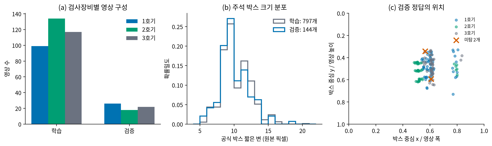

그림 1. 정답 박스는 작고, 영상과 위치 분포는 고르지 않다. (a) 학습 영상은 1호기 99장, 2호기 134장, 3호기 117장이고, 검증 영상은 각각 26장, 18장, 22장이다. (b) 학습 정답 797개와 검증 정답 144개 모두 TXT 박스의 짧은 변이 주로 8~12픽셀에 분포한다. 이는 라벨 박스의 크기이며 실제 이물의 지름을 직접 나타내지는 않는다. (c) 각 점은 검증 정답 박스 중심을 영상 너비·높이에 대한 비율로 나타낸 위치다. 정답은 화면 중앙 부근과 오른쪽 일부 구간에 모여 있고, 주황색 ×는 대표 모델이 놓친 정답 2개다. 따라서 이 그림은 모델을 어떤 장비·크기·위치 조건에서 평가했는지 보여주며, 위치별 결과를 해석할 때 해당 조건의 표본 수도 함께 살펴봐야 한다.

### 2.2 모델 개발 흐름

처음 확인하고 싶었던 것은 작은 이물이 특징 추출 과정에서 약해지는지였다. 그림 1에서 정답 박스의 짧은 변은 주로 8~12픽셀이었다. 작은 물체 탐지 연구에서는 물체 정보가 축소 과정에서 사라질 수 있어 얕은 층의 고해상도 특징을 활용해 왔다. QueryDet은 저해상도에서 작은 물체의 대략적인 위치를 찾은 뒤 고해상도 특징을 이용하고(Yang et al., 2022), ICCV 2025의 DM-EFS도 특징을 뽑는 네트워크의 앞쪽 층에서 고해상도 정보를 활용한다(Sharma, 2025). 이 연구들이 우리 X-ray에서 P2가 반드시 유리하다는 뜻은 아니다. P2는 모델이 만드는 여러 크기의 특징 지도 가운데 원본 공간 정보를 더 많이 유지하는 고해상도 단계다. 우리 실험에서는 이 경로를 두 기본 검출기에 추가해 세 번씩 비교했다.

P2는 평균 AP를 높인 경우도 있었지만, 낮은 오검출 조건의 검출 수까지 포함하면 두 검출기에서 같은 방향의 개선을 보이지 않았다. 그래서 P2를 최종 모델에 고정하기보다 저장된 예측을 살펴봤다. 이물 가까이에 후보 박스가 있는데도 경계가 맞지 않거나, 더 정확한 후보가 낮은 점수를 받는 사례가 다음 실험의 단서가 됐다.

다음에는 후보와 정답의 매칭 정도를 학습에 반영하는 방법을 확인했다. DEIM은 낮은 품질의 매칭도 학습에 반영하도록 MAL을 제안했다(Huang et al., 2025). 우리 실험에서는 DEIM 전체 학습법을 가져오지 않고, D-FINE-S에 MAL 손실만 적용했다. 이어서 좋은 박스가 낮은 점수를 받는 문제를 다루기 위해, 위치 품질을 검출 점수에 반영한 GFLv2와 예측 박스의 순위를 개선한 Rank-DETR을 참고했다(Li et al., 2021; Pu et al., 2023). 이 문제의식에 맞춰 D-FINE 후보 특징과 D-FINE의 경계 분포(Peng et al., 2025)를 활용하는 별도 UQ를 만들었다. UQ는 기존 논문의 모듈을 그대로 옮긴 것이 아니라 이번 프로젝트에서 구현한 점수 재조정 모듈이다.

UQ를 적용한 뒤 전체 AP는 올랐지만, 같은 이물 주변에서 가장 정확한 후보가 최고 점수를 받는 문제는 남았다. 그래서 후보 순위 감독, 주변 픽셀 특징, 라벨 경계 완화를 차례로 확인했다. 표 1은 각 실험을 왜 시작했고, 결과가 다음 판단에 어떻게 이어졌는지 요약한다.

표 1. 앞선 결과에서 생긴 질문을 따라 실험을 이어갔다. 선행연구는 가설을 세우는 근거로 활용했으며, 논문 방법 전체를 그대로 적용한 경우는 표에 구분해 적었다.

| 우리가 확인하고 싶었던 것 | 해본 방법과 참고한 연구 | 결과와 다음 판단 |
|---|---|---|
| 작은 이물의 신호가 특징 추출 중 약해지는가? | 작은 물체에 고해상도 특징을 쓰는 QueryDet(CVPR 2022)과 DM-EFS(ICCV 2025)를 참고해, YOLOv8s와 D-FINE-S에 P2 경로를 각각 추가하고 세 번씩 학습했다. | 평균 AP는 좋아지기도 했지만 낮은 오검출 성능은 일관되지 않았다. P2는 최종 구성으로 채택하지 않았다. |
| 후보 박스와 정답의 매칭 정도를 학습에 반영하면 검출이 나아지는가? | 매칭 품질을 손실에 반영한 DEIM(CVPR 2025)의 MAL을 D-FINE-S에 적용했다. DEIM 전체 학습법이 아니라 MAL 손실의 효과를 따로 비교했다. | FP≤6에서 정답 검출 평균은 140.33개에서 141.67개로 늘었지만, AP는 38.68에서 38.36으로 낮아졌다. 낮은 오검출 성능과 전체 순위 성능을 나눠 확인했다. |
| 더 정확한 박스가 더 높은 점수를 받는가? | 위치 품질을 추정한 GFLv2(CVPR 2021)와 점수 순위를 개선한 Rank-DETR(NeurIPS 2023)를 참고해 후보별 품질 예측기 UQ를 별도로 구현했다. | MAL에 UQ를 더하자 AP는 1.02점, AP75는 1.63점 높아졌다. FP≤6 검출 수는 같아, UQ의 효과를 전체 후보 점수 순위에서 살폈다. |
| 같은 이물 주변의 좋은 후보 중 더 정확한 박스를 고를 수 있는가? | Rank-DETR의 순위 학습에서 착안해 후보 쌍(hard-pair)과 후보 목록(listwise) 학습을 시험했다. | 최고 점수 후보가 IoU 0.75 이상인 정답 수는 평균 53.33개로 달라지지 않았다. 이 방식은 최종 구성에 포함하지 않았다. |
| 검은 점 주변의 픽셀이나 라벨 경계를 활용하면 남은 차이를 줄일 수 있는가? | 동일 파라미터 수의 대조군과 주변 픽셀 특징을 비교했다. 또 좌·상·우·하 경계를 직접 맞추는 방법과 경계 주변 1픽셀 오차를 완화하는 Soft1을 UQ와 결합해 비교했다. | 주변 픽셀 실험은 첫 비교에서 개선을 보이지 않았다. Soft1은 경계 좌표 대조군보다 평균 AP75가 0.59점 높았지만, 세 반복 중 한 번만 개선돼 최종 구성을 바꾸지 않았다. |

### 2.3 기본 모델과 핵심 구성 비교

YOLOv8s와 D-FINE-S를 서로 다른 계열의 기준 모델로 비교하고, 검출 후보의 매칭과 위치 품질을 더 반영하는 방법은 D-FINE-S에서 검증했다. YOLO 계열은 실용적인 단일 단계 검출기로 널리 알려져 있고, YOLOv8은 Ultralytics가 공식 모델 문서와 사전학습 가중치를 제공하는 구현이다(Ultralytics, n.d.). D-FINE-S는 query로 후보 박스를 만들고, 각 경계 위치를 하나의 수치만으로 보지 않고 분포로 표현해 단계적으로 다듬는 DETR 계열 검출기다(Peng et al., 2025). 이 경계 분포 정제(Fine-grained Distribution Refinement; FDR) 구조는 UQ가 활용하는 입력 특징도 제공한다. 구조가 다른 두 모델을 함께 두어 일반적인 검출기와 최신 DETR 계열을 비교했다. YOLOv8은 별도 학술 논문이 출판된 모델이 아니므로 공식 모델 문서를 참고했다.

기본 모델의 검증 AP는 YOLOv8s 38.75, D-FINE-S 38.68로 비슷했다. 반면 오검출을 6개 이하로 제한한 비교점에서 D-FINE-S는 평균 140.33/144개, YOLOv8s는 137.33/144개를 검출했다. D-FINE-S는 이 대회처럼 놓친 물체와 오검출을 함께 따져야 하는 상황에 유리한 비교 출발점이었으며, query 특징과 FDR 출력도 후보별 위치 품질을 분석하는 데 활용할 수 있었다.

후속 손실 실험은 D-FINE-S에 집중했다. MAL은 DETR의 매칭 문제를 다루기 위해 DEIM에서 제안됐고, 논문에서도 D-FINE을 포함한 DETR 계열에 적용됐다(Huang et al., 2025). YOLOv8은 여러 후보를 촘촘히 학습하는 별도의 할당 방식을 사용하므로, MAL을 같은 의미로 적용하려면 학습 방식부터 다시 설계해야 한다. UQ도 D-FINE의 query 특징과 FDR 분포 요약값을 입력으로 받도록 만들었다. 따라서 후속 실험은 이 두 특징이 있는 D-FINE-S에서 요소별로 비교했고, YOLOv8은 독립된 기준 모델로 두었다. 이는 YOLOv8에 MAL·UQ를 적용할 수 없다는 뜻이 아니라, 이번 프로젝트에서 검증 범위를 명확히 한 선택이다.

MAL은 D-FINE의 FP≤6 검출 수를 140.33개에서 141.67개로 높였고, AP는 38.68에서 38.36으로 변했다. UQ를 추가하면 FP≤6 검출 수는 유지하면서 AP가 1.02점, AP75가 1.63점 높아졌다. 이번 비교에서 MAL은 낮은 오검출 조건의 검출 수를 늘렸고, UQ는 전체 후보 점수 순위를 개선했다.

표 2. 서로 다른 검출 계열의 기준 모델과 D-FINE-S 후속 실험의 검증 결과. 검증 66장·정답 144개, 3회 반복의 평균 ± 표본 표준편차이다. FP≤6 TP는 각 반복에서 오검출을 6개 이하로 제한했을 때 맞게 검출한 정답 수다. 이 기준은 동일한 오검출 한도에서 검출 수를 비교하기 위해 사용했다.

| 모델 | AP | AP75 | FP≤6 TP/144 |
|---|---:|---:|---:|
| YOLOv8s | 38.75 ± 0.86 | 17.72 ± 1.69 | 137.33 ± 1.53 |
| YOLOv8s + 고해상도 경로 | 39.15 ± 0.80 | 19.49 ± 2.05 | 139.00 ± 1.00 |
| D-FINE-S | 38.68 ± 1.41 | 16.76 ± 0.71 | 140.33 ± 1.15 |
| D-FINE-S + 고해상도 경로 | 39.13 ± 0.63 | 18.51 ± 2.38 | 138.33 ± 2.89 |
| D-FINE-S + MAL | 38.36 ± 0.07 | 17.42 ± 2.03 | 141.67 ± 0.58 |
| D-FINE-S + MAL + UQ | 39.38 ± 0.62 | 19.05 ± 0.77 | 141.67 ± 0.58 |

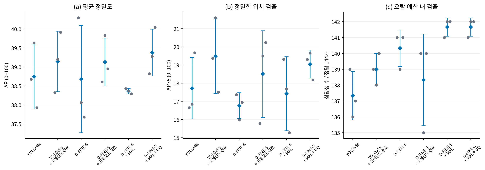

그림 2. 평균 검출 성능과 낮은 오검출 조건의 검출 수를 함께 비교했다. 세 패널은 왼쪽부터 AP, AP75, FP≤6일 때의 정답 검출 수를 보여준다. 회색 점 하나는 학습 반복 하나이고, 파란 마름모와 막대는 3회 평균과 표본 표준편차다. 각 패널의 세로축 범위가 다르므로 막대 높이를 패널 간 직접 비교하지 않는다.

그림에서 기본 YOLOv8s와 D-FINE-S의 AP 차이는 작지만, D-FINE-S는 FP≤6 비교에서 더 많은 정답을 검출했다. P2를 넣으면 두 계열 모두 평균 AP가 올랐고, YOLOv8s+P2는 평균 AP75가 가장 높았다. 그러나 P2를 넣은 D-FINE-S는 FP≤6 검출 수가 기본 모델보다 낮았고, 반복 간 변동도 컸다. 반면 D-FINE-S+MAL+UQ는 여섯 구성 중 평균 AP가 가장 높았고, FP≤6 검출 수도 MAL의 이득을 유지했다. 따라서 최종 모델은 모든 지표에서 1위를 차지해서가 아니라, 전체 검출 순위와 낮은 오검출 조건을 함께 고려했을 때 가장 균형 잡힌 결과를 보여 선정했다.

UQ(Unary Quality)는 후보 박스마다 위치 품질을 추정해 기존 검출 점수와 결합하는 예측기다. 이물 근처에 여러 박스가 있을 때, 정답에 더 잘 맞는 박스가 낮은 점수를 받아 출력에서 밀릴 수 있다는 관찰에서 출발했다. UQ는 박스 좌표를 다시 회귀하지 않고, 기존 점수와 별도로 후보 품질을 예측해 점수만 보정한다. 위치 품질을 점수와 연결한 선행연구로 GFLv2(CVPR 2021)와 Rank-DETR(NeurIPS 2023)을 참고했지만, UQ는 이번 D-FINE-S의 특징을 입력으로 구성한 별도 예측기다.

MAL(Matchability-Aware Loss)은 후보와 정답의 매칭 품질 차이를 학습 손실에 반영하는 방법이다. DEIM(CVPR 2025)에서 제안됐으며, 본 비교에서는 그중 MAL 손실을 D-FINE-S에 적용했다. D-FINE-S 자체는 ICLR 2025에 발표된 DETR 계열 검출기이며, 경계 위치를 분포로 표현해 단계적으로 정제한다.

UQ는 후보 query 특징 256개, FDR 경계 분포 통계 20개, 기존 점수 1개, 박스 기하 정보 6개를 결합한 283차원 입력을 받는다. query는 이미지에서 하나의 후보를 표현하는 특징 벡터다. 검출기와 박스 좌표를 고정한 상태에서 후보와 공식 정답 사이의 최대 IoU를 학습 목표로 삼았으며, UQ에는 62,007개의 파라미터가 있다. 추론 점수는 기존 점수 p와 예측 위치 품질 q의 기하평균 √(p·q)로 계산한다.

UQ 적용 후 AP와 AP75는 높아졌고, FP≤6 검출 수는 같았다. 다만 같은 이물 주변에서 가장 높은 점수를 받은 후보의 위치 품질은 달라지지 않았다. 따라서 이번 실험에서 확인한 효과는 전체 후보 점수 순위의 개선이며, 같은 이물 안에서 가장 정확한 박스를 선택하는 문제는 후속 과제로 남았다.

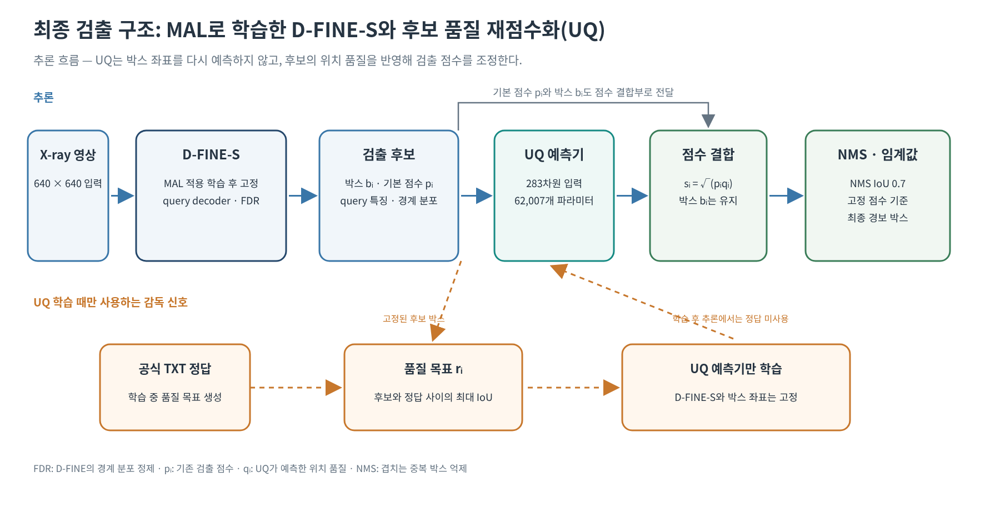

그림 3. MAL로 학습한 D-FINE-S가 만든 후보의 박스 좌표는 그대로 두고, UQ가 위치 품질을 추정해 점수를 다시 계산한다. 위쪽은 추론 흐름이다. D-FINE-S는 후보 박스와 기본 점수뿐 아니라 query 특징과 FDR의 경계 분포 정보도 출력한다. UQ는 이를 받아 각 후보의 위치 품질 q를 예측하고, 기본 점수 p와 결합해 √(p·q)를 만든다. 최종 단계에서 NMS와 고정 임계값을 적용한다. 아래 점선은 학습 때만 쓰는 공식 TXT 정답으로, 후보와 정답의 최대 IoU를 UQ의 학습 목표로 만든다. 추론할 때 TXT 정답은 입력되지 않으며, UQ가 바꾸는 것은 후보 순위에 반영되는 점수다.

### 2.4 최종 모델 선정

대표 모델은 D-FINE-S+MAL+UQ다. 3회 반복 중 검증 AP가 중앙값인 난수 초기값 20260930의 가중치를 대표 가중치로 사용했다. 이 모델은 검증셋에서 AP 39.28, AP75 19.66, FP≤6 조건에서 142/144개 정답 검출을 기록했다. 세 반복의 평균은 AP 39.38±0.62, AP75 19.05±0.77, 141.67/144개다.

고정한 평가 설정에서 시험셋 성능은 AP 37.46, AP50 93.29, AP75 15.88이었다. 검증셋에서 정한 임계값을 적용했을 때 정답 206개 중 평균 196.33개를 검출해 재현율 95.31%를 기록했고, 영상당 평균 오검출은 16.00개였다. 동일한 3회 평균 기준으로 기본 D-FINE-S보다 AP가 0.70점, AP75가 2.29점 높았고, 기본 YOLOv8s보다 AP가 0.63점, AP75가 1.33점 높았다. 저오검출 비교점에서는 기본 D-FINE-S 140.33개에서 MAL+UQ 141.67개로 늘었다.

### 2.5 후보 순위·주변 픽셀·라벨 경계 실험

후속 실험은 후보 순위, 주변 영상 정보, 라벨 경계의 세 가지 가능성을 각각 확인했고, 최종 구성보다 일관된 이득을 보인 방법은 없었다. 이 비교로 어떤 아이디어를 더 살펴볼 가치가 있는지와 현재 데이터에서 확인된 범위를 함께 정리했다.

먼저 Rank-DETR(NeurIPS 2023)이 다룬 점수와 위치 정확도의 불일치에서 출발해, 좋은 후보끼리 우열을 학습하는 후보 쌍 방식(hard-pair)과 후보 목록의 순서를 학습하는 방식(listwise)을 시험했다. 검증 정답 144개 가운데, 같은 정답 주변 후보 중 최고점수 박스의 IoU가 0.75 이상인 경우는 세 방법 모두 평균 53.33개였다. 전체 점수 순위를 다듬는 것만으로 같은 이물 주변의 대표 박스를 고르는 문제까지 해결되지는 않았다.

두 번째로, 이물이 주변 제품 배경에서 어떻게 구별되는지 후보 주변의 원본 픽셀 특징을 추가해 살펴봤다. 이는 검은 점의 국소 대비나 질감이 후보 품질을 보완할 수 있는지 확인하는 실험이었다. 파라미터 수를 맞춘 대조군과 비교한 첫 실험에서는 정밀 선택이나 AP75의 개선이 나타나지 않아 확장하지 않았다.

마지막으로, 눈에 보이는 검은 점에 비해 TXT 경계가 다소 달라 보이는 사례를 바탕으로 라벨 경계 불확실성(annotation boundary ambiguity) 가설을 확인했다. 좌·상·우·하 경계를 직접 맞추는 대조군과 경계 주변 1픽셀 오차를 완화하는 Soft1을 비교하고, 두 방식 모두 같은 UQ와 결합해 세 번씩 학습했다. Soft1+UQ의 경계 대조군 대비 평균 차이는 AP +0.31점, AP75 +0.59점이었다. 그러나 AP75는 세 반복 중 한 번만 높아졌고, 이 반복에서 +2.93점이 전체 평균을 끌어올렸다. 이에 따라 경계 완화 가능성은 기록하되 최종 구성은 MAL+UQ로 유지했다.

후속 실험은 후보 순위, 주변 픽셀, 경계 허용을 하나씩 추가해 확인했다. 각 방법은 일부 지표에서 가능성을 보였지만, 반복 비교에서 기존 구성보다 안정적으로 좋아지지는 않았다. 이 과정을 통해 현재 데이터에서 성능을 바꾸는 요소와 남아 있는 문제를 나누어 볼 수 있었다. 최종적으로는 MAL+UQ를 유지했다. 현재 데이터에는 같은 물체를 여러 사람이 독립적으로 표시한 라벨이 없어 경계 표기의 실제 편차를 직접 측정할 수 없다. 이후 독립 촬영과 반복 라벨 자료가 확보되면, Rank-DETR 계열의 후보 간 순위 학습과 경계 허용 감독을 더 직접적으로 비교할 수 있다. 제품 종류와 촬영 조건도 넓혀 같은 평가 기준으로 확인하는 것이 다음 단계다.

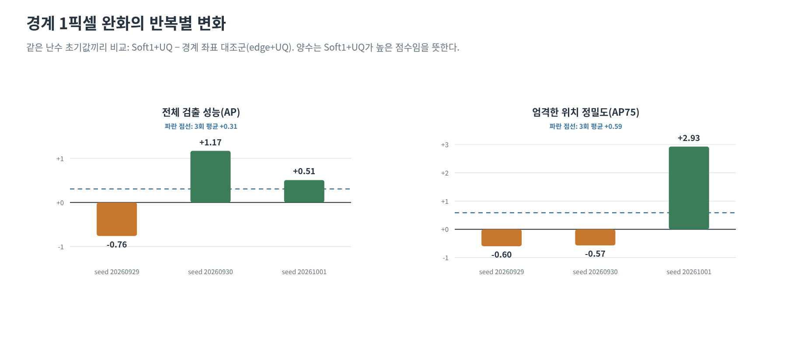

그림 4. 경계 주변 1픽셀 오차 완화의 이득이 반복마다 같은 방향으로 나타나지는 않았다. 각 막대는 같은 난수 초기값으로 학습한 `Soft1+UQ`에서 `edge+UQ`의 점수를 뺀 변화량이다. 양수는 Soft1+UQ가 높았음을 뜻한다. 왼쪽은 전체 검출 성능(AP), 오른쪽은 더 엄격한 위치 정밀도를 보는 AP75를 나타낸다. AP 차이는 세 반복에서 −0.76, +1.17, +0.51점으로 평균 +0.31점이었다. AP75 차이는 −0.60, −0.57, +2.93점으로 평균 +0.59점이지만, 향상은 세 반복 중 한 번뿐이었다. 이 비교는 경계 허용의 가능성을 보여주지만, 평균만으로 안정적인 개선이라 판단하기 어려워 최종 모델에는 반영하지 않았다. 반복의 난수 초기값은 20260929, 20260930, 20261001이다.

### 2.6 선행연구와 적용 범위

기존 연구의 아이디어를 데이터에서 확인한 병목에 맞춰 선택적으로 적용했다. P2는 고해상도 가설 검증, MAL은 학습 손실 변경, UQ는 위치 품질에 따른 재점수화에 해당한다. 품질 추정의 문제의식은 GFLv2와 Rank-DETR에 연결된다(Li et al., 2021; Pu et al., 2023).

표 3. 선행연구의 역할과 본 프로젝트의 적용 범위. 참고한 개념과 실제 구현을 구분한다.

| 연구(발표 학회·연도) | 연결되는 아이디어 | 본 프로젝트의 적용 |
|---|---|---|
| QueryDet (CVPR 2022) | 작은 물체를 위한 고해상도 특징 | 기존 검출기에 P2를 추가해 고해상도 가설을 검증 |
| DM-EFS (ICCV 2025) | 얕은 층의 고해상도 특징을 활용한 작은 물체 검출 | P2 경로를 시험할 근거로 참고 |
| D-FINE (ICLR 2025) | 경계 분포의 반복 정제와 자기증류 | 기본 검출기로 사용하고 query·FDR 출력을 후속 분석에 활용 |
| DEIM (CVPR 2025) | 매칭 품질을 고려하는 MAL | MAL 손실만 적용해 논문의 전체 학습 구성과 구분 |
| GFLv2 (CVPR 2021) | 위치 품질을 점수와 연결하는 예측 | UQ 입력과 후보 품질 점수 설계에 참고 |
| Rank-DETR (NeurIPS 2023) | 점수와 위치 정확도의 순위 불일치 | 후보 순위 진단과 후속 hard-pair/listwise 실험에 참고 |
| TIDE (ECCV 2020) | 검출 오류의 원인 분해 | 저장 후보의 단계별 실패 진단에 참고 |
| Conformal Risk Control (ICLR 2024) | 별도 보정 자료를 이용한 위험 제어 | 현장 임계값 보정 절차를 설계할 때 참고 |

주요 학술 선행연구는 CVPR·ICCV·ICLR·NeurIPS·ECCV 학회 논문이다. YOLOv8은 별도의 학술 논문이 아니라 Ultralytics의 공식 모델·사용 문서에 기술된 구현으로 기준 모델에 포함했다.

## 제3장 — 영향요인 및 오류분석

대표 모델의 미탐 2건은 이물 주변에 경보 박스가 있었지만, 공식 TXT 정답 박스와 충분히 겹치지 않아 검출 기준에 들지 못했다. 먼저 성공 사례와 미탐 사례의 실제 영상을 비교하고, 이어서 후보 생성부터 최종 출력까지 어느 단계에서 차이가 생겼는지 살펴본다. 마지막으로 장비, 박스 크기, 위치, 대비와 주변 밝기별 결과를 확인해 어떤 조건에서 성능 차이가 나타났는지 정리한다.

그림 5. 성공 사례와 미탐 사례에서 공식 정답과 예측 박스가 어떻게 달랐는지 보여준다. 위에서부터 정답 106·110·135·136이며, 106과 135는 성공 사례, 110과 136은 미탐이다. 왼쪽은 원본의 40×40픽셀 영역을 확대한 영상이고, 가운데는 공식 정답(초록 실선)과 실제 최고점수 경보(주황 점선)를 겹쳐 표시했다. 오른쪽의 파란 점선은 정답과 가장 많이 겹친 후보를 사후에 골라 표시한 것으로, 실제 운영에서 사용할 수 있는 예측은 아니다. 성공한 두 사례는 정답과 잘 맞는 박스가 있었던 반면, 미탐 110과 136은 가장 잘 맞는 후보도 IoU 0.441과 0.481에 머물렀다. 검출 기준인 IoU 0.5에 조금 못 미친 박스가 최종 미탐으로 집계된 모습을 확인할 수 있다.

### 3.1 실패 단계별 분석

두 미탐은 모두 모델이 이물 주변에 박스를 만들었지만, 공식 정답과 박스 경계가 충분히 겹치지 않은 경우였다. 이 차이를 더 구체적으로 보기 위해 저장된 후보를 순서대로 확인했다. NMS는 서로 많이 겹치는 후보 가운데 점수가 높은 박스만 남기고 나머지를 제거해 중복 출력을 줄이는 후처리다. 우리 설정에서는 후보 간 IoU가 0.7을 넘을 때 중복 여부를 판단했다.

분석에는 TIDE(Bolya et al., 2020, ECCV 2020)의 오류 분해 관점을 참고했다. 다만 아래 구분은 논문의 유형을 그대로 옮긴 것이 아니라, 이 프로젝트에서 저장한 NMS 전·후 후보와 고정 점수 기준에 맞춰 다시 정한 것이다. IoU 0.3은 정답 근처에 후보가 있었는지 살펴보는 진단 기준이고, IoU 0.5는 실제 정검출을 판정하는 기준이다.

표 4. 각 미탐을 후보가 처음 기준을 통과하지 못한 단계에 따라 나눴다.

| 실패 단계 | 판정 기준 | 쉽게 말하면 |
|---|---|---|
| 근처 후보 부족 | NMS 전 최대 IoU < 0.3 | 저장된 후보 중 정답과 가까운 박스가 거의 없음 |
| 경계 정렬 부족 | NMS 전 최대 IoU가 0.3 이상, 0.5 미만 | 이물 근처는 찾았지만 박스 위치나 크기가 정답과 덜 맞음 |
| NMS에서 제외 | NMS 전에는 IoU ≥0.5인 후보가 있으나 NMS 후에는 없음 | 겹치는 다른 박스를 정리하는 과정에서 적합한 후보가 빠짐 |
| 점수 기준 아래 | NMS 후 IoU ≥0.5인 후보가 있으나 고정 점수 기준을 통과하지 못함 | 맞는 후보가 있어도 점수가 낮아 최종 화면에 나오지 않음 |
| 일대일 대응에서 제외 | 점수 기준을 넘은 후보가 여러 정답과 경쟁해 해당 정답에 배정되지 않음 | 한 예측은 한 정답에만 대응하므로 다른 정답이 남음 |

이 기준으로 보면 정답 110과 136의 NMS 전 최고 IoU는 각각 0.441과 0.481이다. 둘 다 0.3을 넘어 주변 후보는 있었지만, 0.5에 이르지 못해 ‘경계 정렬 부족’에 해당한다. 각 행은 같은 정답을 여러 원인으로 세지 않도록 먼저 확인된 실패 단계 하나를 기록한다. 분석 대상은 점수 0.001 이상으로 저장된 후보다.

### 3.2 장비·정답 박스 크기별 성능

미탐 2건은 모두 3호기 영상에서 나왔지만, 작은 박스가 일괄적으로 더 어려웠던 것은 아니다. 가장 작은 크기 구간의 정답 17개는 모두 검출됐고, 가장 큰 구간은 정답이 1개뿐이었다. 표 5는 이런 조건별 차이를 전체 재현율 하나로 뭉뚱그리지 않도록 영상 수와 정답 수를 함께 보여준다.

표 5. 장비와 TXT 정답 박스의 짧은 변에 따라 정검출 수를 나눠 보았다. 재현율은 각 구간에서 정검출한 수를 정답 수로 나눈 값이다.

| 조건 | 영상 수 / 촬영 그룹 수 | 정답 | 정검출 | 미탐 | 재현율 |
|---|---:|---:|---:|---:|---:|
| 1호기 | 26 / 4 | 56 | 56 | 0 | 100% |
| 2호기 | 18 / 3 | 42 | 42 | 0 | 100% |
| 3호기 | 22 / 4 | 46 | 44 | 2 | 95.65% |
| 짧은 변 <8px | 12 / 4 | 17 | 17 | 0 | 100% |
| 8≤짧은 변<12px | 59 / 11 | 104 | 103 | 1 | 99.04% |
| 12≤짧은 변<16px | 11 / 2 | 22 | 22 | 0 | 100% |
| 짧은 변≥16px | 1 / 1 | 1 | 0 | 1 | 0% |

크기는 실제 이물의 지름이 아니라 공식 TXT 박스의 짧은 변 길이이며, 원본 영상 픽셀로 계산했다. 정답 1개인 가장 큰 구간의 재현율 0%는 그 한 사례의 결과다. 이 사례만으로 큰 이물이 더 어렵다고 결론 내릴 수는 없다. 또 두 미탐이 모두 3호기에 있었지만, 장비별 표본 구성과 영상 해상도, 촬영 그룹이 서로 다르므로 장비 자체가 원인이라고 말하기보다는 해당 조건에서 미탐이 관찰됐다고 설명하는 것이 알맞다. 촬영 그룹 단위로 표본을 다시 구성하면 3호기 재현율의 탐색 범위가 58.9~100%로 넓었다. 이는 장비별 촬영 그룹이 네 개뿐인 자료에서 결과가 그룹 구성에 민감할 수 있음을 보여준다.

### 3.3 위치·대비·주변 밝기별 결과

미탐 2건은 대비와 박스 크기에서 서로 다른 위치에 놓였다. 한 건은 낮은 대비 쪽, 다른 한 건은 높은 대비 쪽에 있어 대비가 낮을수록 계속 놓친다는 단순한 흐름은 보이지 않았다. 표 6과 그림 6·7은 이런 비교를 자세히 보여준다.

표 6에서 각 숫자는 ‘정검출 수 / 해당 조건의 정답 수’다. 예를 들어 가로 중심 낮음 49/49는 그 구간의 정답 49개를 모두 검출했다는 뜻이다. 낮음·중간·높음은 학습 정답의 분포를 세 구간으로 나눈 경계로 정했다. 표의 경계값은 이해를 돕기 위해 반올림해 표시했다.

표 6. 위치와 영상 밝기 특성의 구간별 정검출 수다. 각 조건은 학습 데이터에서 정한 경계로 낮음·중간·높음을 나눴다.

| 조건 | 두 구간 경계 | 낮음 | 중간 | 높음 |
|---|---|---:|---:|---:|
| 박스 중심의 가로 위치 | 0.5625 / 0.6059 | 49/49 | 34/35 | 59/60 |
| 박스 중심의 세로 위치 | 0.4552 / 0.5316 | 56/57 | 47/47 | 39/40 |
| 영상 가장자리까지의 거리 | 0.3614 / 0.4034 | 36/37 | 63/64 | 43/43 |
| 공식 박스의 폭/높이 비율 | 0.9000 / 1.0769 | 34/34 | 52/53 | 56/57 |
| 대비 대리지표 | 0.7541 / 1.1515 | 61/62 | 42/42 | 39/40 |
| 주변 밝기의 표준편차 | 9.6845 / 11.3922 | 60/61 | 51/51 | 31/32 |

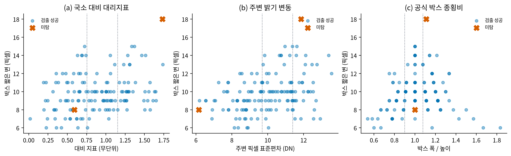

그림 6. 각 점은 정답 박스 하나다. 파란 원은 정검출, 주황색 ×는 미탐이며, 점선은 학습 자료에서 정한 낮음·중간·높음 구간의 경계다. 세 패널은 왼쪽부터 정답 안팎의 밝기 차이, 주변 픽셀의 밝기 변화, 정답 박스의 폭과 높이 비율을 박스 짧은 변과 비교한다. 두 주황색 표식이 한쪽 끝에 함께 모이지 않는 것을 볼 수 있다. 실제로 두 미탐 중 하나는 짧은 변 8픽셀·낮은 대비, 다른 하나는 짧은 변 18픽셀·높은 대비에 놓여 있다. 이 그림은 특정 크기나 대비만으로 미탐을 설명하기보다 사례별 박스 정렬도 함께 볼 필요가 있음을 보여준다.

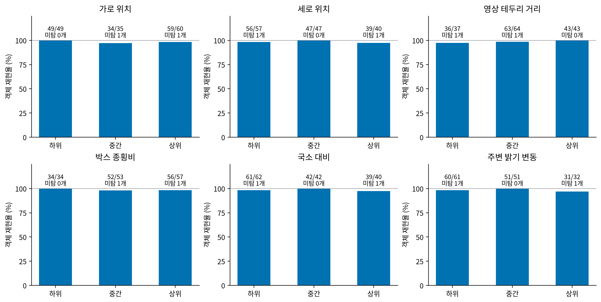

그림 7. 여섯 패널은 가로 위치, 세로 위치, 영상 가장자리 거리, 박스 폭/높이 비율, 대비 대리지표, 주변 밝기 변동을 각각 낮음·중간·높음으로 나눠 재현율을 나타낸다. 막대 위의 분수는 정검출 수와 정답 수이고, 그 아래 미탐 수를 덧붙였다. 예를 들어 49/49는 49개 전부 검출한 경우다. 대부분의 막대가 100%에 가깝고, 미탐은 여러 조건에 하나씩 나뉘어 있다. 막대 높이와 함께 각 구간의 정답 수를 읽으면, 비슷한 재현율이 어느 정도의 표본에서 얻어진 결과인지 알 수 있다.

여기서 대비 대리지표는 공식 정답 영역과 그 주변의 평균 밝기 차이를 주변 밝기 변동으로 나눈 값이다. 물질의 밀도를 직접 측정한 수치는 아니다. 주변 표준편차는 주변 픽셀 밝기가 얼마나 달라지는지를 나타내며, 배경 무늬와 잡음도 함께 반영한다. 박스 폭/높이 비율 역시 TXT 상자의 모양이며 실제 이물의 물리적 형상을 뜻하지 않는다. 이 조건들은 정답을 이용해 사후 분석했으므로 모델이 검사 중 새 영상을 분류할 때 사용하는 신호와 구분한다.

### 3.4 성공·미탐 사례 비교

그림 5에서 보듯이, 미탐 110과 136은 이물 주변에 경보 상자가 있었지만 공식 정답과 충분히 겹치지 않았다. 표 7은 그때 만들어진 후보가 NMS 전후와 최종 경보에서 어느 정도 정답에 가까웠는지 보여준다. IoU가 1이면 두 박스가 완전히 겹치고 0이면 서로 겹치지 않는다. 이번 정검출 기준은 IoU 0.5 이상이다.

표 7. 두 미탐은 중복 박스를 제거하는 NMS를 적용하기 전부터 IoU 0.5 이상인 후보가 없었다.

| 정답 추적 번호 | TXT 박스 크기 | NMS 전 최고 IoU | NMS 후 최고 IoU | 최종 경보 중 최고 IoU | 확인 결과 |
|---|---:|---:|---:|---:|---|
| 110 | 20×18px | 0.441 | 0.366 | 0.350 | 저장 후보에서 IoU 0.5 이상 박스가 없었음 |
| 136 | 8×8px | 0.481 | 0.442 | 0.409 | 저장 후보에서 IoU 0.5 이상 박스가 없었음 |

NMS 전 최고 IoU가 이미 0.5보다 낮으므로, 이 두 사례는 NMS가 좋은 박스를 지웠거나 점수 임계값만 높아서 생긴 실패와 다르다. 특히 정답 136은 최고 후보도 0.481이어서, 당시 저장된 후보 중 가장 잘 맞는 박스를 고르더라도 정검출 기준을 넘지 못한다.

성공 사례 두 건은 다른 모습을 보였다. 정답 106은 실제 최고점수 후보의 IoU가 0.837이고, 가장 잘 맞는 후보는 0.846이었다. 정답 135는 최고점수 후보의 IoU가 0.634인 반면, NMS 전에는 0.764인 더 정밀한 후보가 있었다. 두 경우 모두 공식 기준으로 검출됐지만, 정답 135는 더 잘 맞는 후보가 최고 점수를 받지 못한 예다. 따라서 후보의 위치를 맞추는 문제와 여러 후보 가운데 어느 것을 출력할지 정하는 문제를 나눠 살펴볼 수 있다. 오른쪽 패널의 가장 좋은 후보는 정답을 알고 난 뒤 고른 진단용 비교값이다.

대표 가중치에서 나온 오검출 6개도 따로 살폈다. 이 가운데 3개는 같은 물체를 여러 번 감싼 중복 박스, 2개는 공식 박스와 경계가 덜 맞은 박스, 1개는 정답과 짝지어지지 않은 후보였다. 이 결과는 위치 검출률만으로는 검출 후 남는 오류의 성격까지 설명하기 어렵다는 점을 보여준다.

이 장의 결과를 종합하면, 이번 검증 자료에서 남은 두 객체 미탐은 주변 후보가 전혀 없어서가 아니라 공식 박스와의 경계 정렬이 부족한 사례였다. 동시에 검증의 양성 영상 66장에는 모두 최소 한 개의 경보가 있었다. 객체 위치 정확도와 영상 단위 경보를 구분해 보는 이유이며, 다음 장의 임계값·재검사 분석으로 이어진다.

## 제4장 — 판정 임계값·재검사·현장 활용

대표 모델은 검증 영상의 이물 144개 중 142개를 검출했고, 이물이 포함된 66개 영상 모두에서 경보를 냈다. 다만 다른 촬영 그룹과 시험 영상에 검증 기준을 그대로 적용했을 때 영상당 오검출 수는 달라졌다. 이 장에서는 임계값을 낮춰도 회수되지 않는 위치 미탐, 촬영 조건에 따른 임계값 변화, 재검사 목록과 작업자 표시 영역을 차례로 살펴본다. 마지막에는 이 결과를 실제 검사 흐름으로 연결하고, 제품을 격리·작업자 검토·자동 통과 후보로 나누는 선택적 검사 확장안을 제시한다.

현재 자료에서는 경보 위치와 작업자의 검토 범위를 분석했다. 정상 제품 영상이 제공되지 않아 자동 통과 기준을 정하는 실험까지 진행하지는 못했지만, 향후 정상·불량 현장 자료를 확보하면 판단이 어려운 제품에 작업자 검토를 집중하는 방식으로 확장할 수 있다. 다음 절들은 이러한 운영안을 뒷받침하는 실험 결과와 적용 절차를 설명한다.

### 4.1 객체 검출과 영상 경보

대표 모델은 객체 기준으로 미탐 2건이 있었지만, 검증의 양성 영상 66장 모두에서 적어도 한 개의 경보 박스를 출력했다. 객체 평가는 각 정답 이물의 위치를 맞췄는지 보고, 영상 경보는 해당 영상이 작업자의 확인 대상으로 넘어갔는지를 본다. 그래서 “이물 박스가 정확히 검출됐는가”와 “이 제품 영상이 경보를 받았는가”를 별개의 결과로 제시했다.

두 미탐은 이물 가까이에는 경보 박스가 있었고, 공식 정답과의 IoU가 0.5에 못 미쳤다. 즉 객체 위치 평가에서는 미탐이지만, 영상 단위로 보면 검토 대상으로 남은 사례다. 이 구분은 모델의 경계 정확도와 검사 라인의 경보 흐름을 함께 이해하는 데 도움이 된다.

### 4.2 임계값 설정과 FROC

검출 점수 임계값을 낮춰 저장 후보를 더 많이 내보내도, 대표 모델의 정검출 수는 142/144에서 포화됐다. 앞 장에서 본 두 미탐은 후보의 점수가 낮아서만 생긴 것이 아니라 최고 후보의 IoU가 0.5에 미달했기 때문이다. 따라서 점수 기준은 오검출과 미탐의 균형을 조절하지만, 이미 위치가 어긋난 박스를 정확한 박스로 바꾸지는 않는다.

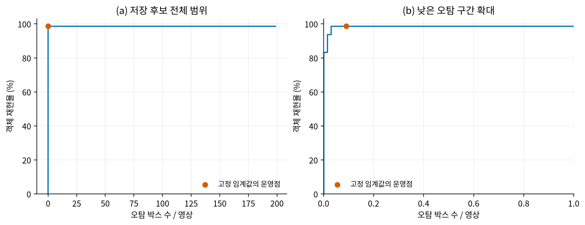

그림 8. FROC(Free-response Receiver Operating Characteristic)는 검출 점수 기준을 바꿀 때 객체 재현율과 영상당 오검출 박스 수가 어떻게 달라지는지 보여준다. 왼쪽은 저장 후보 전체 범위, 오른쪽은 오검출이 적은 구간을 확대했다. 각 점은 다른 점수 임계값의 결과이며, 주황색 원은 FP 6개인 비교 운영점이다. 이 점에서 TP는 142/144, 영상당 오검출은 6/66=0.091개다. 운영점의 검출 점수 임계값 약 0.193과 영상당 오검출 0.091은 서로 다른 값이다. 곡선이 142개에서 평평해지는 것은 점수를 더 낮춰도 남은 두 정답에 IoU 0.5를 넘는 저장 후보가 없다는 뜻이다. 이 FROC는 양성 영상에서 계산한 박스 오검출 곡선이며 정상 제품의 오경보율과는 다르다.

고정 임계값을 검증과 시험에 그대로 적용한 결과도 비교했다. 그림 9는 왼쪽부터 객체 재현율, 영상당 오검출 박스, 양성 영상 경보율을 보여준다. 검증에서는 MAL과 MAL+UQ의 재현율이 모두 98.38%였고, 시험에서는 95.15%와 95.31%였다. 양성 영상 경보율은 두 자료 모두 100%였지만, MAL+UQ의 영상당 오검출은 검증 0.091개에서 시험 0.190개로 늘었다. 시험 영상은 84장, 정답은 206개다. 즉 시험에서 모든 양성 영상이 경보를 받았다는 사실과 오검출 부담이 검증과 같았다는 주장은 구분해서 읽어야 한다.

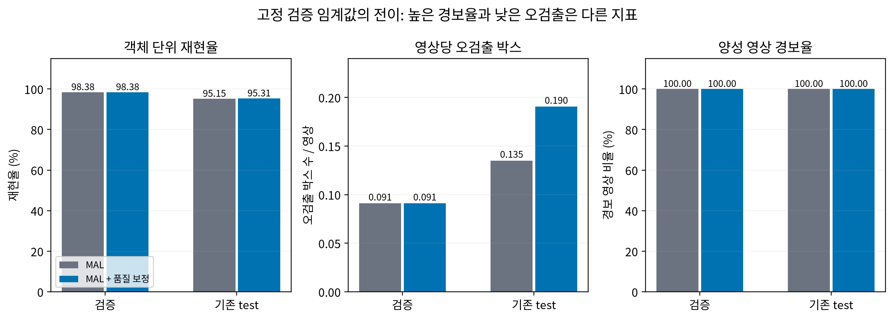

그림 9. 회색 막대는 MAL, 파란 막대는 MAL+UQ 결과다. 두 모델 모두 검증과 시험에서 양성 영상 경보율은 100%였다. 오른쪽 패널만 보면 문제가 없어 보일 수 있지만, 왼쪽의 객체 재현율은 시험에서 검증보다 낮고 가운데 영상당 오검출은 늘었다. 세 패널을 함께 읽어야 경보가 발생했는지, 이물 위치를 맞췄는지, 추가 확인 부담이 얼마나 되는지를 나눠 볼 수 있다. 세 값은 각각 영상 경보율, 객체 재현율, 오검출 박스 수이므로 같은 성능 지표처럼 비교하지 않는다.

안전한 임계값을 정하려면 목표 장비와 제품을 대표하는 별도 보정 자료가 필요하다. 먼저 현장에서 허용할 미탐 위험과 작업자가 처리할 수 있는 검토량을 정하고, 점수 기준마다 재현율·영상당 오검출·제품 단위 판단 결과를 비교한다. 허용 위험을 만족하는 기준 중 확인 부담이 낮은 것을 고른 뒤, 새 촬영 그룹에서 고정 기준으로 다시 확인하는 절차가 적절하다. Conformal Risk Control은 보정 자료에서 정한 규칙으로 목표 위험을 관리하는 방법을 제시하고(Angelopoulos et al., 2024, ICLR 2024), Andeol et al. (2023)은 Conformal and Probabilistic Prediction with Applications 심포지엄(CPPA, PMLR)에서 철도 신호 검출에 불확실성을 반영한 박스 출력을 적용했다. 여기서 수행한 실험은 그 연구의 통계 보장을 재현한 것이 아니라, 현재 검증 데이터에서 임계값이 다른 촬영 그룹에 어떻게 옮겨가는지를 비교한 것이다.

### 4.3 촬영 그룹 간 임계값 전이

11개 촬영 그룹을 하나씩 제외하고 나머지 그룹으로 점수 기준을 정한 뒤, 제외한 그룹에 적용했다. 이 과정을 반복해 각 그룹을 한 번씩 미리 보지 않은 평가 대상으로 삼았다. 표 8의 ‘보정 목표’는 임계값을 정할 때 사용한 기준이고, 정검출·미탐·오검출은 제외 그룹에 적용한 결과다.

표 8. 검증셋 안에서 촬영 그룹 하나를 제외해 임계값을 정한 뒤, 제외 그룹에서 성능을 비교했다.

| 임계값을 정한 기준 | 제외 그룹 정검출 /144 | 미탐 | 오검출 | 오검출/영상 | 재현율 |
|---|---:|---:|---:|---:|---:|
| 보정 그룹 영상당 오검출 ≤0.1개 | 142 | 2 | 7 | 0.106 | 98.61% |
| 보정 그룹 전체 재현율 ≥95% | 135 | 9 | 2 | 0.030 | 93.75% |
| 보정 그룹 전체 재현율 ≥98% | 140 | 4 | 2 | 0.030 | 97.22% |

오검출 목표 방식은 제외 그룹에서 기존과 거의 같은 정답 142개를 찾았고 재현율은 98.61%였다. 다만 영상당 오검출은 0.106개로 보정 목표인 0.1개를 조금 넘었다. 전체 재현율 95%와 98%를 목표로 정한 임계값은 제외 그룹에서 각각 93.75%와 97.22%를 기록했다. 평균 결과에서 정한 기준이 새 그룹에서도 그대로 유지되지는 않았다는 뜻이다. 표의 분모 144는 11회 제외 평가에서 각 영상이 제외 그룹 결과로 한 번씩 포함된 뒤 합산한 전체 정답 수다.

모든 보정 그룹에서 95% 재현율을 요구한 더 엄격한 조건은 11회 중 10회에서 만족 가능한 임계값이 없었다. 임계값 보정 데이터 안에서조차 일부 촬영 그룹의 성능을 동시에 맞추기 어려웠음을 보여준다. 상세 그룹별 결과는 제8장 8.1절에 제시한다.

### 4.4 재검사 우선순위 평가

낮은 후보 점수, YOLO와의 박스 불일치, 두 검출기의 박스 개수 차이를 영상별 재검사 신호로 비교했다. 표 9의 값은 해당 신호로 고른 영상 안에 실제 미탐 정답이 몇 개 포함됐는지 3회 학습 결과에 걸쳐 평균한 수다. 무작위 값은 같은 수의 영상을 반복해서 무작위로 고를 때 기대되는 평균이다.

표 9. 같은 검토 예산에서 각 신호가 찾아낸 미탐 수를 무작위 영상 선택과 비교했다.

| 검토 영상 수 (검증 영상 대비) | 낮은 후보 점수 | 박스 위치 불일치 | 박스 개수 차이 | 무작위 선택 평균 |
|---|---:|---:|---:|---:|
| 4장 (6.1%) | 0.67 | 0.00 | 0.00 | 0.149 |
| 7장 (10.6%) | 0.67 | 0.33 | 0.00 | 0.257 |
| 14장 (21.2%) | 1.00 | 0.67 | 0.00 | 0.502 |

검토 예산을 4·7·14장으로 늘리면 낮은 점수 신호가 포함한 미탐의 평균도 0.67개에서 1개로 늘었다. 하지만 미탐 자체가 반복별로 3·2·2개뿐이라 결과는 한두 영상의 순위에 크게 좌우된다. 박스 위치 불일치 신호도 일부 예산에서 미탐을 포함했지만, 박스 개수 차이는 이번 비교에서 미탐을 포함하지 못했다.

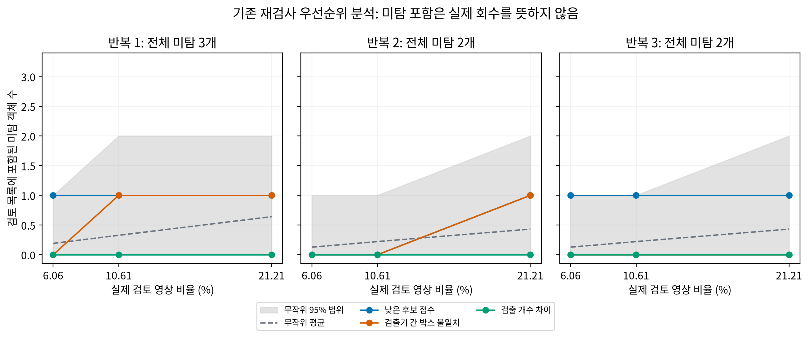

그림 10. 세 패널은 세 번의 학습 반복을 각각 보여주며, x축은 검증 영상 중 실제 검토한 비율(4·7·14장)이다. 색 선은 각 신호로 우선순위를 정했을 때 선택 목록에 포함된 미탐 수다. 회색 점선은 같은 수의 영상을 10,000회 무작위로 골랐을 때 평균이고, 회색 영역은 그 결과의 2.5~97.5백분위다. 신호가 무작위 평균보다 높은 지점도 있지만 모든 반복과 예산에서 같은 차이를 보이지 않는다. 특히 작은 검토 예산에서는 한 영상 순위가 결과를 크게 바꾼다. 그러므로 이 결과는 재검사 신호 후보를 비교한 것이며, 실제로 작업자가 미탐을 찾아 회수했다는 측정은 아니다.

Andeol et al. (2023, Conformal and Probabilistic Prediction with Applications 심포지엄)은 철도 신호 검출에서 탐지 결과의 불확실성을 보정하는 방법을 연구했다. 우리 자료에서도 영상 단위로 검토 순서를 만드는 방식이 자연스럽지만, 적은 미탐 수에 여러 신호를 맞춰 하나의 위험 점수로 합치면 검증 자료에 과하게 맞을 수 있다. 현재는 경보 위치와 검토 사유를 화면에 함께 보여주고, 실제 작업자의 선택·확인 결과를 쌓아 우선순위를 평가하는 방향이 적절하다.

### 4.5 검토 영역과 표시 여백

작업자가 작은 이물 주변을 확인할 수 있도록 예측 박스 바깥에 원본 픽셀 기준 여백을 더하는 방법을 비교했다. 2픽셀 여백을 사용하면 공식 정답 면적의 95% 이상이 표시 영역에 들어오는 사례가 45개에서 137개로 늘었다. 영상에서 표시하는 평균 면적은 0.176%에서 0.337%로 증가했다. 여백은 화면 표시 범위에만 적용하며 검출 좌표나 AP 계산을 바꾸지 않는다.

표 10. 예측 박스 주위에 더한 여백과 정답 포함 수, 화면에 표시된 평균 면적을 비교했다.

| 추가 여백 | 정답 면적의 95% 이상 포함 /144 | 영상당 평균 표시 면적 |
|---|---:|---:|
| 0픽셀 | 45 | 0.176% |
| 2픽셀 | 137 | 0.337% |
| 4픽셀 | 143 | 0.549% |

2픽셀에서 4픽셀로 넓히면 더 많은 정답 영역을 보여주지만 표시 면적도 커진다. 그림 11의 전체 비교에서는 8픽셀 여백일 때 정답 144개 모두의 95% 이상이 포함되지만, 영상당 평균 표시 면적도 1.101%로 증가한다. 따라서 여백은 포함도를 높이는 동시에 작업자가 확인할 화면 범위도 늘리는 선택이다. 제8장 8.2절에 여백별 전체 수치를 제시한다.

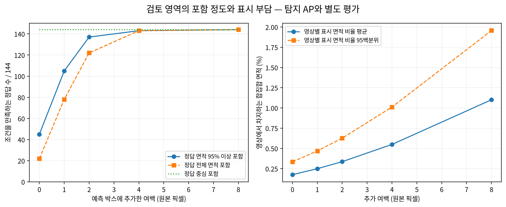

그림 11. 왼쪽 그래프는 여백을 넓힐수록 정답 박스 면적의 95% 이상이 표시 영역에 포함되는 수가 어떻게 변하는지 보여준다. 초록 점선은 정답 중심이 포함된 수로, 여백이 없어도 144개 모두 들어온다. 오른쪽 그래프는 영상 한 장에서 표시되는 면적의 평균과 95백분위를 나타낸다. 4픽셀부터 포함도는 거의 포화하지만 화면 표시 면적은 계속 커진다. 이 수치는 정답 영역이 얼마나 보였는지와 화면 표시량을 비교한 것이며, 실제 사람의 발견률이나 작업시간을 측정한 결과는 아니다.

### 4.6 검사 흐름과 보조 화면

검사 화면은 모델 결과를 작업자가 확인하기 쉬운 위치와 범위로 전달하는 데 초점을 두었다. 그림 12에서 주황색 선은 최종 탐지 박스, 청록색 선은 2픽셀 검토 여백, 자주색 십자는 작업자가 클릭해 표시한 의심 위치다. 오른쪽에는 현재까지의 확인 수와 메모 입력란이 있다.

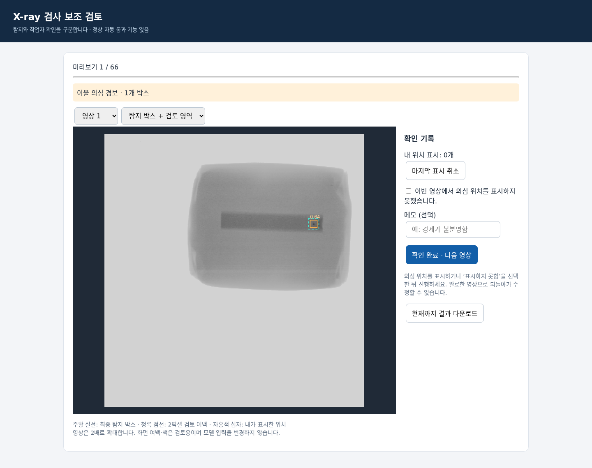

그림 12. 화면은 양성 영상 66장의 고정 예측을 표시한 검사 보조 예시다. 작업자는 이물 의심 위치를 확대해 보고, 위치를 찾았는지 표시하거나 미발견 상태를 선택하고, 필요하면 메모를 남긴다. 위치 표시와 미발견 선택은 서로 다른 결과로 저장된다. 이 화면은 검토 절차를 보여주는 예시이며 실제 작업자 비교 결과는 포함하지 않는다.

표 11은 어떤 정보를 영상 분석에 쓰고, 어떤 정보를 실제 검사 시점에 얻을 수 있는지 나눈다. 공식 정답 박스의 크기·위치·대비는 결과를 이해할 때 유용하지만, 정답은 추론 때 알 수 없으므로 실시간 재검사 신호가 될 수 없다. 반면 검출 점수, UQ 위치 품질, 모델 간 불일치는 예측에서 얻을 수 있어 검토 사유를 설명할 수 있다. 물질 밀도·재질과 정상 여부는 현재 영상·라벨에서 직접 얻지 못하므로 별도 현장 자료가 필요하다.

표 11. 분석 후에만 알 수 있는 조건과 검사 시점에 사용할 수 있는 신호를 구분했다.

| 정보 | 무엇을 설명하는가 | 활용 시점 |
|---|---|---|
| 정답 박스의 크기·위치·폭/높이 비율·대비 | 어떤 조건에서 검출과 미탐이 나왔는지 | 결과 분석 후 |
| 검출 점수·UQ 위치 품질·검출기 간 불일치 | 경보가 얼마나 확실한지, 추가 확인이 필요한지 | 추론과 작업자 확인 |
| 영상 크기·장비·촬영 날짜·파일 형식 | 입력 조건이 학습과 다른지 | 촬영 및 입력 점검 |
| 물리적 밀도·재질·제품 경계·정상 여부 | 현재 자료에서 직접 측정하지 않은 실제 조건 | 현장 라벨을 확보한 뒤 분석 |

실제 운영에서는 경보가 난 위치를 작업자가 확인하고, 판단이 어려운 영상은 격리하거나 다시 촬영한 뒤 결과를 기록하는 흐름으로 연결할 수 있다. 기록에는 모델의 점수, 확인 사유, 작업자 판단, 재촬영 여부를 함께 남긴다. 이 자료가 쌓이면 장비·제품별 임계값과 재검사 기준을 다시 비교할 수 있다. 자동 통과 판단은 충분한 정상·불량 제품의 현장 결과를 함께 분석한 다음 별도로 검토할 수 있다.

### 4.7 선택적 검사 운영 확장

현장에서는 이물의 근거가 충분한 제품을 우선 격리하고, 판단이 어려운 제품에 작업자의 확인을 집중하는 방식으로 확장할 수 있다. 정상·불량 제품을 함께 수집해 통과 기준을 정하면, 나머지 제품은 자동 통과 후보로 분류할 수 있다. 이 구조의 목적은 모든 경보를 같은 검토 목록에 넣는 대신, 제품별로 필요한 조치를 구분하는 데 있다.

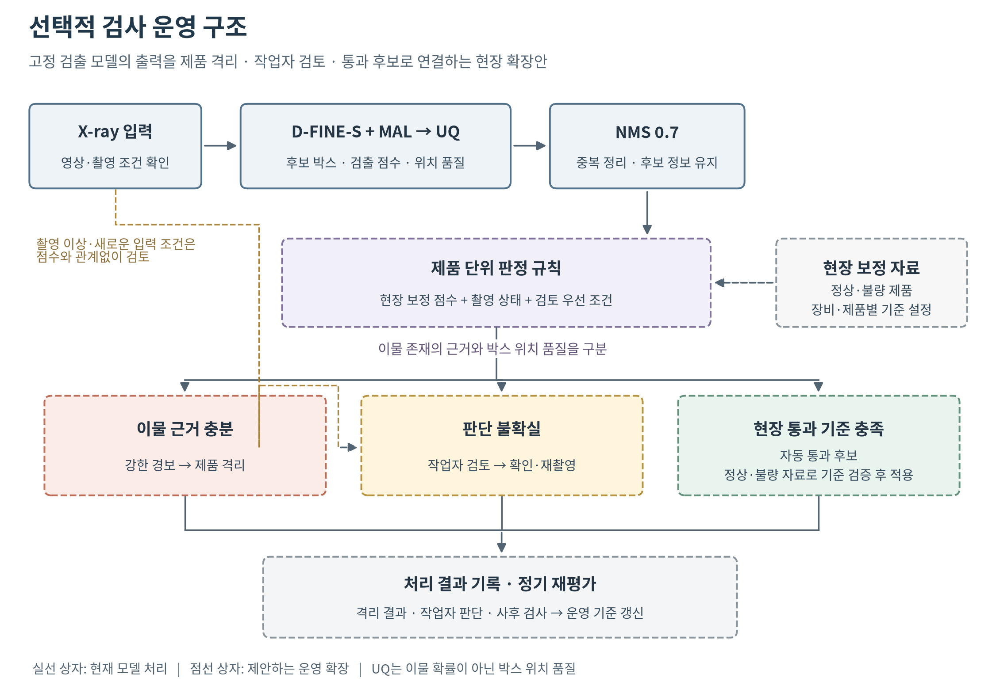

그림 13. 현재 검출 모델을 유지하면서 제품 단위의 판단 절차를 추가하는 운영 확장안이다. 실선 상자는 현재 모델의 처리 단계를, 점선 상자는 현장 자료로 기준을 정해 적용할 운영 단계를 나타낸다. 이물 근거가 충분한 제품은 격리하고, 애매한 제품은 작업자가 검토하며, 별도 보정에서 통과 기준을 충족한 제품은 자동 통과 후보로 분류한다. 촬영 이상이나 새로운 입력 조건은 점수와 관계없이 검토 대상으로 보낸다. 이 그림은 구조 제안이므로 처리 비율이나 성능 수치를 표시하지 않았다.

이러한 접근은 선택적 예측(selective prediction) 연구와 연결된다. Geifman과 El-Yaniv의 SelectiveNet(ICML 2019)은 모델이 직접 판단하는 비율과 그 판단의 오류를 함께 평가했다. 우리 운영안에서도 자동 처리 비율을 높이는 것과 불량 제품의 통과를 줄이는 것을 함께 살펴본다. Mozannar와 Sontag(ICML 2020)의 전문가 위임 연구는 전문가의 판단 자료를 이용해 어떤 사례를 사람에게 넘길지 학습한다. 이를 참고하면 작업자 검토의 효과도 실제 확인 결과와 소요시간으로 평가할 수 있다. 본 운영안은 이 논문들의 모델을 추가로 학습하는 대신, 자동 처리와 사람 검토를 나누는 설계·평가 관점을 활용한다.

판정 기준을 만들 때는 검출 점수와 UQ의 의미를 구분해야 한다. UQ는 박스가 정답 위치와 얼마나 잘 맞는지를 예측한다. 이물이 있어도 경계가 모호하면 위치 품질이 낮을 수 있으므로, 낮은 UQ 값을 정상 근거로 사용하지 않는다. NMS 이후 후보 정보와 검출 점수는 제품 단위 판단의 입력으로 쓰고, UQ는 위치 확인이 필요한 이유를 설명하는 보조 정보로 활용한다. 출력 박스가 없거나 점수가 낮은 제품도 현장 통과 기준을 거쳐야 한다.

현장 적용은 다음 순서로 진행할 수 있다.

1. 목표 장비·제품에서 정상과 불량 영상을 함께 수집한다. 모델 출력을 제품 단위 점수로 모으는 규칙을 정하고, 기준을 정할 보정 자료와 새 촬영 그룹의 평가 자료를 분리한다.
2. 제품 단위 점수에 두 기준을 두어 격리·검토·통과 후보를 나눈다. 불량 제품의 통과를 먼저 제한하고, 그 범위 안에서 정상 제품의 불필요한 격리와 작업자 검토량을 줄이는 기준을 찾는다. 촬영 상태가 나쁘거나 적용 범위를 벗어난 입력은 검토를 우선한다.
3. 기준을 고정한 뒤 새 촬영 그룹에서 불량 유출률, 정상 제품 격리율, 작업자 검토율을 평가한다. 작업자가 실제로 바로잡은 오류와 검토시간도 함께 기록한다.

불량 유출률은 전체 불량 제품 중 통과로 분류한 비율이고, 정상 제품 격리율은 전체 정상 제품 중 격리한 비율이다. 작업자 검토율은 전체 제품 중 사람이 확인한 비율이다. 세 지표를 함께 보면 불량을 놓치는 위험과 불필요한 검사 부담을 동시에 비교할 수 있다. 앞 절의 영상당 오검출 박스 수와 달리, 이 지표들은 제품에 내린 최종 조치를 평가한다.

임계값 보정에는 Angelopoulos et al.의 Conformal Risk Control(ICLR 2024)처럼 허용할 위험에서 출발해 기준을 정하는 방법도 검토할 수 있다. 이 방법의 통계적 보장은 보정 자료와 적용 자료에 관한 가정 아래 성립하므로, 장비나 제품이 바뀌면 별도의 전이 평가가 필요하다. 현재 실험에서 관찰한 촬영 그룹별 성능 변화는 이러한 재평가의 필요성을 뒷받침한다.

현재 데이터는 이물이 포함된 영상으로 구성되어 있어 정상 제품의 점수 분포와 불필요한 격리량을 측정할 수 없었다. 따라서 이번 결과에서는 경보·재검사 분석을 제시하고, 자동 통과 영역은 정상·불량 현장 자료를 확보한 뒤 확정하는 확장 단계로 두었다. 이렇게 하면 기존 모델을 바꾸지 않고도 작업자 검토를 필요한 제품에 집중하는 검사 체계로 발전시킬 수 있다.

## 제5장 — 창의성 및 차별성

이 프로젝트는 실제 오류를 관찰해 다음 실험을 정하고, 비교 결과에 따라 모델을 선택했다. 고해상도 특징, 매칭 손실, 위치 품질, 후보 순위, 주변 픽셀, 경계 완화 가설을 같은 평가 기준에서 비교했다. 모델 선정 이후에는 임계값 전이, 재검사 우선순위, 작업자 표시 영역까지 분석해 선택적 검사 운영안으로 연결했다. 이 장에서는 모델링과 현장 적용에서 얻은 기여를 정리하고, 선행연구에서 참고한 부분과 추가 검증 방향을 설명한다.

### 5.1 실패 분석 기반 설계와 검증

작은 물체를 위해 고해상도 특징을 먼저 확인했지만 P2의 이득은 모든 모델과 운영 지표에서 같지 않았다. 후보와 정답의 매칭을 반영하는 MAL, 후보별 위치 품질을 점수에 반영하는 UQ를 이어서 비교했고, 각각 낮은 오검출 조건의 검출 수와 전체 후보 순위에 미친 효과를 나눠 보았다. 표 12는 이 결정 흐름과 참고한 논문을 함께 정리한다.

표 12. 실험에서 확인한 기여와 그 아이디어를 참고한 선행연구 및 학회다.

| 확인한 기여 | 참고한 아이디어와 발표처 | 실제로 한 일과 결과 |
|---|---|---|
| 오류를 단계별로 나눠 다음 실험을 정함 | TIDE, 유럽 컴퓨터 비전 학회 ECCV 2020 | 후보 생성, 박스 경계, 점수 기준, NMS 이후 결과를 분리해 두 미탐의 실패 단계를 확인 |
| 작은 이물의 특징 보존을 점검 | QueryDet, CVPR 2022; DM-EFS, ICCV 2025 | 고해상도 특징 경로 P2를 두 기본 모델에서 비교했고, 지표 전반의 일관된 이득은 확인하지 못해 최종 모델에는 고정하지 않음 |
| 매칭 품질을 학습에 반영 | DEIM의 MAL, CVPR 2025 | D-FINE-S에 MAL 손실을 적용해 낮은 오검출 기준의 정답 검출 수를 평균 140.33개에서 141.67개로 높임 |
| 위치 품질과 검출 점수의 차이를 보정 | GFLv2, CVPR 2021; Rank-DETR, NeurIPS 2023 | D-FINE 후보 특징을 받는 UQ를 설계했고, MAL에 더했을 때 AP +1.02점, AP75 +1.63점. 같은 이물 주변의 최고점수 후보는 바뀌지 않음 |
| 촬영 그룹 변화와 사람 검토를 함께 점검 | Conformal Risk Control, ICLR 2024; Andeol et al., CPPA 심포지엄, PMLR 2023 | 그룹을 제외하는 임계값 전이, 무작위 검토 비교, 정답 포함도와 화면 표시 면적을 각각 측정 |

표에서 보듯이 MAL은 DEIM 논문의 손실을 적용한 것이고, UQ는 품질을 점수에 반영하는 기존 문제의식에 따라 프로젝트 데이터에 맞게 별도로 구성했다. 프로젝트의 차별점은 관찰한 실패에 맞춰 선행연구의 개념을 선택하고, 같은 조건의 비교와 오류 분석으로 효과를 확인한 데 있다.

모델 이후의 분석도 운영 설계에 반영했다. 촬영 그룹이 바뀌면 임계값 성능이 달라졌으므로 장비·제품별 보정 절차를 두었고, 재검사 신호는 무작위 선택과 비교했다. 검토 영역은 정답 포함도와 표시 면적을 함께 측정해 작업자 화면의 범위를 정하는 근거로 사용했다. 제4장의 선택적 검사 확장안은 이러한 결과를 격리·검토·통과 후보라는 제품 단위 조치로 연결한다.

세 가지 조치로 나누는 개념은 기존 선택적 예측·전문가 위임 연구와 연결된다(Geifman & El-Yaniv, 2019; Mozannar & Sontag, 2020). 이 프로젝트에서는 이를 X-ray 검사에 맞춰 구체화하고, 이물 존재의 근거와 박스 위치 품질을 구분했다. 현재 확인한 성과는 운영안을 뒷받침하는 실험과 설계이며, 검토량 절감 효과는 정상·불량 제품 및 작업자 결과를 확보한 뒤 평가할 수 있다.

### 5.2 적용 범위와 향후 검증

현재 결과는 제공된 양성 X-ray 자료에서 모델 선택, 객체별 오류, 임계값 변화와 검토 영역을 분석한 것이다. 특히 두 미탐, 적은 수의 촬영 그룹, 정상 영상의 부재를 고려하면 크기·재질·밀도 조건별 결론을 넓은 생산 환경 전체로 확장하기보다 관측된 사례와 분모를 함께 제시하는 편이 정확하다.

다음 단계의 검증은 두 방향으로 이어질 수 있다. 합성 X-ray에서는 크기·위치·대비를 하나씩 조절해 현재 모델이 어떤 조건에서 점수나 위치 품질을 잃는지 스트레스 테스트할 수 있다. 실제 현장에서는 정상·불량 제품과 작업자 확인 결과를 확보해 불량 유출률, 정상 제품 격리율, 작업자 검토율과 재촬영 효과를 측정할 수 있다. 합성 조건의 결과와 실제 생산 자료의 성능은 별도 근거로 보고한다.

## 제6장 — 코드 구성 및 재현성

고정한 대표 가중치의 추론과 평가는 새 가상환경에서도 같은 결과를 냈다. 반면 MAL·UQ의 학습 진입점은 기본 동작을 점검했지만, 전체 학습을 새로 반복하거나 다른 컴퓨터에서 학습 결과까지 비교한 것은 아니다. 이 장에서는 고정한 모델과 평가 조건, 확인한 재현 범위를 설명한다.

### 6.1 고정 모델 추론·평가 재현성

대표 가중치로 검증 영상 66장을 다시 처리했을 때, 예측 좌표·점수와 평가 결과가 일치했다. 대표 모델은 AP 39.28, AP75 19.66, 정답 142개, 오검출 6개를 기록했다. 추론 단계에는 TXT 정답을 넣지 않고, 모델 출력과 정답을 비교하는 평가 단계에서만 공식 라벨을 사용했다.

표 13. 고정 모델 실행과 학습 절차에서 확인한 재현 수준이다.

| 확인 범위 | 결과 |
|---|---|
| 고정 가중치 추론·평가 | 새 가상환경에서 검증 예측 좌표·점수·평가값이 일치 |
| MAL 학습 진입점 | 작은 배치에서 손실과 기울기가 유한한 값인지 점검 |
| UQ 학습 진입점 | 위치 품질 예측부가 갱신되고 검출기 가중치는 고정되는지 점검 |
| 전체 학습 반복 | 전체 학습 일정을 다시 수행하지 않았으며, 3회 학습 결과는 기존 저장값으로 비교 |
| 다른 GPU·컴퓨터 | 같은 결과를 내는지 별도 비교하지 않음 |

여기서 확인한 것은 고정 가중치에 대한 추론·평가의 재현성과 학습 코드의 기본 실행 여부다. 학습 전체를 다시 돌렸을 때 가중치가 비트 단위로 같아지는 재현성과는 다르다. CUDA의 일부 역전파 연산은 실행마다 차이가 날 수 있어 학습 성능은 세 난수 초기값의 평균과 표준편차로 함께 제시했다.

### 6.2 평가 조건

모델 간 비교가 같은 기준에서 이뤄지도록 데이터 분할과 평가 규칙을 고정했다. 대표 결과는 난수 초기값 20260930의 단일 가중치이며, 평균±표준편차로 제시한 값은 세 번 학습한 결과를 따로 집계한 것이다.

표 14. 대표 모델 결과를 해석할 때 사용한 주요 조건이다.

| 항목 | 고정 조건 |
|---|---|
| 학습·검증 자료 | 학습 350장·797개 정답, 검증 66장·144개 정답 |
| 대표 모델 | D-FINE-S + MAL + UQ, 난수 초기값 20260930 |
| 입력 변환 | 640×640 입력 크기에 맞추고 여백을 채우는 방식 |
| 중복 박스 정리 | NMS IoU 기준 0.7 |
| 박스 배율 | 1.0 |
| 정검출 판정 | 예측과 정답 IoU 0.5 이상, 일대일 대응 |
| 시험 자료 평가 | 검증에서 정한 점수 기준을 그대로 적용 |

따라서 대표 단일 모델의 AP·AP75와 세 번 학습 평균은 서로 다른 결과 단위다. 시험셋 성능은 검증셋에서 정한 기준을 적용한 값으로 제시하며, 검증·시험 결과를 함께 읽어야 모델 성능과 운영 부담을 이해할 수 있다.

### 6.3 모델·학습 방법 출처

기본 검출기 D-FINE-S는 D-FINE(Peng et al., 2025, ICLR 2025)을 바탕으로 했고, MAL은 DEIM(Huang et al., 2025, CVPR 2025)에서 제안한 학습 손실을 적용했다. UQ는 D-FINE 후보 특징을 입력으로 사용하는 프로젝트 구현이다. 기본 검출기, 학습 손실, 프로젝트에서 추가한 품질 예측부를 구분해 설명함으로써 각 구성의 출처와 역할을 명확히 했다.

학습 초기화에는 COCO 사전학습 가중치를 사용했다. 대표 결과는 KAMP 데이터로 학습한 가중치에서 얻었다. 그림과 표의 수치는 본문에 설명한 데이터 분할과 평가 규칙에 따라 계산했다.

## 제8장 — 추가 기술: 세부 진단과 계산 방법

제4장에서는 임계값 전이, 영상 재검사 신호, 표시 여백의 핵심 결과를 먼저 설명했다. 이 장은 그 결과가 어떤 그룹과 계산에서 나왔는지 자세히 보여준다. 표 15와 그림 14는 촬영 그룹마다 임계값 목표가 유지되는지, 표 16과 그림 11은 표시 여백을 넓힐 때 정답이 포함되는 정도와 화면 면적이 어떻게 달라지는지를 설명한다. 마지막에는 다른 검출기의 보완 결과, 사람 검토 절차, 지표 계산 정의를 정리한다.

### 8.1 그룹별 임계값 전이 상세

11개 촬영 그룹 중 하나를 평가에서 제외하고, 나머지 그룹의 자료로 임계값을 정했다. 제외한 그룹에는 해당 기준을 한 번도 사용하지 않은 채 적용했다. 표 15는 11개 평가에서 각 영상이 제외 그룹으로 한 번씩 포함된 결과를 합산한 값이다.

표 15. 오검출 목표와 재현율 목표로 각각 임계값을 정하고, 제외한 촬영 그룹에 적용한 결과다.

| 보정 규칙 | 제외 그룹 정검출 /144 | 미탐 | 오검출 | 오검출/영상 | 전체 재현율 | 목표를 만족할 수 없었던 보정 횟수 |
|---|---:|---:|---:|---:|---:|---:|
| 보정 그룹의 오검출 ≤0.1개/영상 | 142 | 2 | 7 | 0.106 | 98.61% | 0/11 |
| 보정 그룹 전체 재현율 ≥95% | 135 | 9 | 2 | 0.030 | 93.75% | 0/11 |
| 보정 그룹 전체 재현율 ≥98% | 140 | 4 | 2 | 0.030 | 97.22% | 0/11 |
| 각 보정 그룹의 재현율 ≥95% | — | — | — | — | — | 10/11 |

첫 번째 규칙은 검증셋의 오검출을 낮게 유지하면서 정답 142개를 검출했지만, 제외 그룹을 합친 결과의 오검출은 영상당 0.106개로 목표 0.1개를 조금 넘었다. 재현율 목표를 둔 두 규칙은 제외 그룹에서 각각 목표보다 1.25%p, 0.78%p 낮았다. 마지막 규칙처럼 각 보정 그룹에서 모두 95%를 요구하면 11번 중 10번은 그 조건을 만족시키는 점수 기준 자체가 없었다. 표의 마지막 열은 목표가 왜 실제 적용에서 어려웠는지를 보여준다.

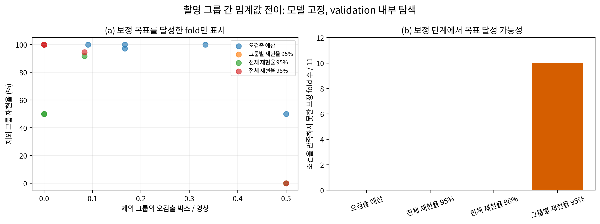

그림 14. 왼쪽의 점 하나는 촬영 그룹 하나를 제외한 평가 결과다(한 번의 제외 평가를 fold라고 부른다). 가로축은 제외 그룹에서 나온 영상당 오검출 수, 세로축은 같은 그룹의 재현율이다. 오른쪽은 각 보정 규칙이 11번 중 몇 번 임계값을 정할 수 있었는지 보여준다. 전체 재현율 목표 방식은 모든 fold에서 기준을 정할 수 있었지만, 그룹별 재현율 95% 목표는 10번에서 가능한 임계값이 없었다. 같은 좌표의 점은 겹쳐 표시될 수 있고, 그룹마다 영상·정답 수가 달라 점 하나의 크기를 동일한 모집단 규모로 해석하지 않는다.

Conformal Risk Control(Angelopoulos et al., 2024, ICLR 2024)은 별도 보정 자료와 명시한 위험 목표를 이용해 판정 규칙을 정하는 연구다. 이번 분석은 촬영 그룹을 나누어 단순 임계값 규칙이 어떻게 옮겨가는지 비교한 경험적 결과이며, 해당 논문의 통계적 보장을 적용한 결과는 아니다.

### 8.2 검토 여백과 표시 면적 분석

검토 영역은 예측 박스의 크기만큼 표시하는 방법부터 주변으로 픽셀 여백을 더하는 방법까지 비교했다. 영역 생성은 모델의 예측 박스만 이용했고, 공식 TXT 정답은 만들어진 영역이 정답을 얼마나 포함했는지 사후 계산할 때 사용했다. 표 16의 포함 수는 정답 144개 중 해당 조건을 만족한 수이며, 면적 비율은 영상 한 장 전체에서 작업자에게 표시되는 영역의 비중이다.

표 16. 여백을 늘렸을 때 정답 중심과 정답 박스가 포함되는 수, 영상 표시 면적을 함께 비교했다.

| 추가 여백 | 정답 중심 포함 /144 | 정답 면적 95% 이상 포함 /144 | 정답 전체 면적 포함 /144 | 영상 표시 면적 평균 | 영상 표시 면적 95백분위 |
|---|---:|---:|---:|---:|---:|
| 0픽셀 | 144 | 45 | 22 | 0.176% | 0.334% |
| 1픽셀 | 144 | 105 | 78 | 0.250% | 0.469% |
| 2픽셀 | 144 | 137 | 122 | 0.337% | 0.627% |
| 4픽셀 | 144 | 143 | 143 | 0.549% | 1.011% |
| 8픽셀 | 144 | 144 | 144 | 1.101% | 1.957% |

여백이 커질수록 정답 주변을 더 많이 표시한다. 2픽셀 여백은 144개 가운데 137개의 정답 면적 95% 이상을 포함하면서 평균 표시 면적을 0.337%로 유지했다. 4픽셀에서는 포함 수가 143개로 6개 더 늘지만 평균 표시 면적은 0.549%로 커진다. 8픽셀에서는 144개가 모두 포함되지만 표시 면적은 평균 1.101%다. 즉 정답 포함을 높이는 것과 화면에 제시할 영역을 작게 유지하는 것 사이에 선택이 있다.

여백에 따른 표시 면적 그래프는 본문 그림 11에서 확인할 수 있다. 이 절에서는 그 그래프의 세부 수치를 표 16으로 제공한다.

Andeol et al. (2023, CPPA 심포지엄)은 철도 신호 탐지에서 불확실성에 맞춰 출력 영역을 구성하는 사례를 보고했다. 여기서는 그 연구의 conformal 절차를 구현한 것이 아니라, 예측 박스 주변에 고정 픽셀 여백을 더했을 때 보이는 영역과 화면 면적의 관계를 측정했다.

### 8.3 검출기 간 미탐 보완 비교

D-FINE-S+MAL+UQ에서 남은 두 미탐을 다른 검출기가 보완할 수 있는지 YOLO 후보와 비교했다. 대표 난수 초기값 20260930의 고정 운영점에서 D-FINE 모델은 정답 142개, YOLO는 136개를 검출했다. 둘 중 하나라도 검출한 정답의 합집합은 142개로, YOLO가 추가로 찾아낸 정답은 없었다. 미탐 110과 136에 대한 YOLO 저장 후보의 최고 IoU는 각각 0.322와 0.410이었다.

이 비교는 두 모델을 결합한 새 앙상블 성능이 아니다. 서로 다른 모델이 현재 남은 오류를 보완할 후보를 제공했는지 살펴본 결과다. 이번 대표 실행에서는 두 미탐 모두 YOLO 후보에서도 공식 정검출 기준 IoU 0.5에 도달하지 않았다.

### 8.4 사람 검토 비교 절차

검사 보조 화면은 영상만 보는 경우, 검출 박스를 함께 보는 경우, 박스와 주변 여백을 함께 보는 경우를 비교할 수 있도록 구성했다. 참가자별로 66장을 22장씩 세 조건에 나누어 배정하고, A·B·C 배정군을 순환해 같은 영상이 각 조건에서 비슷한 횟수로 제시되도록 했다. 한 참가자에게 동일 영상을 반복해 보여주지 않고, 정답 위치와 정답 개수는 화면에 표시하지 않는다.

기록 항목은 정답 영역 안에 위치를 표시했는지, 찾지 못한 영상을 선택했는지, 검토에 걸린 시간이다. 이 측정으로 세 화면 조건의 위치 확인과 소요 시간을 비교할 수 있다. 현재 보고서에 제시한 화면은 검토 절차의 예시이며, 실제 참가자 평가 결과는 포함하지 않았다.

### 8.5 계산 방법

본문에서 사용한 조건부 지표와 영역 계산은 다음과 같다.

- AP: pycocotools의 COCO 박스 평가 설정을 사용했다(maxDets=100). 운영점과 FROC는 검출 점수 순서대로 예측과 정답을 일대일 대응했다.
- 후보 저장: 원본 영상 좌표로 박스를 복원했고, 점수 0.001 이상인 후보를 오류 분석 대상으로 저장했다.
- 재현율: 정답 중 IoU 0.5 이상 예측과 일대일로 연결된 정답 비율이다. TP/(TP+FN)으로 계산했다.
- 대비 대리지표: 정답 영역과 주변 영역의 평균 밝기 차이를 주변 밝기 표준편차로 나눴다. 주변 영역은 정답 박스 주위를 최소 3픽셀, 또는 박스 최대 변의 절반만큼 확장한 창에서 다른 정답 영역을 뺀 곳이다. 안정화 상수 1은 8비트 밝기 단위다.
- 구간별 비교: 학습 정답 797개의 3분위 경계를 검증 정답에 적용했다. 따라서 낮음·중간·높음은 검증 결과를 보고 정한 구간이 아니다.
- 그룹 재표집: 촬영 그룹 단위로 3,000회 재표집했고, 난수 초기값은 20261003이었다. 표본 그룹이 적은 조건에서는 구간 폭이 넓을 수 있어 그룹 수와 원래 정답 수도 함께 제시했다.
- 재검사 신호: 점수 0.25 이상 후보에서 낮은 점수, 검출기 사이 박스 불일치, 검출 개수 차이를 계산했다. 미탐 포함 수는 검토 목록에 들어온 FN 개수이며 실제 작업자의 발견·회수를 뜻하지 않는다.
- 무작위 비교: 검토 영상 수를 4·7·14장으로 맞춰 10,000회 무작위 선택하고 평균과 2.5~97.5백분위를 계산했다.
- 검토 영역: 예측 박스에 더한 여백을 영상 경계 안으로 제한하고, 한 영상에서 겹치는 영역은 합집합으로 계산했다. 정답 면적 포함률은 예측된 검토 영역과 공식 TXT 박스의 교집합을 기준으로 구했다.
- UQ 입력: 후보 query 특징 256차원, FDR 경계 분포 통계 20차원, 기존 점수 1차원, 박스 기하 정보 6차원으로 총 283차원이다. UQ는 후보와 정답 사이의 최대 IoU를 학습 목표로 하고, 추론 때 기존 검출 점수와 예측 품질을 결합해 최종 점수를 계산한다.

## 참고문헌

Andeol, L., Fel, T., de Grancey, F., & Mossina, L. (2023). Confident object detection via conformal prediction and conformal risk control: An application to railway signaling. *Proceedings of the Twelfth Symposium on Conformal and Probabilistic Prediction with Applications*, 36–55. Proceedings of Machine Learning Research, 204. https://proceedings.mlr.press/v204/andeol23a.html

Angelopoulos, A. N., Bates, S., Fisch, A., Lei, L., & Schuster, T. (2024). *Conformal risk control*. International Conference on Learning Representations. https://research.google/pubs/conformal-risk-control/

Bolya, D., Foley, S., Hays, J., & Hoffman, J. (2020). TIDE: A general toolbox for identifying object detection errors. In A. Vedaldi, H. Bischof, T. Brox, & J.-M. Frahm (Eds.), *Computer Vision – ECCV 2020* (Lecture Notes in Computer Science, Vol. 12348, pp. 558–573). Springer. https://doi.org/10.1007/978-3-030-58580-8_33

Geifman, Y., & El-Yaniv, R. (2019). SelectiveNet: A deep neural network with an integrated reject option. *Proceedings of the 36th International Conference on Machine Learning*, 2151–2159. Proceedings of Machine Learning Research, 97. https://proceedings.mlr.press/v97/geifman19a.html

Mozannar, H., & Sontag, D. (2020). Consistent estimators for learning to defer to an expert. *Proceedings of the 37th International Conference on Machine Learning*, 7076–7087. Proceedings of Machine Learning Research, 119. https://proceedings.mlr.press/v119/mozannar20b.html

Huang, S., Lu, Z., Cun, X., Yu, Y., Zhou, X., & Shen, X. (2025). DEIM: DETR with improved matching for fast convergence. *Proceedings of the IEEE/CVF Conference on Computer Vision and Pattern Recognition*, 15162–15171. https://openaccess.thecvf.com/content/CVPR2025/html/Huang_DEIM_DETR_with_Improved_Matching_for_Fast_Convergence_CVPR_2025_paper.html

Li, X., Wang, W., Hu, X., Li, J., Tang, J., & Yang, J. (2021). Generalized focal loss V2: Learning reliable localization quality estimation for dense object detection. *Proceedings of the IEEE/CVF Conference on Computer Vision and Pattern Recognition*, 11632–11641. https://openaccess.thecvf.com/content/CVPR2021/html/Li_Generalized_Focal_Loss_V2_Learning_Reliable_Localization_Quality_Estimation_for_CVPR_2021_paper.html

Peng, Y., Li, H., Wu, P., Zhang, Y., Sun, X., & Wu, F. (2025). *D-FINE: Redefine regression task of DETRs as fine-grained distribution refinement*. International Conference on Learning Representations. https://proceedings.iclr.cc/paper_files/paper/2025/hash/6cf58a87e3097e7d1f9be3e8693a93de-Abstract-Conference.html

Pu, Y., Liang, W., Hao, Y., Yuan, Y., Yang, Y., Zhang, C., Hu, H., & Huang, G. (2023). *Rank-DETR for high quality object detection*. Advances in Neural Information Processing Systems. https://arxiv.org/abs/2310.08854

Sharma, A. (2025). DM-EFS: Dynamically multiplexed expanded features set form for robust and efficient small object detection. *Proceedings of the IEEE/CVF International Conference on Computer Vision*, 24569–24579. https://openaccess.thecvf.com/content/ICCV2025/html/Sharma_DM-EFS_Dynamically_Multiplexed_Expanded_Features_Set_Form_for_Robust_and_ICCV_2025_paper.html

Yang, C., Huang, Z., & Wang, N. (2022). QueryDet: Cascaded sparse query for accelerating high-resolution small object detection. *Proceedings of the IEEE/CVF Conference on Computer Vision and Pattern Recognition*, 13668–13677. https://openaccess.thecvf.com/content/CVPR2022/html/Yang_QueryDet_Cascaded_Sparse_Query_for_Accelerating_High-Resolution_Small_Object_Detection_CVPR_2022_paper.html

Ultralytics. (n.d.). *YOLOv8*. Ultralytics documentation. Retrieved October 5, 2026, from https://docs.ultralytics.com/models/yolov8

대회 공고의 이물 위치·개수 기준은 공식 TXT 라벨로 적용했으며, BMP에 포함된 색상 사각형은 이물 고유 특징으로 사용하지 않았다.
