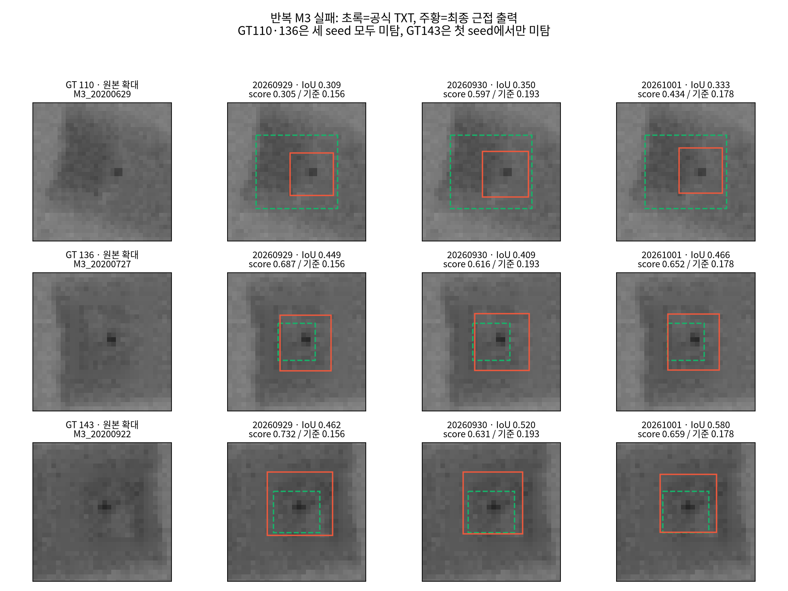
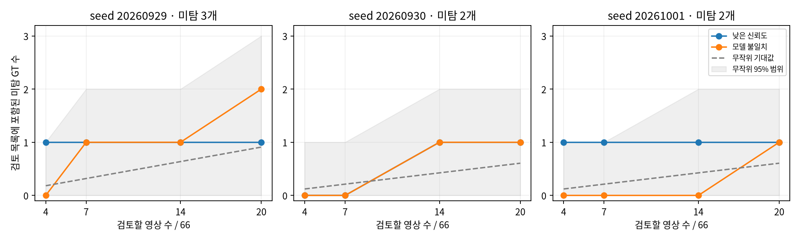
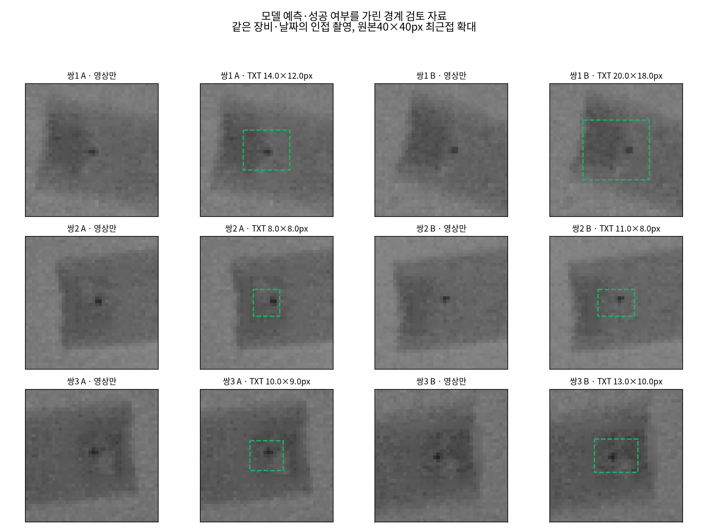
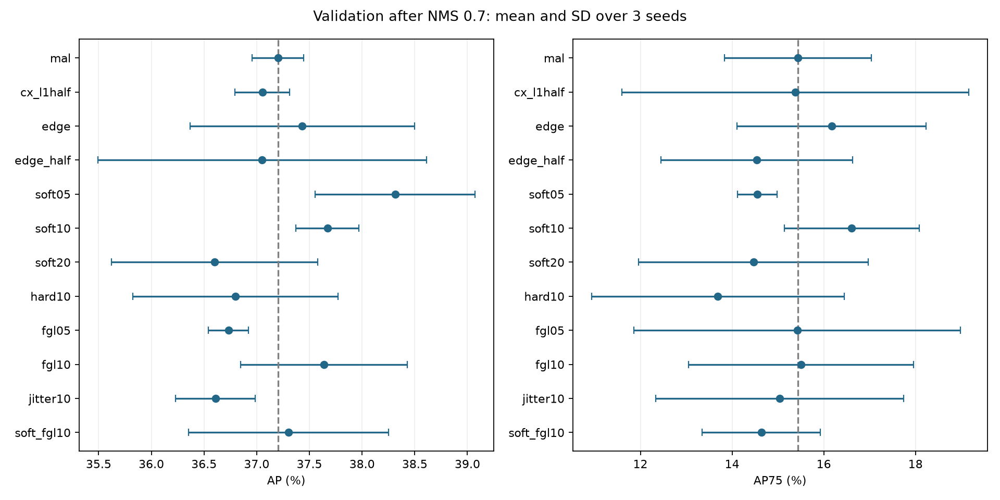
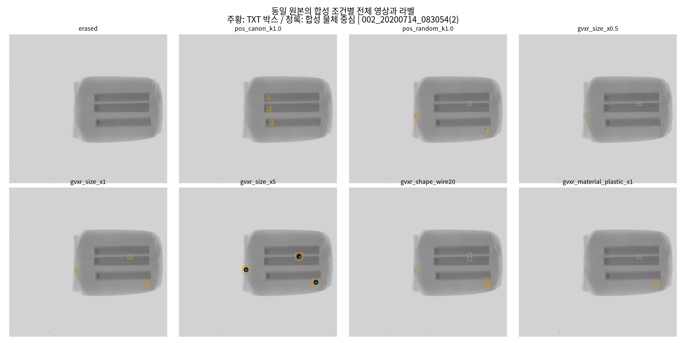
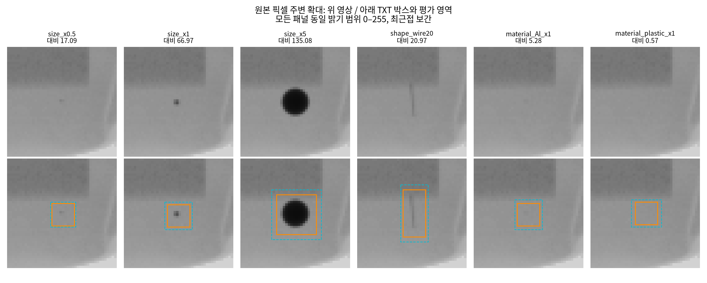

# KAMP X-ray 새 데이터 v2 실험·분석 진행 보고서

최종 갱신: 2026-10-03. **범위는 팀의 `kamp_xray_v2` 데이터 수령 이후부터다.** 데이터 수령 이전 실험은 본문에 포함하지 않는다. 이후 진행 과정·결과·판단은 이 문서 하나를 갱신한다. 실행 로그·CSV·체크포인트·시각화는 근거 자료로 별도 보존한다.

**진행 이력·제출 준비 현황·앞으로 할 일은 이 문서에서 관리한다. 제출 본문은 별도 [제출용 결과보고서 — 사용자 담당](제출용_결과보고서_사용자담당.md)에서 관리한다.**

## 1. 현재 결론과 연구 질문

현재 잠정 비교 기준은 **D-FINE-S + MAL + UQ + NMS 0.7, 박스 scale 1.0**이다. YOLOv8s는 다른 계열의 기준 모델로 유지한다. 이 조합은 validation으로 선택한 비교 기준이며, 2026-10-02 사용자 요청으로 고정 설정 test 평가까지 완료했다. 이후 test에 맞춘 추가 조정은 하지 않았다. 아래에서 validation 탐색과 test 평가 결과를 구분한다.

새 데이터에서 확인한 흐름은 다음과 같다.

> 작은 이물을 위한 고해상도 P2가 필요하다고 가정했다. 그러나 두 detector와 세 seed에서 P2 효과가 일관되지 않았다. 후보 추적에서는 이물 근처 후보와 공식 GT에 정밀하게 맞는 후보가 존재하지만, 점수·NMS·최종 선택에서 손실되는 경우를 확인했다. MAL과 UQ는 일부 지표를 개선했지만 같은 이물의 정밀 후보 선택을 해결하지 못했다. 후보 특징의 상대 품질 진단과 hard-pair/listwise 감독을 추가했으나 정밀 대표 선택은 개선되지 않았다. 이어서 동일 용량 대조군과 로컬 원본 픽셀 추가 head를 첫 seed에서 비교했지만 대표 선택은 그대로였고 AP75도 개선되지 않았다. 현재는 이 방식의 확대를 보류했다. M3 반복 미탐과 검토 우선순위까지 분석한 결과, 높은 점수의 공식 박스 불일치가 남았고 단순 신뢰도·모델 불일치 신호로 안정적으로 선별하지 못했다. 객체 IoU 실패와 제품 경보를 구분해 해석한다.

**현재 남은 질문:** 공식 GT 기준으로 이미 괜찮은 후보들 사이의 미세한 경계 차이를 무엇으로 구별할 수 있는가? 이 개선이 AP75뿐 아니라 조건별 미탐과 낮은 FP 조건의 검출에도 도움이 되는가?

**최신 완료 결과(2026-10-02):** ambiguity36회에 이어 MAL/edge/Soft1 각각3seed의 동일 UQ 비교9회를 완료했다. Soft1+UQ는 이번 MAL+UQ 대비 AP+1.33/AP75+2.73이지만 edge+UQ 대비 AP+0.31/AP75+0.59이며 AP75 개선은1/3seed뿐이다. 사전 일관성 기준을 충족하지 못했다. UQ로 AP는 개선됐지만 FP≤6 TP는 각 run에서 그대로이고 GT110·136도 남았다. 기존 MAL+UQ 기준을 유지하고 이번 모델 탐색을 종료한다. 상세 결과는 §13.9다. 예약은 사용자 요청으로 삭제했다.

“나쁜 박스와 좋은 박스는 어느 정도 구별하지만 좋은 박스와 더 좋은 박스는 어렵다”는 표현은 **현재 고정 특징과 진단용 학습에서 관찰한 결과**다. 모든 detector의 보편적 한계나 정보가 전혀 없다는 증명은 아니다. 또한 좋은 박스의 기준은 공식 TXT와의 IoU이지 실제 물리적 이물 경계의 정확성은 아니다.

## 2. 수령 데이터와 실험 기반 확정

### 2.1 데이터 출처·라벨·전처리

데이터 위치는 `/home/viplab/contest/kamp_xray_v2`다. 팀원이 마커를 제거한 8bit 단채널 PNG와 공식 TXT, 고정 분할 manifest를 제공했다.

- 제공 설명상 전처리는 색상 차이 마스크에 Telea radius 3 인페인팅을 적용한 방식이다. 생성 코드가 제공된 것으로 간주하지 않으며, 알고리즘 설명과 실제 파일 확인을 구분한다.
- TXT는 공식 라벨을 변경하지 않은 단일 `defect` 클래스다. 색상·재질·밀도 정보는 없다.
- 실제 보이는 점이 약 2×2px이고 공식 박스 한 변이 5~21px로 더 크다는 것은 팀의 관찰이다. 실제 물체 경계를 별도 정밀 annotation으로 검증한 결과는 아니다.
- 제공 처리본은 **색상 마커 제거**를 한 것이며, 불균일한 공식 박스 크기를 보정한 데이터가 아니다.
- 미라벨 영상에 pseudo-label을 추가한 팀 실험은 일관된 이득이 없었다고 전달받았다. 현재 학습에는 공식 라벨 500장만 사용한다. “추가 정보가 없다”는 원인은 확정하지 않았다.
- 확인된 정상 제품 전용 데이터가 없으므로 정상 오경보율·안전한 자동 통과율을 이 자료만으로 추정하지 않는다.

[제공 패키지 설명](kamp_xray_v2/README.md) · [팀원의 전처리·실험 기록](<kamp_xray_v2/권나현 진행상황 3eb8bae11e188056839cd85c67b4c44f.md>)

### 2.2 분할 유지와 test 사용 제한

| 분할 | 영상 | 공식 bbox | 장비·날짜 그룹 |
|---|---:|---:|---:|
| train | 350 | 797 | 17 |
| validation | 66 | 144 | 11 |
| test | 84 | 206 | 9 |

제공된 `(장비, 날짜)` 그룹 분할을 유지했다. M1은 352×332 또는 316×332, M2는 316×332, M3는 576×444 해상도다. 장비별 train/val/test 영상 수는 M1 99/26/31, M2 134/18/25, M3 117/22/28이다. Test 수량은 제공 manifest·문서 정보이며 이 단계의 평가를 뜻하지 않는다.

사용자가 test 평가를 승인하기 전까지 이 아키텍처 실험에서는 test 이미지·라벨을 읽거나 학습·평가에 사용하지 않았다. 2026-10-02 승인 후 고정 설정 평가에만 사용했으며12절에 별도로 기록했다. 다만 **팀원이 이미 test로 전처리·pseudo-label 비교를 수행했기 때문에 프로젝트 전체에서 완전히 미사용한 test라고 주장할 수 없다.** 최종 성능의 독립성 한계를 결과에 명시해야 한다.

Train/validation만 640×640 중앙 letterbox로 변환하고 패딩값 114를 사용했다. 회색조를 3채널로 복제하고, 실제 정수 resize의 x/y 배율로 라벨을 변환했다. 추가 crop·flip·mosaic 등 증강은 적용하지 않았다. 표시 제거에 GT bbox를 사용하지 않았다.

[분할 manifest](kamp_xray_v2/split_manifest.csv) · [실험 데이터 감사](experiments/kamp_v2_baselines/data_audit.json) · [좌표 변환](experiments/kamp_v2_baselines/data640/transforms.json)

### 2.3 미라벨 검토 자료의 취급

사용자가 육안 검토할 수 있도록 TXT가 없는 원본을 [미라벨 원본 모음](미라벨_원본_모음/README.md)에 별도 정리했다. 고유 픽셀 기준 2,020장이며 M1 782, M2 623, M3 615장이다. 이 폴더는 전처리된 학습 데이터가 아니고, 원본 마커·비정상 입력·val/test와 같은 촬영 그룹이 포함될 수 있다.

추가 사용은 저신뢰도·모델 불일치·취약 장비·새 촬영 조건을 검토하는 방향이 후보지만 아직 새 라벨 추가 실험은 수행하지 않았다. 수행한다면 train 허용 그룹만 사용하고 **동일 장수 무작위 추가 라벨링 대조군**을 둬 선별 전략의 이득을 분리한다.

## 3. 공통 실험·평가 원칙

| 항목 | 고정한 조건 |
|---|---|
| 기본 모델 | YOLOv8s / D-FINE-S |
| 초기화 | COCO 기반 가중치; 새 데이터에 맞춘 기본 학습을 다시 수행 |
| 반복 | seed 20260929, 20260930, 20261001 |
| detector 학습 | 30 epoch, batch 8, AdamW, lr 0.0002, AMP off, 증강 off |
| 입력 | 같은 640 letterbox와 분할 |
| checkpoint | 기본 detector는 validation에서 선택; 추가 UQ/후보 head는 정해진 마지막 epoch |
| AP 평가 | 원본 좌표 pycocotools COCO AP50:95, maxDets 100, 후보 상한 300, score floor .001 |
| 공통 후처리 | NMS .7, 박스 scale 1.0 |
| 운영점 | validation 66장에서 FP/영상≤.1, 즉 FP≤6인 임계값 |

AP 수치는 0~100 스케일이다. TP는 IoU≥.5 일대일 매칭이다. 운영점은 실행별 validation으로 탐색했으므로 배포 고정 임계값·안전성 보증이 아니다. AP75와 GT별 정밀 후보 수는 정의가 다르며 서로 대체하지 않는다.

YOLO는 기본 출력에 이미 NMS .7이 있다. 공통 비교는 D-FINE에도 NMS .7을 적용하지만, YOLO의 NMS 전 dense 후보를 분석한 것은 아니다. 모델별 native 학습 로그의 AP는 프레임워크 차이가 있어 서로 직접 비교하지 않는다.

세 seed는 같은 데이터 분할을 사용하는 반복이다. 공유 초기값을 유지하고 데이터 순서 등 학습 변동을 비교했으며, 독립 촬영 데이터 세 개가 아니다. 30 epoch 파일럿으로 완전 수렴을 보장하지 않는다. 모델·하이퍼파라미터를 validation에서 반복 검토했으므로 결과는 탐색적이다.

## 4. 수행 순서와 판단 변화

| 단계 | 수행한 일 | 결과가 바꾼 판단 |
|---|---|---|
| 1 | 제공 처리본·TXT·분할 확인, train/val 공통 입력 구축 | 라벨 크기는 그대로이며 추가 전처리보다 같은 조건의 모델 비교가 우선 |
| 2 | 두 기본 모델과 각각의 P2, 4설정×3seed 학습 | P2를 필수로 채택할 근거 부족 |
| 3 | 공통 NMS·크기 보정·장비/크기/대비별 실패 분석 | 후보 위치 발견과 정밀 bbox 평가를 분리해야 함 |
| 4 | D-FINE 내부 encoder/top-k/decoder/final/NMS 추적 | 후보 부재뿐 아니라 refinement·점수·선택 손실도 존재 |
| 5 | 영상 정렬 후 GT 일관성, 12run 예측 정렬 분석 | 라벨 규칙·촬영 변동·공통 학습 편향의 영향을 분리해서 해석 |
| 6 | D-FINE+MAL 3seed 재학습 | 낮은 FP 비교에는 유망하나 공통 NMS AP 이득은 없음 |
| 7 | 기본/MAL 위 UQ 6개 학습·평가 | MAL 위 전역 AP 개선; 지역 대표 선택은 그대로 |
| 8 | 동일 후보의 5종 특징 선형 probe, 6checkpoint×5구성 | 대략적인 품질은 구별하지만 정밀 후보끼리의 순위는 약함 |
| 9 | quality 연장/hard-pair/listwise, 6조건×3목적 | 목적 변경만으로 대표 선택·낮은 FP 검출 개선 안 됨 |
| 10 | 실제 최종 출력과 GT 기준 best-IoU 후보 이미지 비교 | 선택으로 개선할 사례와 후보 자체가 부족한 사례를 시각적으로 구분 |
| 11 | 첫 seed 동일 용량 query-only / query+로컬 픽셀 residual 비교 | 대표 선택 개선 없음, AP75 대조군보다 낮아 3seed 확대 안 함 |
| 12 | M3 반복 실패·추론 신호별 검토 목록·무작위 대조 | 객체 IoU 실패와 제품 경보를 구분; 재검사 신호의 안정적 이득 미확인 |
| 13 | 성공·실패의 인접 촬영 A/B 검토 자료 구성 | 공식 경계 여백 차이와 영상 차이를 함께 확인, 라벨 수정 안 함 |
| 14 | 사용자 승인 후 고정18run test 평가 | MAL+UQ AP 이득 유지, validation 임계값의 FP 수준은 유지되지 않음 |

12개 기본/P2 학습은 2026-10-01 약 59분 16초, MAL 3개는 약 19분, UQ 6개는 약 9분 43초였다. 오래 걸리는 학습은 정상 작동을 먼저 확인하고 완료 예상 이후 평가를 예약해 분석했다. 완료된 MAL/UQ 예약은 정리했다. 최근 hard-pair/listwise 실험은 저장 특징을 재사용해 18개 학습·평가가 약 85초에 끝나 예약이 필요하지 않았다.

## 5. 기본 모델·P2에서 확인한 것

공통 NMS .7, scale1.0. 세 seed 평균 ± 표본 표준편차다.

| 모델 | AP | AP50 | AP75 | TP / 144, FP≤6 |
|---|---:|---:|---:|---:|
| YOLOv8s | 38.75 ± 0.86 | 94.22 ± 1.08 | 17.72 ± 1.69 | 137.33 ± 1.53 |
| YOLOv8s + P2 | 39.15 ± 0.80 | 95.20 ± 1.79 | 19.49 ± 2.05 | 139.00 ± 1.00 |
| D-FINE-S | 38.68 ± 1.41 | 96.69 ± 1.04 | 16.76 ± 0.71 | 140.33 ± 1.15 |
| D-FINE-S + P2 | 39.13 ± 0.63 | 96.55 ± 0.67 | 18.51 ± 2.38 | 138.33 ± 2.89 |

YOLO P2의 AP 차이는 seed별 −0.35/−0.43/+1.99, D-FINE P2는 −1.69/+1.77/+1.27이었다. D-FINE P2의 낮은 FP TP는 −1/−4/−1로 세 seed 모두 감소했다. TXT 짧은 변<8px 17개에서도 P2가 일관되게 유리하지 않았다. P2는 해상도뿐 아니라 용량·경로도 바꾸므로 결과를 해상도 하나의 인과 효과로 보지 않는다.

D-FINE의 기본 출력 TP는 122.67, P2는 107.00이었으나 NMS 후 140.33/138.33으로 늘었다. 중복 제거가 낮은 FP 운영에 유용한 동시에 정밀 후보를 제거할 수 있다. 박스 0.95 축소는 네 모델 모두 평균 AP를 낮춰 채택하지 않았다.

[수치와 paired 비교](experiments/kamp_v2_baselines/analysis/aggregate.csv) · [P2 seed별 차이](experiments/kamp_v2_baselines/analysis/p2_paired.csv)

## 6. 후보 생성부터 최종 출력까지 실패 분석

### 6.1 어디에 있는지 찾기와 공식 박스 맞추기는 다르다

GT 주변 최고 점수 후보의 중심오차 중앙값은 약 0.77~0.85px였다. 진단용으로 GT 중심만 넣었을 때보다 GT 폭·높이를 넣었을 때 IoU≥.75가 더 많이 회복됐다. D-FINE은 실제 51.67개에서 중심 교체 81.33개, 크기 교체 106.33개였다. 이는 공식 박스 정렬의 개선 여지를 보여주며 추론 가능한 방법이 아니다.

### 6.2 단계별 손실을 별도로 추적했다

기본 D-FINE/P2 6checkpoint×66장=396회에서 추적 전후 최종 boxes/logits가 동일했다. Score≥.001 기준 정밀 후보 존재 수는 다음과 같다.

| 진단 | D-FINE | D-FINE+P2 |
|---|---:|---:|
| 최종 decoder의 IoU≥.75 후보 coverage | 100.67 | 95.33 |
| NMS 후 coverage | 64.67 | 63.33 |
| NMS로 정밀 후보가 모두 사라진 GT | 36.00 | 32.00 |
| 중간에는 정밀 후보가 있었지만 최종 decoder에서 사라진 GT | 15.00 | 18.00 |

Coverage는 GT별 후보 존재 수이며 일대일 Recall이 아니다. Encoder 전체 위치에 bbox head를 적용한 분석은 실제 선택되지 않은 위치까지 포함한 counterfactual 진단이다. Top-k 이전 박스가 부정확해도 decoder에서 회복될 수 있으므로 그것만으로 특징 소실을 단정하지 않았다.

실패는 후보 생성, 후보 유지·정제, localization, 점수, 중복·NMS 선택, 임계값에서 나눠 기록한다. 학습·좌표변환 문제와 GT 경계 불확실성은 이 단계들의 해석에 영향을 주는 별도 감사 축으로 유지한다.

[단계별 coverage](experiments/kamp_v2_baselines/analysis/stage_coverage.csv) · [단계별 후보 소실](experiments/kamp_v2_baselines/analysis/stage_losses.csv) · [중심·크기 진단](experiments/kamp_v2_baselines/analysis/geometry.csv)

## 7. 공식 GT 일관성과 모델 정렬을 분리한 진단

같은 split·장비·날짜·session·prefix·해상도의 시간상 인접 영상 323쌍을 영상 정보만으로 정렬했다. 원본 색상 마커 주변을 정렬에서 제외하고, 양방향 translation ECC와 NCC·이동 제한을 적용해 87쌍을 통과시켰다. 정렬 완료 후 중심거리≤3px로 대응한 bbox는 153쌍이었다.

| 결과 | 값 |
|---|---:|
| 정렬 후 GT IoU 중앙값 | 0.650 |
| GT 중심거리 중앙값 | 1.42px |
| 네 경계 중 최대 차이 중앙값 | 2.20px |
| GT IoU<.75 | 125/153쌍 |
| 중심거리≤1px인 46쌍 중 IoU<.75 | 25쌍 |

12개 run에서 공통으로 주변 최고점수 후보 IoU<.75인 GT는 48개였다. 폭 또는 높이 오차가 12run 모두 같은 부호로 .5px를 초과한 GT는 99개였다.

이 결과는 라벨 경계 규칙·촬영 변동·공통 학습 편향을 함께 고려해야 함을 뜻한다. 전역 translation만으로 작은 이물의 국소 이동·회전·투영 변화를 제거하지 못하며, GT 대응 cutoff와 반복 쌍 의존성도 있다. **라벨 오류 비율을 계산한 결과가 아니며 공식 TXT는 수정하지 않았다.**

동시에 D-FINE은 정밀 후보가 있지만 최고점수 후보가 정밀하지 않은 GT가 평균 49개였다. 이 ranking 현상은 공식 GT 기준으로 독립 분석할 수 있어 MAL/UQ 검증의 근거가 됐다.

[정렬 GT 쌍](experiments/kamp_v2_baselines/alignment_audit/matched_GT_pairs.csv) · [예측 정렬](experiments/kamp_v2_baselines/alignment_audit/prediction_alignment.csv)

## 8. MAL과 UQ의 역할 검증

### 8.1 MAL: 감독 방식 변경

기본 D-FINE과 같은 초기값·분할·30epoch에서 VFL을 MAL로 바꾸고 나머지를 유지했다. 실제 train batch의 유한 loss/gradient를 확인한 뒤 3seed 학습했다.

공통 NMS에서 기본→MAL은 AP 38.68→38.36, AP75 16.76→17.42, TP140.33→141.67이었다. MAL의 AP가 전반적으로 우월하다고 결론 내리지 않았다. NMS 전 낮은 FP TP는 122.67→139.33으로 좋아졌으나 같은 후처리를 적용하면 차이는 작아졌다.

정밀 후보 coverage는 100.67→104.00으로 늘고 중간 정밀 후보 소실은 15.00→6.67로 줄었지만, 정밀 후보가 낮은 순위인 GT는 49.00→50.67로 개선되지 않았다. MAL은 선택 문제의 해결책이라기보다 비교할 가치가 있는 학습 기반으로 유지했다.

### 8.2 UQ: 좌표를 고정한 품질 점수 학습

기본과 MAL 각각의 detector를 고정하고, 최종 query·FDR 통계·점수·기하를 입력으로 quality를 예측하는 62,007-parameter head를 train350에서 30epoch 학습했다. 최종 점수는 `sqrt(base score × quality)`다. 마지막 epoch를 고정하고 validation으로 head epoch를 선택하지 않았다.

6checkpoint의 detector parameter·buffer가 부모와 bitwise 동일했고, 396회 재추론에서 boxes/base scores 최대 차이 0이었다. 따라서 UQ는 bbox refinement가 아니다.

| 구성 | AP | AP75 | TP / 144, FP≤6 |
|---|---:|---:|---:|
| 기본 | 38.68 | 16.76 | 140.33 |
| 기본+UQ | 38.85 | 17.11 | 140.33 |
| MAL | 38.36 | 17.42 | 141.67 |
| MAL+UQ | 39.38 | 19.05 | 141.67 |

MAL 위 UQ의 AP 이득은 세 seed 모두 양수로 평균 +1.02, AP75 +1.63이었다. 그러나 같은 GT 주변 최고점수 query는 **세 seed 모두 한 번도 바뀌지 않았고**, 낮은 FP TP도 그대로였다. 이는 전역 점수 순위의 이득과 지역 대표 선택의 이득을 구분해야 함을 보여준다.

NMS 후 정밀 coverage는 MAL68.00→MAL+UQ68.67로 작은 변화였고 평균 35.33GT는 여전히 NMS에서 정밀 후보를 모두 잃었다. 원래 base score≥.001인 동일 후보 집합으로 재평가해도 UQ AP가 같아, 이득이 새로 score floor를 넘은 후보 때문이라는 설명은 지지되지 않았다.

[UQ 비교 수치](experiments/kamp_v2_uq/analysis/aggregate.csv) · [동일 query 진단](experiments/kamp_v2_uq/analysis/same_query_summary.csv) · [고정 후보 집합 검증](experiments/kamp_v2_uq/analysis/fixed_support.csv)

## 9. 좋은 후보 중 더 좋은 후보를 구별할 수 있는가

### 9.1 고정 특징 선형 probe

기본/MAL×3seed의 특징을 추출하고 다섯 입력 구성으로 총30개 선형 probe를 train에서 학습했다. GT 내 특징·IoU 평균을 빼 상대 차이를 학습했고, GT별 총 가중치를 같게 뒀다. 정규화·ridge 계수는 train 또는 사전 고정 설정만 사용했다.

| 전체 특징 probe | 기본 | MAL |
|---|---:|---:|
| 일반 후보 쌍 우열 정확도 | 83.3% | 81.4% |
| 두 후보 모두 IoU≥.5 | 66.0% | 66.4% |
| 두 후보 모두 IoU≥.65 | 50.9% | 50.4% |
| 정밀 대표 수, 기존→probe | 51.7→49.7 | 53.3→49.3 |

모든 쌍은 IoU 차이≥.05이며 GT별 정확도를 평균했다. 조건마다 포함 GT가 달라 난이도 하나의 인과 효과로 보지 않는다. 약50%는 무작위 우열 선택 기준에 가깝지만 통계적 유의성을 확정한 결과는 아니다.

이 진단은 GT로 같은 이물 후보를 묶어준 oracle 조건이다. 실제 탐지 성능이 아니며, 나쁜 후보를 잘 가려도 최고 후보 하나의 선택은 악화될 수 있다. Train 특징은 그 train에 학습된 detector에서 나와 in-sample이다. 모든 비선형 방법의 실패를 증명하지 않는다.

[Probe 수치](experiments/kamp_v2_candidate_probe/summary.csv) · [어려운 쌍 분석](experiments/kamp_v2_candidate_probe/hard_pairs.csv)

### 9.2 Hard-pair/listwise 감독 통제 실험

이어서 동일 UQ head·초기값·자료 순서에서 15epoch를 추가 학습했다. 기본/MAL×3seed×3목적=18회다. 고정 detector 특징을 재사용해 좌표는 변하지 않는다.

- **Quality 대조군:** 기존 품질 loss만 더 학습해 추가 학습량의 영향을 통제한다.
- **Hard-pair:** 같은 GT, 두 IoU≥.5, 차이≥.05인 후보 쌍의 우열을 학습한다.
- **Listwise:** 예측 박스 overlap으로 만든 클러스터 안에서 IoU 기반 순위를 학습한다.

클러스터는 원래 점수 순 greedy leader·predicted-box IoU≥.7로 만들며 GT를 사용하지 않는다. GT는 train target에만 사용한다. 추론은 단일 후보별 head와 기존 점수 결합이므로 새로운 관계망 아키텍처를 구현한 실험은 아니다.

| 부모 | 목적 | AP | AP75 | TP, FP≤6 | 정밀 대표 수 |
|---|---|---:|---:|---:|---:|
| 기본 | Quality | 38.83 | 17.12 | 140.33 | 51.67 |
| 기본 | Hard-pair | 38.87 | 17.20 | 140.33 | 52.00 |
| 기본 | Listwise | 38.69 | 16.90 | 140.33 | 51.67 |
| MAL | Quality | 39.35 | 18.81 | 141.67 | 53.33 |
| MAL | Hard-pair | 39.31 | 18.90 | 141.67 | 53.33 |
| MAL | Listwise | 39.38 | 19.00 | 141.67 | 53.33 |

추가학습 대조군 대비 이득은 작고 seed별로 일관되지 않았다. Quality 점수만 별도로 사용한 사후 진단에서도 MAL hard-pair의 정밀 대표는53.0개로 기존 UQ 결합점수53.33개보다 높지 않았다. 따라서 기존 object score가 좋아진 quality를 가린다는 설명만으로 실패를 설명할 수 없다.

**이번 감독 변경은 채택하지 않는다.** 고정한 보조 loss 계수 .1에서 얻은 결과이며 모든 계수·다른 구조의 불가능성까지 뜻하지 않는다. 새로운 관계 모듈을 바로 확대할 실험 근거는 부족하다.

[18개 실행 결과](experiments/kamp_v2_hard_selection/results.json) · [동일 조건 설정](experiments/kamp_v2_hard_selection/README.md) · [품질 단독 진단](experiments/kamp_v2_hard_selection/quality_diagnostic.json)

### 9.3 예측 bbox 주변 로컬 영상 추가: 단일 seed 선별 실험

2026-10-02에 MAL+UQ 첫 seed20260929를 고정하고, query-only와 query+로컬 영상 두 구성을 비교했다. 이전 단계에서 지역 대표 선택이 나아지지 않아, 후보 주변의 공간 정보를 추가하면 공식 경계 차이를 구별하는지 확인하기 위한 실험이다.

Detector와 기존 UQ를 모두 고정하고, 기존 quality logit에 residual을 더하는 head만 학습했다. 두 구성의 추가 학습 파라미터는 **78,779개로 동일**하다. 같은 초기값·자료 순서, 30epoch, batch16, AdamW lr1e-4, quality loss+.1 hard-pair loss를 사용했고 마지막 epoch를 평가했다.

로컬 입력은 **예측 bbox를 1.5배 확대한 영역**에서 원본 처리본의 회색조를16×16으로 bilinear sampling한 값이다. Patch 평균·표준편차로 정규화한256개 픽셀과 평균·표준편차를 더한258차원이며, query-only 대조군에는256개 query 특징과2개 크기 특징을 넣어 입력 차원·용량을 맞췄다. 원래283차원 특징은 둘 다 함께 입력한다. GT는 crop 위치나 크기를 정하는 데 사용하지 않았다.

이것은 로컬 원본 픽셀을 MLP에 추가하는 작은 실험이다. 학습된 backbone P2/RoI feature나 convolutional patch encoder를 검증한 결과는 아니다. 공간적인 crop은 추론용 후보 특징을 만들기 위한 것이며 전체 detector 입력·박스 좌표를 바꾸지 않는다.

| 첫 seed의 구성 | AP | AP75 | TP, FP≤6 | 정밀 대표 수 |
|---|---:|---:|---:|---:|
| 이전 MAL+UQ | 38.82 | 19.31 | 141 | 57 |
| 동일 용량 query-only residual | 38.92 | 19.78 | 141 | 57 |
| Query+로컬 영상 residual | 38.92 | 19.50 | 141 | 57 |

로컬 영상 추가는 대조군 대비 AP 약+0.008, AP75 약−0.28이며, 기존 UQ 대비 후보 IoU 개선·악화 건수도 둘 다0이다. 대표 선택과 낮은 FP 검출에 이득이 없으므로 **첫 seed 선별을 통과하지 못해 나머지 두 seed는 실행하지 않았다.** 단일 seed에서 설정을 선별한 탐색 결과이지 일반적인 효과 크기나 유의성 추정이 아니다.

Quality 점수만 사용한 사후 진단에서는 대조군 정밀 대표52개, 로컬53개로 기존 결합점수의57개보다 낮았다. 예측 클러스터 내부 hard-pair 정확도는65.69%→65.77%로 거의 같았다. Residual logit은 실제로 변했고 gradient가 유한해 학습이 아예 실행되지 않은 경우는 아니다. 로컬 입력만0으로 바꾼 진단은 AP39.02/AP7520.05였지만 입력 분포를 깨는 개입이므로 대체 모델로 채택하거나 공간 정보가 없다는 증명으로 쓰지 않는다.

검증: 두 초기 출력은 기존 UQ와 일치했고, 기존 UQ 가중치는 bitwise 불변이었다. 모든 step의 loss/gradient와30epoch 완료를 확인했다. 별도 CPU bilinear 계산과 추출 특징의 최대 차이는8.21e-6이었다. 전체 추출·두 학습·공통 평가는 약18.8초에 완료돼 예약 실행은 필요하지 않았다. Test는 사용하지 않았다.

**판단:** 이 단순 로컬 픽셀 residual은 채택하지 않는다. 이 결과를 모든 고해상도 특징 접근의 반증으로 확대하지 않는다. 같은 validation에서 head/계수를 계속 바꾸는 실험은 보류하고, 현재 MAL+UQ를 유지한 채 M3 반복 실패·공식 GT 경계의 해석·재검사 조건 분석을 우선한다. 향후 다른 로컬 구조를 시험하려면 추가 정보와 검증 기준을 별도로 명확히 해야 한다.

[실험 설정](experiments/kamp_v2_local_quality/protocol.json) · [두 구성 결과](experiments/kamp_v2_local_quality/results_seed20260929.json) · [입력·품질 진단](experiments/kamp_v2_local_quality/diagnostics.json) · [학습 로그](experiments/kamp_v2_local_quality/seed20260929.log)

## 10. 실제 최종 박스와 정답 참조 후보 시각화

### 10.1 비교 정의

현재 잠정 모델 **MAL+UQ, seed20260929**를 시각화 기준으로 고정했다. 최종 출력은 실제 저장된 예측에 NMS .7과 기존 FP≤6 평가 임계값 **0.15639794**를 적용한 것이다. 이 임계값은 validation 탐색값이지 배포 기준이 아니다.

각 GT에 IoU≥.1로 인접한 최종 출력 중 최고점수 박스를 현재 대표로 표시한다. 비교 후보는 같은 이미지의 NMS 전 저장 후보(score≥.001) 중 **공식 TXT와 IoU가 가장 높은 실제 예측 박스**다. 좌표를 정답으로 바꾼 박스가 아니다. 다만 어느 후보가 더 좋은지 고르는 데 정답을 사용했으므로 실제 모델 개선 결과가 아니다.

전체 영상 비교에서는 대상 박스 하나만 이 후보로 교체하고 나머지 최종 출력은 유지하는 진단용 그림이다. 후보의 원래 score를 그대로 표기하며, 교체 후 임계값·NMS를 재실행한 결과라고 주장하지 않는다. 서로 다른 GT의 oracle 후보는 독립 선택이므로 이를 모아 일대일 검출 성능으로 해석하지 않는다.

- 초록 점선: 공식 TXT
- 주황 실선: 현재 최종 선택
- 파랑 실선: 정답을 참조해 고른 best-IoU 후보
- 배경: 모델에 입력한 팀의 마커 제거 처리본, 원본 해상도
- 확대: 최근접 보간, 밝기·대비 조절 없음. 픽셀 경계 원점(0,0)에 맞춰 연속 bbox 좌표를 표시했다.

그림의 확대 crop은 육안 진단용이며 모델 입력 전처리를 바꾸지 않았다. 원본 파일이나 TXT를 수정하지 않았다.

### 10.2 사례와 해석

첫 seed를 사전 고정하고, M1/M2/M3 각각의 “IoU .5~.75인 현재 박스와 .75 이상 후보” 중 개선 폭이 큰 사례를 선택했다. 이미 정밀한 박스, 반복 실패 GT110, 중간 개선 사례도 포함했다. 이는 **현상을 설명하는 목적 표본**이며 평균 사례나 독립 성능 검증 표본이 아니다.

| GT | 장비 | 현재→후보 IoU | 현재→후보 score | 후보의 원래 상태 |
|---|---|---|---|---|
| 38 | M1 | .639→.876 | .681→.107 | NMS 제거 + 임계값 미달 |
| 61 | M2 | .620→.956 | .702→.099 | NMS는 통과, 임계값 미달 |
| 111 | M3 | .658→.854 | .676→.091 | NMS 제거 + 임계값 미달 |
| 32 | M1 | .760→.923 | .661→.100 | NMS 제거 + 임계값 미달 |
| 110 | M3 | .309→.548 | .305→.054 | NMS는 통과, 임계값 미달 |
| 101 | M3 | .693→.801 | .674→.101 | NMS 제거 + 임계값 미달 |

GT38에서는 현재 박스8.94×8.65px보다 후보10.18×10.66px가 공식11×11px에 더 잘 맞는다. 둘 다 같은 작은 점을 포함하지만, 약1~2px의 크기 차이와 경계 위치가 IoU를 크게 바꾼다. 이것이 실제 이물의 외곽을 더 정확히 그렸다는 뜻은 아니다.

GT110은 최선 후보를 골라도 IoU .548이므로 정밀 선택만으로 .75 수준을 달성하지 못한다. 모든 실패를 후보 선택 문제로 묶으면 안 된다.

전체144GT×3seed=432개 비교를 CSV로 저장했다. 최종 현재 박스가 IoU .5~.75이고 NMS 전에는 IoU≥.75 후보가 있는 GT는 seed별41/56/54개였다. 이는 해당 정의의 후보 차이 개수이며 미탐 수·일대일 Recall과 다르다.


[GT38 원본·확대·겹침 비교](experiments/kamp_v2_candidate_visualization/case_01_gt38.png) · [GT61](experiments/kamp_v2_candidate_visualization/case_02_gt61.png) · [GT111](experiments/kamp_v2_candidate_visualization/case_03_gt111.png) · [GT32](experiments/kamp_v2_candidate_visualization/case_04_gt32.png) · [GT110](experiments/kamp_v2_candidate_visualization/case_05_gt110.png) · [GT101](experiments/kamp_v2_candidate_visualization/case_06_gt101.png)

[전체432개 비교 CSV](experiments/kamp_v2_candidate_visualization/all_cases.csv) · [임계값·TP·FP 재현 확인](experiments/kamp_v2_candidate_visualization/verification.json)

## 11. 조건별 미탐과 재검사 정책으로 이어지는 해석

공통 NMS 기본형에서 장비별 TP는 YOLO M1 56/56, M2 42/42, M3 평균39.33/46이었고, D-FINE은54.67/56,42/42,43.67/46이었다. MAL+UQ는56/56,42/42,43.67/46이다. M3가 남는 취약 조건이지만 장비에는 해상도·촬영·라벨 분포가 함께 섞여 있어 하드웨어 원인으로 단정하지 않는다.

Validation TXT 짧은 변은 <8px17개,8~12px104개,12~16px22개,≥16px1개다. 마지막 구간은 단 한 개의 GT110이므로 일반적인 큰 이물 미탐 경향으로 설명하지 않는다. MAL 계열은 <8px17/17을 검출했고 UQ가 추가 미탐을 회수하지는 못했다.

대비 분석값은 GT bbox 내부와 주변 링의 통계로 계산한 사후 대리값이다. 실제 이물 CNR도 아니고 GT 없이 바로 계산할 수 있는 재검사 입력도 아니다. 이 값에서 대비와 미탐의 명확한 단조 관계는 확인하지 못했다.

후속 재검사 신호는 모델 불일치, 추론 가능한 품질·불확실성, 영상 품질, 학습 분포와의 차이 등을 후보로 둘 수 있다. 다만 모델의 quality를 실제 불량 확률로 해석하지 않으며, 낮은 score만으로 안전한 자동 통과를 정하지 않는다. 재검사율과 실제 회수율은 검수된 정답 및 별도의 재검사 수단으로 검증해야 한다. 현재 정책은 확정하지 않았다.

[조건별 수치](experiments/kamp_v2_uq/analysis/conditions.csv) · [기본 모델 조건별 분석](experiments/kamp_v2_baselines/analysis/conditions.csv)

### 11.1 M3 반복 미탐의 실체 확인 (2026-10-02)

현재 MAL+UQ의 같은 FP≤6 운영점을 재현하고, 4개 기본/P2 설정×3seed의 실패와 대조했다. 남은 미탐은 M3의 세 GT, 세 촬영일에 집중됐다.

| GT | 촬영 그룹 | 기본/P2 12run의 미탐 | MAL+UQ 3run의 미탐 | 주변 최고점수 후보 IoU, 세 seed |
|---|---|---:|---:|---|
| 110 | M3_20200629 | 12/12 | 3/3 | .309 / .350 / .333 |
| 136 | M3_20200727 | 11/12 | 3/3 | .449 / .409 / .466 |
| 143 | M3_20200922 | 7/12 | 1/3 | .462 / .520 / .580 |

GT110에서는 공식20×18px보다 작은 박스가 나오고, GT136에서는 공식8×8px보다 큰 박스가 나왔다. GT143도 공식 박스에 비해 크기·상단 여백이 다르며 seed에 따라 IoU .5의 양쪽으로 갈린다. 영상에 보이는 점 근처에 높은 점수 박스가 있다는 점을 그림에서 확인했다. 이 관찰만으로 공식 라벨이 틀렸다고 판정하지 않는다.

GT136의 세 번째 seed에서는 NMS 후 낮은 score 후보 중 IoU .844 박스가 존재했지만 운영점에서는 미탐이었다. 반면 GT110의 NMS 후 최선 IoU는 .548/.366/.334로, 후보 선택만으로 모든 seed를 회복할 조건도 아니다.



**객체 수준 미탐과 제품 단위 경보는 다르다.** 동일 평가 임계값에서 세 seed 모두66/66장에 적어도 하나의 최종 박스가 있었다. GT136·143은 단일 GT 영상인데도 IoU 기준으로는 미탐이면서 검출 박스는 있었다. 따라서 “남은2~3개 미탐=불량 제품2~3개 자동 통과”라고 설명하면 안 된다. 반대로 현재 영상이 모두 이물을 포함하므로 이 경보율로 정상/불량 선별 성능이나 안전성을 입증할 수도 없다.

### 11.2 정답 없이 계산하는 검토 우선순위 신호

검토 신호 계산에는 GT를 사용하지 않았다. YOLOv8s와 MAL+UQ의 NMS .7 출력에서 신호용 score cutoff .25를 고정하고, 다음 세 기준을 각각 계산했다. 검출 성능의 평가 임계값과 신호 추출용 .25는 다른 값이다.

- **낮은 신뢰도:** 해당 영상 D-FINE 계열 후보의 최소 score를1에서 뺀 값. 후보가 없으면1. 후보 중 하나가 불확실한 영상을 올리는 단순 규칙이다.
- **모델 불일치:** 두 모델 박스를 IoU 최대화 일대일 대응한 뒤, 총 IoU를 두 모델 중 더 많은 박스 수로 나눈 agreement를1에서 뺀 값. 한 모델만 후보가 있으면1, 둘 다 없으면0이다. 둘 다 없는 경우를 놓치므로 단독 안전 정책으로 사용하지 않는다.
- **후보 수 차이:** 두 모델의 남은 박스 수의 절댓값 차이. 동점이 많으므로 순위 정보가 약할 수 있다.

학습한 위험 예측기나 여러 신호의 가중치 최적화는 수행하지 않았다. 4/7/14/20장 검토 예산을 고정해, 검토 목록이 기존 MAL+UQ의 IoU 기준 미탐 GT를 얼마나 포함하는지 사후 측정했다. 해당 GT를 재검사로 실제 회수한 것은 아니다.

### 11.3 검토 예산과 무작위 대조

7장은66장의10.6%다. 표는 검토 목록에 들어온 미탐 GT 수다.

| 신호 | seed20260929: 총3개 중 | seed20260930: 총2개 중 | seed20261001: 총2개 중 |
|---|---:|---:|---:|
| 낮은 신뢰도 상위7장 | 1 | 0 | 1 |
| 모델 불일치 상위7장 | 1 | 0 | 0 |
| 후보 수 차이 상위7장, ID 동점 해소 | 0 | 0 | 0 |
| 무작위7장 기대값 | .318 | .212 | .212 |

무작위 대조는 동일66장에서 비복원10,000회 추출했다. 이 예산에서는 무작위 미탐 포함 수의2.5~97.5백분위가 모두0~1개였다. 관찰된 포함 수는 이 범위 안에 있다. 이는 통계적 우월성을 검증한 것이 아니며, 작은 표본에서 재검사 우선순위의 안정적 이득을 입증하지 못했다는 의미다.

후보 수 차이는 동점 순서에 따라7장 안의 미탐 포함 수가 seed별0~3/0~2/0~2개까지 달라질 수 있었다. 표의0을 이 신호의 확정 성능으로 해석하지 않는다. 동점은 실제 목록 재현을 위해 image ID로 풀고 가능한 범위를 별도 저장했다.

검토 예산을20장(30.3%)으로 늘려도 낮은 신뢰도는1/1/1개, 모델 불일치는2/1/1개를 포함해 모든 미탐을 포괄하지 못했다. 같은 자료에서 확인한 M3만 전부 검토하면22장(33.3%)이지만, 이는 실패 관찰 뒤 정한 조건이므로 독립적으로 검증된 정책이 아니다.



회색 영역은 무작위 목록을 바꿨을 때의 변동 범위다. 실제 배포 성능의 신뢰구간이 아니다. 세 seed는 같은 영상에서 나온 결과이며 독립적인7개 미탐 사건으로 합산하지 않는다. 현재 남은 실패는 높은 점수의 위치·크기 불일치가 많아 낮은 confidence만으로 찾기 어려우며, 두 모델이 비슷하게 틀리는 경우 불일치도 작을 수 있다.

### 11.4 정책 판단과 다음 우선순위

**이번 신호만으로 자동 통과·재검사 규칙을 확정하지 않는다.** 현재는 정밀 위치 실패와 제품 경보 실패를 분리해 설명하고, 모델 선택을 유지한 상태에서 근거를 정리하는 단계다.

다음 검토는 반복 실패3개뿐 아니라 같은 장비·촬영 조건에서 성공한 사례도 함께 놓고, 실제 점 위치와 공식 박스의 여백 규칙을 모델 예측을 가린 상태에서 검토하는 것이 유용하다. 이는 라벨 수정이나 새 정답 확정을 자동으로 수행한다는 뜻이 아니다. 정상 제품과 실제 경보 누락 사례를 확보해야 안전한 자동 통과 기준을 평가할 수 있다.

새로운 모듈 학습이나 재검사 신호의 계수 탐색은 시작하지 않았다. 기존 checkpoint만 분석했으므로 예약 학습도 없다. Test는 사용하지 않았다.

[반복 GT 감사](experiments/kamp_v2_reinspection/repeat_failures.json) · [모든15run의 GT별 실패](experiments/kamp_v2_reinspection/gt_failures.csv) · [추론 신호](experiments/kamp_v2_reinspection/image_signals.csv) · [검토 예산·동점·무작위 비교](experiments/kamp_v2_reinspection/review_curves.csv) · [미탐 영상의 순위](experiments/kamp_v2_reinspection/missed_image_ranks.csv)

### 11.5 성공·실패 경계 대조 자료

반복 실패GT110/136/143에 대해 같은 M3 촬영일에서 세 seed 모두 성공한 가까운 사례를 대응시켰다. 같은 영상은 제외하고 bbox 중심거리40px 이하에서 촬영 시간 차이가 가장 작은 사례를 골랐다. GT110↔106은3초, GT136↔135는4초, GT143↔144는3초 차이다. 전역 정렬을 추가한 실험이 아니며 bbox 중심을 기준으로 같은40×40px 영역을 보여준다.

모델 박스와 성공 여부를 숨긴 A/B 자료를 만들었고, 영상만 보는 패널과 공식 TXT를 겹친 패널을 나눴다. 공식 크기는 각 쌍에서14×12 대20×18,8×8 대11×8,10×9 대13×10px였다. 가까운 촬영 시각·비슷해 보이는 점에 비해 박스 여백 규칙이 달라질 가능성을 보여주지만, 실제 점의 동일성이나 독립 재라벨링 결과를 뜻하지 않는다. 일부 영상은 점의 모양·주변 밝기도 달라 보이므로 라벨 문제로만 설명하지 않는다.



이 작업은 검토 자료 구성과 시각 확인까지이며, 외부 검토자가 수행한 blind adjudication은 아니다. 정답을 수정하지 않았다. [대응 기준·A/B 키](experiments/kamp_v2_reinspection/boundary_pair_key.json)

## 12. 고정 설정 test 평가 (2026-10-02 완료)

### 12.1 승인·설정 고정·평가 범위

사용자가 test 점수 산출을 요청한 뒤, test 이미지·라벨을 읽기 전에18개 checkpoint의 SHA256과 각 validation 임계값을 고정했다. 비교 구성은 YOLOv8s/P2, D-FINE-S/P2, MAL, MAL+UQ의6종×3seed다. **Test 이전 선택은 MAL+UQ이며 결과를 보고 선택 모델이나 임계값을 바꾸지 않았다.**

모든 모델에 같은640 letterbox, 원본 좌표 COCO AP, NMS .7, scale1.0, score floor .001을 적용했다. 평가 대상은84장·206GT다. Test에서 FP 예산을 맞추기 위한 임계값 탐색은 하지 않고, 각 run의 validation FP≤6 임계값을 그대로 적용했다. 따라서 아래 TP/FP는 test FP≤6 또는≤8로 맞춘 비교가 아니다.

같은 장비·날짜 그룹 분할을 유지했고500장 전체의 완전 동일 픽셀 교차 split 중복은 없었다. 이것은 near-duplicate나 동일 시험편의 유사성을 배제한 검증은 아니다. 팀원이 전처리 선택에 test를 사용한 이력이 있어 프로젝트 전체의 완전 미사용 test라고 부르지 않는다. 이후 test를 보고 설계를 조정하면 같은 test 재평가를 독립 검증으로 주장할 수 없다.

### 12.2 점수와 고정 validation 임계값의 검출 결과

세 seed 평균이며 AP의 ±는 표본 표준편차다. 객체 Recall은 공식 IoU≥.5 기준이다.

| 구성 | AP | AP50 | AP75 | TP / 206 | FP | Recall |
|---|---:|---:|---:|---:|---:|---:|
| YOLOv8s | 32.20 ± 0.87 | 87.88 | 10.17 | 191.00 | 13.67 | 92.72% |
| YOLOv8s+P2 | 33.29 ± 1.21 | 88.29 | 10.93 | 191.00 | 15.33 | 92.72% |
| D-FINE-S | 35.00 ± 0.71 | 89.63 | 14.29 | 191.00 | 14.00 | 92.72% |
| D-FINE-S+P2 | 35.44 ± 1.31 | 88.62 | 14.92 | 189.33 | 15.67 | 91.91% |
| D-FINE+MAL | 36.50 ± 1.31 | 92.67 | 14.77 | 196.00 | 11.33 | 95.15% |
| D-FINE+MAL+UQ | 37.46 ± 1.26 | 93.29 | 15.88 | 196.33 | 16.00 | 95.31% |

사전에 선택한 MAL+UQ의 test AP는37.46, AP7515.88로 이번 비교군 중 가장 높았다. MAL 대비 UQ는 AP 평균+0.95, AP75+1.11이며 세 seed에서 모두 양수였다. 반면 고정 validation 임계값에서 TP는+0.33, FP는+4.67이다. **AP 향상은 고정 운영점의 오탐 감소와 동의어가 아니다.**

| seed | MAL→MAL+UQ ΔAP | ΔAP75 | ΔTP | ΔFP |
|---|---:|---:|---:|---:|
| 20260929 | +0.81 | +1.15 | +1 | +2 |
| 20260930 | +0.65 | +0.15 | +0 | +5 |
| 20261001 | +1.39 | +2.04 | +0 | +7 |

Validation에서 FP/영상≤.1로 고른 임계값은 test에서 동일 수준을 유지하지 못했다. MAL은 평균.135 FP/영상, MAL+UQ는.190 FP/영상이었다. 이 결과를 보고 test 임계값을 바꾸지 않았다. 임계값의 촬영 조건 간 전이 한계를 결과로 남긴다.

Test AP는 validation보다 낮다. YOLO38.75→32.20, D-FINE38.68→35.00, MAL+UQ39.38→37.46이다. 서로 다른 촬영 그룹·객체 분포와 validation 선택의 영향이 섞여 있으므로 차이를 특정 원인 하나로 설명하지 않는다.

P2는 test 평균 AP를 YOLO+1.09, D-FINE+0.44 높였지만, 고정 임계값의 TP는 YOLO 변화0, D-FINE−1.67이며 FP는 늘었다. Test 평균 순위를 보고 P2를 새로 채택하지 않는다.

### 12.3 조건별 결과와 안전성 해석

| 모델 | M1 TP / 81 | M2 TP / 61 | M3 TP / 64 |
|---|---:|---:|---:|
| YOLOv8s | 80.67 | 53.67 | 56.67 |
| YOLOv8s+P2 | 80.67 | 54.67 | 55.67 |
| D-FINE-S | 79.00 | 54.67 | 57.33 |
| D-FINE-S+P2 | 79.33 | 54.00 | 56.00 |
| D-FINE+MAL | 80.00 | 57.33 | 58.67 |
| D-FINE+MAL+UQ | 80.00 | 57.33 | 59.00 |

MAL+UQ는 M1 80/81, M2 57.33/61, M3 59/64였다. Validation의 잔존 실패가 M3에 집중됐다고 해서 test도 M3만 취약하다고 가정할 수 없다. M2에서도 미탐이 발생했고, 장비 자체보다 촬영 그룹의 차이를 함께 보아야 한다. 이 조건별 test 수치는 설명용이며 조건별 임계값 조정에 사용하지 않는다.

MAL과 MAL+UQ는 세 seed 모두84/84장에 최종 경보 박스가 있었다. YOLO/D-FINE 기본형 일부 seed에는 경보 없는 영상도 있었다. Test 역시 정상 제품 전용 표본이 없어 이 경보율로 정상 오경보율이나 실제 운영 안전성을 평가할 수 없다. 객체 위치 실패와 제품 경보 여부는 분리해 보고한다.

### 12.4 현재 판단

Test에서도 MAL+UQ의 ranking 지표 이득은 관찰됐지만, 고정 임계값의 FP 증가는 명확한 한계다. 따라서 성능 주장은 “공식 bbox 평가의 AP 개선”으로 한정하며, 안전한 자동 통과나 재검사 정책을 확립했다고 표현하지 않는다. 새로운 설정·모델 선택·임계값 탐색을 test 결과로 수행하지 않는다.

평가18회는 정상 종료했으며 약153초였다. 초기 실행 파일의 stdlib 이름 충돌을 점수 산출 전에 수정했고, 모델·후처리·임계값은 그대로 유지했다. 원본 데이터·TXT·가중치를 수정하거나 새 학습을 수행하지 않았다.

[고정 체크포인트·임계값](experiments/kamp_v2_test_frozen/frozen_protocol.json) · [평균·seed별 결과](experiments/kamp_v2_test_frozen/summary.json) · [평가 CSV](experiments/kamp_v2_test_frozen/metrics.csv) · [입력 해시](experiments/kamp_v2_test_frozen/input_hashes.json) · [교차 split 픽셀 감사](experiments/kamp_v2_test_frozen/cross_split_pixel_audit.json) · [완료 기록](experiments/kamp_v2_test_frozen/completion.json)

### 12.5 고정 추론 실행과 재현성 확인

2026-10-02, 앞서 진행하던 GT 없는 추론 실행기를 검증했다. [실행기](inference_locked/predict.py)는 고정 protocol의 체크포인트 해시·validation 임계값·NMS .7·scale1을 사용하며, 원본 해상도의 **마커 제거가 끝난 uint8 grayscale** 영상을 입력받는다. 자체 인페인팅은 하지 않는다. 현재 프로젝트의 절대 경로와 실행 환경을 사용하는 도구이며 독립 배포 패키지는 아니다.

M1/M2/M3 validation 영상 각1장에 대해 YOLOv8s와 MAL+UQ의 seed20260929 추론을 기존 common evaluation과 비교했다. 6개 모델–영상 조합에서 NMS 이후 전체 박스 좌표와 score의 최대 차이는 모두0이었다. MAL+UQ의 비교 박스 수는 영상별225/223/239, YOLO는 각3이며, .001 score floor의 후보 수로 운영 임계값의 경보 수와 다르다. [검증 기록](inference_locked/verification.json)

실행 예시는 다음과 같다. 출력 폴더는 기존 결과를 보호하기 위해 새 경로여야 한다.

```bash
/home/viplab/contest/.detector-venv/bin/python /home/viplab/contest/inference_locked/predict.py --images /입력/폴더 --output /새/출력/폴더 --variant dfine_mal_UQ --seed 20260929 --preprocessed
```

출력은 원본 좌표 predictions, 경보 박스 overlay, 영상별 판정 목록, 가중치 해시와 임계값 기록이다. GT를 읽지 않으며, 검출이 없다고 정상/자동 통과로 판정하지 않는다. 이번 재현성 확인은 3장×2모델의 일치 검사이며 모든 모델·입력 형식에 대한 포괄 검증은 아니다.

### 12.6 GT 경계 불확실성: 실제 repository 기술 검토 — 구현·학습 전

**질문:** 검은 점 형태의 이물 자체는 보이지만 사람이 정한 사각형 경계가 몇 픽셀 흔들릴 수 있다는 관찰을, 모델 구조를 확대하지 않고 localization supervision에 반영할 수 있는가?

**판단:** 구현 가능한, 통제 실험 가치가 있는 가설이다. 다만 현재 D-FINE은 one-hot 경계 target을 사용하는 모델이 아니며, 기존 분포 표현 위에 *원본 픽셀 단위의 경계 prior*를 추가하는 문제다. 관찰된 GT 불일치는 annotation uncertainty를 지지하지만, 영상 정합 오차·실제 이동·표기 규칙 차이와 완전히 분리되지 않았다. 이 가설을 라벨 오류의 확정이나 새 방법의 성능 보장으로 표현하지 않는다. 이번에는 모델·loss·원본 TXT를 변경하거나 새 학습을 실행하지 않았다.

#### A. 현재 GT → localization distribution 경로

1. `kamp_v2_baselines/prepare.py`에서 원본 TXT를 정확한 `sx=nw/w`, `sy=nh/h`와 padding으로640 letterbox 좌표에 옮긴다. 학습 `ConvertBoxes`가 normalized `cxcywh`로 바꾼다.
2. `DFINECriterion.forward`가 official GT로 Hungarian matching과 기존 GO matching union을 만든다. 분류는 해당 branch matching, boxes/local은 GO union을 사용한다. DN은 별도의 기존 대응을 사용한다.
3. `DFINECriterion.loss_local`이 matched GT를 `xyxy`로 바꾸고, detach된 `ref_points`와 함께 `bbox2distance`에 넘긴다. Regular와 DN target cache가 별개다.
4. `bbox2distance`는 reference box 중심·크기에 대한 네 경계의 상대 거리로 바꾼다. 예를 들어 `dL=(ref_cx−GT_x1)/(ref_w/s)−s/2`, `s=abs(reg_scale)`다.
5. `translate_gt`가 비균일 위치 `W(j)`에서 해당 거리를 감싸는 두 bin을 찾아 선형 보간한다. 구간 내부에서 `qL=(Wright−d)/(Wright−Wleft)`, `qR=1−qL`이다. 즉 **대개 두 bin에 확률을 주며 정확히 bin 위에 놓인 경우에만 one-hot에 해당**한다. 범위 밖에는 기존 clipping이 있다.
6. `unimodal_distribution_focal_loss`가 두 cross-entropy를 보간 가중치로 합치고, 현재 예측과 official GT의 detach된 IoU로 가중한다. 별도로 L1/GIoU도 official box에 그대로 적용된다.

실제 config는 `reg_max=32`로33개 bin, `reg_scale=4`, decoder의 고정 `up=.5`다. MAL gamma는2이며 scheduler의 gamma .1과 구분한다. 기본 loss weight는 classification1, L1 5, GIoU2, FGL .15, DDF1.5다. 숫자만으로 실제 gradient 기여를 비교할 수는 없다.

#### B. FDR/FGL/DDF와 중복인가? MAL/UQ와 충돌하는가?

| 구성 | 실제 역할 | 이번 가설과의 관계 |
|---|---|---|
| FDR | decoder가 이전 corner logits에 보정을 누적하고, 분포의 `Σp(j)W(j)`로 경계를 복원 | 경계를 분포로 표현하지만 사람의 ±1px 오차를 명시하지는 않음 |
| FGL | official 경계를 인접 두 bin으로 보간해 supervision | 기존 보간은 좌표 표현이며 annotation uncertainty prior와 다름 |
| DDF | 마지막 decoder 분포를 detach해 앞 decoder에 전달하는 내부 distillation, 현재 T=5 | soft target이지만 GT 경계 prior와 다름. 외부 teacher나 pseudo-label pipeline을 추가할 필요 없음 |
| MAL | matched IoU²를 양성 classification target으로 사용 | FGL만 바꾸면 MAL의 official GT 기준은 유지됨. 위치가 나빠지면 IoU와 분류 target도 내려가므로 완전히 독립적이지 않음 |
| 기본 LQE | corner 분포의 top-k 확률과 평균으로 score 보정 | smoothing이 분포 통계도 바꾸므로 ranking 변화가 함께 발생할 수 있음 |
| 추가 UQ | query 특징·분포 top4 통계·기존 score·geometry로 품질 예측 | 예전 unsmoothed detector에 맞춰 학습한 head를 새 detector에 그대로 붙이는 것은 공정한 비교가 아님 |

특히 decoder 코드의 LQE 관련 주석만 보고 이를 무효한 경로로 취급하면 안 된다. 실제 `forward`는 `scores + quality_score`를 반환한다. FGL-only smoothing 이후에도 L1/GIoU, FGL의 IoU 가중치, MAL target은 sharp한 official GT를 기준으로 한다. 따라서 첫 실험의 정확한 주장은 **“분포 localization target의 작은 완화”**이며 “모든 GT 불확실성을 처리했다”가 아니다.

#### C. ±1~2px를 어떻게 표현할 것인가?

이번 가설의 단위는 **원본 영상 픽셀**로 정의하는 것이 자연스럽다. 원본 경계에 `εx` 픽셀을 더하면 normalized 학습 좌표 변화는 `sx·εx/640`이고, 거리 표현의 변화 크기는 다음과 같다.

`|Δd_horizontal| = reg_scale · sx · |εx| / (640 · ref_w)`

수직은 `sy`, `ref_h`를 사용한다. 좌·상 경계는 부호가 반대이며 우·하는 같은 부호다. 동일한 원본 ±1px를 모든 객체에 적용해도 reference 크기와 비균일 W 때문에 bin 공간의 퍼짐은 달라진다. 이것은 size별 정책을 도입하는 것이 아니라 같은 물리적 단위를 표현하기 위한 변환이다.

예시로 reference 폭이 원본10px라면 중앙의 bin 간격은 약 .190px, 다음 간격은 .204px, .220px로 달라진다. 이는 수식 예시이지 실제 reference box 분포의 측정 통계가 아니다. 따라서 “인접 bin 하나 = 1px”가 아니며 `[.1,.2,.4,.2,.1]` 같은 고정 index kernel도 원하는 ±1px와 일치하지 않는다. 비균일 W에서 index 대칭 smoothing은 실제 경계 기대값을 이동시킬 수도 있다.

**현재 데이터 로더의 `orig_size`는 이미 저장된640×640 이미지 크기다.** 원본 크기가 아니므로 이것만으로 원본1px를 복원할 수 없다. 구현한다면 `kamp_v2_baselines/data_audit.json`의 image별 `sx/sy`를 `image_id`/파일명과 검증해 target metadata로 전달해야 한다. 향후 resize/crop 증강이 바뀌면 그 변환도 반영해야 한다. GT 좌표 자체를 수정할 필요는 없다.

#### D. 추천하는 target과 jitter 대조군

추천 출발점은 **원본 경계의 ±1px에 제한된 대칭 triangular prior**다. “±1”은 support의 반폭이며 표준편차1이 아니다. 중심을 가장 믿고 멀어질수록 덜 믿는 가정을 단순하게 표현한다. Gaussian도 가능하지만 표준편차·truncation을 따로 정해야 하므로 첫 비교에는 덜 간단하다. 고정 adjacent-bin smoothing은 구현은 쉽지만 픽셀 가설과 맞지 않아 주 방법으로 추천하지 않는다. Triangular가 경험적으로 우수하다는 결과는 아직 없다.

각 경계에서 기존 encoder가 만드는 target을 `q(t)`라 두면 제안은 `q_soft=Eε[q(t+ε)]`다. 이산 적분으로 계산하고 기존 logits에 `−Σ q_soft log softmax(logits)`를 적용할 수 있다. 모든 bin에 균일 확률을 섞는 일반적인 label smoothing과는 다르다. 확률 합1·비음수·유한값·clipping 비율을 확인하고, 기존 IoU 가중치와 box 수 normalizer를 유지해야 한다. 평균을 bin 수로 추가 나누면 loss scale이 달라진다.

중요한 한계는, prior 전체가 같은 두 bin 사이에 머물면 보간이 선형이어서 대칭·평균0 prior의 `E[q(t+ε)]`가 기존 `q(t)`와 같을 수 있다는 것이다. 항상 여러 bin으로 넓어지는 것은 아니다. 먼저 train target에서 실제 변화량·유효 bin 수·기대 경계 이동·범위 clipping을 측정해야 한다.

공정한 jitter 대조군은 데이터셋 GT를 바꾸는 일반적인 box augmentation이 아니라 **matching을 original GT로 끝낸 뒤 FGL target 생성용 복사본의 네 경계만 동일 prior로 jitter**하는 방식이다. 좌·우 경계를 함께 이동시키는 center-only jitter는 width/height boundary inconsistency를 직접 시험하지 못한다. 독립 경계 jitter에는 box 역전과 영상 범위 밖 처리가 필요하고, clamp/rejection은 prior의 평균을 바꿀 수 있으므로 기록해야 한다.

고정된 prediction/reference/matching/IoU weight 아래에서는 cross-entropy가 target에 선형이므로, **같은 prior의 jitter-FGL loss 기댓값 = averaged-target FGL loss**다. 둘은 완전히 다른 가설이라기보다 Monte Carlo 감독과 평균 감독의 비교다. 이론상 평균 target이 샘플링 변동을 줄인다. 실제 학습 경로는 달라질 수 있다. Gaussian smoothing과 uniform jitter처럼 prior를 다르게 하면 이 등가 비교가 아니다.

#### E. 실제 수정 지점과 matching 보존 범위

아래는 수정 후보를 식별한 것이며 이번에 수정한 목록이 아니다.

| 파일 / class / function | 현재 위치와 필요한 역할 |
|---|---|
| [dfine_utils.py](models/D-FINE/src/zoo/dfine/dfine_utils.py), `weighting_function` L10 / `translate_gt` L56 / `bbox2distance` L145 | 기존 W와 좌표 mapping 보존. pixel prior를 기존 two-bin target에 투영하는 별도 helper가 자연스러움 |
| [dfine_criterion.py](models/D-FINE/src/zoo/dfine/dfine_criterion.py), `DFINECriterion.loss_local` L139 | **DN L152, regular L160의 `bbox2distance` 호출이 정확한 target 생성 위치.** 기존 cache에 smooth target 또는 jitter target 보관 |
| 같은 파일, `unimodal_distribution_focal_loss` L498 | 현재 두 CE 합산. dense soft target CE 또는 동일한 weighted sparse CE 합으로 확장하는 위치 |
| 같은 파일, `_clear_cache` L269 / `forward` L283 | cache reset·regular/DN·aux 적용 범위 점검. 기존 matcher와 GO union 그대로 유지 |
| [dfine_decoder.py](models/D-FINE/src/zoo/dfine/dfine_decoder.py), `Integral.forward` L291 / `LQE.forward` L307 / decoder L423 | representation과 score 영향 확인 위치. 첫 실험에서는 수정할 필요 없음 |
| [loss_patch.py](experiments/kamp_ablation_v3/loss_patch.py), `mal` L14 / `install` L33 | 실제 MAL 적용 위치. 첫 실험에서는 original GT 기반 IoU² target 그대로 유지 |
| dataset target metadata 전달 경로 | `data_audit.json`의 원본 sx/sy 전달. `coco_dataset.py` L190의 orig_size를 원본 크기로 오해하지 않기 |

Decoder는 첫 layer의 `pre_bboxes.detach()`를 모든 layer의 초기 reference로 공유한다. 기존 regular/DN cache 구조를 존중하고, jitter도 같은 query/target의 auxiliary layer마다 새로 뽑지 않는 것이 맞다. Regular final/aux 및 DN의 FGL에 같은 정책을 적용하되 별도 DN cache를 유지하는 설계가 일관적이다. encoder/prehead의 L1/GIoU와 DDF는 그대로 둔다.

**Matching 구현과 target을 바꾸지 않고 적용 가능하다.** `targets['boxes']`를 in-place 수정하지 않고, 기존 assignment 이후 local loss 안에서만 복사·투영한다. 다만 학습 결과 prediction/score가 바뀌면 이후 iteration의 기존 matcher가 다른 assignment를 낼 수 있다. “matching 규칙 유지”와 “모든 학습 step의 assignment가 완전히 동일”는 다르다.

#### F. 가치·실패 가능성·실행 전 제안

장점은 데이터에서 출발한 가설이고, 구조·추론 비용·공식 TXT를 유지하며 supervision만 통제할 수 있다는 점이다. 반면 다음 이유로 실패할 수 있다.

- 실제 차이가 무작위 경계 흔들림이 아니라 일관된 여백 convention이면 평균0 smoothing이 편향을 고치지 못한다.
- 이미 명확한 정답을 흐리면 high-IoU 정밀도가 떨어질 수 있다. 1px도 작은 박스에는 큰 변화다.
- L1/GIoU 등 sharp supervision이 남아 효과가 작거나 서로 다른 감독이 상충할 수 있다.
- 초기 reference에 따라 분포 범위 끝에 clipping되어 target 중심이 이동할 수 있다.
- LQE/UQ가 읽는 분포 통계가 변해 box가 좋아져도 ranking은 나빠질 수 있다.
- official 평가도 기존 bbox를 사용하므로 시각적 자연스러움과 AP 개선이 같지 않을 수 있다.

**FGL smoothing을 선택하는 경우의 조건부 비교안**은 D-FINE-S+MAL의 동일 초기화·학습량·3seed에서 ① 기존 FGL ② 같은 pixel prior를 샘플링한 FGL-only jitter ③ 그 prior를 평균낸 fixed FGL target이다. 이 방식의 구현 가능성과 annotation ambiguity 활용 방법 중 우선순위는 별개이며, 후속 판단은 §12.7에 정리한다. 여기서 fixed는 동일한 prior/반폭을 뜻하며 모든 GT에 같은 bin 확률 벡터를 준다는 뜻이 아니다. NMS .7과 scale1 유지, 먼저 UQ 없이 localization 효과를 분리한다. 이후 유망 조건에만 UQ를 기존 절차대로 다시 학습해 비교한다. 기존 UQ 가중치를 재사용한 점수 변화를 새 detector의 성능으로 해석하지 않는다.

실행 전 필수 검증은 uncertainty0에서 기존 loss/gradient 일치, 확률 합1, 원본↔640↔거리 단위 검증, 양수 box·finite loss/gradient, 기존 matching 경로·원본 GT 불변, regular/aux/DN 정상 처리다. 본 코드가 NaN loss를 `nan_to_num`으로 치환하므로 그 이후 값만 보고 정상 학습이라고 판단하지 말고 치환 전 검사도 필요하다. 효과는 val AP/AP75뿐 아니라 네 경계 오차, center/size bias, precise candidate 수와 최종 선택, 고정 운영점 recall/FP로 분리해서 본다. 시각 검토에는 변하지 않은 official GT를 함께 표시한다.

현재 test는 이미 평가했다. 이 새 가설의 탐색에 test를 재사용하거나 임계값을 맞추지 않는다. 기존 val의 후속 탐색은 가능하지만 새 독립 검증으로 표현하지 않으며, 최종 일반화 확인에는 추가로 보지 않은 촬영 그룹이 가장 명확하다. **현재 상태는 repository 기술 검토 완료, smoothing 구현·학습 미실행**이다.

### 12.7 Annotation ambiguity 활용 여부와 우선순위 재검토

사용자의 핵심 제안은 FGL을 넓히는 특정 구현이 아니라 **관찰한 annotation ambiguity를 학습에 활용할 가치가 있는가**다. 판단은 “기존 기준 모델을 보존하면서 검증할 가치가 있다”이다. 당장 학습법을 교체하거나 ambiguity를 확정하지 않는다. 우선순위를 **annotation 반복성 측정 → 근거가 있으면 작은 오차의 감독을 완만하게 하는 통제 실험 → 필요 시 FGL 분포 확장**으로 조정한다. 이번 단계는 문헌·설계 검토이며 코드 변경과 학습은 없다.

#### 근거 문헌과 적용 한계

| 연구 | 확인한 핵심 | 우리 과제에 주는 근거와 한계 |
|---|---|---|
| [Bounding Box Regression With Uncertainty for Accurate Object Detection, CVPR 2019](https://openaccess.thecvf.com/content_CVPR_2019/papers/He_Bounding_Box_Regression_With_Uncertainty_for_Accurate_Object_Detection_CVPR_2019_paper.pdf) | bbox ambiguity를 명시하고 localization과 variance를 함께 학습하는 KL loss 제안 | uncertainty-aware supervision의 직접적인 선행 근거. 고정 ε dead-zone loss를 검증한 논문은 아니며, variance 예측을 추가하는 방법을 그대로 채택할 필요는 없음 |
| [Distribution-Aware Calibration for Object Detection with Noisy Bounding Boxes, BMVC 2024](https://bmvc2024.org/proceedings/102/) | proposal의 공간 분포를 이용해 감독을 보정하는 DISCO; proposal augmentation, box refinement, confidence estimation 사용 | 불완전한 bbox 감독을 다루는 최근 근거. 우리의 작은 경계 흔들림과 큰 noisy-box 문제는 구분해야 하며, proposal 분포가 진실이라는 가정을 현 데이터에 그대로 옮기지 않음 |
| [How Much Noise is there in Labels Generated by Humans?, CVPR Workshops 2025](https://openaccess.thecvf.com/content/CVPR2025W/SAIAD/html/Nowak_How_Much_Noise_is_there_in_Labels_Generated_by_Humans_CVPRW_2025_paper.html) | 자동차 영상630장을 각각10명이 라벨링해 사람 사이의 차이와 consensus를 분석 | 같은 영상의 다중 annotation으로 불확실성을 측정한다는 방법론이 유용. CVPR 본회의 논문이 아닌 워크숍이며 자동차 데이터 결과를 X-ray 성능 근거로 사용하지 않음 |

위 연구들은 annotation ambiguity를 다룰 이유를 제공한다. **우리 데이터에서 ε=1px가 적절하거나 ε-tolerant loss가 FGL smoothing보다 우수함을 입증하지 않는다.** 그 부분은 프로젝트의 검증할 가설이다. 또한 L1/GIoU의 config weight가 FGL보다 크다는 사실만으로 gradient 영향이 더 강하다고 단정하지 않는다. 항의 단위·개수·실제 gradient를 함께 봐야 한다.

#### 무엇을 먼저 측정할 것인가?

검은 점의 외곽과 official bbox의 차이는 곧 annotation variance가 아니다. 일정한 여백을 주는 규칙, blur/대비, threshold 선택, Telea 영향이 섞일 수 있다. 임계값으로 얻은 검은 영역을 정답 외곽으로 확정하지 않는다. 기존153개 반복 영상 bbox 쌍의 최대 경계 차이 중앙값2.20px도 촬영 변화와 정합 오차가 섞여 있어 곧바로 ε=2로 설정할 수 없다.

제안은 train에서 장비·촬영 그룹·대비를 나눠30~50개의 객체 crop을 고르고, 동일한 영상·표시 조건·명시한 box 규칙으로 두 사람의 독립 annotation 또는 한 사람의 시간 간격을 둔 반복 annotation을 받는 것이다. 기존 official 박스와 모델 예측은 숨긴다. 후자는 사람 간 차이까지 측정하지 못한다. 공식 TXT는 덮어쓰지 않고 audit annotation으로 보존한다. 측정할 항목은 네 경계의 부호 있는 차이, 중심/크기 차이, 점 중심에 대한 여백의 평균과 분산이다. 객체·촬영 그룹의 반복 의존성을 고려하며 test는 사용하지 않는다. 실제 사람 반복 라벨링은 아직 수행되지 않았다.

- **흔들림이 작고 규칙이 일정:** 기존 supervision 유지가 합리적이다.
- **같은 영상·같은 규칙에서도 경계가 흔들림:** 작은 오차에 대한 감독 완화 실험의 근거가 된다.
- **관찰자나 장비별로 일정하게 큰/작은 박스를 그림:** convention 또는 systematic bias 문제로 분리한다. 평균0 smoothing만으로 해결된다고 볼 수 없다.

#### ε-tolerant loss에 대한 판단

`max(|e|−ε,0)`처럼 작은 경계 오차의 gradient를 완전히 없애는 방식은 직관적이지만 첫 선택으로 단정하지 않는다. 허용 범위 안에서 어느 박스가 더 정확한지 해당 loss가 가르치지 않기 때문에, 현재 문제가 된 AP75와 정밀 후보 선택을 악화시킬 수 있다. 선행 논문들이 이 특정 식의 우수성을 보장하는 것도 아니다.

실험한다면 작은 오차에 약한 gradient를 남기는 **soft tolerance**를 더 보수적인 후보로 둔다. 개념 예시는 `αρ(e)+(1−α)ρ(max(|e|−ε,0))`, `0<α<1`이며 ρ는 선택한 좌표 penalty다. 이는 이번 프로젝트의 설계 예시이지 인용 논문의 재현식이나 확정 구현이 아니다. ε는 원본 픽셀 단위로 정의하고 동일하게 적용한다. 기존 loss에 양의 항을 추가하기만 하면 작은 오차에 대한 기존 압력이 줄지 않으므로, 무엇을 대체·완화하는지 명시해야 한다.

현재 D-FINE L1은 normalized cxcywh다. 네 edge의 픽셀 오차로 바꾸면 좌표 parameterization도 바뀌므로 **같은 edge loss의 ε=0 대조군**이 필요하다. 또한 단순히 전체 regression weight를 줄인 대조군과 비교해야 “ambiguity에 특화된 이득”과 “감독을 전반적으로 약하게 한 효과”를 구분할 수 있다. 구체적인 계수나 ε는 현재 확정하지 않는다.

L1만 완화하면 GIoU/FGL은 여전히 exact GT를 요구한다. 이것은 FGL-only smoothing과 마찬가지로 부분 실험이지 전체 localization의 허용 구간이 아니다. 첫 실험은 제한된 변경의 효과를 검증하는 것으로 해석하고, 동시에 모든 loss를 완화하지 않는다. 전체 localization을 interval/set-valued target으로 바꾸는 것은 별도 설계 검토가 필요한 확장이다. MAL의 official IoU target, matching, NMS .7, official 평가도 우선 유지한다. UQ는 detector 변화의 효과를 분리한 뒤 재학습해 비교한다.

채택 판단은 기존 모델 대비 val AP/AP75, 원본 픽셀 경계 오차/편향, candidate와 최종 출력의 차이, 동일 validation 정책의 recall/FP 및 seed 재현성으로 한다. 공식 점수를 낮추고 tolerant metric만 높인 결과를 detector 성능 향상으로 주장하지 않는다. 학습 이득이 없더라도 annotation 감사는 공식 IoU 실패와 실제 이물 미탐의 차이를 설명하는 근거가 된다. 이 경우 기존 모델을 유지하면서 데이터 분석에만 ambiguity 결과를 활용한다.

### 12.8 원본 해상도 train 영상 직접 확인

사용자가 관찰한 박스 크기·위치·쏠림의 비일관성을 직접 확인했다. Train만 사용해 M1/M2/M3 각6개 영상에서 객체1개씩, 총18개를 추출했다. 장비별 촬영 그룹을 먼저 분산하고 seed20261002로 영상과 객체를 선택했다. 모델 예측·성공/실패를 보고 고르지 않았고 test를 열지 않았다. 팀의 원본 해상도 전처리 영상에서32×32px를 최근접 확대하고, 밝기·대비 조절 없이 공식 TXT 박스를 별도 패널에 표시했다. 이 18개는 전체 데이터의 통계적 대표성이나 오류율을 보장하는 표본은 아니다.

[M1 표본](experiments/kamp_v2_annotation_review/M1_train_gt.png) · [M2 표본](experiments/kamp_v2_annotation_review/M2_train_gt.png) · [M3 표본](experiments/kamp_v2_annotation_review/M3_train_gt.png) · [선택 이미지·TXT 행·좌표](experiments/kamp_v2_annotation_review/selection.json)

직접 확인한 예시는 다음과 같다. M1-1은12×10px 박스 안에 검은 점이 중앙 부근에 있지만, M1-2의8×11px 박스에서는 점이 아래쪽·오른쪽에 있다. M2-4의12×10px 박스에서도 점 아래 여백보다 위 여백이 더 넓게 보인다. M3에서는19×15px(M3-2),8×11px(M3-4) 등 박스 크기가 다르고, M3-4의 점은 박스 아래쪽에 있다. 이 값들은 공식 bbox 크기이며 점의 크기를 자동 분할해 측정한 수치는 아니다. 기존 인접 촬영 비교 자료에서도14×12와20×18px 등 차이를 다시 확인했다.

**시각적 판단:** 관찰한 표본의 박스들이 검은 점 주변에 항상 같은 여백·중심 규칙을 갖는다고 보기는 어렵다. 다만 서로 다른 영상의 외관만으로 원인을 모두 사람의 실수나 동일한 ±1~2px random noise로 확정할 수 없다. 촬영 차이와 전처리의 영향도 남는다.

**현재 권고:** annotation ambiguity를 학습 가설에 활용하는 작은 통제 실험은 진행할 가치가 있다. 다중 annotation을 대규모로 완성하기 전에는 아무 실험도 할 수 없다는 뜻은 아니다. 동일 영상 반복 annotation은 ε의 크기와 원인을 검증하는 더 강한 근거로 병행할 수 있다. 전역 pixel tolerance를 미리 정답으로 확정하지 않고, 작은 오차에 gradient를 남기는 soft tolerance부터 비교 후보로 둔다. 크기뿐 아니라 위치·방향별 여백도 달라 보이므로 size-only loss나 일괄 bbox 축소만으로 이 가설을 표현하기는 부족하다. 네 경계의 오차와 중심·크기 변화를 함께 본다.

원본 TXT, matching, 공식 평가, 기준 모델은 유지한다. 같은 좌표 loss에서 ε=0인 대조군과 감독 강도만 낮춘 대조군을 통해 효과를 분리하고, 작은 pilot이 유망할 때3seed로 확대하는 방향이다. FGL·MAL·GIoU를 한꺼번에 완화하지 않는다. 어떤 항만 완화했다면 전체 localization이 tolerant해졌다고 표현하지 않는다. 기존 UQ를 그대로 붙인 변화가 detector 개선을 가리지 않도록 우선 MAL 기준에서 검증한다. 시각적으로 점을 포함한다는 이유만으로 공식 IoU FP를 TP로 바꾸거나, 검은 점에 딱 맞게 official bbox를 일괄 재작성하지 않는다. **이번에 한 일은 시각화·직접 검토·보고서 갱신이며 학습 변경은 없다.**

## 13. Annotation ambiguity 전체 train 학습 묶음 — 2026-10-02 완료

사용자가 전체 학습 데이터로 여러 가능성을 비교하고 완료 후 자동 분석하도록 승인했다. `/home/viplab/contest/experiments/kamp_v2_ambiguity`에 **12조건×3seed=36회** 학습을 시작했다. 초기 순차 실행은 아래와 같이 최대3개 동시 실행으로 전환했다. 앞 절의 “구현·학습 미실행”은 해당 검토 시점의 기록이며, 현재 실행 상태는 이 절과 `queue_status.json`이 기준이다.

### 13.1 고정 조건과 비교군

모든 run은 팀 train350장/797box 전체와 val66장/144box를 사용한다. 각30epoch, batch8,640 letterbox, AMP off, 기존 MAL과 동일한 optimizer/scheduler/config를 유지한다. seed20260929/20260930/20261001, 동일 COCO 유래 initialization에서 각각 새로 시작한다. 부분 데이터 실험이나 이전 KAMP checkpoint의 추가 미세조정이 아니다. Test를 이번 학습·설정 선택·평가에 사용하지 않는다. 모든 detector는 D-FINE-S+MAL이며 이번 묶음에 추가 UQ 학습은 없다.

| 코드 | 비교 조건 | 목적 |
|---|---|---|
| mal | 기존 MAL 재학습 | 같은 실행 환경의 기준 |
| cx_l1half | 기존 cxcywh L1 ×.5 | 단순 감독 강도 감소 대조군 |
| edge | xyxy edge L1, tolerance0 | 좌표 표현 변경 대조군 |
| edge_half | edge L1 ×.5 | edge 감독 강도 감소 대조군 |
| soft05 | edge soft tolerance .5 원본px | 작은 허용 폭 |
| soft10 | edge soft tolerance1 원본px | 기본 후보 |
| soft20 | edge soft tolerance2 원본px | 큰 허용 폭의 이득/손실 |
| hard10 | edge hard tolerance1 원본px | 허용 범위 내 gradient 제거의 영향 |
| fgl05 | FGL 평균 target .5 원본px | 작은 분포 완화 |
| fgl10 | FGL 평균 target1 원본px | 분포 완화 후보 |
| jitter10 | FGL target에 동일 prior의 jitter1 원본px | 샘플링과 평균 감독 비교 |
| soft_fgl10 | soft10 + fgl10 | 두 감독 변화의 결합 |

Soft edge penalty는 normalized edge error의 절댓값 `e`에 대해 `.25e+.75max(e−ε_axis,0)`이며, `ε_axis=ε_original×sx_or_sy/640`이다. Hard는 `max(e−ε_axis,0)`이다. L1 항만 대체하며 기존 GIoU와 MAL, matching/GO/DN 대응은 유지한다. Boxes loss를 사용하는 regular/aux/pre/encoder/DN branch에 같은 규칙을 적용한다. 전체 localization의 dead zone을 만들었다는 뜻은 아니다.

FGL은 원본 픽셀 단위 offsets `[-1,-.5,0,.5,1]×ε`, probabilities `[1,2,3,2,1]/9`의 **이산 대칭 triangular prior**를 기존 two-bin 표현으로 투영한다. 연속 triangular 분포와 같다고 표현하지 않는다. ε는 support 반폭이며 표준편차가 아니다. 각 GT 네 경계의 marginal target을 평균내거나, 같은 prior에서 독립 경계 jitter를 샘플링한다. Jitter는 별도의 RNG를 사용해 모델 DN/data RNG 소비를 직접 바꾸지 않는다. Regular/DN cache를 분리하고 aux layer 간 기존 cache 공유를 유지한다. 영상 content 범위 및 양수 box 조건으로 제한한 좌표 수를 기록한다. FGL의 표현 가능한 거리 범위에는 원래 구현의 clipping도 남는다.

공식 TXT/데이터 파일과 기존 모델 repository를 수정하지 않고 새 실행기의 process-local patch로 적용했다. 모델·loss별 변경은 [ambiguity_patch.py](experiments/kamp_v2_ambiguity/ambiguity_patch.py), 설정·초기화·데이터 해시는 [manifest.json](experiments/kamp_v2_ambiguity/manifest.json)에 기록했다. 같은 seed에서도 서로 다른 loss가 이후 prediction과 assignment를 바꾸는 것은 정상이며, matching *규칙*과 원본 GT를 유지한 비교다.

### 13.2 실행 전 검증과 실제 시작 상태

12조건 모두 실제 train batch8로2회씩 forward/backward/optimizer update를 통과했다. Regular/aux/DN FGL 계산, MAL 적용, loss 및 gradient의 유한값, 원본 GT 불변, 고정 출력에서 기존 matching 동일성을 확인했다. 평균분포 uncertainty0의 기존 sparse target 대비 loss 차이는0, gradient 최대 차이는 약5.96e-8이었다. Soft tolerance0의 penalty와 gradient도 기존 절댓값과 일치했다. FGL target의 확률 합1/비음수/finite를 검사한다. 원 코드의 `nan_to_num` 이전 loss와 optimizer 갱신 이전 gradient를 검사하여 NaN 은폐를 막았다.

실제2batch 사전 검증의 FGL changed-target 비율은 fgl05 약93.5%, fgl10 약97.2%, jitter10 약65.4%였다. 이는 전체 학습 통계나 성능 결과가 아니다. 원본 content/box 유효성 제한에 걸린 좌표는 이 검증 배치에서0이었다. 별도 debug 학습 가중치는 버리고 본 실험은 초기 가중치에서 새로 시작했다. [사전 검증](experiments/kamp_v2_ambiguity/preflight.json)

2026-10-02 16:41 KST 확인 시 첫 `mal_seed20260929`는5epoch 완료, 평균 train loss30.66→21.82였으며 학습·validation·checkpoint 저장이 정상 진행 중이었다. 사전 검증 최대 allocated VRAM 약5.0GiB, 본 학습 중 전체 GPU 점유 약6.5GiB였다. 현재 속도 외삽은 전체 약5시간이며 조건별 loss 계산과 평가 시간을 포함해 **약5~7시간, 10월2일21:40~23:40 KST 전후**를 초기 예상으로 둔다. 확정 완료 시각이 아니며 실제 queue 상태를 우선한다.

### 13.2.1 GPU 병렬 실행 전환

사용자가 RTX3090 24GB의 메모리 여유를 지적해, **최대3개 GPU 작업을 동시 실행**하도록 전환했다. 학습과 평가가 모두 슬롯을 차지한다. 기존 첫 학습 PID2715971과 optimizer 진행은 그대로 유지하고, 순차 scheduler만 종료한 뒤 새 single-writer scheduler가 인계했다. 새로운 작업은20초 간격 및 free VRAM≥7500MiB 조건으로 시작한다. 세 작업 실행 시 GPU 전체 점유18897MiB(약18.5GiB), 여유5221MiB, 이용률100%를 확인했다. 4개 동시 실행은 각 프로세스의 reserved memory와 학습 peak를 고려해 사용하지 않는다.

이전5~7시간 예상은 순차 실행 기준이다. 병렬은 GPU 연산 자원을 공유하므로 시간을 단순히3으로 나눌 수 없으며, 병렬 처리량 확인 후 예상 시간을 수정한다. [병렬 실행기](experiments/kamp_v2_ambiguity/run_parallel.py), [인계 기록](experiments/kamp_v2_ambiguity/parallel_migration.json), [병렬 로그](experiments/kamp_v2_ambiguity/logs/parallel_queue.log)를 현재 실행 근거로 사용한다. 상태 파일의 `active_jobs`에 모든 활성 작업이 기록되며 `active`는 호환용 첫 작업이다. 중지된 `run_queue.py`를 다시 실행하지 않는다. 완료 분석 예약도 이 병렬 상태를 확인하도록 갱신했다. 인계한 첫 MAL run은30epoch와 validation 평가까지 정상 완료했고, 집계1/36 후 다음 edge_half run이 자동 시작되는 전환도 확인했다.

### 13.3 자동 평가·로그·완료 후 분석 예약

각 run 학습 완료 후 기존과 같은 official validation AP 기준 best checkpoint를 읽고, 원본 픽셀 좌표로 복원해 NMS .7/scale1을 적용한다. Raw/NMS AP·AP75, validation에서 FP≤6으로 선택한 TP/recall, 장비별 결과, best-IoU candidate·최고점수 근처 candidate(IoU≥.3)·NMS 이후 precise coverage, 네 경계/중심/크기의 signed error를 저장한다. Candidate coverage는 진단용 oracle이며 one-to-one recall과 다르다. 같은 데이터에서 선택하는 operating point도 실제 배포 임계값의 독립 검증이 아니다.

완료된 run은 매번 CSV/JSON으로 집계한다. 최종 분석은 평균·표준편차와 paired seed 차이, edge 대조군 및 단순 loss 감소 대조군, raw와 NMS 결과를 구분한다. 36회 중 최고점수 하나만 고르지 않는다. 여러 validation 실험 이후의 이득이므로 탐색 편향을 유지한다. 기존 평가된 test를 새 독립 최종 검증으로 재사용하지 않는다.

- [현재 대기열 상태](experiments/kamp_v2_ambiguity/queue_status.json)
- [전체 대기열 로그](experiments/kamp_v2_ambiguity/logs/queue.log)
- [첫 학습 로그](experiments/kamp_v2_ambiguity/logs/mal_seed20260929.log)
- [3개 동시 진행 뷰어](experiments/kamp_v2_ambiguity/watch_parallel.py)
- 결과 경로: `experiments/kamp_v2_ambiguity/analysis/per_run.csv`, `summary.json`, `paired_deltas.csv` 및 각 `runs/<name>/common_eval/`

실시간 확인 명령은 다음과 같으며 뷰어 종료는 학습을 중단하지 않는다.

```bash
/home/viplab/contest/.detector-venv/bin/python /home/viplab/contest/experiments/kamp_v2_ambiguity/watch_parallel.py
```

기존 이 작업의 중지된 heartbeat `ablation`을 **“v2 Annotation ambiguity 학습 완료 및 분석”**으로 갱신·활성화했다. 매1시간 실제 프로세스·로그·상태를 확인하고, 정상 진행 중 변화가 없으면 알리지 않는다. 오류 또는 완료 시 확인하며, 완료 후 위 비교와 실패 분석을 수행해 이 통합 보고서만 갱신하고 사용자에게 설명한 뒤 예약을 중지하도록 설정했다. 기존 v3.1 지시나 새 개별 보고서 생성 지시는 제거했다. 학습 실패는 보존하며 임의 추가 학습·재시작은 하지 않는다. 대기열은3회 연속 training failure이면 중단하고 평가 오류는 해당 run의 실패로 분리한다.

### 13.4 전체 완료 및 동일 조건 결과

**36/36 학습·평가 성공, 실패0, 각30epoch 완료.** 실제 실행은2026-10-02 16:39:46~19:27:50 KST, 총168.06분(약2시간48분)이었다. 초기 순차 실행과 최대3개 병렬 전환, 각 run validation 평가를 포함한 벽시계 시간이다. GPU 학습은 종료됐다. 최초 순차 기준5~7시간 예상 대신 이 실측값을 사용한다.

다음은 **추가 UQ 없이 D-FINE-S+MAL**, NMS .7/scale1의 validation 결과다. AP/AP75는3seed 평균±표본 표준편차이며 confidence interval이 아니다. TP는 각 run의 validation FP≤6 임계값에서144개 GT 중 검출 수다. 모든 행의 FP가6인 것은 같은 예산으로 임계값을 골랐기 때문이지 모델들의 score calibration이나 실제 운영 오탐률이 같다는 뜻이 아니다.

| 조건 | AP | AP75 | TP / 144 | 정밀 후보 있음 | 최고점수 근처 후보 정밀 | NMS 이후 정밀 후보 있음 |
|---|---:|---:|---:|---:|---:|---:|
| MAL | 37.20 ± .24 | 15.44 ± 1.60 | 140.33 | 101.67 | 49.33 | 65.33 |
| cxcywh L1 ×.5 | 37.05 ± .26 | 15.38 ± 3.78 | 141.00 | 102.67 | 48.67 | 73.33 |
| edge L1 | 37.43 ± 1.07 | 16.17 ± 2.07 | 141.00 | 98.67 | 51.67 | 68.67 |
| edge L1 ×.5 | 37.05 ± 1.56 | 14.54 ± 2.09 | 140.67 | 98.67 | 47.00 | 67.67 |
| soft .5px | **38.31 ± .76** | 14.55 ± .43 | 141.00 | 102.00 | 45.67 | 70.00 |
| soft 1px | 37.67 ± .30 | **16.61 ± 1.48** | 141.00 | 106.00 | 51.67 | **78.67** |
| soft 2px | 36.60 ± .98 | 14.47 ± 2.51 | 141.00 | 99.33 | 47.67 | 69.67 |
| hard 1px | 36.80 ± .98 | 13.69 ± 2.76 | 140.00 | 99.67 | 45.00 | 66.67 |
| FGL .5px | 36.73 ± .19 | 15.42 ± 3.56 | 141.00 | 102.67 | 49.33 | 68.00 |
| FGL 1px | 37.64 ± .79 | 15.51 ± 2.45 | 139.67 | 102.00 | 49.67 | 65.33 |
| FGL jitter1px | 36.61 ± .38 | 15.04 ± 2.71 | 139.33 | 98.67 | 49.67 | 66.00 |
| soft1 + FGL1 | 37.30 ± .95 | 14.64 ± 1.29 | 141.00 | 105.00 | 49.33 | 67.33 |

“정밀”은 official GT와 IoU≥.75다. 최고점수 근처 후보는 GT와 IoU≥.3인 raw 후보 중 최고 score이며, GT를 사용한 진단용 선택이다. 정밀 후보 보유 수와 NMS 이후 수는 threshold 적용 전 oracle coverage로, AP75·일대일 recall·실제 경보 TP와 같지 않다.



**대조군 구분:** 이번 재학습 MAL의 AP37.20/AP7515.44는 이전 저장된 MAL 평균38.36/17.42와 다르다. 동일 seed의 첫 epoch loss도 bitwise 일치하지 않는다. 선언한 config·초기화·데이터는 기존 프로토콜을 따랐지만, 실행 경로/환경 차이에 따른 재현 차이의 정확한 원인을 이번 결과만으로 확정하지 않는다. 따라서 위 방법의 paired 효과는 반드시 **이번 묶음의 MAL/edge 대조군**에 대해 계산하며, 과거 MAL이나 UQ 수치를 같은 실행의 대조군처럼 섞지 않는다. 이 재현 차이도 기존 최종 모델을 바로 바꾸지 않는 이유다.

### 13.5 가설별 판단과 seed 비교

**1. 감독을 단순히 약하게 하면 좋아지는가?** cxcywh L1 ×.5는 MAL 대비 AP−.15, AP75−.06이다. edge L1 ×.5도 edge 대비 AP−.38, AP75−1.63이다. 단순 loss 감소만으로 일관된 개선은 없었다. 다만 soft loss의 효과를 모든 가능한 weight 조정과 구분한 완전한 증명은 아니며, 이번에 정한 .5 대조군과의 비교다.

**2. Soft .5px는 정밀 localization 개선인가?** AP는 MAL보다 세 seed 모두 높지만 평균 AP75는−.89, 최고점수 정밀 후보는49.33→45.67로 줄었다. Edge 대비 AP75는 세 seed 모두 감소했다(−3.95/−.26/−.65). 따라서 평균 AP1위라는 이유로 “경계 모호성을 해결했다”라고 결론 내리거나 최종 채택하지 않는다.

**3. Soft1px는 가장 균형 잡힌 후속 후보인가?** 이번 묶음에서는 그렇지만 채택 근거는 아직 약하다.

| 비교 | seed | ΔAP | ΔAP75 | ΔTP | ΔNMS 이후 정밀 후보 |
|---|---|---:|---:|---:|---:|
| soft1 − MAL | 20260929 | +.43 | +3.10 | 0 | +10 |
| soft1 − MAL | 20260930 | +.42 | −.32 | +2 | +18 |
| soft1 − MAL | 20261001 | +.56 | +.74 | 0 | +12 |
| soft1 − edge | 20260929 | −.88 | −1.43 | 0 | +10 |
| soft1 − edge | 20260930 | +1.50 | +.57 | +1 | +14 |
| soft1 − edge | 20261001 | +.10 | +2.18 | −1 | +6 |

MAL 대비 AP는3/3 양수, AP75는2/3 양수다. 그러나 좌표 표현을 통제한 edge 대비 평균 AP+.24/AP75+.44에 그치고, TP 평균은 같다. 반면 NMS 후 정밀 후보 보유는 edge보다 세 seed 모두6~14개 많다. 이는 추가 분석할 가치가 있는 후보 보존 신호이지 최종 대표 선택이 해결됐다는 뜻은 아니다. 최고점수 정밀 후보 수는 edge와 soft1 모두51.67이다.

**4. 더 넓게 또는 더 강하게 완화하면 좋은가?** Soft2px와 hard1px는 평균 AP/AP75가 MAL보다 낮다. 작은 오차에서 gradient를 완전히 없애거나 허용 폭을 늘리는 것이 자동으로 유리하지 않았다. 현재 조건에서는 채택하지 않는다.

**5. FGL smoothing/jitter와 결합은 필요한가?** FGL .5px는 AP 개선이 없고 FGL1px는 AP+.44/AP75+.07이지만 TP−.67이며 seed별 방향이 일정하지 않다. 평균 target의 AP는 같은 prior jitter보다 세 seed 모두 높았으나 그것만으로 MAL보다 유리하다고 볼 수 없다. Soft1+FGL1은 soft1 단독보다 AP75가 세 seed 모두 나빠졌다(−3.17/−1.04/−1.72). 현재 결합을 채택할 이유가 없다.

Raw→NMS 변화도 분리한다. MAL은 AP37.29→37.20/AP7516.85→15.44, soft1은38.40→37.67/18.08→16.61이다. Soft1의 raw AP75 이득도 관찰되므로 변화 전체를 NMS만의 효과라고 볼 수 없지만, NMS .7이 AP75를 낮추는 기존 tradeoff는 남아 있다. 이번 결과를 보고 NMS threshold를 추가 탐색하지 않았다.

### 13.6 실패·경계 오차·조건별 결과

최고점수 근처 후보의 평균 네 경계 MAE는 MAL .991px, edge .981px, soft.5 .997px, soft1 .985px다. Soft1의 oracle best candidate MAE는 .635px로 MAL .649px보다 약간 작지만, 실제 최고점수 후보의 경계 오차가 크게 줄었다고 볼 수 없다. 폭/높이 평균 bias도 MAL +.118/+.453px, soft1 +.140/+.415px로 남는다. 평균 signed error는 양·음 오차가 상쇄되므로 MAE와 함께 해석한다.

정밀 후보가 있지만 최고점수 후보가 정밀하지 않은 GT는 MAL52.33, edge47.00, soft1 54.33개다. Soft1은 좋은 후보 집합을 조금 늘렸지만 그중 더 좋은 것을 선택하는 문제를 해결하지 못했다. 이 수치는 조건부 oracle 진단이며 전체 구조의 인과적 병목을 확정하는 지표는 아니다.

**반복 미탐 GT110·136은 모든12조건×3seed에서 FP≤6 운영점의 미탐으로 남았다.** 둘 다 M3다. GT110의 raw best IoU는 실행별 .369~.730, 최고점수 근처 후보 IoU는 .309~.460이었다. GT136은 raw best .419~.840, 최고점수 후보 .371~.480이었다. 따라서 모든 run에 적합한 후보가 아예 없었던 것도 아니고, ambiguity loss로 최종 검출이 복구된 것도 아니다. 후보의 유무·score·NMS·임계값을 구분해야 한다.

| 조건 | M1 TP / 56 | M2 TP / 42 | M3 TP / 46 | <8px TP / 17 |
|---|---:|---:|---:|---:|
| MAL | 54.67 | 42.00 | 43.67 | 16.00 |
| edge | 55.33 | 41.67 | 44.00 | 16.33 |
| soft .5px | 55.67 | 42.00 | 43.33 | 16.67 |
| soft1px | 55.67 | 42.00 | 43.33 | 16.67 |
| FGL1px | 54.67 | 41.67 | 43.33 | 16.00 |

Soft1의 낮은 FP 운영점 이득은 M3의 반복 실패 해소에서 나오지 않았다. <8px에서도 검출 TP는 약간 늘지만 최고점수 정밀 후보는 MAL .67→soft1 1.00/17로 여전히 적다. ≥16px 구간은 GT1개뿐이므로 그 구간의 실패를 일반적인 큰 객체 문제로 해석하지 않는다.

NMS 후 예산 내 FP6개의 구성도 다르다. MAL은 평균 localization3.67/duplicate1.00/background-or-unlabeled1.33, soft1은3.00/.33/2.67이다. 마지막 범주는 GT와의 낮은 overlap에 따른 분석적 이름이며 실제 배경 또는 미라벨 이물이라는 판정이 아니다. Duplicate 감소가 모든 FP 감소나 안전성 개선으로 이어졌다는 주장은 하지 않는다.

### 13.7 실행 감사·최종 판단·다음 단계

36개 checkpoint 해시와 기록된 source/config 관련 근거 해시를 확인했다. Manifest에 포함된 train/val annotation과 data audit 해시는 모두 동일하다. 모든 run은30epoch, criterion1320회 호출, finite epoch loss 기록, 정상 trainer 종료와 eval exit0을 갖는다. 사전 검증에서 GT 불변·고정 출력 matching 불변을 확인했고, 본 학습은 loss가 `nan_to_num`으로 가려지기 전과 gradient clipping 시 nonfinite를 중단하도록 구성되어 검출된 numerical failure가 없었다. 매 step gradient norm 전체를 저장한 것은 아니므로 gradient 분포를 측정했다고 표현하지 않는다.

FGL 평균 target은 학습 전체에서 기존 target과 달라진 행이 약99.6~99.8%, jitter는약66.5~66.6%였다. 따라서 효과가 작은 이유를 “smoothing이 실제로 적용되지 않았다”라고 설명할 근거는 없다. 추가한 영상 content/양수 box 제한의 clipping은0이었다. **원래 D-FINE 거리 표현 끝의 saturation/clipping은 별도로 계수하지 않았으므로 모든 종류의 clipping이0이라고 주장하지 않는다.** 분석 CSV를 읽을 때 confidence의 부동소수점 round-trip을 보존해 원래 threshold 포함 여부를 검증했다. 이 분석 단계의 읽기 처리를 수정했으며 원본 prediction/metric은 수정하지 않았다. 분석용 pandas2.2.3과 시간대 의존 패키지는 학습 완료 후 추가했다.

**판정:** annotation ambiguity의 시각적·반복 영상 관찰은 유지하지만, 이번36회로 uncertainty-aware supervision의 일관된 우월성이 입증되지는 않았다. Soft1px만 후속 검증 후보로 보존하고, soft.5는 AP와 정밀도의 tradeoff 후보로 기록한다. Hard1, soft2, FGL smoothing 단독/결합은 현재 채택하지 않는다. 기존 MAL+UQ 잠정 기준과 official GT/평가를 유지한다. 이번 묶음에 UQ를 학습하지 않았으므로 soft1+UQ가 더 좋을 것이라는 결론도 아직 낼 수 없다.

다음은 새로운 loss 조합을 늘리는 것보다 다음 두 확인이 우선이다. 첫째, 동일 영상의 box 규칙과 반복 annotation으로 실제 허용할 경계 차이를 추정해 ε의 데이터 근거를 보강한다. 둘째, soft1을 더 검증한다면 MAL/edge/soft1의 소수 후보에 동일 UQ 절차를 적용해 후보 보존 증가가 최종 선택과 low-FP 성능으로 전환되는지 비교한다. 36회 분석 직후에는 후속 학습을 시작하지 않았으며, 이후 사용자 승인으로 §13.9의 제한된 UQ 비교를 시작했다. 이미 반복 사용한 val의 선택 편향,3seed 표본 크기, 기존 test 열람 상태를 유지하며 새 독립 촬영 그룹이 확보되면 그쪽에서 재검증한다.

이번 연구의 설명은 “라벨이 틀렸으므로 점수를 무시한다”가 아니라, **“경계 표기의 비일관성을 관찰하고 여러 감독 완화를 비교했으나, 작은 완화의 제한적 이득과 남은 선택 실패를 분리해 확인했다”**가 적절하다. 안전한 자동 통과 기준을 확립한 실험은 아니다.

36회 완료 분석 직후 예약 `ablation`을 PAUSED로 변경했으며, 이후 §13.9의 승인된 UQ 비교를 위해 다시 활성화했다.

[완료 검증](experiments/kamp_v2_ambiguity/analysis/completed_verification.json) · [run별 수치](experiments/kamp_v2_ambiguity/analysis/per_run.csv) · [paired 차이](experiments/kamp_v2_ambiguity/analysis/paired_deltas.csv) · [학습 감사](experiments/kamp_v2_ambiguity/analysis/training_audit.csv) · [조건별 분석](experiments/kamp_v2_ambiguity/analysis/conditions_per_run.csv) · [경계 오차](experiments/kamp_v2_ambiguity/analysis/geometry_summary.csv) · [반복 미탐](experiments/kamp_v2_ambiguity/analysis/repeated_misses.csv) · [FP 구성](experiments/kamp_v2_ambiguity/analysis/fp_categories.csv)

### 13.8 MAL 재현 차이 감사

과거 MAL과 이번 MAL의 점수 차이를 확인하기 위해 실제 기존 실행 경로를 같은 seed20260929로 두 번(old_a/old_b), 이번 실행 경로를 한 번(new_a) 실행했다. 각8 optimizer step만 진단했으며 이 가중치를 새 평가 모델로 사용하지 않는다. 초기 모델 전체 해시·입력 영상·GT·CPU/GPU RNG가 같고 첫 forward 출력과 loss도 정확히 같았다. 그러나 기존 경로끼리도 첫 backward gradient와 첫 optimizer update 후 가중치가 달랐다. 이번 경로와 비교해도 같은 양상이었다.

엄격한 결정성 모드로 실제 D-FINE backward를 실행하자 `grid_sampler_2d_backward_cuda`에 결정적 구현이 없다는 오류가 발생했다. 따라서 seed 고정만으로 기존 학습이 bitwise 재현되지 않는다는 직접 증거를 확보했다. **과거 AP 차이 전체가 이 연산 하나 때문이라고 확정한 것은 아니다.** 전체 학습 경로의 오차 증폭과 다른 환경 요인의 기여는 분리 측정하지 않았다. 이번 묶음 내부의 seed별 대조군 비교를 유지하고 과거 MAL 수치를 직접 섞지 않는다.

[재현 감사 결과](experiments/kamp_v2_repro_audit/summary.json) · [엄격한 결정성 검사](experiments/kamp_v2_repro_audit/strict_check.json)

### 13.9 마지막 제한 UQ 비교 — 9run 완료 및 판단

2026-10-02 22:33:05~22:42:57(KST),9run 학습·평가를 약9분52초에 완료했다. 실패0이다. 이번 ambiguity 묶음의 MAL/edge/soft1px 각각3seed에 기존과 동일한 unary UQ를 적용했다. Detector의 `best_stg1.pth`는 동결하고 UQ62,007개 parameter만 전체 train350장으로30epoch 학습했다. 기존 UQ와 동일 초기화·optimizer·학습률·quality target·score 결합을 사용하고 마지막 epoch를 평가했다. UQ checkpoint를 val 최고점으로 고르지 않았다. Val66장/144GT, NMS .7, bbox scale1, 동일 원본 좌표 평가이며 test는 추가 사용하지 않았다.

완료 후9개 checkpoint의 detector tensor를 각각 원래 checkpoint와 직접 비교해 전부 bitwise 동일함을 확인했다. 원래 detector와 최종 UQ checkpoint의 기록된 해시도 모두 일치했다. 모든 GT의 raw best-IoU 값도 UQ 전후 동일하다. 즉 UQ는 bbox를 새로 정제한 실험이 아니라 score를 바꾼 실험이다.

#### 13.9.1 같은 묶음의 결과 비교

표는3seed 평균±표본표준편차다. TP는 각 run의 validation-selected FP≤6 운영점에서의 검출 수/144GT다. 배포용 고정 임계값 성능이 아니다.

| 모델 | AP | AP75 | TP (FP≤6) | 정밀 raw 후보 보유 GT | 정밀 최고점수 근처 후보 GT | NMS 후 정밀 후보 보유 GT |
|---|---:|---:|---:|---:|---:|---:|
| MAL+UQ | 37.60±0.27 | 15.80±1.49 | 140.33 | 101.67 | 49.00 | 65.00 |
| edge+UQ | 38.62±1.11 | 17.95±2.15 | 141.00 | 98.67 | 51.67 | 70.00 |
| Soft1+UQ | 38.93±0.30 | 18.54±2.14 | 141.00 | 106.00 | 51.67 | 77.33 |

정밀 후보는 official GT IoU≥.75다. 최고점수 근처 후보는 GT IoU≥.3인 후보 중 최고 score를 뜻한다. 이 지표들은 GT를 사용하는 oracle 진단이며 실제 추론 규칙 또는 일대일 recall이 아니다.

| Soft1+UQ의 paired 차이 | 평균 ΔAP | AP 개선 seed | 평균 ΔAP75 | AP75 개선 seed | 평균 ΔTP |
|---|---:|---:|---:|---:|---:|
| 이번 MAL+UQ 대비 | +1.33 | 3/3 | +2.73 | 3/3 | +0.67 |
| 이번 edge+UQ 대비 | +0.31 | 2/3 | +0.59 | 1/3 | 0.00 |

Edge+UQ 대비 seed순(20260929/30/20261001) AP75 차이는 **−0.60 / −0.57 / +2.93**다. 따라서 평균 AP75 이득은 마지막 seed가 끌어올린 결과이며, 일관된 ambiguity-specific 개선으로 볼 수 없다. Edge parameterization 자체의 효과를 통제하지 않고 MAL 대비 수치만 제시하면 해석이 과장된다. 과거 MAL+UQ 수치는 이번 paired 비교에 섞지 않았다.

실행 전 기준은 두 대조군 각각보다 평균 AP/AP75가 높고 각 지표에서2/3seed 이상 개선되며 평균 TP가 감소하지 않는 것이었다. **MAL 대조군 기준은 통과했지만 edge 대조군의 AP75 기준은 실패했다.** 결과 확인 후 기준을 완화하지 않는다. 이는 탐색 종료를 위한 사전 기준이지 통계적 유의성 검정은 아니다.

#### 13.9.2 UQ가 실제 바꾼 것과 바꾸지 못한 것

| 동일 detector에 UQ 추가 | 평균 ΔAP | 평균 ΔAP75 | 평균 ΔTP | 평균 Δ정밀 최고점수 후보 | 평균 ΔNMS 후 정밀 후보 |
|---|---:|---:|---:|---:|---:|
| MAL | +0.40 | +0.37 | 0.00 | −0.33 | −0.33 |
| edge | +1.19 | +1.78 | 0.00 | 0.00 | +1.33 |
| Soft1 | +1.26 | +1.92 | 0.00 | 0.00 | −1.33 |

9run 모두 UQ로 AP/AP75가 올랐지만 **FP≤6 TP는 각 run에서 모두 그대로**다. Soft1의 정밀 최고점수 근처 후보 수는3seed 모두 변화가 없고 NMS 후 정밀 후보 보유 GT는각각1/1/2개 줄었다. Soft1+UQ의 NMS 이후 후보 보존이 다른 모델보다 높은 것은 주로 Soft1 detector에 이미 존재한 이득이다. UQ가 그 후보를 더 잘 보존했다고 말할 수 없다.

UQ는 score 변환이므로 AP 향상은 score에 따른 전체 prediction 순위와 일부 NMS 선택 변화로 발생할 수 있다. 이번 AP 향상을 “같은 이물의 좋은 박스와 더 좋은 박스 구별을 해결했다”거나 “미탐을 줄였다”로 바꾸어 말하지 않는다. 정밀 후보 수가 같아도 후보의 정체가 일부 바뀔 가능성까지 배제한 것은 아니며, 개수 지표와 AP는 다른 질문에 답한다.

#### 13.9.3 남은 실패와 조건별 결과

GT110·136은9run 모두 FP≤6에서 미탐이다. GT110 raw best IoU는 .406~.730, 최고점수 근처 후보는 .364~.454다. GT136 raw best IoU는 .509~.840, 최고점수 근처 후보는 .371~.442다. 특히 Soft1 seed20260930은 GT136에 IoU .840 후보가 있지만 최고점수 근처 후보는 .417이다. 좋은 후보의 존재와 최종 대표 선택 문제를 여전히 구분해야 한다.

| 모델 | M1 TP/56 | M2 TP/42 | M3 TP/46 | 최고점수 후보 경계 MAE(px) |
|---|---:|---:|---:|---:|
| MAL+UQ | 54.67 | 42.00 | 43.67 | .994 |
| edge+UQ | 55.33 | 41.67 | 44.00 | .981 |
| Soft1+UQ | 55.67 | 42.00 | 43.33 | .985 |

Soft1의 M1 이득을 M3 개선으로 일반화할 수 없다. 정밀 raw 후보가 있는데 최고점수 후보는 정밀하지 않은 GT는 MAL52.67, edge47.00, Soft1 54.33개다. Soft1이 후보 풀을 개선한 제한적 신호와, 실제 선택 병목이 남았다는 증거가 함께 존재한다.

#### 13.9.4 최종 결정과 다음 작업의 범위

**이번 ambiguity 모델 탐색을 종료하고 기존 MAL+UQ 비교 기준을 유지한다.** Soft1+UQ는 평균 지표가 유망한 실험 후보로 보존하되, edge 대조군 대비 일관성 기준을 통과하지 못했으므로 새로운 최종 모델로 교체하지 않는다. 새로운 loss 조합·큰 모듈·추가 seed·test 재평가를 시작하지 않았다.

Annotation ambiguity의 시각적 관찰이 틀렸다는 뜻은 아니다. 관찰을 활용한 감독 완화가 강한 대조군을 안정적으로 넘는다는 증거가 부족하다는 결론이다. 동일 영상의 독립 반복 annotation은 아직 없으므로 실제 annotator variance나 최적 ε를 측정했다고 주장하지 않는다. Official TXT는 유지한다.

이후에는 새 모델 탐색보다 (1) 검은 점과 official box의 경계 규칙을 사례로 명시하고, (2) 객체 IoU 미탐과 제품 단위 경보 실패를 분리하며, (3) 장비·대비·후보 불일치별 재검사 우선순위를 기존 출력으로 정리하는 작업이 적절하다. 앞선 재검사 신호의 안정적 이득 미확인도 그대로 보고한다. 정상 제품과 독립 촬영 데이터 없이 안전한 자동 통과 기준이나 실제 재검사 회수율을 확정하지 않는다. 사람의 추가 검사 없이 “놓친 이물을 회수했다”고 계산하지 않는다. 향후 독립 촬영 그룹을 얻으면 고정 기준과 보존 후보를 검증할 수 있다.

사용자 요청에 따라 완료 확인 예약 `ablation`은 **삭제**했다. 추가 자동 학습/분석 예약은 이 실험에 남기지 않았다.

[고정 계획](experiments/kamp_v2_ambiguity_uq/manifest.json) · [run별 결과](experiments/kamp_v2_ambiguity_uq/analysis/per_run.csv) · [paired 비교](experiments/kamp_v2_ambiguity_uq/analysis/paired_UQ.csv) · [UQ 추가 효과](experiments/kamp_v2_ambiguity_uq/analysis/UQ_gain.csv) · [반복 미탐](experiments/kamp_v2_ambiguity_uq/analysis/repeated_misses.csv) · [검증 결과](experiments/kamp_v2_ambiguity_uq/analysis/verification.json)

## 14. 현재 결정·미실행 사항

| 항목 | 현재 상태와 이유 |
|---|---|
| YOLOv8s / D-FINE-S | 두 기준 계열로 유지 |
| P2 | 재검증 완료; 필수 구조로 채택하지 않고 비교군 보존 |
| NMS .7 | 낮은 FP 운영의 강한 대조군으로 유지 |
| 박스 축소 | 채택 안 함; scale1.0 유지 |
| MAL+UQ | 전역 AP와 낮은 FP 비교를 위한 잠정 기준 |
| 선형 상대 품질 probe | 진단 완료; 정밀 대표 선택 개선 실패, 추론에 넣지 않음 |
| Hard-pair/listwise | 통제 실험 완료; 현재 설정 채택 안 함 |
| 로컬 원본 픽셀 residual | 첫 seed 비교 완료; 정밀 선택 이득 없어 채택·반복 확대 안 함 |
| 학습된 고해상도 backbone/RoI 특징 | 이번 raw-pixel 실험과 다르며 아직 미실행 |
| 미라벨 선별 추가 라벨링 | 검토 후보, 비교 학습 미실행 |
| 재검사 우선순위 | 신뢰도·모델 불일치·개수 차이 탐색 완료; 안정적 이득 미확인, 정책 미확정 |
| Test 고정 설정 평가 | 18run 완료; MAL+UQ AP37.46, 고정 임계값 FP16.00. 이후 test 튜닝 안 함 |
| GT 없는 고정 추론 | YOLO/MAL+UQ, 3장씩 기존 출력과 좌표·score 정확히 일치 |
| GT 경계 uncertainty | 36회 분석 완료, 실패0. 동일 UQ 9run도 완료, 실패0. 일관성 기준 미충족으로 탐색 종료; 기존 모델 유지 |

예측 bbox 주변 로컬 원본 픽셀을 추가한 첫 비교는 완료했으나 정밀 대표 선택이 나아지지 않았다. GT 경계 불확실성의 검토는 §12.6~12.8, 완료한36회 전체 train 실험과 결과는 §13이 기준이다. **36회 ambiguity 실험과9회 UQ 후속 비교·분석을 모두 완료했다.** Soft1+UQ의 평균 이득은 있지만 edge 대조군 대비 AP75 일관성 기준을 충족하지 못해 모델 탐색을 종료하고 기존 기준을 유지한다. 재현 감사는 §13.8, 완료 결과와 판단은 §13.9를 따른다. 독립 반복 annotation에 의한 경계 variance 측정은 아직 미실행이다. 예약은 삭제했다. 양성 영상의 객체 IoU 미탐만으로 안전한 자동 통과 기준을 확정하지 않는다.

## 15. 근거 관리와 이후 업데이트 원칙

이 문서는 새 데이터 이후 진행을 설명하는 **단일 최신 보고서**다. 완료·진행·미실행을 구분하고, 새로운 결과가 이전 결론을 바꾸면 해당 본문을 수정한다. 과거 시점의 “앞으로 실행” 문장을 최신 결론과 함께 중복해서 쌓지 않는다.

- 데이터 수령 이전까지 포함된 원 통합본은 [보관본](reports/archive/프로젝트_진행과정_통합보고서_구데이터포함_20261002.md)에 보존했다. 이후 수정하지 않는다.
- 이미 작성한 개별 실험 보고서는 당시 기록으로 보존한다. **앞으로 과정·결과의 서술 보고서를 새로 분산 작성하거나 개별 과거 보고서를 갱신하지 않고 이 문서에 통합한다.** 코드·로그·수치·그림은 각 experiment 아래 저장한다.
- 대회 규정은 [대회 분석 보고서](대회_분석_보고서.md), 원본 데이터 출처·라벨 체계는 [데이터 분석 보고서](데이터_분석_보고서.md)를 참고한다. 현재 실험 분할·전처리·성과는 이 v2 보고서가 기준이다.
- 본 갱신은 저장된 데이터와 실험 결과를 근거로 하며 공식 사이트의 규정을 새로 검증한 작업이 아니다.


## 16. 최종 제출 준비 — 단일 작업 목록 (2026-10-03)

사용자 승인으로 모델 탐색 종료 후 정리 단계에 들어갔다. 사용자 담당 부분만 작성하며 데이터·synthetic 본문은 팀원이 담당하고 사용자가 나중에 통합한다. GitHub 공개보다 로컬 재현 패키지를 우선한다. 새 학습·새 threshold 최적화·test 재추론은 수행하지 않았다.

### 16.1 공식 과제와 입력 계약

사용자가 전달한 공식④번 본문은 이물 탐지와 위치 표시, 조건별 성능 분석, 안전을 고려한 판정 임계값·재검사 기준을 요구한다. 색상 표시를 직접 탐지 특징으로 쓰면 안 되고, 위치·개수는 TXT를 우선하며 마스킹/인페인팅 방법과 영향을 보고해야 한다. 이 지침을 현재 작업 기준으로 반영한다. URL은 https://www.kamp-ai.kr/contestNoticeDetail?CPT_NOTICE_SEQ=28 이며 본문은2026-10-03 사용자 제공이다. 사이트 자체 최신 접속은 차단되어 추가 공지 부재까지 확인한 것은 아니다.

제공 HWPX를 직접 확인했다. 사용자 담당 초안은 제2장 모델개발40점, 제3장 오류분석15점, 제4장 활용10점, 제5장 차별성10점, 제6장 재현성10점이다. 제1장 데이터15점은 팀원 담당과 연결한다. 저장된 공식 과제문에는 PDF보고서, 코드ZIP(학습용 데이터/환경/README/test예측), 발표PDF+PPT, 설문 완료화면과 블라인드 제출 안내가 있다.

### 16.2 대표 checkpoint 확정

기존 MAL+UQ3seed의 **validation AP 중앙값 seed20260930**을 단일 전달 모델로 선정했다. 최고 test 점수로 고르지 않았다. 이 대표 선정 규칙은2026-10-03에 정했으며 과거 사전등록으로 표현하지 않는다.3seed 평균은 반복 실험 성능으로 계속 별도 표기한다.

- 모델: D-FINE-S + MAL + UQ, NMS0.7, scale1.0.
- 고정 임계값:0.19337229430675507. 안전 임계값이 아닌 기존 validation 비교 운영점.
- checkpoint SHA256: `ddbdbc3638e661003b49922832edb84a44c8d0b95e30d33906ff4cae984c6461`.
- 단일 val: AP39.275808 / AP50 97.878244 / AP75 19.660062 / TP142 / FN2 / FP6.
- [선정 manifest](final_project/manifests/model.json), [checkpoint](final_project/checkpoints/maluq_seed20260930.pth).

### 16.3 작업 상태 — 이후 이 표를 갱신

| 상태 | 작업 | 완료 기준 / 남은 범위 |
|---|---|---|
| 완료 | 공식 과제·양식과 역할 연결 | 사용자 제공 본문과 HWPX 반영; 최신 추가공지 확인 한계 명시 |
| 완료 | 대표 모델 확정 | val 중앙값 선정·해시·설정 manifest |
| 완료 | 고정 추론/평가 로컬 패키지 | 전체 val66장 기존13256개 prediction 좌표/score 정확히 동일 |
| 완료 | 평가 ID/좌표 계약 | 팀원 category1/실험category0, filename 경로 매핑 처리 |
| 완료 | 대표 FN/FP·장비·크기 분석 | 별도 제출용 보고서 제3장, CSV/JSON/FROC 생성 |
| 완료 | 사용자 담당 제2~6장 1차 본문 | 별도 제출용 보고서 유지; 방법론·표 설명·그림6개·저자–연도 인용 보완 완료 |
| 완료 | 과거 markdown 정리 | 루트16개 보관, 해시와 이동 목록 저장, 문서 링크 재연결 |
| 완료 | 대표 모델 조건별 분석 보완 | 위치·종횡비·GT 대비·주변 밝기 변동의 학습 3분위 구간 분석; 3seed 조건 분석으로 확대 해석하지 않음 |
| 완료 | 임계값·재검사 설명 | 고정 결과 전이·무작위 대조·현장 절차 본문/도표 보완; 정책 효과 검증 완료라는 뜻은 아님 |
| 사용자 최종 작업 | 원본→전처리 재현 연결 | 사용자가 마지막에 직접 통합; 현재 자동 작업에서 제외 |
| 완료 | detector→UQ 재학습 진입점 패키징 | 초기값·MAL 패치·설정·UQ 포함; 소량 배치 검증 완료, 전체 재학습 미실행 |
| 완료 | 새 가상환경 설치 검증 | 같은 컴퓨터의 새 환경에서 의존성·66장 예측·metric 정확 일치; 타 하드웨어 미검증 |
| 대기 | Synthetic 인계/실험 | 동일 데이터형식+checkpoint+threshold+박스 규칙; 팀원이 수행 |
| 미실행 | 제출PDF/PPT·예측파일 묶음 | 사용자 담당 본문을 공식 양식으로 편집, 팀원이 최종통합 |
| 미실행 | 최종 제출 확인 | 식별정보·설문화면·필수파일·패키지 해시 점검 |

재학습 실행 경로와 새 환경 검증은 완료했다. 다음 순서는 **출처·라이선스 및 제출 묶음 감사 → 사용자 담당 제출본 최종 편집**이며 전처리 연결은 사용자가 마지막에 수행한다. 새 detector/loss/앙상블 탐색은 하지 않는다. 정상 데이터 없는 상태의 자동통과 정책 검증은 이번 성과로 넣지 않는다.

### 16.4 문서 정리와 패키지 관리

루트에는 이 통합 문서·별도 제출용 결과보고서·대회 분석·데이터 분석·AGENTS를 유지한다. 이전16개 실험/선행연구 문서는 [과거 보고서 보관 폴더](reports/archive/legacy_reports_20261003)로 옮겼다. 내용은 보존하고 상대 링크만 새 위치에 맞췄다. [이동 목록/전후 해시](reports/archive/legacy_reports_20261003_inventory.json)를 남겼다. 기존 구데이터 포함 통합 보관본은 수정하지 않았다. 실험 코드·CSV·로그·checkpoint는 이동/삭제하지 않았다.

과거 report 생성 스크립트는 옛 루트 파일을 다시 만들 수 있으므로 재실행하지 않는다. 앞으로 진행 서술은 이 문서에서, 제출 본문은 `제출용_결과보고서_사용자담당.md`에서 각각 갱신한다. final_project/README는 실행 안내만 유지한다. 보관된 논문 검토는 역사적 근거이며 최신 실험 결론을 덮어쓰지 않는다.

[패키지 README](final_project/README.md) · [재현 검증](final_project/analysis/reproduction_verification.json) · [별도 폴더 이동 검증](final_project/analysis/portability.json) · [코드 출처](final_project/manifests/source_provenance.json)

### 16.5 진행 보고서와 제출 보고서 분리 (사용자 지정)

2026-10-03 사용자 요청으로 기존 §17의 제2~6장 초안을 [제출용 결과보고서](제출용_결과보고서_사용자담당.md)로 옮겼다. 본 문서는 실험 이력·판단 근거·완료/미실행 상태·다음 할 일을 관리한다. 제출용 문서는 심사자가 읽을 본문·표·그림·인용·한계 설명을 관리한다. 결과가 바뀌면 두 문서의 관련 수치를 일치시키되 같은 본문을 양쪽에 중복 보관하지 않는다.

아래 작업 중 1~4의 본문·도표 보완을 완료했다. 다음 실행 작업은 5이며, 6은 팀 자료 통합 시 이어간다.

1. 기존 고정 예측으로 위치·종횡비·대비·배경 복잡도별 성능과 표본 수를 보완한다. GT 기반 사후 설명과 추론 가능한 신호를 구분한다.
2. 제3장 실패 분류와 대표 성공/실패 그림을 마무리한다. 단일 대표 seed와3seed 결과를 구분한다.
3. 제4장 threshold/FROC·객체 검출/제품 경보·재검사 예산 및 한계를 제출 문장과 도표로 정리한다. 새 threshold 최적화는 하지 않는다.
4. 제2장 모델 선정·핵심 ablation의 평균/표준편차와 제5장 기여·선행연구 인용을 보강한다.
5. 재현 패키지에 기존 재학습 실행 경로를 정리하고 새 환경 설치를 검증한다. 전처리 구현은 팀원 자료와 연결하며 새 모델 실험은 시작하지 않는다.
6. 사용자 담당 본문과 패키지의 수치·출처·설정 일치 여부를 확인하고 최종 PDF/PPT 편집용으로 준비한다.


### 16.6 제출 본문·과학적 시각화 보완 (2026-10-03)

대표 checkpoint의 기존 예측으로 여섯 조건을 분석하고 제출 본문 제2~6장을 보완했다. 장비는 1호기·2호기·3호기로 표시하고, GT·IoU·AP·NMS·MAL·UQ를 본문에서 정의했다. 그림 6개는 PNG와 벡터 PDF로 저장했고 축·한글·범례·실제 영상 박스를 시각적으로 확인했다. 그림마다 표본·방법·해석 한계를, 표마다 분모와 의미를 적었다. 저자–연도 인용 및 APA 방식 참고문헌 6편을 연결했다.

- 학습 797개 정답의 3분위 경계를 검증 144개에 적용했다. x/y 중심, 영상 테두리 거리, 박스 종횡비, 대비 대리지표, 주변 밝기 표준편차를 계산했다.
- 대비는 `abs(mean_GT−mean_ring)/(std_ring+1)`이다. 확장 영역에서 모든 GT를 제외했다. 기존 실험의 다른 대비 정의를 덮어쓰지 않고 이번 정의를 별도 JSON에 명시했다.
- 미탐은 낮은 대비 1/62, 높은 대비 1/40, 중간 대비 0/42로 저대비 단조 관계를 확인하지 못했다. 전체 FN이 2개인 기술통계이다.
- 실제 이물 물리 크기·형상·밀도와 TXT 박스 지표를 구분했다. 영상 테두리를 제품 가장자리로 간주하지 않았다.
- 성공 정답106·135와 실패110·136을 동일 40×40픽셀, 동일 밝기 범위로 비교했다. 대표 seed의 실패 둘은 raw best IoU가 .5 미만이다. 다른 seed의 GT136 진단을 혼합하지 않았다.
- 본문 성능표에 3seed 평균±표본 표준편차를 추가했다. 대표 단일 모델 조건 분석과 구분했다.
- 새 학습·test 재추론·임계값 재선정은 하지 않았다. 이번 보완은 대표 모델의 사후 설명이며 조건별 독립 검증이나 안전성 입증이 아니다.

[조건별 원자료](final_project/analysis/condition_extended.csv) · [지표 정의](final_project/analysis/descriptor_protocol.json) · [사례 선택](final_project/analysis/figure_case_manifest.json) · [그림](final_project/figures) · [제출 본문](제출용_결과보고서_사용자담당.md)

진행 문서와 제출 본문을 별도로 유지하며, 앞으로도 그림·약어 정의·표 해설을 포함하는 편집 원칙을 적용한다. 재현 패키지의 그림 생성 스크립트는 아직 상위 원자료/실험 CSV에 의존하며, 독립 추론 패키지 검증과 범위를 구분한다.


### 16.7 재학습 진입점 및 별도 환경 검증 완료

2026-10-03 기존 MAL→동결 UQ 학습 코드를 로컬 패키지에 정리했다. 외부 실험 폴더의 절대경로 대신 명시적인 데이터/config/checkpoint/output 인자를 사용한다. COCO 기반 초기화 가중치와 기존 MAL 손실 패치, vendor 학습 진입점, 처리본→640 학습 자료 변환 코드를 포함했다. 원본 BMP의 색상 제거는 여전히 팀원 구현 연결 대상이다.

- 새 `.final-repro-venv`에 lock을 설치하고 75개 패키지 의존성 검사를 통과했다. 같은 OS/GPU/드라이버에서의 독립 가상환경 검증이다.
- 처리본에서 재생성한 train/val 영상·TXT 832개가 기존 파일 해시와 일치했다. COCO 정답 두 파일도 구조·값이 일치한다.
- MAL 8장 배치의 손실 31.53916과 488개 gradient tensor가 유한했다. 이 검사는 optimizer를 갱신하지 않았다.
- UQ 2배치 실행에서 품질 head의 유한 gradient와 detector 가중치 완전 동일성을 확인했다. smoke 산출물은 검증용이며 최종 checkpoint를 교체하지 않았다.
- 새 환경에서 검증 66장 전체를 추론했다. 13,256개 예측 좌표·점수가 이전 결과와 정확히 일치했고 AP39.275808/AP7519.660062/TP142/FP6을 재현했다.
- 전체 30+30 epoch 재학습, 새 모델 탐색, test 재평가는 하지 않았다. 학습 실행 경로와 고정 checkpoint 평가의 재현은 확인했으나 전체 재학습 가중치 동일성을 보장하지 않는다.

[검증 결과](final_project/analysis/fresh_environment_verification.json) · [MAL 역전파](final_project/analysis/mal_backward_check.json) · [실행 안내](final_project/README.md)

다음 작업은 출처·라이선스 및 제출 묶음 감사, 사용자 담당 본문 최종 편집이다. 전처리 코드·버전 연결은 사용자가 마지막에 수행하도록 유보했다. 학습 장시간 실행을 다음 기본 단계로 삼지 않는다.


### 16.8 제출 본문 상세화 및 원본 결과 교차검증

사용자 요청에 따라 전처리 구현 연결은 마지막 수동 작업으로 남겼다. 제출용 본문에 가설별 관찰·통제 실험·채택/기각 근거, 선행연구와 실제 구현의 차이, 실패 분류 판정 규칙, 임계값 전이, 재검사 무작위 대조, 주장 가능한 범위 및 공식 요구 대응을 추가했다. 진행 기록과 제출 문서는 계속 분리한다.

- 제출 본문은 그림10개·표12개로 보완했다. 새 그림4개는 UQ 방법론, 경계 완화 paired 차이, 객체/영상 경보·FP 전이, 재검사 무작위 비교이다. PNG와 벡터 PDF를 확인했다.
- 3개 seed의 평균·개별 변동, 대표 단일 checkpoint, 검증과 기존 test 분모를 구분했다. 새 test 평가 없이 기존 결과만 재표현했다.
- UQ 분포 입력의 평균은 전체 bin 평균이 아니라 상위4개 확률의 평균이라는 점을 코드와 맞췄다. AP는 COCO 기본 maxDets100, 운영점은 별도 저장 후보 매칭이라는 평가 차이도 본문에 명시했다.
- D-FINE 서지를 공식 ICLR2025 proceedings로 보완했다. Rank-DETR를 추가해 점수–위치 불일치의 관련성을 설명했다. DEIM·D-FINE·Rank-DETR·risk control 공식/저자 자료를 확인했으며 실제 구현하지 않은 방법의 성과를 본 연구에 귀속하지 않았다.
- 재검사 낮은 점수 신호는 평균상 무작위보다 높으나 seed/예산별 실패와 넓은 무작위 범위를 함께 표시했다. 검토 목록의 미탐 포함을 실제 회수로 표현하지 않는다.
- 표·그림 연속 번호, 10개 그림의 PNG/PDF 존재, MAL/UQ 원본 평균,6개 run 양성영상 경보, 기존 test AP·FP, 대표 FN 및 조건별 분모, Soft1 대조군 일관성을 자동 대조했다.

[제출 본문](제출용_결과보고서_사용자담당.md) · [검증 JSON](final_project/analysis/report_audit.json) · [새 그림 근거](final_project/analysis/synthesis_sources.json)

다음은 실제 전달 파일의 출처·라이선스, 필수 파일과 임시 검증 산출물의 분리, 팀 자료 최종 통합 및 양식 편집이다. 추가 학습·threshold 최적화는 하지 않는다.


### 16.9 전달 패키지 출처·라이선스·필수 파일 감사

2026-10-03 로컬 패키지의 전달 후보와 점검용 파일을 구분했다. 원본 파일 이동·삭제와 공개 업로드는 하지 않았다. 전처리 구현 연결은 사용자의 최종 작업으로 유지한다.

- D-FINE vendor78개 파일이 깨끗한 원본 checkout(commit `956d1709314c2c6a4df6f34de232054578a7449f`)과 일치했다. 원래 저작권 표기 및 Apache 라이선스를 보존했다.
- DEIM 공식 LICENSE를 별도 보존하고 MAL 패치 파일에 출처·수정 사항을 표기했다. 당시 참고 코드의 정확한 upstream commit은 미기록이라는 한계도 남겼다.
- COCO 초기화 가중치는 공식 가중치의 단순 복사본이 아니라 단일 클래스 모델의 호환 tensor 로드와 나머지 초기화를 거친 파일임을 기록했다. 코드 라이선스로 데이터/가중치의 모든 공개 권한을 추정하지 않았다.
- 대표 seed20260930의 기존 test 예측16,757개와 기존 metric을 `saved_test/`로 그대로 복사했다. 84장 파일명/ID 대응과 해시를 보존했다. 새 test 추론·선택·임계값 조정은 하지 않았다.
- 최상위 requirements.txt를 추가했다. 기존 환경lock은 YOLO 비교 의존성을 포함한 전체 목록이다.
- 파일별 전달 후보·로컬 점검용·캐시 제외·출처 검토 대상을 CSV에 기록했다. 원래 경로가 포함된 문서는 외부 전달 전 블라인드 검토 대상이다.
- 최종 PDF/PPT·설문 화면·학습용 데이터 포함·전처리 연결이 남아 있어 최종 ZIP 및 제출 완료를 선언하지 않았다.

[출처 안내](final_project/THIRD_PARTY_NOTICES.txt) · [전달 파일 목록](final_project/manifests/delivery_inventory.csv) · [감사 상태](final_project/analysis/delivery_audit.json) · [기존 test 출력](final_project/saved_test/export_manifest.json)

다음은 사용자 담당 보고서의 공식 양식 편집 및 팀 자료 통합이다. 전처리와 팀 자료를 연결한 뒤에 최종 제출 묶음·블라인드 점검을 마무리한다.

### 16.10 현장 판단 방법론의 추가 검증 후보 — 실행 전 검토

사용자가 MAL의 문제 맞춤 적용도 대회 차별성임을 지적했고, synthetic 이외의 임계값·재검사 실증 가능성을 요청했다. 기존 본문 작성 완료는 추가 실증 가능성이 없다는 뜻이 아니다. 공식④번은 조건별 성능 및 안전을 고려한 임계값·재검사 기준의 제안을 요구하며 공장 배치 실증 자체가 필수라고 확인한 것은 아니다. 공식 웹 재접속은 실패하여 저장 과제문과 사용자가 제공한 추가 안내를 기준으로 판단했다.

검토 우선순위는 다음과 같다. 아래는 아직 실행한 결과가 아니다.

1. **촬영 그룹 간 임계값 전이 검증:** 고정 모델의 기존 validation 예측으로 한 그룹을 제외한 자료에서 운영점을 정하고 제외 그룹에서 TP/FN·FP/영상·검토 부담을 측정한다. 기존 FP 예산 방식과 사전에 정한 목표 recall 방식 비교. Validation이 모델 선택에 쓰였으므로 독립 외부 검증/통계적 안전 보장으로 표현하지 않는다. 목표를 만족하는 후보가 없으면 달성 불가로 기록하며 test는 새 조정에 사용하지 않는다.
2. **탐지 박스와 검토 영역의 분리:** 공식 AP 박스는 그대로 두고, 사람이 확인할 영역만 별도로 확장/결합해 공식 정답 영역의 포함 정도와 화면 면적·영역 수를 비교한다. 검토 영역은 예측만으로 생성하고 정답은 calibration/사후 평가에만 쓴다. 넓혀서 AP가 좋아졌다고 주장하지 않으며 물리적 이물 포함과 TXT 포함도 구분한다.
3. **추가 검사의 회수 가능성 상한:** 현재 고정 D-FINE과 YOLO 저장 후보를 비교해 한쪽 미탐을 다른 쪽 후보가 실제로 보완하는지 먼저 확인한다. 보완할 후보가 거의 없으면 불일치 기반 추가 검사 정책을 확대하지 않는다. 다른 detector 출력은 최종 모델 자동 교체가 아니라 검토 보조 후보로 한정한다.
4. **선택적 사람 검토 실험:** 정답 비공개·조건 무작위 배정·같은 영상을 반복 보는 기억효과를 통제해 원영상 대 모델 보조 화면의 위치 확인·시간·불필요 표시를 비교할 수 있다. 팀원 소규모 실험은 전문가/공장 실증과 구분한다. 사람 참여 전 결과를 회수율로 가정하지 않는다.

관련 근거: [Learn then Test](https://arxiv.org/abs/2110.01052), [Conformal Risk Control](https://arxiv.org/abs/2208.02814), [철도 신호 검출의 conformal 적용, 2023](https://proceedings.mlr.press/v204/andeol23a.html), [Sequential Conformal Risk Control, 2025 preprint](https://arxiv.org/abs/2505.24038). 후자는 검출의 순차적 위험 제어를 다루지만 현재11개 검증 그룹·반복 활용 자료에 이론 보장을 그대로 적용하지 않는다. 군집 의존성·교환가능성·독립 calibration 조건과 실제 허용 위험 정의를 먼저 검토해야 한다.

현재 고정 모델·test protocol은 유지한다. 추가 검증은 모델 개선과 별개인 운영/검토 방법의 탐색으로 기록한다. 데이터가 뒷받침하지 않는 정상 오경보율, 자동 통과 안전성, 실제 생산 비용 절감은 산출하지 않는다.


### 16.11 실제 validation 기반 운영 분석 완료

사용자 승인으로 §16.10의 첫 세 분석을 대표 단일 seed20260930의 저장 예측으로 수행했다. 모델·공식 AP 박스·고정 임계값은 바꾸지 않았으며 test 파일을 읽거나 재추론하지 않았다. 결과는 제출 본문 §4.5~4.7에 통합했다.

- 11개 그룹을 하나씩 제외해 임계값 전이를 비교했다. 오검출 예산 방식 TP142/FN2/FP7, 전체 recall95 방식 TP135/FN9/FP2, recall98 방식 TP140/FN4/FP2였다. 목표 재현율은 제외 그룹에서 유지되지 않았다.
- 각 보정 그룹 recall95 조건은10/11fold에서 달성 불가능했다. 최저 저장 점수를 적용한 추가 수치는 불가능성 진단용으로만 CSV에 남겼고 정책 성과로 집계하지 않았다. 보정 가능했던1fold도 제외 그룹0/2였다.
- 검토 영역0/1/2/4/8픽셀 확장 비교에서 공식 정답95%면적 포함은45/105/137/143/144개, 평균 표시 면적은0.176/0.250/0.337/0.549/1.101%였다. 정답 중심은 원래144개 모두 포함되어 있어 새 이물 회수로 해석하지 않는다. 기본 AP/TP는 그대로다.
- YOLO의 대표run 고정 TP136, D-FINE TP142, 양쪽 매칭 정답 합집합142였다. D-FINE의 FN110/136에 대한 YOLO 최대 IoU는.322/.410으로 보완 후보가 없었다. 새로운 결합 모델 성능으로 주장하지 않는다.
- 새 그림2개 PNG/PDF와 원자료 CSV/JSON을 보존했다. 그룹 의존성과 validation 반복 선택 이력 때문에 독립 일반화 검증·conformal 보장을 주장하지 않는다.
- 실제 사람 검토·시간 측정은 미실행이다. 검토 영역 여백 또는 새 임계값을 배포값으로 선정하지 않았다.

[운영 분석 설정](final_project/analysis/operational/protocol.json) · [그룹 전이](final_project/analysis/operational/group_transfer.csv) · [검토 영역](final_project/analysis/operational/review_region_summary.csv) · [YOLO 보완 가능성](final_project/analysis/operational/complementarity.json)


### 16.12 검사 보조 화면 및 사람 검토 실험 도구 준비

고정 validation 예측으로 미리보기와 참가자용 비교 화면을 구축했다. 기존 모델·NMS0.7·임계값·공식 TXT는 유지했다. 세 표시 조건을 참가자별22장씩 배정하고 A/B/C 간 순환한다. 정답 키는 참가자 화면과 서버 공개 폴더 밖에 별도로 저장했다. 결과 JSON 평가 도구는 정답 내부 클릭의 일대일 대응, 미대응 클릭, 활성 검토 시간을 집계한다.

실제 브라우저 자동 점검에서 표시·클릭·취소·진행 제한·이어하기·66장 완료·다운로드를 확인했다. 모의 클릭 평가도 확인했다. 이 점검은 소프트웨어 검증이며 사람 실험 결과가 아니다. 점검 출력은 `final_project/outputs/review_ui_qa/`에 구분했다. 제출 보고서 §4.8과 그림13에 구현과 검증 계획을 반영했다.

다음 할 일은 참가자에게 익명 ID와 A/B/C를 배정하고 비교 화면에서 결과 JSON을 수집하는 것이다. 실제 참가자는 미리보기를 먼저 보지 않는다. 참가자별 최종 누적 파일 하나를 평가하고, 조건별 위치 표시·시간 차이를 해석한다. 정상 자료와 공장 검토 결과가 없으므로 실제 안전성이나 회수 효과로 과장하지 않는다. 전처리 연결은 여전히 사용자가 마지막에 수행한다.

[실행 및 실험 안내](final_project/review_study/README.md) · [비교 화면](final_project/review_study/study.html) · [브라우저 점검](final_project/outputs/review_ui_qa/browser_checks.json)


### 16.13 제출 본문 가독성 편집본 작성

사용자 요청에 따라 기존 `제출용_결과보고서_사용자담당.md`는 수정하지 않고 [가독성 개선본](제출용_결과보고서_사용자담당_가독성개선본.md)을 별도로 작성했다. 이번 추가 문서는 진행 보고서가 아닌 제출 본문의 편집 대안이다. 장별 핵심 결론을 먼저 배치하고 제2장을 관찰→판단→선정 순서로, 제4장을 임계값→재검사→현장 사용의 질문 중심으로 정리했다. 반복되는 방어적 표현은 줄이고 필요한 해석 범위는 모았다. 구현·계산 세부는 문서 부록 및 기존 README에 연결했다. 새로운 실험이나 결과 변경은 없다.

그림13개는 데이터 분석 보고서와 같은 상대 경로로 연결했다. 브라우저용 [HTML 미리보기](제출용_결과보고서_사용자담당_가독성개선본.html)도 생성했고 모든 그림의 실제 로드를 확인했다. 원본 해시 불변, 핵심 수치표7개의 값 보존, 표·그림 순차 번호와 장별 요약5개를 점검했다. 점검 기록은 `final_project/analysis/editorial/edit_audit.json`이다. 팀 자료 통합 및 원본 전처리 최종 연결 상태는 이전과 같다.


### 16.14 쉬운 문체와 제8장 추가 기술 정리 (2026-10-04)

공식 HWPX 양식의 “추가적으로 기술할 내용은 자유롭게 작성 가능” 안내를 직접 확인했다. 사용자 요청에 따라 가독성 개선본의 제2~6장은 성과·방법·판단 중심으로 유지하고, 세부 진단을 제8장으로 옮겼다. 제8장은 그룹 전이 상세 결과, 검토 여백, YOLO 보완 가능성, 사람 비교 절차, 계산·구현 정의로 구성한다. 제7장 본문은 이번 담당 범위에서 새로 작성하지 않았다.

MAL·UQ·P2의 첫 등장에 기능 설명을 넣고 추상적·내부용 표현을 고쳤다. 제4장은 약33% 줄였다. 수치표의 결과와 그림13개를 유지하고 순서를 바꾼 뒤 번호를 다시 매겼다. 설명표에 IoU≥0.75의 기존 정의를 풀어 쓴 것 외에 수치표 숫자는 모두 보존됐음을 확인했다. 기존 원본 제출 Markdown은 보존했다. 가독성 개선 Markdown과 HTML을 갱신했다. 새 실험·모델·임계값 변경은 없다.


### 16.15 장 도입부를 일반 문단으로 변경 (2026-10-04)

사용자 요청에 따라 가독성 개선본 제2~6장의 ‘핵심 결론’ 상자를 없애고, 주요 결과와 해당 장의 설명 순서를 소개하는 일반 문단으로 바꿨다. 제8장도 같은 방식으로 도입부를 정리했다. 본문 수치·표·그림과 기존 원본은 유지하고 HTML 미리보기를 함께 갱신했다.


### 16.16 제4장의 핵심 실험 근거 복원 (2026-10-04)

사용자 피드백에 따라 가독성 개선본 제4장을 여섯 절로 정리했다. 객체 미탐2건과 양성 영상66/66 경보의 구분을 독립 절로 복원하고, 촬영 그룹 임계값 전이와 0·2·4픽셀 검토 여백의 핵심 수치표를 본문에 넣었다. 기존 재검사 대조표·FROC·검사 UI는 유지했다. 제8장의 전체 결과와 계산 정의는 남겨 두고 본문에서 해당 절로 안내했다. 숫자는 기존 분석에서 가져왔으며 새 실험이나 결론 변경은 없다. 기존 원본을 보존하고 개선본 Markdown·HTML만 갱신했다.


### 16.16 제4장의 핵심 실험 근거 복원 (2026-10-04)

사용자 피드백에 따라 가독성 개선본 제4장을 여섯 절로 정리했다. 객체 미탐2건과 양성 영상66/66 경보의 구분을 독립 절로 복원하고, 촬영 그룹 임계값 전이와 0·2·4픽셀 검토 여백의 핵심 수치표를 본문에 넣었다. 기존 재검사 대조표·FROC·검사 UI는 유지했다. 제8장의 전체 결과와 계산 정의는 남겨 두고 본문에서 해당 절로 안내했다. 숫자는 기존 분석에서 가져왔으며 새 실험이나 결론 변경은 없다. 기존 원본을 보존하고 개선본 Markdown·HTML만 갱신했다.


### 16.17 제출 편집본 최종 문장 점검 (2026-10-04)

UQ의 설계 설명과 실측 AP 개선을 구분하고, 작업자 부담으로 읽힐 수 있던 표현을 실제 측정한 표시 면적으로 고쳤다. 파일 점검 중 앞서 요청한 일반 도입 문단과 제4장 핵심 표가 반영되지 않은 상태를 확인해 복원했다. 제4장 여섯 절, 본문 핵심 비교표와 제8장 안내를 유지한다. 핵심 수치, 로컬 링크, 순차 번호, 그림13개 표시를 확인하고 HTML을 갱신했다. 기존 원본은 보존하며 모델·임계값·실험 결과 변경은 없다.

### 16.18 제2장 도입부와 2.1 가독성 개선 (2026-10-05)

사용자 피드백에 따라 가독성 개선본의 제2장 도입부와 2.1만 다시 정리했다. 도입부에 3회 학습 평균 AP 39.38±0.62, AP75 19.05±0.77, FP≤6 기준 정답 검출 평균 141.67/144(재현율 98.4%)를 제시하고, AP/AP75와 FP≤6 비교를 짧게 설명했다. 2.1은 별도 용어 목록 대신 IoU, 정검출·미탐·오검출, 재현율, AP와 NMS를 평가 절차가 나오는 순서로 설명한다. FP≤6은 공통 오검출 한도에서 모델을 비교하기 위한 기준이라는 점을 덧붙였다. 그림 1에는 세 패널이 보여주는 내용과 위치 분포를 해석할 때의 의미를 적었다. HTML 미리보기를 함께 갱신했고 Markdown의 그림 13개 경로가 모두 존재하는 것을 확인했다. 2.2 이후 내용과 기존 제출 원본은 수정하지 않았다.

### 16.19 제2장 baseline 비교와 선행연구 서술 보강 (2026-10-05)

사용자 피드백에 따라 제2장 도입부에 기본 D-FINE-S 대비 최종 MAL+UQ의 3회 평균 차이를 추가했다. AP는 38.68±1.41에서 39.38±0.62로 +0.70점, AP75는 16.76±0.71에서 19.05±0.77로 +2.29점이며, FP≤6 조건 재현율도 97.5%에서 98.4%로 비교해 제시한다. 2.2는 P2 실험 동기부터 후보 분석, MAL, UQ, 후속 실험으로 이어지는 이유를 문장으로 풀었다. 고해상도 특징의 근거로 QueryDet(Yang et al., 2022)과 DM-EFS(Sharma, 2025), MAL은 DEIM(Huang et al., 2025), 품질 점수·순위 아이디어는 GFLv2(Li et al., 2021)와 Rank-DETR(Pu et al., 2023)을 인용하고, 우리 구현이 각 논문 전체 방법과 어떻게 다른지 구분했다. 표 1은 ‘무엇을 알고 싶었나—무엇을 참고해 해봤나—무엇을 보고 다음 결정을 했나’ 순서로 다시 썼다. 참고문헌에 DM-EFS 서지정보를 추가했다. 수치와 그림 파일은 바꾸지 않았고, HTML 미리보기를 Markdown에서 다시 생성했다.

### 16.20 제2장 2.3~2.5 제출용 서술과 구조도 보강 (2026-10-05)

사용자 피드백에 따라 가독성 개선본을 심사위원 제출용 문체로 다듬었다. YOLOv8s는 널리 알려진 실용적 단일 단계 검출기, D-FINE-S는 DETR 계열 기준 모델로 선정한 이유를 설명하고, 비슷한 기본 AP와 FP≤6에서 D-FINE-S가 더 많은 정답을 검출한 결과를 함께 제시했다. MAL은 DETR 매칭 기반 손실이고 UQ는 D-FINE의 query·FDR 정보를 사용하는 실험이어서 D-FINE-S에서 통제 비교했다. YOLOv8은 별도 논문이 아닌 Ultralytics 공식 모델 문서를 근거로 한 독립 기준 모델임을 명시했다.

그림2는 AP·AP75·FP≤6 결과를 패널별로 해석하고, 평균과 반복 편차를 분리해 설명했다. 그림3은 추론 흐름, 283차원 품질 입력, `√(p·q)` 점수 결합, 좌표 유지, NMS 및 UQ 학습 때만 사용되는 TXT 감독 신호를 논문식 구조도로 다시 작성했다. 그림4에는 반복별 AP/AP75 차이와 평균선을 넣고 Soft1의 개선이 반복 간 일관되지 않았음을 수치와 함께 풀어 썼다.

후속 후보 순위·국소 픽셀·경계 완화 실험은 각각 Rank-DETR, 위치 품질 추정, annotation boundary ambiguity와 연결해 이유와 결과를 정리했다. 불필요한 MAL 재현 변동 문장은 삭제하고, 경계 편차를 직접 재려면 독립 반복 라벨 자료가 필요하다는 다음 연구 방향을 덧붙였다. 표3에 선행연구의 발표 학회·연도를 적고 Ultralytics 문서를 참고문헌에 추가했다. 문서 제목과 도입부의 내부 편집·팀 역할 표현도 제출용 문장으로 고쳤다.

그림3·4는 PNG 미리보기와 벡터 PDF·SVG를 생성하고 Chrome으로 한글 표시를 확인했다. Markdown을 HTML로 다시 렌더링했으며, 그림 링크 13개와 원본 제출 Markdown의 해시 불변을 확인했다. 이 편집에서 새 실험·성능 수치·모델 결론 변경은 없었다.


### 16.21 제3~8장 가독성·그림 해석 보강 (2026-10-05)

가독성 개선본에서 제3장 미탐·성공 사례 그림을 장 도입 문단 바로 아래로 옮겼다. 공식 TXT 박스, 실제 최고점수 경보, 사후 진단용 최대 IoU 후보의 표시 차이를 캡션에서 설명하고, 두 미탐이 후보 부재가 아니라 경계 정렬 부족으로 분류된 이유를 표 4와 연결했다. 조건별 표에는 분모와 측정값을 풀어 썼으며, 그림 6·7의 색·축·구간과 두 오류가 놓인 위치를 설명했다.

제4장 이후에는 FROC, 검증·시험 전이, 그룹별 threshold, 재검사 예산, 표시 여백, 검사 화면의 표·그림을 각각 읽는 문장을 보강했다. 위험 보정과 선택적 검토 관련 선행연구는 실험에서 참고한 아이디어와 실제 적용 범위를 구분하고 발표처를 적었다. TIDE의 ECCV 2020 서지정보도 보강했다.

장 도입부는 해당 장의 수치와 내용을 먼저 제시하고 뒤에서 다룰 순서를 설명하도록 정리했다. 굵은 글씨 표시는 본문 전반에서 제거하고, 재현 패키지 안내와 대회 요구사항 대응표 등 내부 정리 성격의 문장은 제출본에서 덜어냈다. 표 1–16과 그림 1–13의 번호를 점검했고, HTML 미리보기에서 PNG 13개가 모두 로드되는 것을 확인했다. 기존 제출 원본의 SHA256은 변하지 않았으며, 새 실험·수치·모델 결론 변경은 없다.


### 16.22 제출본 소제목 문장형 표현 정리 (2026-10-05)

사용자 요청에 따라 가독성 개선본의 제2~6장과 제8장 소제목을 짧은 명사형으로 정리했다. 질문형·문장형 표현을 ‘객체 검출과 영상 경보’, ‘임계값 설정과 FROC’, ‘재검사 우선순위 평가’처럼 내용 중심 표현으로 바꿨다. 본문·수치·표·그림은 수정하지 않았고 HTML 미리보기를 갱신했다.


### 16.23 선택적 검사 운영 확장과 제출 문장 정리 (2026-10-06)

- 가독성 개선본 §4.7에 격리·작업자 검토·자동 통과 후보의 운영 확장안을 추가하고 §4 도입부와 §5 차별성에 연결했다. 정상 제품 부재로 자동 통과 기준은 현장 보정 단계로 구분했다.
- UQ 위치 품질과 제품 이물 위험을 구분하고 SelectiveNet(ICML 2019), Learning to Defer(ICML 2020), Conformal Risk Control(ICLR 2024)의 적용 관점을 정리했다. 새 학습·임계값 최적화·시험셋 평가는 실행하지 않았다.
- 운영 구조 그림 PNG/PDF 및 생성 코드를 저장했다. 기존 보고서 원본은 유지하고 개선본 Markdown/HTML만 갱신했다. 그림 참조, 정답 포함 증가 수, 오검출 단위를 함께 점검했다.


### 16.24 팀원 합성 데이터 다운로드·형식 감사 (2026-10-06)

판단: 기존 D-FINE-S + MAL + UQ를 고정한 채 조건별 스트레스 테스트에 사용할 수 있는 형식이다. 합성 데이터로 학습하거나 임계값을 다시 선택하지 않고, 실제 데이터 성능과 분리해서 평가한다. 이번 작업은 다운로드·전체 형식 검사·대표 영상 확인·평가기 검토이며 모델 추론은 아직 실행하지 않았다.

#### 보관 위치와 무결성

- 원본: [kamp_synth_test_v1.zip](data/synthetic/incoming/kamp_synth_test_v1.zip), 506,422,446바이트. ZIP CRC 전체 검사 통과, 안전한 경로 확인 후 추출했다.
- 데이터: `data/synthetic/kamp_synth_test_v1/`. 기존 `kamp_xray_v2`와 분리했고 팀원 파일은 수정하지 않았다.
- [다운로드 출처·SHA256](data/synthetic/download_manifest.json), [전체 감사 요약](experiments/kamp_synth_v1_audit/audit_summary.json), [영상별 검사](experiments/kamp_synth_v1_audit/image_audit.csv), [조건별 수량](experiments/kamp_synth_v1_audit/condition_counts.csv).

#### 구성과 입력 호환성

| 항목 | 확인 결과 |
|---|---|
| 영상 / 합성 이물 | 12,750장 / 37,600개 |
| 검증 배경 파생 / 시험 배경 파생 | 5,610장 / 7,140장 |
| 조건 세트 / 원본 배경 | 42종 / 기존 검증 66장 + 시험 84장 |
| 영상 형식 | 모두 uint8 단채널 PNG, 316×332·352×332·576×444 |
| 라벨 | YOLO 정규화 좌표 5열, class 0; 영상마다 TXT 존재 |
| 이물 제거 대조 영상 | 150장, 빈 TXT 150개 |
| 전수 검사 | 디코딩·크기·라벨 개수·유효 좌표·TXT와 CSV 박스 일치 오류 0건 |
| 원본 분할 대응 | 150개 배경의 기존 검증/시험 분할과 모두 일치 |
| 옮겨 심은 이물 출처 | donor가 기록된 4,300개 물체 모두 기존 train 영상 출처 |
| 완전 동일 픽셀 | 고유 영상 12,703개, 중복 그룹 39개; 분할 간·서로 다른 원본 간 중복 없음 |

`images.csv`에는 원본 영상·장비·조건·분할이, `objects.csv`에는 박스·합성 중심·평가 영역·재질·크기·대비 등이 있다. 옮겨 심기 조건의 gVXR 재질·대비 열 등이 비어 있는 것은 서로 다른 생성 방식의 메타데이터를 합친 구조다. 12,750장은 독립 촬영 수가 아니라 150개 배경의 반복 변형이다. 조건 차이는 같은 원본끼리 대응 비교하고, 불확실성을 추정할 때는 파생 영상보다 원본 영상·촬영 그룹을 묶음 단위로 사용한다.

현재 추론 입력의 uint8 회색조 조건과 호환된다. 다만 추론 결과는 JSON의 `file_name, bbox[x,y,w,h], score`이고 제공 평가기는 CSV의 `image_id,x1,y1,x2,y2,conf`를 받으므로 파일명·좌표 변환이 필요하다. `data.yaml`의 `path: .`는 실행 위치에 의존하므로 추후 실행 설정에서 절대 경로를 별도로 지정한다. 제공 세트에는 COCO 주석 파일이 없다.

#### 영상 확인과 해석



같은 시험 원본 `002_20200714_083054(2)`에서 원래 자리와 무작위 자리, 크기·형상·재질 변화를 비교했다. 주황색은 TXT 박스, 청록색은 CSV의 합성 중심이다. 눈으로 확인한 대표 영상에서는 중심과 박스가 합성 물체 주변에 위치한다. 이 시각적 확인과 별도로 전체 파일의 좌표·형식 검사를 수행했다.



동일한 0–255 밝기 범위에서 확대한 결과다. 아래 행의 주황색은 TXT 박스, 청록 점선은 제공 평가 영역이다. 크기를 키우면 크기와 대비가 함께 증가하고, 긴 선은 점 형태와 다른 공간 구조를 만든다. 작은 플라스틱은 배경에서 시각적으로 구별하기 어렵다. 따라서 크기·형상·재질 축을 각각 순수한 단일 시각 변수의 인과 효과로 해석하기보다, 해당 합성 조건에서의 반응으로 설명한다.

플라스틱 1배 영상 300장 중 47장(검증 파생 16장, 시험 파생 31장)은 해당 원본의 `erased` 영상과 픽셀 배열이 완전히 같다. [해당 영상 목록](experiments/kamp_synth_v1_audit/positive_images_identical_to_erased.csv)을 저장했다. 이 47장은 양성 라벨이 있으나 저장 영상에는 제거 배경과 구별되는 신호가 없다. 검출률과 함께 이러한 관측 불가능 사례 수를 별도로 제시해야 한다. 원본 파일과 라벨을 삭제하거나 변경하지 않았다.

`erased`는 실제 정상 제품이 아니라 이물을 지운 합성 대조 영상이다. 제거 흔적이나 남은 제품 구조에 대한 반응을 분석하는 데 유용하지만, 현장 정상 특이도·자동 통과 안전성을 검증하는 자료로 대체하지 않는다. 이 세트가 들어와도 제출 본문의 ‘현장 정상 자료 확보 필요’는 유지한다.

#### 제공 평가기의 의미

`tools/eval_synth.py`는 예측 중심이 합성 물체 중심에서 8픽셀 이내이거나 CSV 평가 영역 안이면 찾은 것으로 계산한다. 평가 영역 판정에는 예측 중심을 내림한 좌표를 사용한다. 이는 공식 TXT IoU 기반 AP가 아니라 이물 주변 경보의 도달률이다.

- 한 물체 주변의 여러 예측은 각각 FP로 세지 않으며, 서로 가까운 여러 물체에 같은 예측이 중복 대응하는 것을 일대일로 막지 않는다. 따라서 제공 `fp_per_image`는 기존 COCO 중복 검출 FP와 정의가 다르다.
- 물체별 최대 신뢰도를 사용하므로 박스 크기·경계의 정밀도를 직접 평가하지 않는다. 검출기별 결과를 비교할 때 이 차이를 명시한다.
- 예측 CSV에 없는 영상은 검출 0개로 처리한다. 실행 누락과 실제 무검출을 구분하기 위해 전체 이미지 처리 완료 목록을 별도로 확인해야 한다.
- 기본 임계값은 0.25지만, 우리 모델의 주 결과에는 이미 고정된 실제 검증 임계값을 전달한다. 팀원 결과와의 비교를 위한 0.25 결과를 추가할 경우 별도 고정 비교 조건으로 표기하고 합성 성능을 보고 선택하지 않는다.

#### 재현 범위와 후속 평가

패키지에는 생성 완료 영상·TXT·메타데이터·평가 코드가 있다. gVXR 생성 코드, 장비 가정의 전체 설정, 랜덤 시드, 광학 밀도 합성·제거 구현과 README가 참조하는 원본 `REPORT.md`는 포함되어 있지 않다. 따라서 제공 세트의 평가 재현은 가능하지만 합성 생성 과정을 처음부터 재현할 근거는 추가로 필요하다. README의 ‘위치를 외웠다’, ‘플라스틱 0%가 정상’이라는 해석과 기존 기준 모델 수치는 제작자의 설명이며 이번 감사로 검증한 모델 결론이 아니다. 원래 자리와 무작위 자리의 성능 차이는 위치 의존성, 배경 대비, 합성 방식의 영향이 함께 작용할 수 있다.

다음 평가에서는 대표 고정 D-FINE-S + MAL + UQ에 현재 임계값·NMS 0.7·box scale 1.0을 적용한다. 원래 자리/이동 자리, 크기, 형상, 재질 조건의 경보 도달률과 제거 대조 영상 반응을 분리한다. 시험 배경 파생 결과를 중심으로 보고 검증 배경 파생 결과는 참고로 구분한다. 기존 시험 영상의 파생 세트이므로 새로운 독립 실제 시험셋으로 부르지 않는다. 실제 AP와 합성 경보 도달률은 별도 표로 제시한다.


### 16.25 합성 데이터 전체 평가 묶음 실행 (2026-10-06)

사용자는 새 자료로 보고서의 가설·운영안을 폭넓게 검증하는 실험 실행을 요청했다. 합성 평가 전용 원칙과 모델 탐색 종료 방향에 따라 새 학습 대신 기존 6개 구성×3개 난수 초기값, 총 18개 가중치의 고정 추론·분석을 실행한다. 구성은 YOLOv8s, YOLOv8s+P2, D-FINE-S, D-FINE-S+P2, D-FINE-S+MAL, D-FINE-S+MAL+UQ다. 각 가중치에 합성 영상 12,750장 전체를 적용한다(총 229,500회 영상 추론).

| 분석 | 산출물과 해석 |
|---|---|
| 위치·크기·형상·재질·장비 | 조건별 경보 도달률, 대응 없는 경보/영상, 점수·위치 품질 |
| P2·MAL·UQ | 같은 seed·같은 합성 물체의 대응 비교, 원본 배경 묶음 bootstrap |
| 이물 제거·관측 불가능 조건 | 제거 대조 영상 경보율, 픽셀 동일 플라스틱 47장 별도 결과 |
| 실패 단계 | 저장 후보 부재, NMS 제거, 임계값 미달; YOLO의 NMS 이전 단계는 저장하지 않으므로 구분해 해석 |
| UQ 진단 | 같은 후보의 원래 점수·UQ·최종 점수, 합성 TXT IoU와 위치 품질 비교 |
| 임계값 변화 | 사전 고정 점수 격자에서 조건별 검출·오경보 곡선 |
| 임계값 보정 | 부 분석으로 합성 val에서만 공통·장비·정답 조건별 90/95/98% 기준 선정 후 합성 test에 적용. 불가능 기준 명시. 정답 조건별 기준은 운영 정책이 아닌 진단 |
| 검출기 보완·재검사 | 같은 seed YOLO/MAL+UQ 검출 합집합, 검토 5/10/20%에서 낮은 점수·품질·점수차·검출개수/경보 불일치와 무작위 비교 |
| 3단계 운영 시나리오 | 두 임계값 격자의 격리·검토·통과 후보 비율. 제거 대조군 기반 탐색이며 실제 정상 안전성·생산 검토량으로 해석하지 않음 |
| 검토 표시 여백 | 0/2/4/8픽셀의 합성 TXT 영역 포함도. 실제 작업자 발견률 아님 |
| 시각화 | 크기·위치 비교, 재질×크기 heatmap, 조건별 임계값 곡선, 대표 미검출 영상 |

새로운 정책 임계값은 배포 모델에 반영하지 않는다. 주 결과는 기존 실제 검증 임계값, NMS 0.7, box scale 1.0이다. 합성 검증 보정은 사용자의 임계값 전이 검증 요청에 따른 별도 부 분석이며, 합성 시험에서 기준을 선택하지 않는다. 실제 시험 영상 자체는 재평가하지 않는다. 합성 TXT와 제공 근접 경보 평가의 역할을 구분하고, 박스 IoU는 보조 진단으로 저장한다.

속도 확인에서 배치 8과 배치 1의 일부 점수·후보 순서가 달라져 기존 평가와 같은 배치 1을 사용했다. 체크포인트별 프로세스를 2개 병렬 실행하며 예측을 중간 저장한다. 첫 두 본 실행은 각각 약 40~42장/초로 진행했다. 전체 18회 추론과 CPU 분석을 포함해 시작 시점 기준 약 60~90분을 예상하며, 실제 처리 조건에 따라 변동한다. 2026-10-06 22:10 KST 시작 기준 예상 완료는 23:10~23:40 KST다.

실행 서비스: `kamp-synth-v1-eval.service`. 상태 확인: `python3 /home/viplab/contest/experiments/kamp_synth_v1_eval/status.py`. [실험 설정](experiments/kamp_synth_v1_eval/protocol.json), [큐 로그](experiments/kamp_synth_v1_eval/queue.log), [상태 JSON](experiments/kamp_synth_v1_eval/queue_status.json). 각 실행의 `analysis/`와 전체 `summary/`에 CSV·그림을 자동 저장한다. 보고서 본문에는 완료 후 실제 결과를 검토해 반영한다.

검증용 인위적 fixture는 `qa/`에 격리했다. 분석 파이프라인 실행 검사는 완료했으며 fixture 수치는 연구 결과에 포함하지 않는다. 제공 평가기와 신규 분석기의 동일 후보 판정도 작은 실제 예측 묶음으로 대조한다. 새 학습, 사람 실험, 합성 재생성, 정상 데이터 기반 안전 보정은 이 묶음에 포함하지 않는다.


#### §16.25 자동 계산 완료

2026-10-06T22:57:34.929343+09:00에 18개 가중치의 합성 추론 및 분석 산출물을 생성했다. 결과는 `experiments/kamp_synth_v1_eval/summary/`에 저장했다. 자동 생성된 수치·그림이며 최종 해석과 제출 본문 반영은 별도 검토한다. 새 학습이나 배포 임계값 변경은 없다.

### 16.26 합성 조건 보완 학습과 사후 비교 (2026-10-07)

합성 스트레스 테스트에서 확인된 취약 조건을 보완할 수 있는지 확인하기 위해, 실제 train 350장에 합성 val 파생 120장(이동·저대비·작은 크기·긴 선·저대비 재질 96장, 제거 배경 hard-negative 24장)을 추가한 25.5% 혼합 학습을 실행했다. YOLOv8s, YOLOv8s+P2, D-FINE-S, D-FINE-S+P2, D-FINE-S+MAL, D-FINE-S+MAL+UQ에 3 seed씩, 총 18회가 정상 종료됐다. 합성 test 파생 영상은 학습에서 제외했다.

세 seed 평균에서 D-FINE-S+MAL+UQ의 합성 시험 경보 도달률은 42.01%에서 64.19%(+22.18%p)로 상승했다. 이동·저대비 조건은 52.31%→95.63%, 크기 0.5배는 2.78%→47.82%, 20배 선형 이물은 7.74%→59.52%로 회복됐다. 반면 기존 실제 시험셋의 사후 비교 AP는 37.46→36.27로 낮아지고, 제거 배경 경보율은 90.08%→92.86%로 올랐다. 따라서 실제 데이터 기준 최종 모델은 기존 D-FINE-S+MAL+UQ 가중치를 유지하며, 합성 보완 학습은 취약 조건의 완화 가능성과 합성-실제 분포 균형의 필요성을 보여주는 보조 결과로 사용한다.

전체 결과, 그래프, 학습 설정과 제출용 문장 후보는 [합성 데이터 학습·평가 분석 보고서](reports/합성데이터_학습_분석보고서.md) §10과 [학습 전후 요약 CSV](experiments/kamp_synth_train_v1_eval/summary/model_comparison.csv)에 보관했다. 실제 test는 이미 열린 자료이며 이번 사후 비교는 독립 최종 검증으로 사용하지 않는다.
